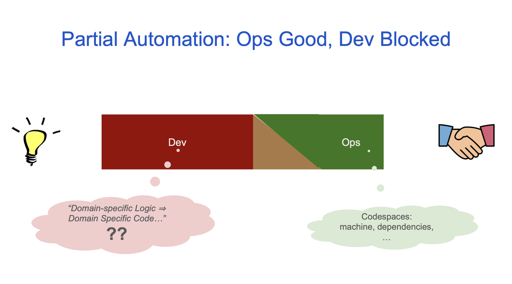
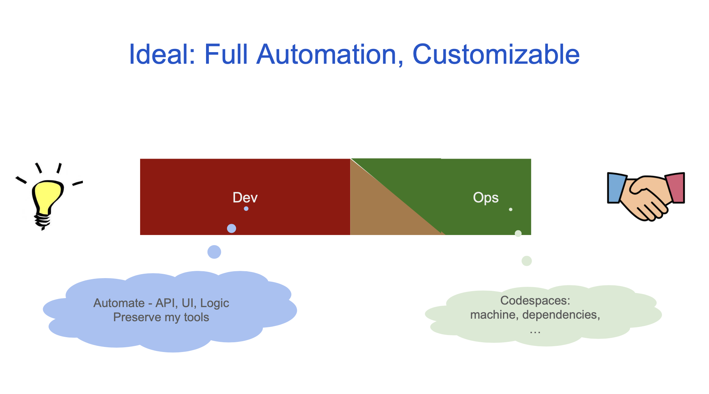
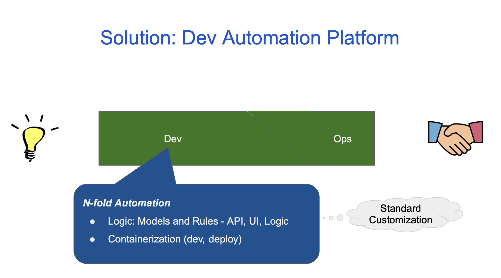
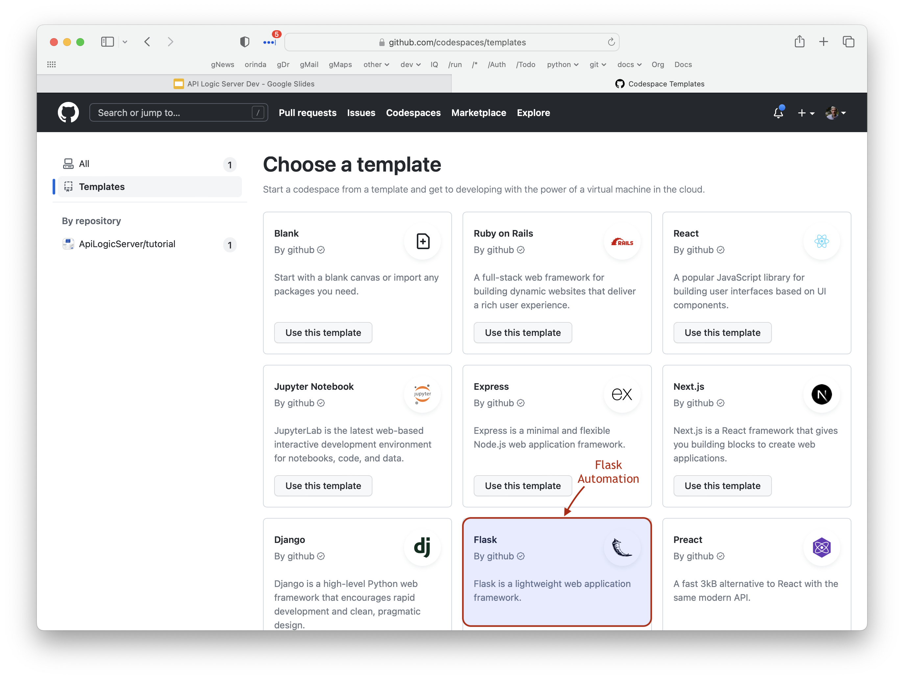

# Reducing Friction: Idea to Deployment - Strategic Business Value

## Currently: Partial Automation, Friction Remains

We have excellent automation at the Ops end of the spectrum, for deployment, and now Dev.

But the Dev end is still manual, blocked by the assumption:

> Domain-specific logic requires domain-specific code

So, we produce better coding tools.  Needed... but not enough.

## Ideal: More Automation, Retain My Tools

The ideal solution delivers N-fold automation, *and* retains the use of standard tools for customization, code management, deployment, etc.

## Solution
* Faster
* Simpler (Build, *Then* Learn)
* Customize (Your IDE, Python, Standard Flask/SQLAlchemy)

## Automation is Strategic
* Ensures Containerization
    * Cloud-Ready: dev, run
* Iteration (Automatic Ordering)
* Enables Migration (App Platform Independence)

## Delivery: Flask, *Automated*

