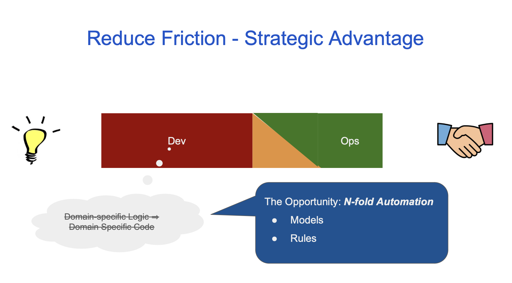
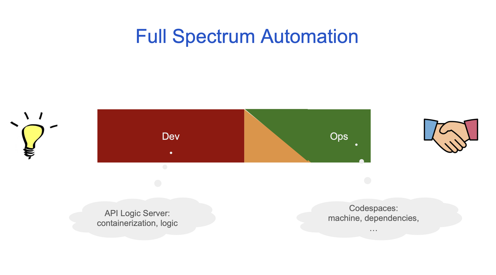
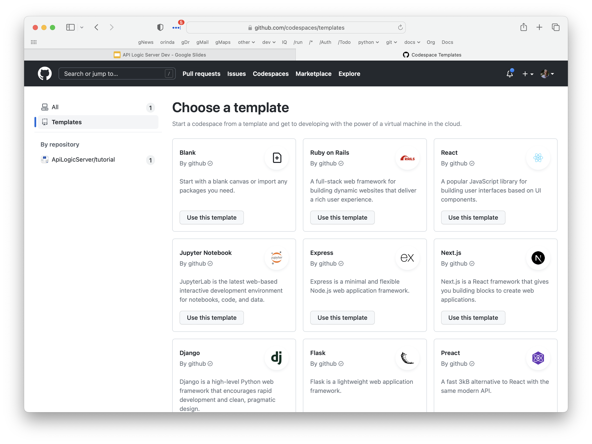

## Automation Gap

## Full Spectrum Automation

## Tactical
* Faster
* Simpler (Build, *Then* Learn)
* Customize (Your IDE, Python, Standard Flask/SQLAlchemy)

## Automation is Strategic
* Ensures Containerization
    * Cloud-Ready: dev, run
* Iteration (Automatic Ordering)
* Enables Migration (App Platform Independence)

## Flask, *Automated*

