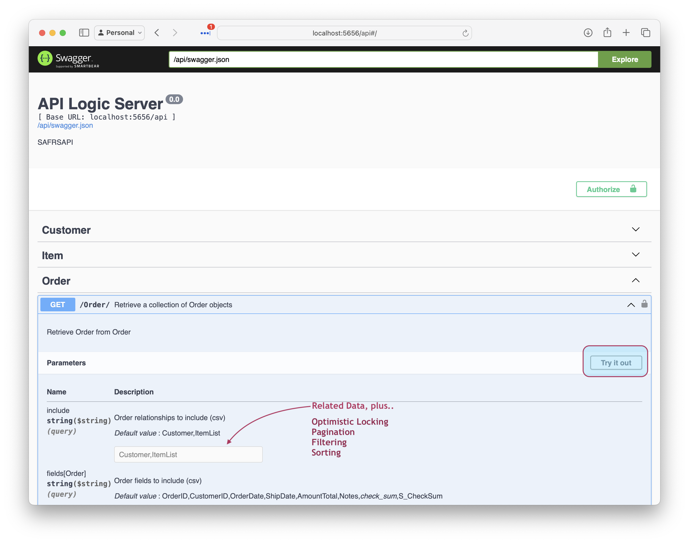
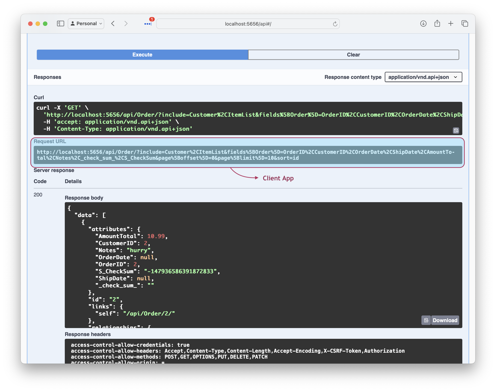

!!! pied-piper ":bulb: TL;DR - API Consumers can self-serve, and reduce network traffic"

    Unlike Custom APIs which require server development, Self-Serve APIs can be used directly by consumers.  They use Swagger to retrieve the data they want, then copying the URI to their code.  API consumers include:

    * UI Developers - progress no longer blocked on custom server development

    * Application Integration - remote customers and organizations can similarly meet their own needs

    For external use, consumer-defined APIs can reduce network traffic.

&nbsp;

## Provider-Defined vs. Consumer-Defined

Consider 2 classes of APIs:

* ***Provider-Defined APIs*** are predefined by server developers

    *  These are useful when API structure is dictated by an external system, such as a web hook.

But, providers typically cannot predict needs for a large class of API consumers (e.g., UI Developers, business partners, or other teams in a large organization).   Given only predefined provider APIs, consumers are often forced to make multiple calls to obtain the data they need, or invoke APIs that return too much data.  These can increase network traffic.

That leads to a second class of APIs, such as GraphQL and [JSON:API](https://jsonapi.org){:target="_blank" rel="noopener"}:

* ***Consumer-Defined APIs*** enable clients to provide parameters for exactly the fields and related data they need.  This can:

    * __Reduce network traffic__ by eliminating multiple API calls, or calls for excessive data, and
    * __Minimize organizational dependencies with _self-serve APIs_.__

&nbsp;

## Example

API Consumers can obtain the data they want as shown below.

&nbsp;

### Create Request With Swagger

First,

1. Use the automatically created Swagger (available via the Admin App) to obtain the data you want
2. Click `Try it out` to verify the result, as shown below

&nbsp;

### Copy URI to client app

Then, when it's correct,

1. Copy the URL to your client app
2. Optionally, save the cURL for interactive testing

