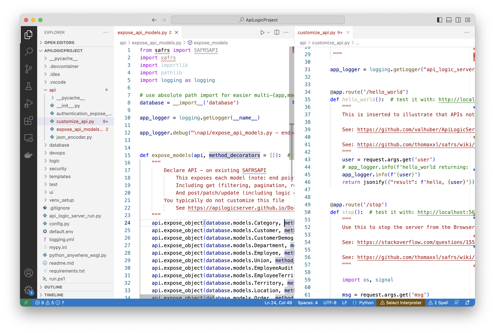
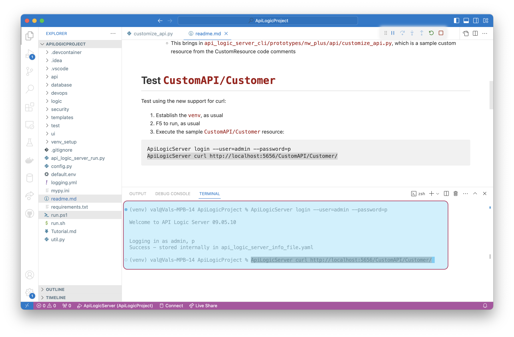

!!! pied-piper ":bulb: TL;DR - Instant API, Related Data, Filtering, Sorting, Pagination, Swagger"

    The `ApiLogicServer create` command creates an API Logic Project that implements your API.  No additional code is required.  **Custom App Dev is unblocked.**

    * __Endpoint for each table__, with __CRUD support__ - create, read, update and delete.

    * Filtering, sorting, pagination, including __related data access__, based on relationships in the models file (typically derived from foreign keys)

    * Automatic **Swagger**

    * Enforces **logic and security** - automatic partitioning of logic from (each) client app

    * **Add new endpoints using standard Flask and SQLAlchemy** - customize `api/customize_api.py` - 

&nbsp;

## Declare / Customize API

APIs are:

1. Declared in `api/expose_api_models.py` -- *generated* code which is typically not modified

2. Customized in `api/customize_api.py` -- see below, and next page

&nbsp;

## Automatic Swagger Generation

API creation includes automatic swagger generation. Start the server, and open your Browser at `localhost:5656`.   

Or, explore the sample app [running at PythonAnyWhere](http://apilogicserver.pythonanywhere.com/api){:target="_blank" rel="noopener"}.

&nbsp;

## Self-Serve

Unlike Custom APIs which require server development, Self-Serve APIs can be used directly by consumers.  They use Swagger to retrieve the data they want, then copying the URI to their code.  API consumers include:

* UI Developers - progress no longer blocked on custom server development

* Application Integration - remote customers and organizations can similarly meet their own needs

For more information, [see Self-Serve APIs.](API-Self-Serve.md)

&nbsp;

## Logic Enabled

API Logic Server is so-named because all the update APIs automatically enforce your [business Logic](Logic-Why.md){:target="_blank" rel="noopener"}.

  > **Key Take-away:** your API encapsulates your logic, factoring it out of APIs for greater concisenss and sharing / consistency

&nbsp;

## Examples

The [Behave Tests](Behave.md){:target="_blank" rel="noopener"} provide several examples of using the API.  You can [review them here](https://github.com/valhuber/ApiLogicServer/blob/main/api_logic_server_cli/project_prototype_nw/test/api_logic_server_behave/features/steps/place_order.py).

&nbsp;

## Key Usage: custom apps

The automatic Admin App is useful, but most systems will require custom User Interfaces.  Use your favorite framework (eg, React).

&nbsp;

## `ApiLogicServer` curl

While swagger is the best way to explore your API, you may want to use curl during test cycles.  If you have activated security, this fails since the header is not provided.

So, as of release 9.05.10, the API Logic Server provides CLI commands to:

1. The **"login"** command:
    * Gets a token from the server (it must must be running)
    * Stores it in `api_logic_server_cli/api_logic_server_info.yaml` 
2. The `curl` command is then enabled:
    * Gets the token
    * Appends security headers to the curl command provided as arg #2

