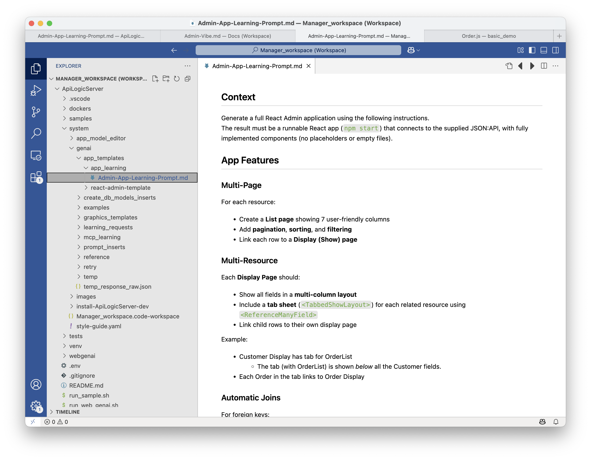

The GenAI process uses this for learning.  It is part of the Manager so you can customize it:



## Context

Generate a full React Admin application using the following instructions.  
The result must be a runnable React app (`npm start`) that connects to the supplied JSON:API, with fully implemented components (no placeholders or empty files).

## App Features

### Multi-Page

For each resource:

- Create a **List page** showing 7 user-friendly columns
- Add **pagination**, **sorting**, and **filtering**
- Link each row to a **Display (Show) page**

### Multi-Resource

Each **Display Page** should:

- Show all fields in a **multi-column layout**
- Include a **tab sheet** (`<TabbedShowLayout>`) for each related resource using `<ReferenceManyField>`
- Link child rows to their own display page

Example:  

- Customer Display has tab for OrderList 

  - The tab (with OrderList) is shown *below* all the Customer fields.
- Each Order in the tab links to Order Display

### Automatic Joins

For foreign keys:

- Display joined value (e.g., `product.name` instead of `product_id`)
- Use first string field from parent table containing `name`, `title`, or `description`

Numeric Primary key fields:

- Display at the end of forms/lists

### Lookups (Foreign Keys)

For foreign key fields:

- Provide auto-complete dropdown (`<ReferenceInput>`)
- For numeric foreign keys, use the joined string field as lookup text

### Cascade Add

When adding a child row as a detail in a Master / Detail,
default the Foreign Key to the Parent (Master) Primary Key.

## Implementation

### Architecture

- **Framework**: React 18 + react-admin 4.x
- **Data Provider**: Custom `dataProvider.js` using `fetchUtils` (no external `ra-jsonapi-client`)

  - Must support: `getList`, `getOne`, `getMany`, `getManyReference`, `create`, `update`, `delete`
  - Must support: filters, joins, sorting, pagination

- **Backend**: JSON:API per `mcp_discovery.json`
- **CORS**: Ensure API allows `http://localhost:3000`

```py
  from flask_cors import CORS  
  CORS(app, origins='*')  # or restrict to localhost:3000
```
- **Project Setup**:

  - Use `create-react-app`
  - Include: `react-admin`, `@mui/material`, `@emotion/react`, `@emotion/styled`, `react-router-dom`
  - Do not use any deprecated or unmaintained libraries
  - Include complete and correct `App.js`, `index.js`, `dataProvider.js`, and `index.html`

---

### Per-Resource Files (Required)

For each resource (`Customer`, `Order` etc):

* Create a source file under `src/`, e.g., `Customer.js`
* Each file must **fully** implement:
    * `CustomerList`
    * `CustomerShow`
    * `CustomerCreate`
    * `CustomerEdit`

Use:

- `<ReferenceField>` for foreign key displays
- `<ReferenceInput>` for foreign key input
- `<ReferenceManyField>` for tabbed child lists
- For show pages

  * Always start with `<SimpleShowLayout>`, followed by a `<TabbedShowLayout>` for related data
    * DO NOT start with `<TabbedShowLayout>`

Be sure to include all required imports.  ALWAYS use the following AS IS, plus whatever else is required:

```jsx
import { List, FunctionField, Datagrid, TextField, DateField, NumberField, ReferenceField, ReferenceManyField, Show, TabbedShowLayout, Tab, SimpleShowLayout, TextInput, NumberInput, DateTimeInput, ReferenceInput, SelectInput, Create, SimpleForm, Edit, Filter, Pagination, BooleanField, BooleanInput } from 'react-admin';
```
You may add other imports, but be sure all those are included.

DO NOT use `<EmailInput>` - use `<TextInput>`.

DO NOT put `<ReferenceField>` in `<Datagrid>`.

Do **not leave any file empty**.

---

### App Wiring

Sample code for `App.js`:


```jsx
import React from 'react';
import { Admin, Resource } from 'react-admin';
import { createTheme } from '@mui/material/styles';

// import each resource
import { CustomerList, CustomerShow, CustomerCreate, CustomerEdit } from './Customer';
...
// import the data provider
import { dataProvider } from './dataProvider';

const theme = createTheme({
    palette: {
        primary: { main: '#1976d2' },    // Material-UI default blue
        secondary: { main: '#1565c0' },  // A darker blue, or choose another color
    },
    typography: { fontSize: 14 },
});

const App = () => {
    return (
        <Admin dataProvider={dataProvider}>  // register each resource...
            <Resource name="Customer" list={CustomerList} show={CustomerShow} edit={CustomerEdit} create={CustomerCreate} />
...
        </Admin>
    );
};

export default App;
```

For dataProvider:

1. be sure it includes the braces: `import { dataProvider }`
2. Do Not generate either:

```jsx
import jsonServerProvider from 'ra-data-json-server'
const dataProvider = jsonServerProvider('http://api.example.com');
```

---

## Response Format

Format the response as a JSResponseFormat:

class JSResponseFormat(BaseModel):  # must match system/genai/prompt_inserts/response_format.prompt
    code : str # generated javascript code (only)
