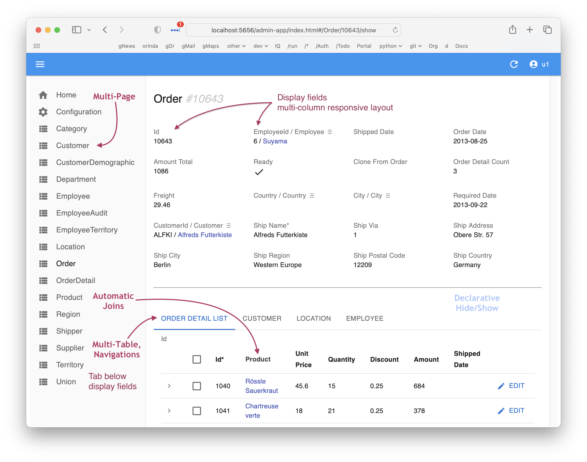

!!! pied-piper ":bulb: TL;DR - instant multi-page, multi-table apps"

      | Feature  | Provides         | Example         |
      |:---------------------------|:-----------------|:-------------------------------------------------------------------------------|
      | Multi-Page | List/Show pages for each table<br>Built-in **search, sort, export**    | Customer Page, Order Page, etc | 
      | Multi-Table | **Tab Sheet** for related child data <br>**Page Transitions** for related data | Customer page has OrderList<br>Click --> Order/OrderDetails | 
      |             | **Automatic Joins** for Parent Data    | Product _Name_ - not just the Id | 
      |             | **Lookups** for foreign keys    | Find Product for OrderDetail | 
      |             | **Declarative hide/show** | Salaried Employee: Hide Union | 
      | Customize | Simple - no HTML / JavaScript    | Edit `ui/admin/admin.yaml` | 
      | Extend | Build Custom UIs with your own framework, using the API    | API-enforced logic simplifies app dev | 

This page describes the Admin App architecture.

<br>

## Uses Global React Admin

The admin "app" created in your project is *just a yaml file.*  It is interpreted by a React Admin app ([SAFRS React Admin - SRA](https://github.com/thomaxxl/safrs-react-admin){:target="_blank" rel="noopener"} by Thomas Pollet) that is part of the API Logic Server install, eg: 

```
venv/lib/python3.12/site-packages/api_logic_server_cli/create_from_model/safrs-react-admin-npm-build
```

This contains the SRA code and the many react libraries it uses.

<br>

## Customized Apps

The objective of the Admin App is to create an highly functional app instantly, easily customized via the yaml (instead of more complex HTML, JS, CSS, etc).

To create a more customized app, you can:

* Use the [Automatic Custom Apps](App-Custom.md){:target="_blank" rel="noopener"}, or
* Create your own custom app using the API - by manual coding, or using Generative AI ("Vibe")

<br>

## Generative AI App Learning

A close approximation of the *automatic* Admin App can be *generated* with GenAI, using this prompt:

### Context

Generate a full React Admin application using the following instructions.  
The result must be a runnable React app (`npm start`) that connects to the supplied JSON:API, with fully implemented components (no placeholders or empty files).

### App Features

Here is a sample App Page:



#### Multi-Page

For each resource:
- Create a **List page** showing 7 user-friendly columns
- Add **pagination**, **sorting**, and **filtering**
- Link each row to a **Display (Show) page**

#### Multi-Resource

Each **Display Page** should:
- Show all fields in a **multi-column layout**
- Include a **tab sheet** (`<TabbedShowLayout>`) for each related resource using `<ReferenceManyField>`
- Link child rows to their own display page

Example:  
- Customer Display has tab for OrderList  
- Each Order in the tab links to Order Display

#### Automatic Joins

For foreign keys:
- Display joined value (e.g., `product.name` instead of `product_id`)
- Use first string field from parent table containing `name`, `title`, or `description`

Numeric Primary key fields:
- Display at the end of forms/lists

#### Lookups (Foreign Keys)

For foreign key fields:
- Provide auto-complete dropdown (`<ReferenceInput>`)
- For numeric foreign keys, use the joined string field as lookup text


### Implementation


#### Architecture

- **Framework**: React 18 + react-admin 4.x
- **Data Provider**: Custom `dataProvider.js` using `fetchUtils` (no external `ra-jsonapi-client`)
  - Must support: `getList`, `getOne`, `getMany`, `getManyReference`, `create`, `update`, `delete`
  - Must support: filters, joins, sorting, pagination
- **Backend**: JSON:API per `mcp_discovery.json`
- **CORS**: Ensure API allows `http://localhost:3000`
  ```py
  from flask_cors import CORS  
  CORS(app, origins='*')  # or restrict to localhost:3000
  ```
- **Project Setup**:
  - Use `create-react-app`
  - Include: `react-admin`, `@mui/material`, `@emotion/react`, `@emotion/styled`, `react-router-dom`
  - Do not use any deprecated or unmaintained libraries
  - Include complete and correct `App.js`, `index.js`, `dataProvider.js`, and `index.html`

---

#### Per-Resource Files (Required)

For each resource (`Customer`, `Order` etc):
- Create a source file under `src/`, e.g., `Customer.js`
- **Each file must fully implement**:
  - `CustomerList`
  - `CustomerShow`
  - `CustomerCreate`
  - `CustomerEdit`

Use:
- `<ReferenceField>` for foreign key displays
- `<ReferenceInput>` for foreign key input
- `<ReferenceManyField>` for tabbed child lists
- `<TabbedShowLayout>` for display pages


Do **not leave any file empty**.

---

#### App Wiring

In `App.js`:
- Import each resource file using:

```jsx
import { CustomerList, CustomerShow, CustomerCreate, CustomerEdit } from './Customer';
```

- Register them in `<Admin>` using:

```jsx
<Resource name="Customer" list={CustomerList} show={CustomerShow} edit={CustomerEdit} create={CustomerCreate} />
```

- import data provider (pre-supplied in src):

```jsx
import { dataProvider } from './dataProvider';
```

Do Not generate either:
```jsx
import jsonServerProvider from 'ra-data-json-server'
const dataProvider = jsonServerProvider('http://api.example.com');
```

---

### Response Format

Format the response as a JSResponseFormat:

class JSResponseFormat(BaseModel):  # must match system/genai/prompt_inserts/response_format.prompt
    code : str # generated javascript code (only)

<br>

## GenAI Resources

If you are using Generative AI:

* Create `docs/mcp_learning/mcp_discovery.json` as the output of [mcp_discovery](Integration-MCP.md#1-discover-servers){:target="_blank" rel="noopener"}, and provide that to your Generative AI tool.  To obtain your discovery:

```bash
curl -X GET "http://localhost:5656/.well-known/mcp.json"
```

<details markdown>

<summary>Here is an example of MCP Discovery: </summary>


```json
{
  "base_url": "http://localhost:5656/api",
  "authorization_url": "http://localhost:5656/api/auth/login",
  "description": "API Logic Project: basic_demo",
  "learning": "To issue one request per row from a prior step (fan-out), use the syntax:\n\n\"$<stepIndex>[*].<fieldName>\"\n\nFor example, if step 0 returns orders, and you want to send a POST per customer:\n\nBefore (incorrect):\n    \"customer_id\": \"{customer_id}\"\n\nAfter (correct):\n    \"customer_id\": \"$0[*].customer_id\"\n    \nOnly if 'email' is in the Natural language query, send email by issing a POST request to the SysEmail endpoint, setting the subject, message and customer_id in the body.   DO NOT include a POST unless the word \u2018email\u2019 appears in the user query.\n\nFormat response as mcp_responseFormat.\n\n<mcp_responseFormat>\nclass QueryParam(BaseModel):\n    name: str  # attribute name\n    op: str  # eq, lt, gt\n    val: str\n\nclass JsonValues(BaseMopdel):\n    name: str  # name of attribute\n    value: str # value of attribute\n\nclass Resource(BaseModel):\n    tool_type: str\n    base_url: str\n    path: str # specified use case or requirement name (use 'General' if missing)\n    method: str # GET, PATCH, POST or DELETE\n    body: json # data for PATCH or POST\n    query_params: List(QueryParam) # filter for GET\n\nclass MCPResult(BaseModel):  # must match system/genai/prompt_inserts/response_format.prompt\n    schema_version: str\n    resources : List[Resource] # list resources\n\n<mcp_responseFormat/>\n",
  "resources": [
    {
      "fields": [
        "id",
        "name",
        "balance",
        "credit_limit",
        "email",
        "email_opt_out"
      ],
      "filterable": [
        "id",
        "name",
        "balance",
        "credit_limit",
        "email",
        "email_opt_out"
      ],
      "methods": [
        "GET",
        "PATCH",
        "POST",
        "DELETE"
      ],
      "name": "Customer",
      "path": "/Customer"
    },
    {
      "fields": [
        "id",
        "order_id",
        "product_id",
        "quantity",
        "amount",
        "unit_price"
      ],
      "filterable": [
        "id",
        "order_id",
        "product_id",
        "quantity",
        "amount",
        "unit_price"
      ],
      "methods": [
        "GET",
        "PATCH",
        "POST",
        "DELETE"
      ],
      "name": "Item",
      "path": "/Item"
    },
    {
      "fields": [
        "id",
        "notes",
        "customer_id",
        "CreatedOn",
        "date_shipped",
        "amount_total"
      ],
      "filterable": [
        "id",
        "notes",
        "customer_id",
        "CreatedOn",
        "date_shipped",
        "amount_total"
      ],
      "methods": [
        "GET",
        "PATCH",
        "POST",
        "DELETE"
      ],
      "name": "Order",
      "path": "/Order"
    },
    {
      "fields": [
        "id",
        "name",
        "unit_price"
      ],
      "filterable": [
        "id",
        "name",
        "unit_price"
      ],
      "methods": [
        "GET",
        "PATCH",
        "POST",
        "DELETE"
      ],
      "name": "Product",
      "path": "/Product"
    }
  ],
  "schema_version": "1.0",
  "tool_type": "json-api"
}
```
</details>

* In addition, provide the schema (`docs/db.dbml`)

<details markdown>

<summary>Here is an example of the schema: </summary>
```
// Copy this text, paste to https://dbdiagram.io/d
// Or, https://databasediagram.com/app
// Or, view in VSCode with extension: "DBML Live Preview"

Table Customer {
    id INTEGER [primary key]
    name VARCHAR 
    balance DECIMAL 
    credit_limit DECIMAL 
    email VARCHAR 
    email_opt_out BOOLEAN 
    }

Table Item {
    id INTEGER [primary key]
    order_id INTEGER 
    product_id INTEGER 
    quantity INTEGER 
    amount DECIMAL 
    unit_price DECIMAL 
    }

Table Order {
    id INTEGER [primary key]
    notes VARCHAR 
    customer_id INTEGER 
    CreatedOn DATE 
    date_shipped DATE 
    amount_total DECIMAL 
    }

Table Product {
    id INTEGER [primary key]
    name VARCHAR 
    unit_price DECIMAL 
    }


// Relationships
    Ref: Item.(order_id) < Order.(id)
    Ref: Item.(product_id) < Product.(id)
    Ref: Order.(customer_id) < Customer.(id)
```
</details>
