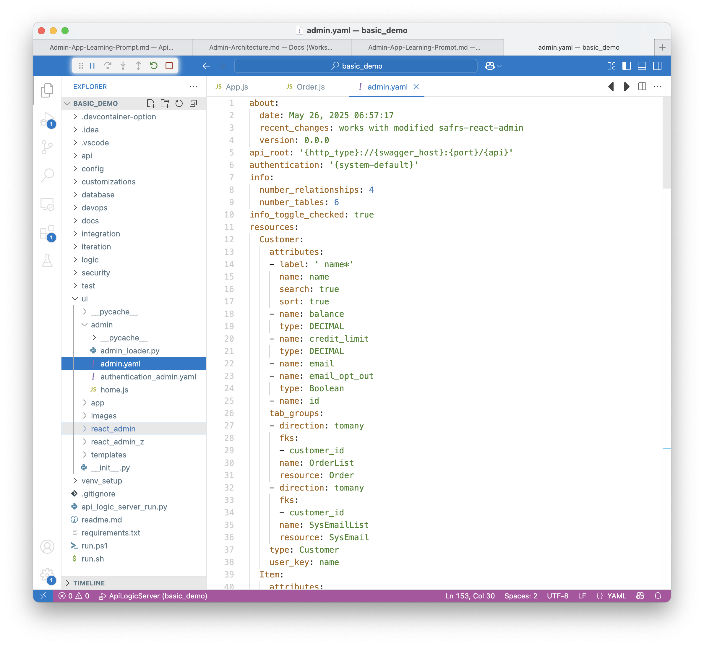

!!! pied-piper ":bulb: TL;DR - instant multi-page, multi-table apps"

      | Feature  | Provides         | Example         |
      |:---------------------------|:-----------------|:-------------------------------------------------------------------------------|
      | Multi-Page | List/Show pages for each table<br>Built-in **search, sort, export**    | Customer Page, Order Page, etc | 
      | Multi-Table | **Tab Sheet** for related child data <br>**Page Transitions** for related data | Customer page has OrderList<br>Click --> Order/OrderDetails | 
      |             | **Automatic Joins** for Parent Data    | Product _Name_ - not just the Id | 
      |             | **Lookups** for foreign keys    | Find Product for OrderDetail | 
      |             | **Declarative hide/show** | Salaried Employee: Hide Union | 
      | Customize | Simple - no HTML / JavaScript    | Edit `ui/admin/admin.yaml` | 
      | Extend | Build Custom UIs with your own framework, using the API    | API-enforced logic simplifies app dev | 

This page describes the Admin App architecture.

<br>

## Uses Global React Admin

The admin "app" created in your project is *just a yaml file.*  It is interpreted by a React Admin app ([SAFRS React Admin - SRA](https://github.com/thomaxxl/safrs-react-admin){:target="_blank" rel="noopener"} by Thomas Pollet) that is part of the API Logic Server install, eg: 

```
venv/lib/python3.12/site-packages/api_logic_server_cli/create_from_model/safrs-react-admin-npm-build
```

This contains the SRA code and the many react libraries it uses.

<br>

## Customized Apps

The objective of the Admin App is to create an highly functional app instantly, easily customized via the yaml (instead of more complex HTML, JS, CSS, etc).

To create a more customized app, you can:

* Use the [Automatic Custom Apps](App-Custom.md){:target="_blank" rel="noopener"}, or
* Create your own custom app using the API - by manual coding, or using Generative AI ("Vibe")

<br>

## Appendix: Sample admin.yml

The `admin.yaml` is located in your project here:



<details markdown>

<summary>Click here to see sample admin.yaml </summary>

<br>

```yaml
about:
  date: May 26, 2025 06:57:17
  recent_changes: works with modified safrs-react-admin
  version: 0.0.0
api_root: '{http_type}://{swagger_host}:{port}/{api}'
authentication: '{system-default}'
info:
  number_relationships: 4
  number_tables: 6
info_toggle_checked: true
resources:
  Customer:
    attributes:
    - label: ' name*'
      name: name
      search: true
      sort: true
    - name: balance
      type: DECIMAL
    - name: credit_limit
      type: DECIMAL
    - name: email
    - name: email_opt_out
      type: Boolean
    - name: id
    tab_groups:
    - direction: tomany
      fks:
      - customer_id
      name: OrderList
      resource: Order
    - direction: tomany
      fks:
      - customer_id
      name: SysEmailList
      resource: SysEmail
    type: Customer
    user_key: name
  Item:
    attributes:
    - label: ' id*'
      name: id
      search: true
      sort: true
    - name: order_id
    - name: product_id
      required: true
    - name: quantity
      required: true
    - name: amount
      type: DECIMAL
    - name: unit_price
      type: DECIMAL
    tab_groups:
    - direction: toone
      fks:
      - order_id
      name: order
      resource: Order
    - direction: toone
      fks:
      - product_id
      name: product
      resource: Product
    type: Item
    user_key: id
  Order:
    attributes:
    - label: ' id*'
      name: id
      search: true
      sort: true
    - name: customer_id
      required: true
    - name: notes
    - name: CreatedOn
      type: DATE
    - name: amount_total
      type: DECIMAL
    - name: date_shipped
      type: DATE
    tab_groups:
    - direction: tomany
      fks:
      - order_id
      name: ItemList
      resource: Item
    - direction: toone
      fks:
      - customer_id
      name: customer
      resource: Customer
    type: Order
    user_key: id
  Product:
    attributes:
    - label: ' name*'
      name: name
      search: true
      sort: true
    - name: unit_price
      type: DECIMAL
    - name: id
    tab_groups:
    - direction: tomany
      fks:
      - product_id
      name: ItemList
      resource: Item
    type: Product
    user_key: name
  SysEmail:
    attributes:
    - label: ' id*'
      name: id
      search: true
      sort: true
    - name: customer_id
      required: true
    - name: message
    - name: subject
    - name: CreatedOn
      type: DATE
    tab_groups:
    - direction: toone
      fks:
      - customer_id
      name: customer
      resource: Customer
    type: SysEmail
    user_key: id
  SysMcp:
    attributes:
    - name: request
      type: textarea
    - label: ' id*'
      name: id
      search: true
      sort: true
      show_when: isInserting == false
    type: SysMcp
    user_key: id
settings:
  HomeJS: /admin-app/home.js
  max_list_columns: 8
  style_guide:
    applicationLocales:
    - en
    - es
    currency_symbol: $
    currency_symbol_position: left
    date_format: LL
    decimal_max: '1000000000'
    decimal_min: '2'
    decimal_separator: .
    detail_mode: tab
    edit_on_mode: dblclick
    exclude_listpicker: false
    include_translation: 'false'
    keycloak_client_id: alsclient
    keycloak_realm: kcals
    keycloak_url: http://localhost:8080
    locale: en
    max_decimal_digits: '4'
    min_decimal_digits: '2'
    new_mode: dialog
    pick_style: list
    row_height: small,
    serviceType: JSONAPI
    startSessionPath: /auth/login
    style: light
    thousand_separator: ','
    use_keycloak: 'false'
```
