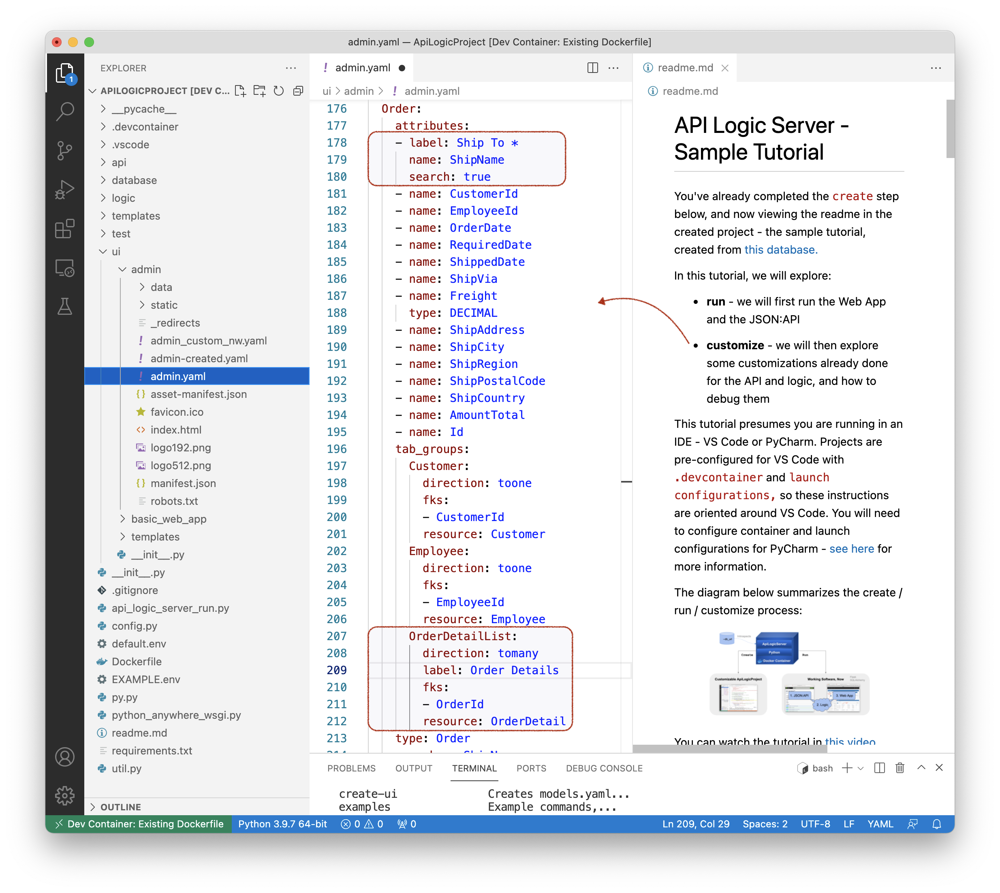
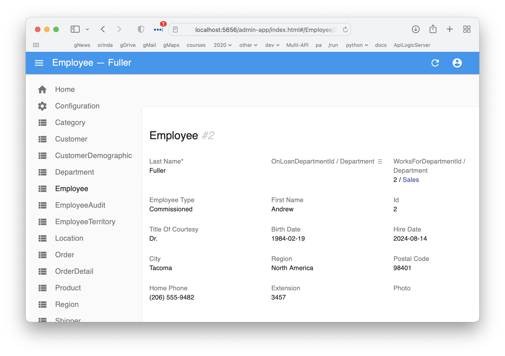
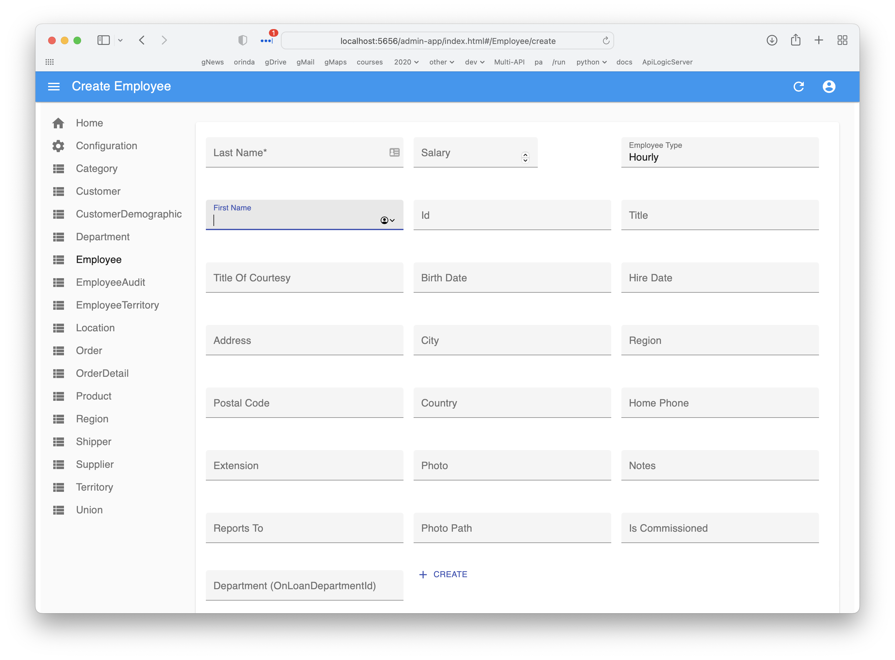

The creation process does _not_ create hundreds of lines of JavaScript and HTML.  

Instead, it creates an _application __model__, represented in the ```admin.yaml``` file.  So, you can customize it easily, without requiring extensive JavaScript/HTML background, or deciphering generated code.


  > **Key Take-away:** instant admin app, with logic, easy to customize


### Intelligent Default Creation
The system makes reasonable attempts to create useful applications

* automatic joins
* "favorite" fields are displayed first, such as field named `name`.
  * You can configure your favorite names when creating:
```
ApiLogicServer create --project_name=my-project \
                      --db_url=nw+ \
                      --favorites='nom nommes'
```
* non-favorites (such as `id`) can be identified with the `--non_favorites` argument.

### Edit `admin.yaml`

While these defaults are useful in creating a recognizable application, you will want to control the display order, override labels and so forth.  You can specify such customizations by editing the `admin.yaml` file below.

This file is created initially by the system, so it's not necessary to learn the syntax in detail.  Instead, it's straight-forward to alter the file using your IDE or text editor.

  > Press Browser refresh to reload the application after you make changes; it is not necessary to restart the server



#### Models and admin correlation

See [this section](Data-Model-Classes.md).

#### Not altered on `rebuild`
The rebuild commands do not override your customizations.  They do recreate `admin-created.yaml`.  You can use this to merge into your `admin.yaml`, e.g., to pick up new tables, relationships, etc.

&nbsp;

#### show_when

You can provide an expression that determines when a field (and its caption) are hidden.  For example, you might show the `Dues` only when the `EmployeeType` is _Hourly_, by declaring this in your `admin.yaml`:


`Dues` is hidden for non Hourly:



and is visible for Hourly:


It also works on update, such as insert:



##### Hiding Fields in Insert Mode

Note you can hide fields depending on the state of the form, e.g. for `OrderDetail`, we can hide the Id since it is generated by the system:

```yaml
  OrderDetail:
    attributes:
      - label: ' Id*'
        name: Id
        search: true
        sort: true
        show_when: isInserting == false
```

&nbsp;

#### Multiple `admin.yaml` files

When creating your own admin files, we recommend starting with the created one.

Also, use caution in removing resources, since these may be used in joins and lookups.

&nbsp;

# Appendix

## Browser Cache

Browsers cache data for performance.  This may required you to [clear your Browser cache](Troubleshooting.md#browser-cache){:target="_blank" rel="noopener"}.