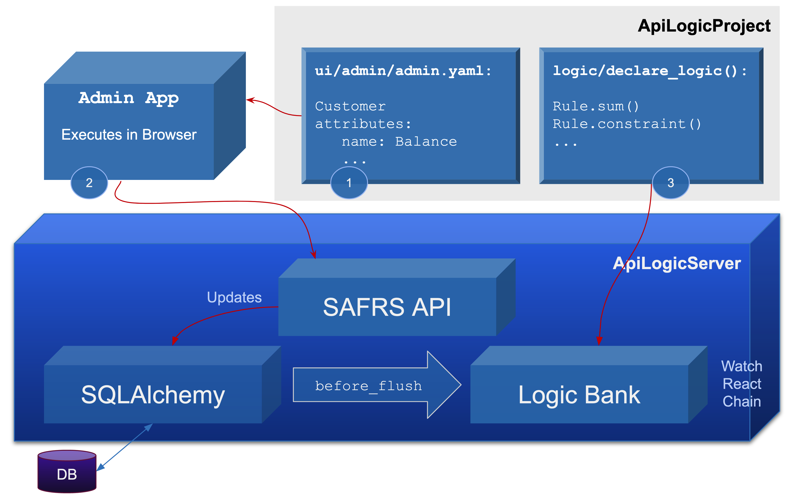
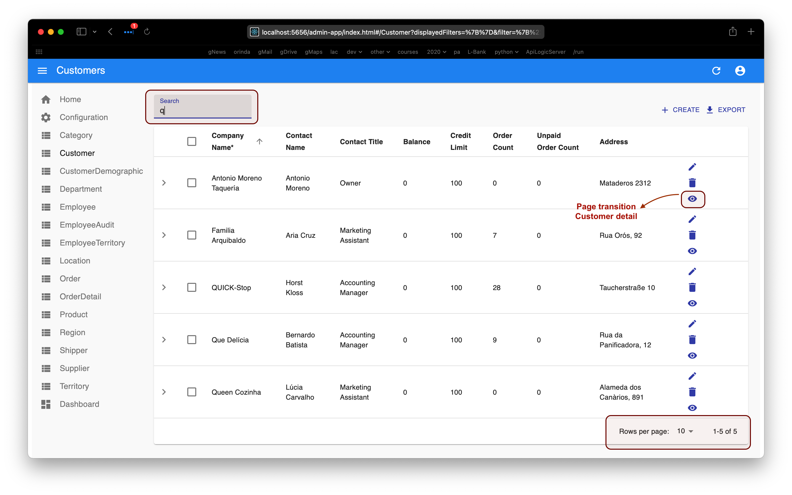
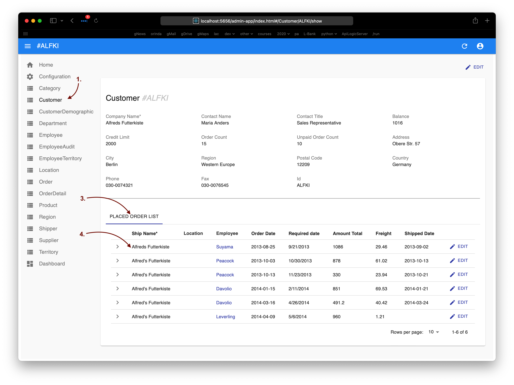
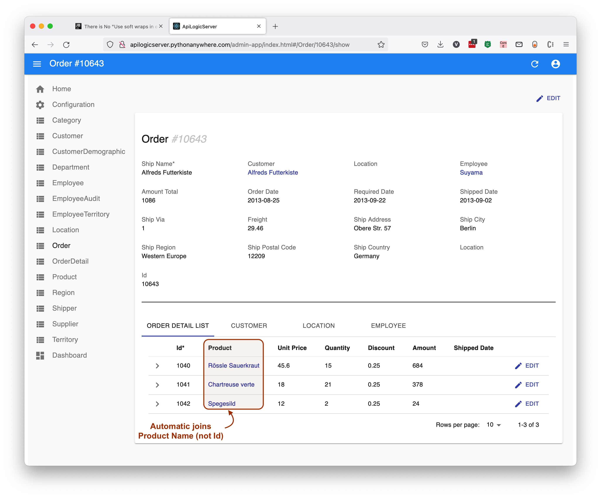
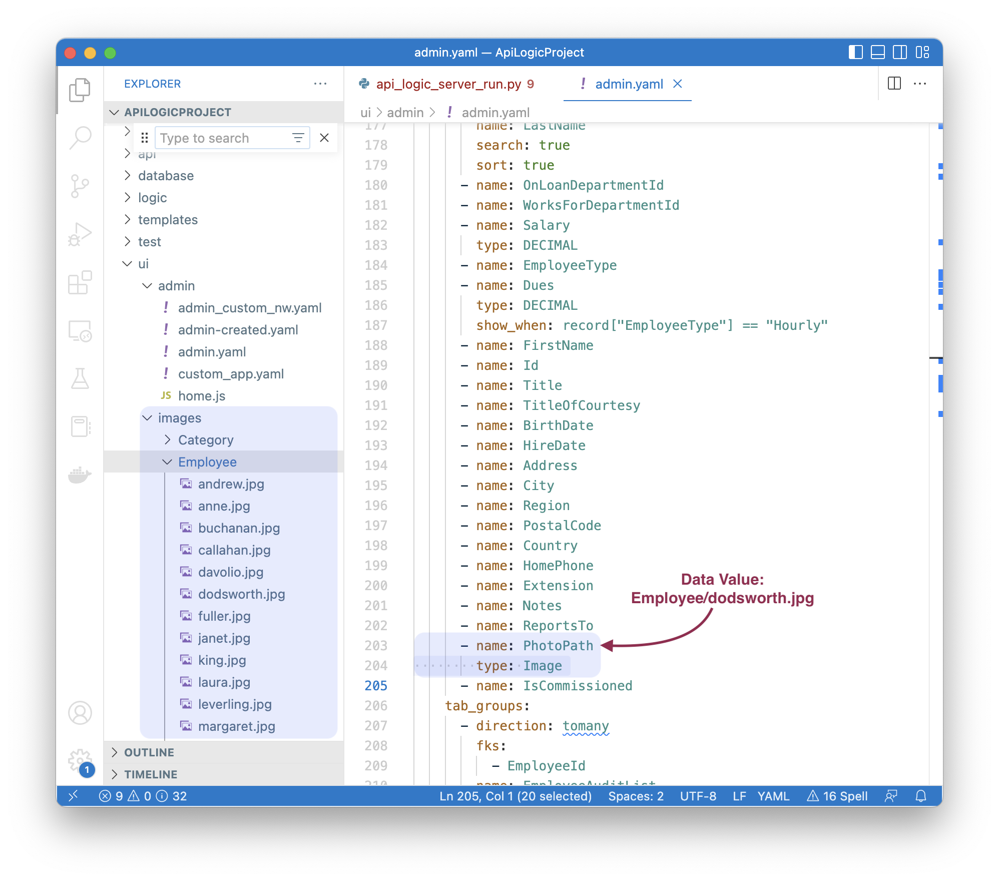
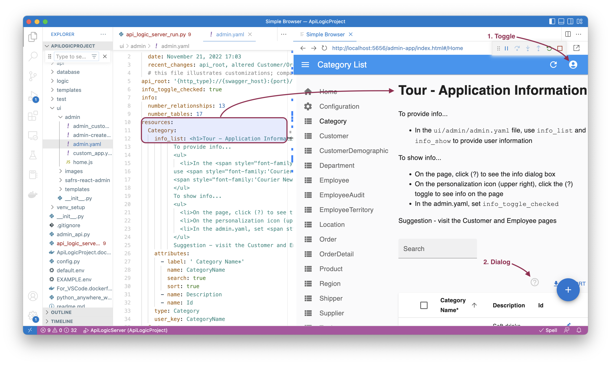
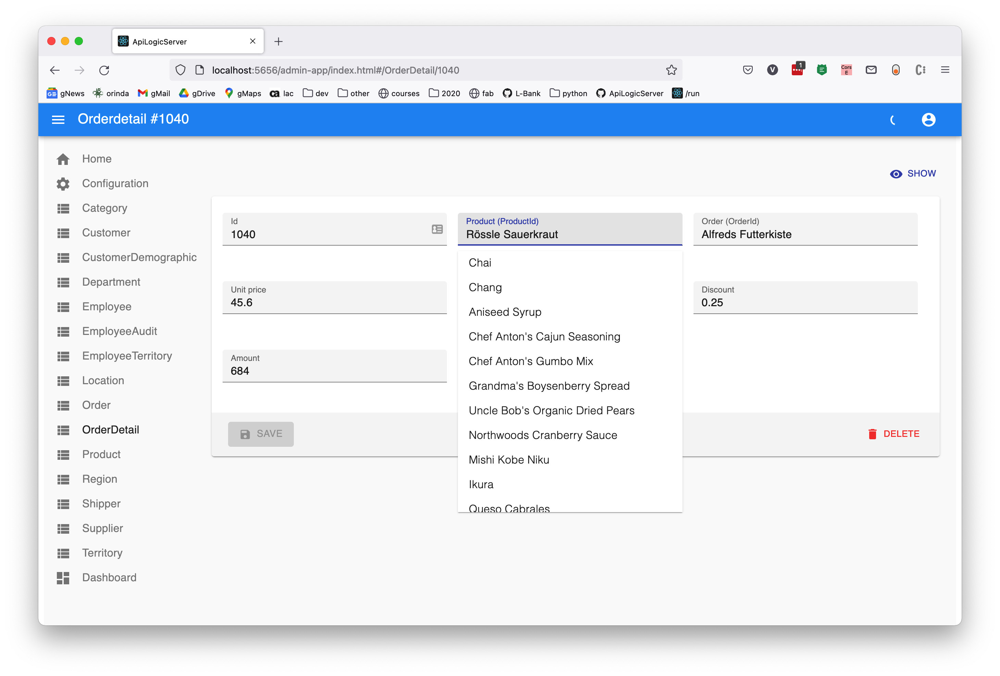
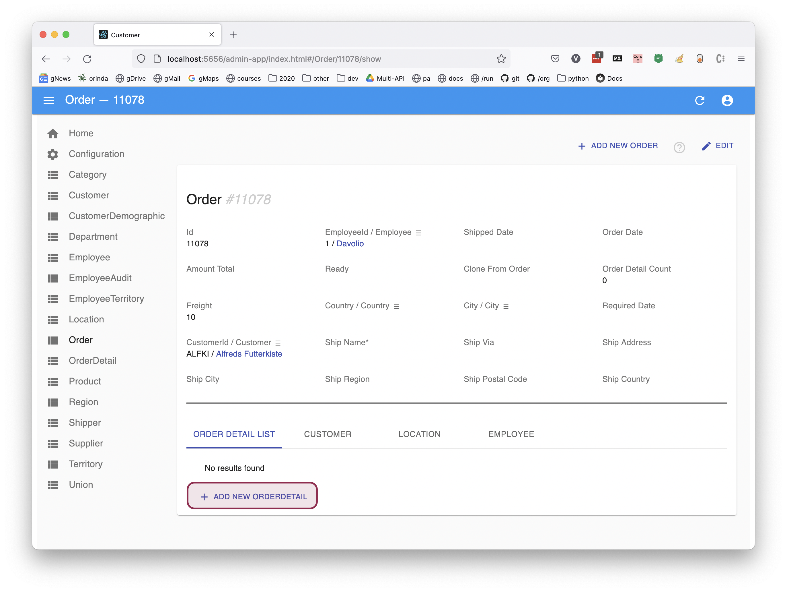

!!! pied-piper ":bulb: TL;DR - instant multi-page, multi-table apps"

      | Feature  | Provides         | Example         |
      |:---------------------------|:-----------------|:-------------------------------------------------------------------------------|
      | Multi-Page | List/Show pages for each table<br>Built-in **search, sort, export**    | Customer Page, Order Page, etc | 
      | Multi-Table | **Tab Sheet** for related child data <br>**Page Transitions** for related data | Customer page has OrderList<br>Click --> Order/OrderDetails | 
      |             | **Automatic Joins** for Parent Data    | Product _Name_ - not just the Id | 
      |             | **Lookups** for foreign keys    | Find Product for OrderDetail | 
      |             | **Declarative hide/show** | Salaried Employee: Hide Union | 
      | Customize | Simple - no HTML / JavaScript    | Edit `ui/admin/admin.yaml` | 
      | Extend | Build Custom UIs with your own framework, using the API    | API-enforced logic simplifies app dev | 

This page describes the Admin App automatically created during `ApiLogicServer create`.


&nbsp;

# Use Cases
The system automatically creates multi-page, multi-table applications as you'll see below.  Typical usage is described here.

### Back Office Admin
Systems commonly include a number of "back office" admin apps that need to be usable, but do not warrant the time and cost of custom app development.  These are costly to build by hand.

Automatic creation of such apps eliminates the time and expense of such back office apps from your project.

### Prototyping / Agile Collaboration
It's a common observation that business users relate poorly to technical documentation such as data model diagrams, but instantly related to running pages containing _their_ data.

API Logic Server can create apps instantly, from just the data model.  Users are able to run the screens - including updates - and begin the collaboration process, such as:
* identify data model issues ("hey, wait, customers have more than 1 address")


* identify rules ("hmm, it needs to verify that balances do not exceed credit limits")

As such items are noted, you can update the data model, recreate, and iterate the design very rapidly, since there is no cost to create the API or the UI.

### Complements Custom API-based Apps (Automatic API and Logic Reuse)

That said, it's common that you will need custom apps for complex functions, customer-facing branding, and so forth.

* Create these in your favorite technology (React, Angular, etc)


* Base them on the automatically created API, which handles not only data retrieval and update, but also enforces your [business logic](Logic-Why.md#extend-python.md){:target="_blank" rel="noopener"}, which dramatically reduces client app dev effort by factoring out business logic to the shared API.

# Architecture - React, based on created logic-enabled API
The Admin App is created in your ApiLogicProject, and operates as follows:

1. Applications are declared in yaml files, automatically created from your database
1. The applications are Single Page React applications executing in the Browser, acquiring data via the SAFRS JSON:API.  
2. Updates are submitted to SQLAlchemy; LogicBank listens for `before_flush` events, and enforces the logic declared in your `declare_logic.py`.

For more information on Architecture, [see Architecture](Architecture-What-Is.md).



  > **Key Take-away:** instant admin apps, an api for custom apps, with enforcement of declarative logic.

&nbsp;

### Declare Behavior in `admin.yaml`

As described in [Admin Customization](Admin-Customization.md), you can declare your own customized labels, field orders, help text in the `admin.yaml` file.

### Multi-App Projects

Explore the sample project `ui/admin` directory.  You will note it contains several admin files (new for release 6.1).  Each file defines a separate admin app:

* the default app is accessed by `http://localhost:5656/`,<br/>corresponding to `ui/admin/admin.yaml`

* custom apps are accessed by `http://localhost:5656/admin/custom_app/`,<br/>corresponding to `ui/admin/custom_app.yaml`

See [Multiple admin.yaml files](Admin-Customization.md#multiple-adminyaml-files).

!!! tip "Tip: Group-specific terminology"

    You can use these to customize terminology for different user groups within an organization.  
    
    For example, `custom_app.yaml` file might be used by Accounting, with __labels__ such _Customer Account_ instead of _Customer_, _Account Balance_ instead of _Balance_, and a re-ordered left-side navigation.

&nbsp;

# Basics: browsing your data

Let's explore the admin app for the sample database.


### Multi-Page, Multi-Table, Automatic Joins



Explore basic data browsing:

1. Navigate to `Customer`
   * Depending on your screen size, you may need to hit the "hamburger menu" (top left) to see the left menu
   * Observe support for _Pagination_
   * Observe support for _Multi-Field Search_
2. Click the Customer row to _drill down_ to see Customer Details
3. Observe the `Placed Order List` tab at the bottom
   * Observe the _multi-table_ page: a tab is created for each foreign key relationship
      * You can customize your model if these are absent in your database
4. On the Customer page (shown below), click the first Placed Order row
   * Observe you can navigate through your database, based on the foreign key relationships



5. On the Order Page
   * Observe the Product information
      * This was ___not___ stored in the `OrderDetail` row, which contains only the `ProductId` -- which is _not_ interesting to users.
      * The system provides __automatic joins__, selecting the most likely "parent" attribute (the attribute called `name`, or containing `name`)
         * You can tune this (e.g. for different languages) using the `--favorites` argument when creating your project.
   * Click one of the `Product Id` values
      * Observe the modal dialog


&nbsp;&nbsp;

  > **Key Take-away:** instant multi-page / multi-table admin apps, suitable for **back office, and instant agile collaboration.**

<details markdown>

<summary>Without Automatic Joins</summary>


</details>  

### Search and Sort

Click the left menu to see the Customer list again

1. Observe the pagination controls at the bottom right
2. Enter _a_ in the `Search` box
3. Click the `Contact Title` to observe sorting


### Declarative Hide/Show: `show_when`

You can provide an expression that determines when a field (and its caption) are hidden.  For example, you might show the `Dues` only when the `EmployeeType` is _Hourly_, by declaring this in your `admin.yaml`:


`Dues` is hidden for non Hourly:


and is visible for Hourly:


It also works on update, such as insert:


&nbsp;

### Data Types

Your yaml can designate data types.   Browse the sample for example, such as `Order.Ready`:

```yaml
      - name: Ready
        type : Boolean
```

&nbsp;

### Images: local or URL

As of release 6.03.06, data fields can refer to images.  Explore the Employee page to see images, using the field `PhotoPath`.  

#### Declaring Image Fields

Edit your `ui/admin/admin.yaml` to designate images, e.g.:

```yaml
      - name: PhotoPath
        type: Image
```

#### Locally Stored Images

Images can be stored on the server, by placing them as shown in the diagram below:



#### URL-based Images

You can also references images by url, such as Steele, specifying a value like:

```
https://encrypted-tbn0.gstatic.com/images?q=tbn:ANd9GcSWYaD6pHRUklVcWdaY4Jl2HOQCPfxJo8n2zj-ZYBvA8g&s
```

&nbsp;

### Application Information

Developers can edit the `ui/admin/admin.yaml` to provide application help, as shown below.

Users can elect to hide/show this info:

1. Info Toggle - on the personalization control, toggle the info control to display information at the top of each screen.  It's initial value is specified by the `ui/admin/admin.yaml` property: `info_toggle_checked: true`.

2. Info Dialog - click this to show a pop-up dialog for help



# Update

Your admin app has important support for making updates.

#### Lookup

Many databases uses automatically generated primary keys.  These can simplify design, but it is unreasonable to expect end users to use these.

For example, Products are identified by an `Id`.  To refer to a parent `Product`, child `OrderDetail` rows declare a foreign key from `OrderDetail.ProductId`.

  > When adding or altering an order, it's unreasonable to expect end users to enter `ProductIds.`  Lookup support addresses this issue.

To explore Lookup support:

1. On the Customer list
   * Click the column header for `Company Name`
   * Remove the search criteria - this should return _Alfreds Futterkiste_ to the top of the list
2. Click that customer to __drill down__ to the Customer Page
3. Click the first Order
4. On the Order page, click the __pencil__ icon to enter update mode
   * You should see the page shown below
5. Position to the `Product` field, and begin typing to __Lookup__ a different product
   * Internally, the system will obtain the `Product.Id` and update the `OrderDetail.ProductId`
6. Click save



#### Cascade Add

Cascade Add sets child Foreign Key values to corresponding parent values, such as setting the CustomerId for a new Order.  Support is also provided to add multiple rows, such as the Order Details for an Order.

For example:

1. Click Customer List
2. Click the first Customer (name is "Alfreds Futterkiste", CustomerID `ALFKI`)
3. Click __+ Add New Order__ (the bottom of the screen)
4. On the ensuing Add, note the defaulted Customer at the bottom of the page
5. __Lookup Employee__ (Sales Rep)
6. Click __Save and Show__ - you should see this page
   
7. Click __Add New Order Detail__
8. __Lookup Product__
9. Click __Save and Add Another__
   
10. __Lookup { start=10 } Product__ (choose a different one)
11. Click __Save__
   

Observe that Logic Enforcement has computed the `Order Amount`.

&nbsp;

#### Logic Enforcement

Repeat the process above, but note the `Customer.Balance` before and after.  This adjustment occurred not because of typical code in UI controllers or api services, but because of the following rules in `logic/declare_logic.py:`
```python
    # get Product Price (e,g., on insert, or ProductId change)
    Rule.copy(derive=models.OrderDetail.UnitPrice,
              from_parent=models.Product.UnitPrice)
    # compute price * qty
    Rule.formula(derive=models.OrderDetail.Amount,
                 as_expression=lambda row: row.UnitPrice * row.Quantity)

    # adjust AmountTotal iff Amount changes
    Rule.sum(derive=models.Order.AmountTotal,
             as_sum_of=models.OrderDetail.Amount)

    # adjust Balance iff AmountTotal or ShippedDate or CustomerID changes
    Rule.sum(derive=models.Customer.Balance,
             as_sum_of=models.Order.AmountTotal,
             where=lambda row: row.ShippedDate is None)  # adjusts - *not* a sql select sum...
    Rule.constraint(validate=models.Customer,
                    as_condition=lambda row: row.Balance <= row.CreditLimit,


    def units_in_stock(row: models.Product, old_row: models.Product, logic_row: LogicRow):
        result = row.UnitsInStock - (row.UnitsShipped - old_row.UnitsShipped)
        return result
    Rule.sum(derive=models.Product.UnitsShipped, as_sum_of=models.OrderDetail.Quantity,
             where="row.ShippedDate is not None")
    Rule.formula(derive=models.Product.UnitsInStock, calling=units_in_stock)

```
Such logic is [automatically re-used](Logic-Why.md#automatic-reuse) over transactions, and is therefore [equivalent to several hundred lines of code.](Logic-Why.md#concise)  So, these rules also govern:

* changing an `OrderDetail.ProductId` (as we did here)
* changing an `OrderDetail.Quantity` 
* adding `OrderDetail` rows
* deleting `OrderDetail` rows
* moving an `Order` to a new `Customer`
* changing `Order.ShippedDate`
* deleting an `Order`

One of the mechanisms to [debug logic](Logic-Why.md#extend-python) is the logic log; here is the log from changing the Product, above, illustrating that our change was a _multi-table_ transaction, altering 5 rows:

```log
Logic Phase:		ROW LOGIC(session=0x1072b1d30) (sqlalchemy before_flush)			 - 2021-12-29 20:19:07,564 - logic_logger - INFO
..OrderDetail[1040] {Update - client} Id: 1040, OrderId: 10643, ProductId:  [28-->] 1, UnitPrice:  [45.6000000000-->] 45.60000000000000142108547152020037174224853515625, Quantity: 15, Discount: 0.25, Amount: 684, ShippedDate:   row: 0x1071f2280  session: 0x1072b1d30 - 2021-12-29 20:19:07,564 - logic_logger - INFO
..OrderDetail[1040] {copy_rules for role: Product - UnitPrice} Id: 1040, OrderId: 10643, ProductId:  [28-->] 1, UnitPrice:  [45.6000000000-->] 18.0000000000, Quantity: 15, Discount: 0.25, Amount: 684, ShippedDate:   row: 0x1071f2280  session: 0x1072b1d30 - 2021-12-29 20:19:07,565 - logic_logger - INFO
..OrderDetail[1040] {Formula Amount} Id: 1040, OrderId: 10643, ProductId:  [28-->] 1, UnitPrice:  [45.6000000000-->] 18.0000000000, Quantity: 15, Discount: 0.25, Amount:  [684-->] 270.0000000000, ShippedDate:   row: 0x1071f2280  session: 0x1072b1d30 - 2021-12-29 20:19:07,565 - logic_logger - INFO
..OrderDetail[1040] {Prune Formula: ShippedDate [['Order.ShippedDate']]} Id: 1040, OrderId: 10643, ProductId:  [28-->] 1, UnitPrice:  [45.6000000000-->] 18.0000000000, Quantity: 15, Discount: 0.25, Amount:  [684-->] 270.0000000000, ShippedDate:   row: 0x1071f2280  session: 0x1072b1d30 - 2021-12-29 20:19:07,565 - logic_logger - INFO
....Product[1] {Update - Adjusting Product: UnitsShipped, UnitsShipped} Id: 1, ProductName: Chai, SupplierId: 1, CategoryId: 1, QuantityPerUnit: 10 boxes x 20 bags, UnitPrice: 18.0000000000, UnitsInStock: 39, UnitsOnOrder: 0, ReorderLevel: 10, Discontinued: 0, UnitsShipped:  [0-->] 15  row: 0x1071f2df0  session: 0x1072b1d30 - 2021-12-29 20:19:07,567 - logic_logger - INFO
....Product[1] {Formula UnitsInStock} Id: 1, ProductName: Chai, SupplierId: 1, CategoryId: 1, QuantityPerUnit: 10 boxes x 20 bags, UnitPrice: 18.0000000000, UnitsInStock:  [39-->] 24, UnitsOnOrder: 0, ReorderLevel: 10, Discontinued: 0, UnitsShipped:  [0-->] 15  row: 0x1071f2df0  session: 0x1072b1d30 - 2021-12-29 20:19:07,567 - logic_logger - INFO
....Product[28] {Update - Adjusting Old Product} Id: 28, ProductName: Rössle Sauerkraut, SupplierId: 12, CategoryId: 7, QuantityPerUnit: 25 - 825 g cans, UnitPrice: 45.6000000000, UnitsInStock: 26, UnitsOnOrder: 0, ReorderLevel: 0, Discontinued: 1, UnitsShipped:  [0-->] -15  row: 0x1072bd730  session: 0x1072b1d30 - 2021-12-29 20:19:07,568 - logic_logger - INFO
....Product[28] {Formula UnitsInStock} Id: 28, ProductName: Rössle Sauerkraut, SupplierId: 12, CategoryId: 7, QuantityPerUnit: 25 - 825 g cans, UnitPrice: 45.6000000000, UnitsInStock:  [26-->] 41, UnitsOnOrder: 0, ReorderLevel: 0, Discontinued: 1, UnitsShipped:  [0-->] -15  row: 0x1072bd730  session: 0x1072b1d30 - 2021-12-29 20:19:07,568 - logic_logger - INFO
....Order[10643] {Update - Adjusting Order: AmountTotal} Id: 10643, CustomerId: ALFKI, EmployeeId: 6, OrderDate: 2013-08-25, RequiredDate: 2013-09-22, ShippedDate: None, ShipVia: 1, Freight: 29.4600000000, ShipName: Alfreds Futterkiste, ShipAddress: Obere Str. 57, ShipCity: Berlin, ShipRegion: Western Europe, ShipPostalCode: 12209, ShipCountry: Germany, AmountTotal:  [1086.00-->] 672.0000000000, Country: None, City: None  row: 0x1072b1490  session: 0x1072b1d30 - 2021-12-29 20:19:07,569 - logic_logger - INFO
......Customer[ALFKI] {Update - Adjusting Customer: Balance} Id: ALFKI, CompanyName: Alfreds Futterkiste, ContactName: Maria Anders, ContactTitle: Sales Representative, Address: Obere Str. 57, City: Berlin, Region: Western Europe, PostalCode: 12209, Country: Germany, Phone: 030-0074321, Fax: 030-0076545, Balance:  [2102.0000000000-->] 1688.0000000000, CreditLimit: 2200.0000000000, OrderCount: 15, UnpaidOrderCount: 10  row: 0x107210670  session: 0x1072b1d30 - 2021-12-29 20:19:07,570 - logic_logger - INFO
Logic Phase:		COMMIT(session=0x1072b1d30)   										 - 2021-12-29 20:19:07,572 - logic_logger - INFO
....Order[10643] {Commit Event} Id: 10643, CustomerId: ALFKI, EmployeeId: 6, OrderDate: 2013-08-25, RequiredDate: 2013-09-22, ShippedDate: None, ShipVia: 1, Freight: 29.4600000000, ShipName: Alfreds Futterkiste, ShipAddress: Obere Str. 57, ShipCity: Berlin, ShipRegion: Western Europe, ShipPostalCode: 12209, ShipCountry: Germany, AmountTotal:  [1086.00-->] 672.0000000000, Country: None, City: None  row: 0x1072b1490  session: 0x1072b1d30 - 2021-12-29 20:19:07,572 - logic_logger - INFO

```

Note: your log is truncated to make it easy to view on a console, as explained in the link above.
