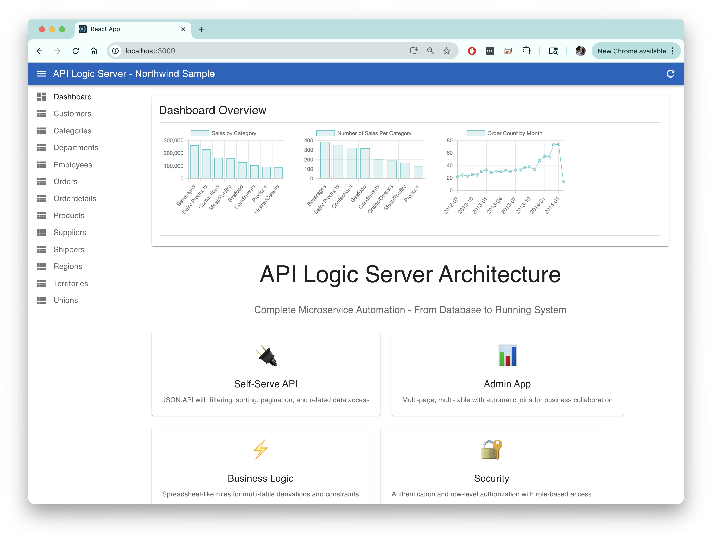
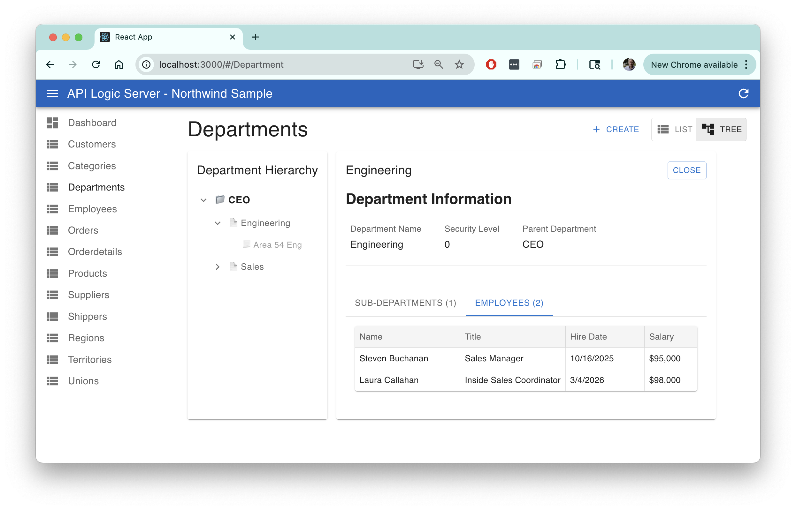
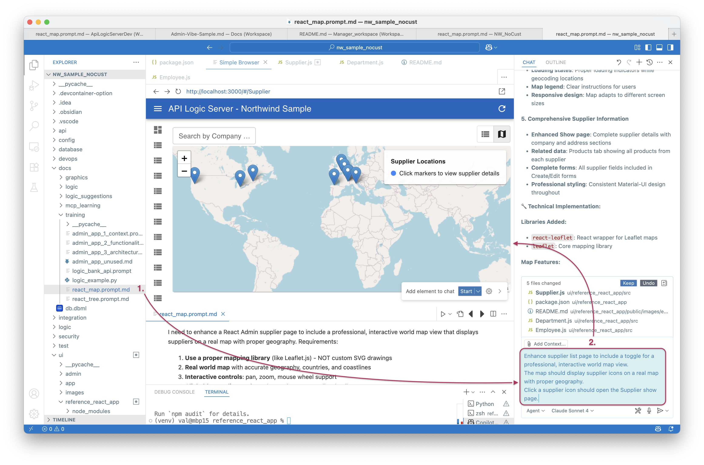

!!! pied-piper ":bulb: TL;DR - Vibe for graphs, maps, trees, cards"

      Use `genai-logic genai-add-app --vibe` to *generate* a standard react app.

      This page illustrates a number of customizations to the northwind sample (`samples/nw_sample` in the Manager).  These are shown below.
      
      These customizations were performed in VSCode using CoPilot, with the Claude Sonnet 4.6 Agent.

&nbsp;
      


## Copilot Summary

Here is the final transcript from CoPilot - it seems pleased with its work!

<details markdown>

<summary>Demos, Tutorials, Samples</summary>

Fantastic! 🎉 I'm thrilled that everything is working perfectly now!

What We've Successfully Accomplished:

* Employee List/Cards Toggle ✅

      * List view: Traditional data grid
      * Cards view: Beautiful card layout with employee photos
      * PhotoPath image support in both cards and show pages
      * Professional styling with hover effects and responsive design

* Employee Show Page ✅

      * Single, prominent photo display at the top (no duplicates!)
      * Comprehensive employee information in a clean grid layout
      * Proper image handling with fallback avatars
      * Seamless navigation from department tree → employee grid → employee details

* Department Tree View ✅

      * Hierarchical expandable tree with +/- icons for incremental expansion
      * Split-panel interface with department details on the right
      * Professional tabbed layout using Material-UI tabs
      * Employee grid display with clickable navigation to employee details

* Supplier Map View Summary ✅

      * Interactive World Map: Displays suppliers as red markers on a Leaflet.js world map with country-based positioning

      * Dual View Toggle: Switch between traditional list view and geographic map view using Material-UI toggle buttons

      * Click Navigation: Click markers or popup buttons to navigate directly to individual supplier detail pages

      * Info Panel: Overlay showing supplier count (29 total) with usage instructions and map legend

      * Global Coverage: Supports 20+ countries with fallback handling for unknown locations

* Technical Excellence ✅

      Robust error handling and data type consistency
      Proper React Admin component patterns
      Material-UI integration with consistent styling
      Clean, maintainable code structure

This implementation provides a truly professional and intuitive user experience for navigating department hierarchies and employee information. The combination of the tree view, image support, and tabbed interfaces creates a modern, enterprise-quality application!

</details>

<br>

## Setup

Node is required.

In the Manager, `samples/nw_sample` has already been created.  You will need to `npm install` and `npm start`.

If you want to start from scratch (e.g. to mimic the process with your own database):

```bash title="Vibe Kickstart"
genai-logic create --project-name=nw, --db-url=nw

# Open the project in your IDE, and issue Termimal commands:
genai-logic genai-add-app
```

Then, proceed with `npm install` and `npm start`.

The Landing Page Graphics requires you `genai-logic genai-graphics`.  For more information, [click here](WebGenAI-CLI.md#dashboard-graphics){:target="_blank" rel="noopener"}.

> Generated Apps do not yet support security; you must disable security: `als add-auth --provider-type=None`

<br>

## Landing Page with Graphs



We first created the graphics, as [described here](WebGenAI-CLI.md#dashboard-graphics){:target="_blank" rel="noopener"}.

We then requested a landing page (no hints on product architecture, by the way... we did not ask where it acquired this information).

```bash title="Prompt -- Landing Page with Graphics"
In ui/reference_react_app, create a landing page that summarizes the architecture, and iFrame to "http://localhost:5656/dashboard"
```

<br>

## Employee Cards


This example was easy and worked the first time:

```bash title="Prompt -- Employee Cards"
Add an option on the Employee List page to show results as cards, and 
show the employee image in the card.
```

<br>

## Department Tree



The examples above worked the first time.  The tree and map took many hours to work out.  See the discussion in the Appendix.

```bash title="Prompt -- Department Tree"
Create a Department tree view component for the existing Department list page. 

Make it collapsible/expandable and integrate it into the existing Department.js file.

The tree should show just the Department Name as a link; 
clicking the link opens an Information panel to the right.
The panel is equivalent to Department Show: all the fields, plus tab sheets for related data.
The tab sheets should provide transitions to the related data show pages (eg, the Employee page).
```

<br>

## Supplier Map


As with the tree, this took many hours to work out.

```bash title="Prompt -- Supplier Map"
Enhance supplier list page to include a toggle for a professional, interactive world map view.
The map should display supplier icons on a real map with proper geography.  
Click a supplier icon should open the Supplier show page.
```

## Required Learnings

The screenshot below shows how this worked in VSCode:

1. GenAI-Logic project creation automatically included learnings for creating maps.
2. Your prompt, plus the learnings, created the revised page.

      * Observe it differs from the screen shot below.  GenAI does not produce the same result every time!



<br>

### Learnings Creation

It took many hours (not days) to build the learnings shown above.
If you wish to build similar learnings for other UI paradidigms, the process is roughly:

1. Make a request
2. Iterate the request as required (this is the part that took hours)
3. When the result is good, **ask the GenAI tool to provide a prompt that is simple, and would have achieved the result without hours of iteration**
4. Create a file with the suggested prompt in the directory shown above
