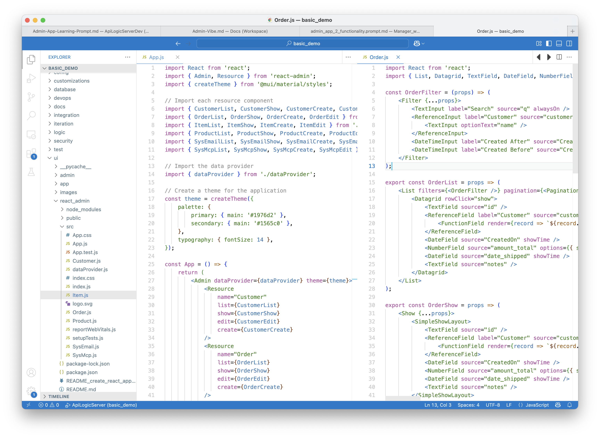
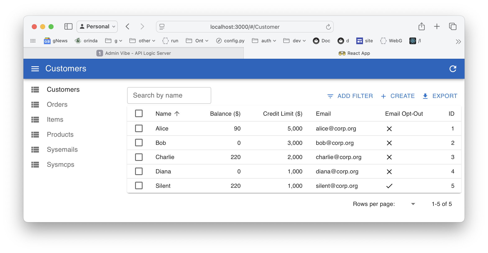
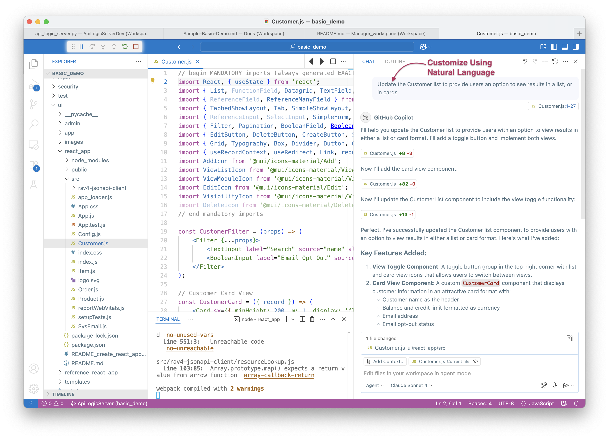
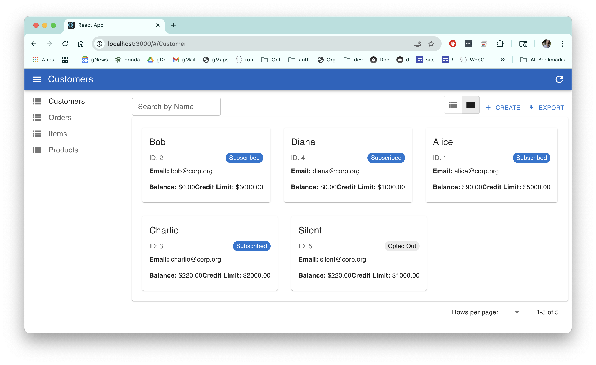
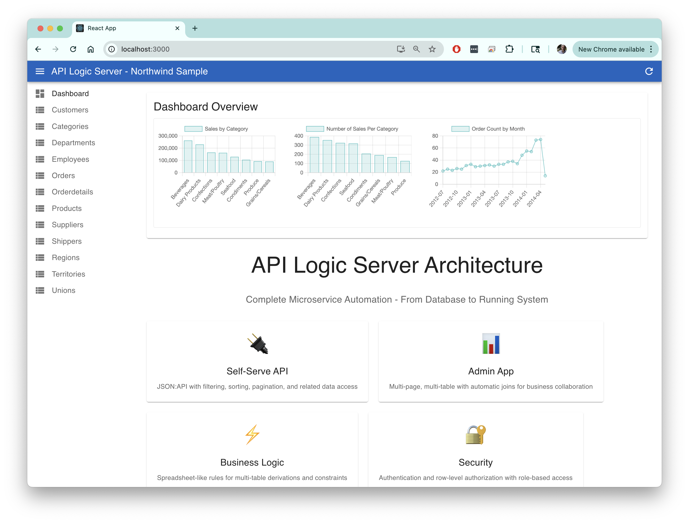

!!! pied-piper ":bulb: TL;DR - instant multi-page, multi-table apps"

      Ask your AI assistant (Copilot, Claude — already in your IDE session) to *generate* a
      standard react app directly from your project's `ui/admin/admin.yaml`,
      ***fully customizable*** using GenAI Vibe tools and/or your IDE. No OpenAI key, no
      separate API call — your assistant already has the schema and a running server in
      context. You get a headstart:

      * No data mockups - use the created server
      * No starting from scratch - customize a running multi-page app
      * Minimal background on html, javascript etc, <br>you can begin using Vibe/Natural Language tools to create custom User Interfaces 
      
      This complements the [*automated* Admin App](Admin-Tour.md){:target="_blank" rel="noopener"}, which focuses on speed and simplicity.
      
      It provides:
      
      | Feature  | Provides         | Example         |
      |:---------------------------|:-----------------|:-------------------------------------------------------------------------------|
      | Multi-Page | List/Show pages for each table<br>Built-in **search, sort, export**    | Customer Page, Order Page, etc | 
      | Multi-Table | **Tab Sheet** for related child data <br>**Page Transitions** for related data | Customer page has OrderList<br>Click --> Order/OrderDetails | 
      |             | **Automatic Joins** for Parent Data    | Product _Name_ - not just the Id | 
      |             | **Lookups** for foreign keys    | Find Product for OrderDetail | 
      |             | **Cascade Add** to default foreign keys    | Add Line Items for *this* order | 
      | Customize | Use GenAI Vibe tools and/or your IDE   | Add new pages, controls, etc | 

      > See status, at end. Prefer a ChatGPT-API-driven CLI generator instead? See the
      > [Appendix: CLI Generator](#appendix-cli-generator-fallback) below — a fallback for
      > environments with no AI assistant session available.


<br>

## Generation

### Get the Data Model Right Fast, *Then* Build the UI

Don't start React generation from a blank prompt — start from the Admin App you
already have running. It's the fast iteration loop for getting the data-model
surface correct before any UI code exists:

1. **Iterate on `ui/admin/admin.yaml`** — columns, types, ordering, labels,
   relationships, `show_when` visibility. Refresh the Admin App, check it, adjust,
   repeat. This loop is seconds per cycle, no build step, no React involved.
2. **Once `admin.yaml` is right**, generate the React Admin app from it. The
   generator isn't guessing table structure — it's translating a schema you've
   already verified. That's why this step is reliable: the hard part (getting
   columns/types/relationships correct) happened first, in the cheap loop.
3. **Only then layer on presentation** the Admin App's generic grid/form UI
   doesn't do — card layouts, maps, custom dashboards, branded styling. This is
   where a custom React app earns its keep over the built-in Admin App.

Skipping straight to React generation means debugging schema mistakes (wrong
column, wrong type, missing relationship) inside generated JSX — slower and
harder to isolate than catching them in `admin.yaml` first.

Pre-reqs:

1. Node
2. Your project running, with `ui/admin/admin.yaml` reflecting the schema you want (step 1 above)

Once your project is running, ask your AI assistant to generate the app (e.g., in your IDE's
chat panel):

```text title="Ask your AI assistant to generate the app"
Create a new react app named my-app-name from ui/admin/admin.yaml.
```

Your assistant copies a deterministic skeleton (package.json, data provider, base
components — no AI needed for this part), then generates one resource file per table in `admin.yaml`
(List/Show/Create/Edit for each), then wires `App.js`. See `ui/app_readme.md` and
`docs/training/admin_app_2_functionality.prompt.md` in your project for the exact pattern
and reporting format.

Then:

```bash title="Run the generated app"
cd ui/my-app-name
npm install
npm start
```

This is fast — a 6-table schema generates in a few minutes, not "6 min for northwind" via a
remote API — because there's no per-resource network round-trip to a hosted model.

<br>

## Generated App

Your AI assistant uses these to drive creation:

1. You projects' `ui/admin/admin.yaml` [(click here)](Admin-Architecture.md#appendix-sample-adminyml){:target="_blank" rel="noopener"}, which provides information about the schema and basic layout
2. The Managers' `Admin-App-Learning` [(click here)](Admin-App-Learning.md){:target="_blank" rel="noopener"} - describes the functionality and architecture of the generated app

It creates applications like this:



<br>

## Running App

The running app looks like this:



<br>

## Vibe Customization

Not a bad app, but the objective here is that we can customize - simply, with Natural Language.  Let's try it.

Here, we are using the Claude preview of VsCode, and make the request:

```txt title="Vibe: Customize with Natural Language"
Update the Customer list to provide users an option to see results in a list, or in cards
```



And we get:




### Northwind Reference Example

The Northwind app (`samples/nw_sample/ui/reference_react_app` in the manager) has been customized to illustrate what you can do with vibe, including graphs and charts, maps, trees, cards, etc.

To review, [click here](Admin-Vibe-Sample.md){:target="_blank" rel="noopener"}.



<br>

### Or, Update the training

This customization example was a one-off.

Since the *app learning* is a part of your project, you can alter it to create apps with lists / cards, automatically.

<br>

## Appendix: Status

Tested end-to-end on `basic_demo` and the Northwind sample (`nw_sample`). Creates
runnable apps, pre-wired with a dataProvider for SAFRS JSON:API.

> Note: AI can make errors — these often require minor corrections to imports, etc.
> We continue tuning the learning to reduce these.

Working:

* Master / Detail Tab Sheets, Grid (multi-column) Show pages, Automatic Joins, Filter, Transitions, Update with Validation, Lookups, Cascade Add

ToDo:

* Security (disable with `genai-logic add-auth --provider-type=None`)

<br>

## Appendix: Explore 

The quickest way to get going...

1. Install GenAI-Logic and the Manager ([click here](Install-Express.md){:target="_blank" rel="noopener"}), and
2. In the Manager, open a terminal window and create Basic Demo ([Info here](Sample-Basic-Demo.md){:target="_blank" rel="noopener"}) as described in the **Readme**:

```bash
ApiLogicServer create --project_name=basic_demo --db_url=basic_demo
```

3. Open the created app, and run it (F5) to explore the Automatic Admin App and the API
4. Execute the Generation procedure as described above
5. Proceed with the readme to explore business logic, MCP, customization, and integration

<br>

## Appendix: CLI Generator (fallback)

Before AI assistants could generate apps directly inside your IDE session, this project
shipped a CLI command that drove the same generation via the OpenAI API — one call per
resource file, to stay under token limits for a single-shot completion. It still works, and
is the right choice if your environment has no AI assistant session available (e.g. a
walled-garden Codespaces setup with only a fixed tool, or a CI/scripted pipeline).

Pre-reqs:

1. An OpenAI API Key ([click here](WebGenAI-CLI.md#configuration){:target="_blank" rel="noopener"})
2. Node

```bash title="Create and Run React app (CLI, OpenAI-driven)"
genai-logic genai-add-app --vibe --app-name=my-app-name
cd ui/my-app-name
npm install
npm start
```

This can take a while (e.g., 6 min for northwind sample) — each resource file is a separate
network round-trip to a hosted model. Produces the same output shape as direct AI-assistant
generation above.


