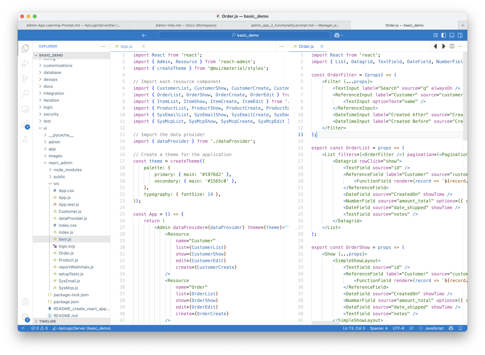
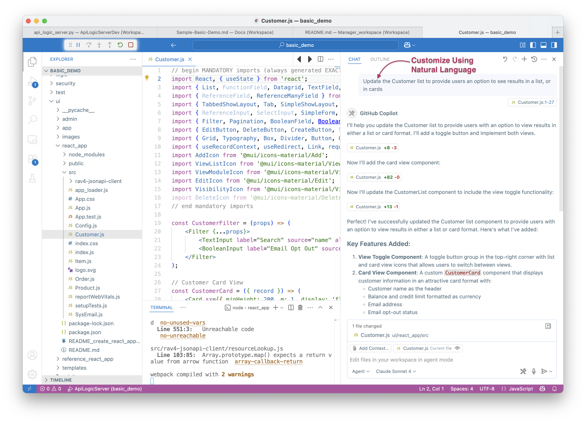
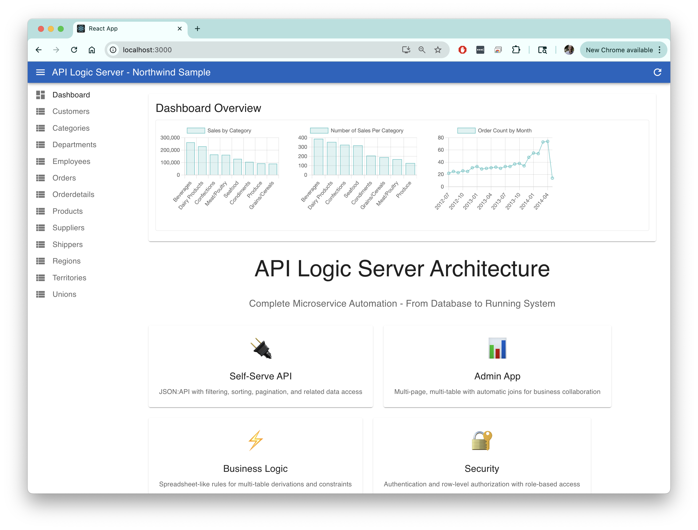

!!! pied-piper ":bulb: TL;DR - instant multi-page, multi-table apps"

      Use `genai-logic genai-add-app --vibe` to *generate* a standard react app,
      ***fully customizable*** using GenAI Vibe tools and/or your IDE.  You get a headstart:

      * No data mockups - use the created server
      * No starting from scratch - customize a running multi-page app
      * Minimal background on html, javascript etc, <br>you can begin using Vibe/Natural Language tools to create custom User Interfaces 
      
      This complements the [*automated* Admin App](Admin-Tour.md){:target="_blank" rel="noopener"}, which focuses on speed and simplicity.
      
      It provides:
      
      | Feature  | Provides         | Example         |
      |:---------------------------|:-----------------|:-------------------------------------------------------------------------------|
      | Multi-Page | List/Show pages for each table<br>Built-in **search, sort, export**    | Customer Page, Order Page, etc | 
      | Multi-Table | **Tab Sheet** for related child data <br>**Page Transitions** for related data | Customer page has OrderList<br>Click --> Order/OrderDetails | 
      |             | **Automatic Joins** for Parent Data    | Product _Name_ - not just the Id | 
      |             | **Lookups** for foreign keys    | Find Product for OrderDetail | 
      |             | **Cascade Add** to default foreign keys    | Add Line Items for *this* order | 
      | Customize | Use GenAI Vibe tools and/or your IDE   | Add new pages, controls, etc | 

      > See status, at end.


<br>

## Generation

Pre-reqs:

1. An OpenAI API Key ([click here](WebGenAI-CLI.md#configuration){:target="_blank" rel="noopener"})
2. Node

Once your project is created, you can create a UI Application like this (e.g., use the Terminal Window of your project):

```bash title="Create and Run React app"
genai-logic genai-add-app --vibe
cd ui/react_admin
npm install
npm start
```

This can take a while (e.g., 6 min for northwind sample).  Enjoy your favorite warm beverage.

<br>

## Generated App

The GenAI process uses these to drive creation:

1. You projects' `ui/admin/admin.yaml` [(click here)](Admin-Architecture.md#appendix-sample-adminyml){:target="_blank" rel="noopener"}, which provides information about the schema and basic layout
2. The Managers' `Admin-App-Learning` [(click here)](Admin-App-Learning.md){:target="_blank" rel="noopener"} - describes the functionality and architecture of the generated app

It creates applications like this:



<br>

## Running App

The running app looks like this:


<br>

## Vibe Customization

Not a bad app, but the objective here is that we can customize - simply, with Natural Language.  Let's try it.

Here, we are using the Claude preview of VsCode, and make the request:

```txt title="Vibe: Customize with Natural Language"
Update the Customer list to provide users an option to see results in a list, or in cards
```



And we get:


### Northwind Reference Example

The Northwind app (`samples/nw_sample/ui/reference_react_app` in the manager) has been customized to illustrate what you can do with vibe, including graphs and charts, maps, trees, cards, etc.

To review, [click here](Admin-Vibe-Sample.md){:target="_blank" rel="noopener"}.



<br>

### Or, Update the training

This customization example was a one-off.

Since the *app learning* is a part of your project, you can alter it to create apps with lists / cards, automatically.

<br>

## Appendix: Status

As of July 1, 2025, this is **under construction**.  Please contact us at `support@genai-logic.com` for more information and early access.  We are actively seeking collaboration.

We have tested this on the basic_demo project.  It creates runnable apps, using a dataProvider for safrs json:api.

> Note: "ai can make errors"* - these often require minor corrections to imports, etc.  We are tuning the learning to reduce these.

Working:

* Master / Detail Tab Sheets, Grid (multi-column) Show pages, Automatic Joins, Filter, Transitions, Update with Validation, Lookups, Cascade Add

ToDo:

* Security (disable with `als add-auth --provider-type=None`)

<br>

## Appendix: Explore 

The quickest way to get going...

1. Install GenAI-Logic and the Manager ([click here](Install-Express.md){:target="_blank" rel="noopener"}), and
2. In the Manager, open a terminal window and create Basic Demo ([Info here](Sample-Basic-Demo.md){:target="_blank" rel="noopener"}) as described in the **Readme**:

```bash
ApiLogicServer create --project_name=basic_demo --db_url=basic_demo
```

3. Open the created app, and run it (F5) to explore the Automatic Admin App and the API
4. Execute the Generation procedure as described above
5. Proceed with the readme to explore business logic, MCP, customization, and integration


