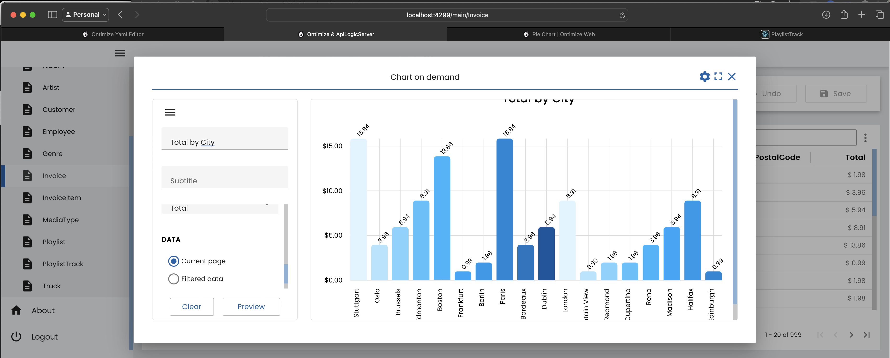
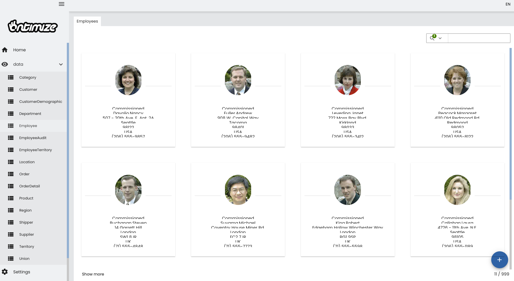
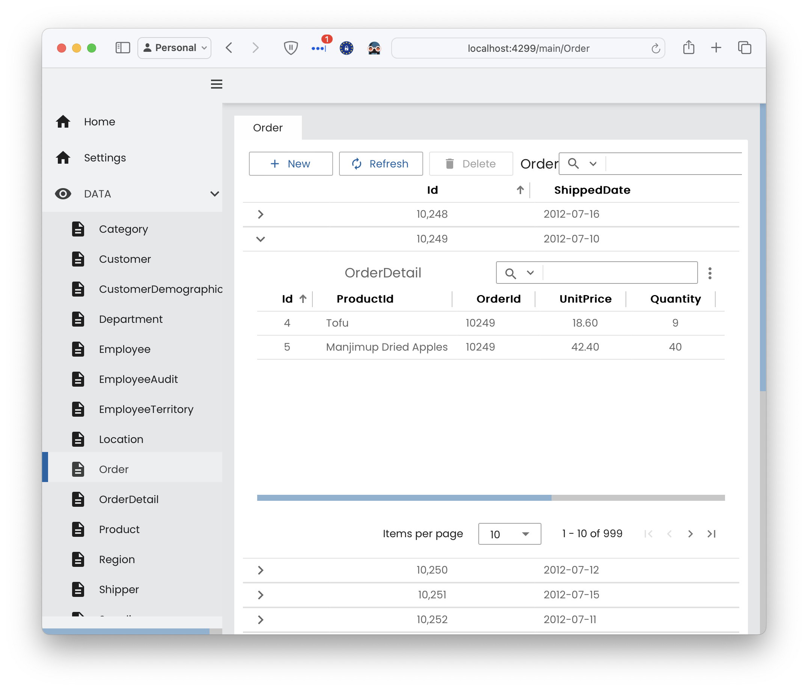
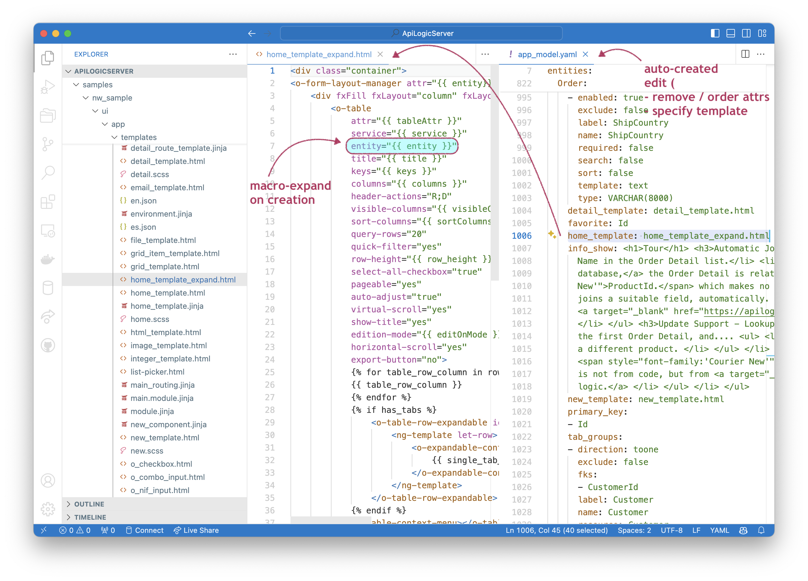
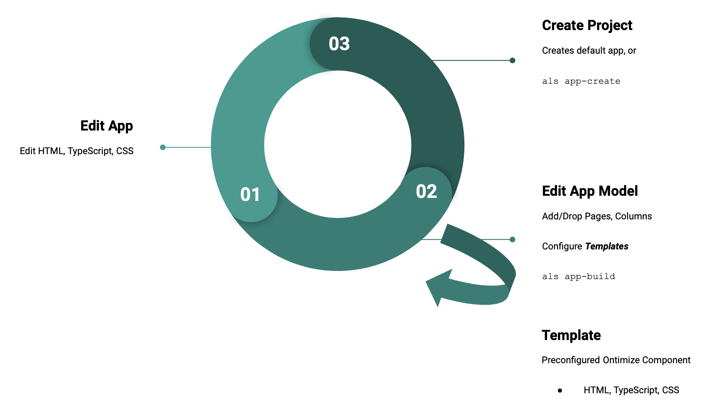
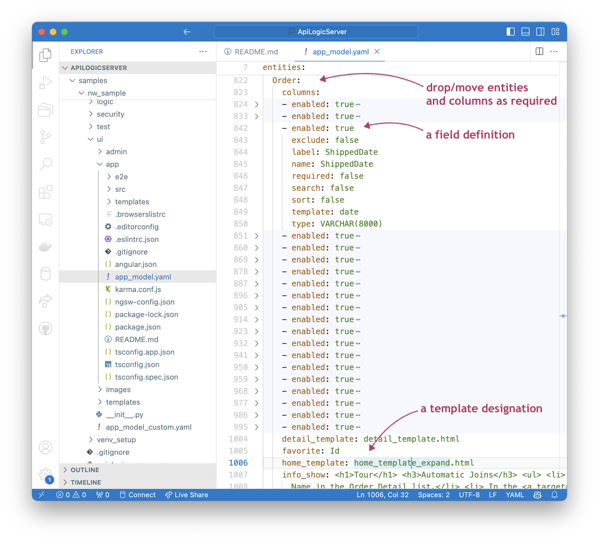
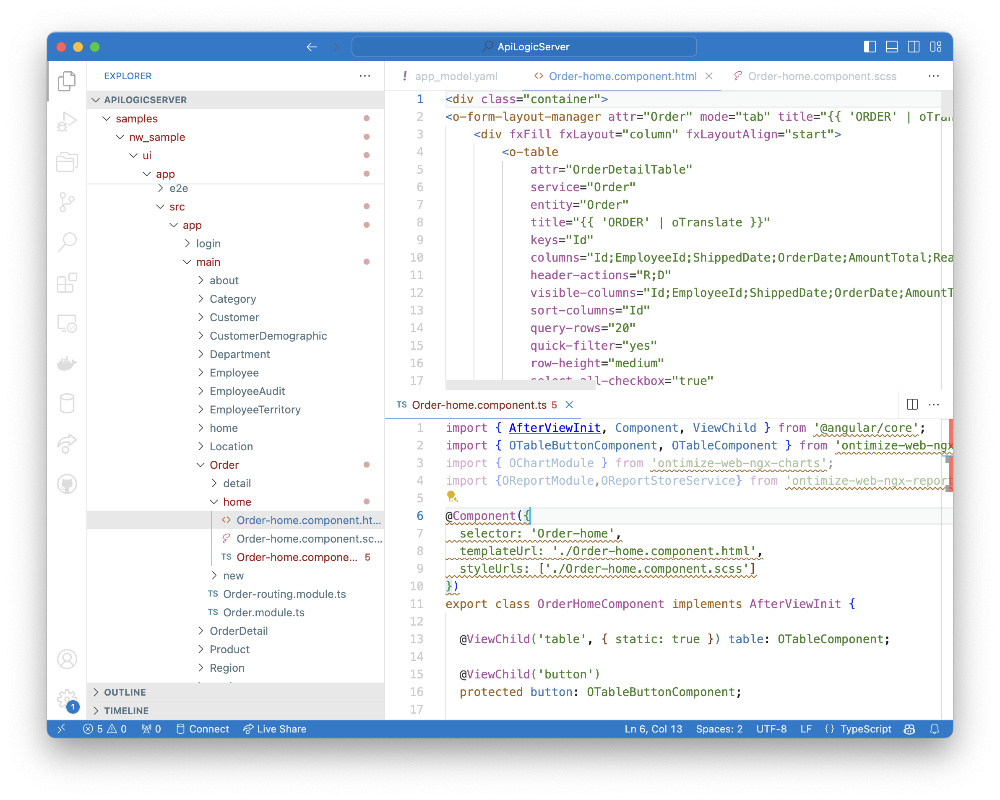

**Under Construction - Beta**

!!! pied-piper ":bulb: TL;DR - Front Office App Dev"

    To complement the Admin App, API Logic Server can automatically create a 'starter kit' Angular app, using [**Ontimize**](https://ontimizeweb.github.io/docs/v15/introduction/), a proven app framework.  This approach provides the features outlined in [Custom Web Apps](App-Custom.md){:target="_blank" rel="noopener"}:

    1. **Faster and simpler automated creation:** the system creates a default app model, and uses that to create a default app, in seconds.
    
    2. **Simpler customization:** it is orders of magnitude simpler to tweak the properties of a generated app than to create the app by hand.  You can customize at 2 levels: 
    
        a. **The generated app for full control:** you can edit the generated app (HTML, Typescript, CSS).
        
        b. **The app model:** the app is generated from a yaml model that designates the components for tables (grid, card, tree, dialog) and fields (text, image, combo, etc).  You can modify the yaml model to rebuild the app.
    
    This technology is currently in preview state - *not* ready for production.  Please contact us if you would like to try it, and provide feedback.

&nbsp;

# Ontimize - Angular Starter Kit

What is Ontimize Web?  See the Playground [Ontimize Web site](https://try.imatia.com/ontimizeweb/v15/playground/main/home){:target="_blank" rel="noopener"}:

> Ontimize Web is web application framework based on Angular for building business software. Ontimize Web makes use of Angular framework and its UI Component framework (Angular Material) to provide a set of reusable, well-tested and accessible components apart from a number of standard services and functionalities.  This includes a wealth of rich UI components (editable grid, charts, reports, tree, etc).

&nbsp;

## API Logic Server Integration

While a separate product, Ontimize is highly integrated with API Logic Server:

1. **Unified Database:** driven by the same Data Model, and underlying JSON:API / logic
2. **Unified Repository:** Artifacts are files stored in your project directory for unified source, and managed by any standard IDE
3. **Shared Dev Server:** the API Logic Server serves the API, the Admin App, and the Ontimize App.  This simplifies development

> It should be possible for users with limited Python, Flask, SQLAlchemy, JavaScript technology (`npm` build, etc), or Ontimize knowledge to <br>1. Create a backend API<br>2. Declare rules for multi-table derivations and constraints<br>3. Create a front office Ontimize app, and<br>4. Make HTML UX page customizations

As you can see below, you are no longer limited to simple master/detail screens:

1. A Chart (via the hamburger window - charts on demand)




2. Card/Grid Template
This will show employees as image cards. The grid_items are the attributes to show below the image. The grid_image is the path to display the image using an href style path.



```
    home_template: grid_template.html
    grid_items: 'EmployeeType, LastName,FirstName,Address, Country, HomePhone'
    grid_image: PhotoPath

```
3. A *nested grid* example below which nests an Item grid within an Order grid:


&nbsp;
This will show the normal Home page grid but it will select the first tabgroup (onetomany) to include as an expandable grid. In the Northwind admin_model.yaml file - change the entity Order home_template.

```
 home_template: home_template_expand.html
```

&nbsp;

## Ontimize Components

Components (like nested grid) are a key element.  As you can see from the [grid component](https://try.imatia.com/ontimizeweb/v15/playground/main/data/grid/basic){:target="_blank" rel="noopener"}, using a component means you provide a **combination of html, css and typescript**.  There are analogous components for cards, trees, dialogs, graphs, charts, maps and fields (text, image, combo, etc).  

&nbsp;

# Concepts: Templates, Models

Each component has its own unique html code (including properties), css and typescript.  So, changing from a list to a grid would be a complex task.

So, API Logic Server introduces a template-based application model:

* **Template**: a macro-expansible version of a template, bundling its html, css and typescript.  The template is a 'generation ready' component.

* **Model**: a YAML file that designates the templates for tables (grid, card, tree, dialog) and fields (text, image, combo, date, currency, etc).  The creation process macro-expands the designated templates, creating the full app, which you can then customize.

> So, typical dev cycle would be to tune the model to designate the templates, </br>
then fine-tune the generated app by editing components.

Templates are created into your project:



&nbsp;

# Custom App Procedures

A default Ontimize app is created automatically when you create projects with security.  You can also create additional apps using the `als app-create` as described below.

&nbsp;

## 1. Create Project

One way is to `create` an ApiLogicServer project, specifying `--auth-provider-type=sql`:

```bash
als create --project_name=ApiLogicProject --db-url= --auth-provider-type=sql
```
Note: Security must be enabled for Ontimize client (see: als add-auth)

This creates a project from your database (here, the [default sample](Sample-Database.md){:target="_blank" rel="noopener"}), which you can open and execute in your IDE.  It includes an API, the Admin App, and the default custom app.

Initially, you may wish to skip to [step 2 to run the default custom app](#2-run).

&nbsp;

### &emsp;&emsp;- Default App Created

If you create your app with authorization, a default Ontimize app will be created as a `ui/app` directory, with a full Ontimize default app.

&nbsp;

### &emsp;&emsp;- Parallel Logic/API Dev

At this point, distinct dev teams can safely proceed in parallel:

* backend: develop logic and custom APIs (e.g., for application integration)
* ui: proceed as described below

As noted earlier:

* logic is **automatically factored out of ui code** (in particular, not in controllers).  This increases re-use across apps, and re-use for integration

* **ui dev is not dependent on server api creation** -- JSON:APIs are self-serve, so ui developers are not blocked by backend api 

&nbsp;

## 2. Run

Execution is standard to Ontimize (assumes the installation of NPM and NodeJS). 

```bash
cd ui/app
npm install
npm start
```

Browse to [localhost:4299](http://localhost:4299), and login as `user: admin password:p`.

&nbsp;

## 3. Customize

The simplest way to introduce rich components is to specify them in the app model, and the rebuild the app.  Iterate this process until you have the right templates, then customize the created app.



### 3a. Enable Security

To enable Keycloak - both ApiLogicServer and your Ontimize application need to be configured for Keycloak. 
Go to config/configy.py and modify the Keycloak settings below (if you are running our local Keycloak Docker container use these defaults.)

    keycloak_url: http://localhost:8080
    keycloak_realm: kcals
    keycloak_client_id: alsclient

&nbsp;
This will inject into src/app.module.ts the keycloak settings.
```
    
    const keycloakOptions: KeycloakOptions = {
    config: {
        url: "{{ keycloak_url }}",
        realm: "{{ keycloak_realm }}",
        clientId: "{{ keycloak_client_id }}"
    },
    initOptions: {
        onLoad: 'login-required'
    }
    };

```
Enable Keycloak for the ALS server and Ontimize client to use:
```
    als add-auth --provider-type=keycloak
```
&nbsp;   
### 3b. Edit the YAML Model

Edit to remove unwanted entities, order columns, define column or page templates, etc. 

You can edit the ui/app/app_model.yaml file directly, or use the [provided model editor gui](#model-editor).

<details markdown>

<summary> Show me how -- Edit Model </summary>

&nbsp;



</details>

### 3c. Rebuild App

Then, rebuild your application (Note: this will overwrite all files in your Ontimize app directory):

PRO TIP: create a new application (app-create) with the edited app_model.yaml and merge the changes for the selected components back into the original app.
```bash
ApiLogicServer app-build --app=app
```

### 3d. Customize Created App

This will use the data model to build an Ontimize app.

You can then use your IDE or other tooling (e.g., Ontimize CLI) to edit the artifacts to customize the look and feel.

Then, repeat [2. Run](#2-run), above.

<details markdown>

<summary> Show me how -- Customize Application </summary>

&nbsp;



</details>


&nbsp;

## 4. Create Additional Apps

To create a new Ontimize application (perhaps the model or database has changed) or you have new templates to test.

With the project open in your IDE, use the **terminal window** to create a new Ontimize application in a named directory under 'ui':

```bash
ApiLogicServer app-create --app=app2
cd ui/app2
npm install
```

This creates `ui/app2/app_model.yaml` and installs the Ontimize 'seed' NodejS package and dependent node_modules.

```bash
ApiLogicServer app-build --app=app2
cd ui/app2
npm start
```
# Dockerize Yaml
Each application already has a Dockerfile (which can be edited) 
```
cd ui/{myapp}
docker build -f Dockerfile -t {gitrepo}/{myappname} --rm .  
```
# Appendices

## Yaml Model Editor
The Yaml editor allows the developer the ability to manage yaml files for editing using an Ontimize built application. Use the "Manage yaml files" New - to add your yaml file and then click upload (save) to populate the screens with entities, attributes, and tab groups. Once complete, use the download_flag (save)  to export the yaml to the 'ui' directory (ui/admin_model_merge.yaml) and compare/merge to your original admin_model.yaml in your ontimize application folder. The open source application can be found here:
```
git clone https://github.com/tylerm007/ontimize_yaml_view
cd ontimize_yaml_view
code .
press f5
```

## Start Ontimize App Model Editor
The App Model Editor simplifies managing yaml files, using an Ontimize built application.  See [App Model Editor](App-Model-Editor.md){:target="_blank" rel="noopener"} for more information.
```
cd ui/yaml
npm install
npm start

#go to http://localhost:4298 (user: admin password: p)
```
## Ontimize app_model.yaml 
The app_model.yaml file is created during the "app-create" or "create" phase and is based on the react-admin ui/admin.yaml file. Each entity, column, and tab_group is exposed with additional metadata.  When the "app-build" is invoked, these properties are used to populate the templates (html, scss, and typescript) for each page. If the "exclude" flag is set to 'false' - the entity, attribute, or relationship will be excluded from the page. The "visible" column flag only applies to the Home table columns appearing in the grid.

## Entity
Use the Ontimize editor to exclude a selected entity or change the titles.


### Edit Entity
|field|Description|
:------|:---------------|
|Entity name|name of API endpoint {{ entity }}|
|Title|display name used for {{ title }} |
|Primary Key|array of primary keys {{ primaryKeys }}|
|Favorite|used for list-picker display|
|Mode|tab or dialog style {{ editMode }}|
|Menu Group|used to organize entity into menu groups|
|Exclude|if true - skip this API endpoint in the first page generation|

## Attributes
Use the Ontimize editor to change the label, tooltip, exclude selected attributes, include attribute in the search or sort, enable or mark fields as required, and include visible in the home table display.

### Edit Attributes
|field|Description|
:------|:---------------|
|Entity Name|name of api endpoint|
|Attribute|name of API attribute {{ attr }}|
|Title|label used for this attribute {{ label }} |
|Template Name|column template (pick list)|
|Search|is this field included in search|
|Sort|is this field included in sort|
|Required|is this field marked as required|
|Excluded|exclude this attribute from detail/new/home pages|
|Visible|is this attribute visible on home table {{ visibleColumns }}|
|DataType|the internal datatype|
|Tooltip|hover value for attribute|
|Default Value|value to show on new page|

## Relationships (TabGroup)
Use the Ontimize editor to exclude tab on detail page (tomany) or change the tile used to display.

### Edit Tab Groups
|field|Description|
:------|:---------------|
|Entity Name|name of api endpoint|
|Tab Entity|the name of the other end of the relationship|
|Direction|toone (parent) or tomnay (children)|
|Relationship name|defined in SQLAlchemy|
|label|Tab Display name|
|Exclude|skip this relationship for all tabs and lookups|
|Foreign Keys|array of values|

## Global Settings
These values are injected into the various entity and attribute to provide and set global values.  New values can be added for new templates.

### Values
|field|Description|
:------|:---------------|
|Include Translation|set to true and then do an app-build to generate Spanish translation (assets/Ii8n/es.json)|
|Currency Symbol|set for locale $ |

### Existing Column Templates
```
    ("checkbox", "o_checkbox.html"),
    ("check_circle", "check_circle_template.html"),
    ("combo", "o_combo_input.html"),
    ("currency", "currency_template.html"),
    ("date", "date_template.html"),
    ("email", "email_template.html"),
    ("file", "file_template.html"),
    ("html", "html_template.html"),
    ("integer", "integer_template.html"),
    ("list", "list-picker.html"),
    ("nif", "o_nif_input.html"),
    ("password", "password_template.html"),
    ("percent", "percent_template.html"),
    ("phone", "phone_template.html"),
    ("real", "real_template.html"),
    ("text", "text_template.html"),
    ("textarea", "textarea_template.html"),
    ("time", "time_template.html"),
    ("timestamp", "timestamp_template.html"),
    ("toggle", "o_slide_toggle.html")
```
## Custom Templates
Ontimize templates can be modified in the local /templates directory.  There are a few examples of using advanced template customizations.  Once the local template is changed use the 'als app-build --app={myApp}' to rebuild your entire app.  If you wish to preserve your prior customizations, we suggest building a new application and merge changes back into your customized Ontimize app.