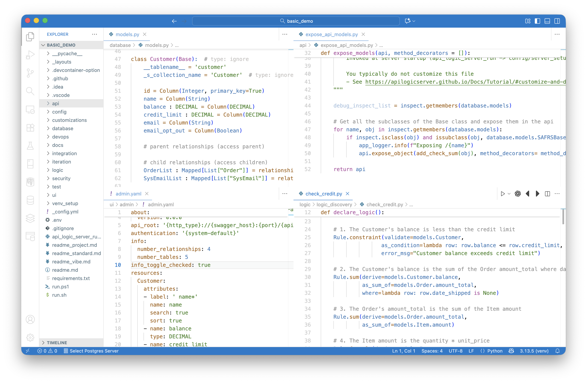

While the most striking element of ApiLogicServer is automation - a running UI and API from a database - there are some important underlying aspects, described below.

&nbsp;

## _Declarative_ Models

Observe that the key files for defining API, UI and Logic are not procedural code.  They are _declarative:_ specifications of _what_ you want to happen, not _how_ it's implemented:

* Logic looks more like a specification than code

* UI looks like a list of Objects and Attributes to display

* API looks like a list of Objects

This is important because they are orders of magnitude shorter, and therefore far easier to understand, and to customize.

For example, consider the UI, defined by `ui/admin/admin.yaml`.  This is in lieu of hundreds of lines of very complex HTML and JavaScript.

## Customizable, Standard Dev Tools

ApiLogicServer makes provisions for you to add standard Python code for aspects of your project that are automated - custom end points, extensions to the data model, logic (rules _plus Python_).  

Using Python for both declarative models and customization presents a uniform, predictable environment for developers.  It enables their use of preferred tools - IDE, code editor with code completion, debugging, source code management, etc.

&nbsp;

## Includes Backend Logic - Rules

As noted above, multi-table constraints and derivations can constitute nearly half the effort in transactional systems.

Unlike most systems that address such logic with "your code goes here", ApiLogicServer provides _**declarative** spreadsheet-like rules,_ customizable with Python, as [described here](../Logic-Why/#extend-python).  Rules are 40X more concise than code.  

Rule execution is via a _transaction logic_ engine, a complementary technology to traditional RETE engines.  The [transaction logic engine](https://github.com/valhuber/LogicBank/wiki/Rules-Engines) is specifically designed to optimize integrity and performance for transactional logic, which is not possible in RETE engines. See [here](https://github.com/valhuber/LogicBank/wiki/Logic-Walkthrough) for more information on their operation.
