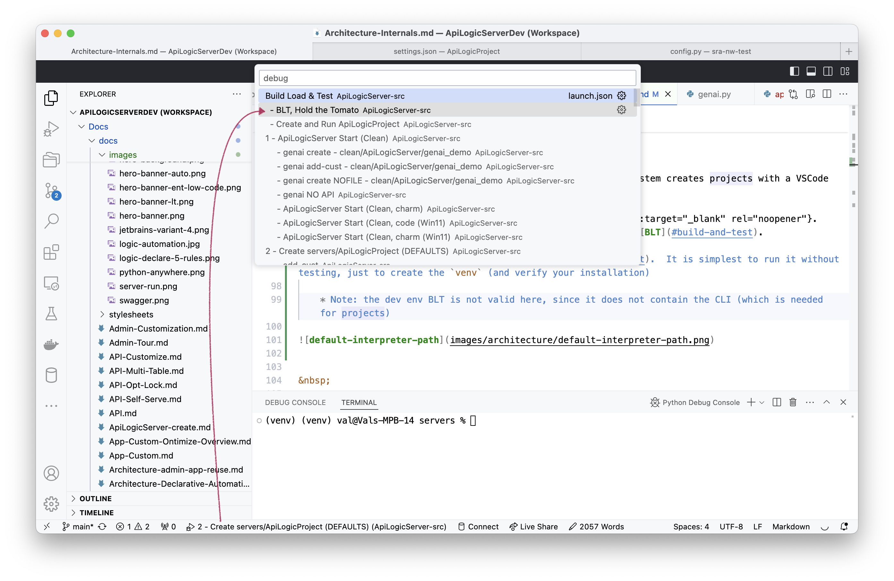

!!! pied-piper ":bulb: TL;DR - rebuild, local install, run tests"

    The **Build Load and Test** Run Configuration:
    
    1. Rebuilds the project locally
    2. Installs it from the local build 
    
        * At: `ApiLogicServer/ApiLogicServer-dev/build_and_test/ApiLogicServer`
    3. Runs a series of tests

        * Tests are configurable, which can reduce setup.  
    
    The resultant install provides a `venv` which is used in unit testing as the **default venv**.  A Run Configuration is provided for build-only, to enable such unit testing. 


As of version 6.02.20, [test automation](https://github.com/ApiLogicServer/ApiLogicServer-src/tree/main/tests/build_and_test){:target="_blank" rel="noopener"} provides automated regression testing.  These have been verified on Mac, Linux (Ubuntu) and Windows.

&nbsp;

## Best Practice: Smoke Test First

The tests take several minutes, and errors can be slightly difficult to diagnose.

The bulk of the tests are in the Sample Projects's Behave tests. These reveal most of the errors, and are simplest to debug using a created project. 

We therefore recommend that, before you run the full regression, first:

1. Create the BLT `venv` (useful for running the smoke test app - [see here](Architecture-Internals.md#create-the-BLT-venv))



2. [Verify the smoke test with the Sample App](Architecture-Internals.md#critical-smoke-test){:target="_blank" rel="noopener"}


## Optional Docker Setup

Full testing requires Docker:

* To build docker projects
* To build the API Logic Server Docker container
* For [docker test databases](Database-Docker.md){:target="_blank" rel="noopener"}

You can reduce or completely eliminate docker requirements by configuring the tests as described in the next section.

&nbsp;

## Install SetupTools

As of release, the system uses setuptools.

You may need verify build is installed.  You can install it manually:

```bash
python -m pip install build
python -m pip install setuptools
```

&nbsp;

## Configuring the Tests

The automated test (use the launch configuration `Build Load & Test`) performs a number of steps.  You can configure the test to run some or all of these by editing the `env_xxx.py` files shown here:


Key aspects are described in the sub-sections below.

&nbsp;

#### `do_install_api_logic_server`

This:

1. Runs the standard Python build: `python3 setup.py sdist bdist_wheel`
2. Installs it into a Python environment

    * `ApiLogicServer/ApiLogicServer-dev/build_and_test/ApiLogicServer`

3. Installs `pyodbc`.  Note this requires you have installed `odbc`, but install failures are intentionally ignored (instead, skip the Sql/Server database with`do_docker_sqlserver = False` )

!!! pied-piper ":bulb: venv can be used for created projects"

    You will find it helpful to use this as a [shared venv](Project-Env.md#shared-venv){:target="_blank" rel="noopener"}.

&nbsp;

#### `do_create_api_logic_project`...

This creates the sample project, runs the server, and tests the logic using the behave tests.  It produces quite a lot of output which you can ignore.  The test is designed to terminate if the tests fail.

These are extensive tests which verify project creation, server startup, logic and some minimal API testing (the Behave tests issue APIs to read/write data).

&nbsp;

#### `do_allocation_test`

This is a complex rule example.

&nbsp;

#### `do_docker_<database>`

These create projects from docker databases ([see here](Database-Connectivity.md#docker-databases)) which are expected to be running.  They perform minimal validation to ensure the server starts by executing the _hello world_ API.  

    This in fact verifies that the `models.py` file is created and runs.

If you don't wish to install or run the docker databases, edit your `tests/build_and_test/env.py` to disable `do_docker_creation_tests`.

## Windows Issues

I was able to build in Windows (12/27/2024), with the following non-trivial provisos.

### Path Length

For many Windows installs, the path length exceeds the max.

1. Prevents git pull for the `api_logic_server_cli/prototypes/manager/system/genai/examples/genai_demo/wg_dev_merge/base_genai_demo_no_logic`.  I had to download the zip and skip these files on unzip.

    * If you do that, don't forget the setup procedure for SafrsReactAdmin

2. The BLT recognizes that the Ont app (`api_logic_server_cli/prototypes/manager/system/app_model_editor`) is too big, and deletes it.

    * So, you can *build* on Windows, but you cannot *release*.

### Logging in genai_svcs

Recent changes (as of 12/27/2024) in logging in `api_logic_server_cli/genai/genai_svcs.py` must be commented out.  This is a serious bug which must be addressed before we can release another version.
