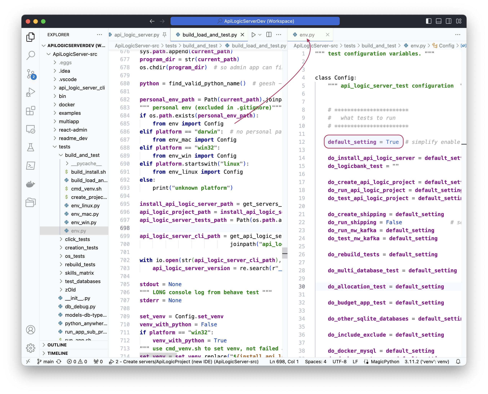

!!! pied-piper ":bulb: TL;DR - rebuild, local install, run tests"

    The **Build Load and Test** Run Configuration rebuilds the project locally, and runs a series of tests.  Tests are configurable, which can reduce setup.  
    
    The resultant install provides a `venv` which is used in unit testing as the **default venv**.  A Run Configuration is provided for build-only, to enable such unit testing. 

As of version 6.02.20, [test automation](https://github.com/ApiLogicServer/ApiLogicServer-src/tree/main/tests/build_and_test){:target="_blank" rel="noopener"} provides automated regression testing.  These have been verified on Mac, Linux (Ubuntu) and Windows.

The automated test (use the launch configuration `Build Load & Test`) performs a number of steps.  You can configure the test to run some or all of these by editing the ``env_xxx.py` files shown here:

&nbsp;

## Best Practice: Behave First

The tests take several minutes, and errors can be slightly difficult to diagnose.  We therefore recommend that you begin testing with the Sample App.

1. Execute the Build Only Run Configuration (it's 2nd on the list).  

2. Execute Run Configuration `2 - Create servers/ApiLogicProject (new IDE)`

## Setup

## Test Configuration

## Unit Test Default `venv`

eg, see 2 - Create servers/ApiLogicProject (new IDE)

#### `do_install_api_logic_server`

This:

1. Runs the standard Python build: `python3 setup.py sdist bdist_wheel`
2. Installs it into a Python environment `dev/servers/install/ApiLogicServer/venv`
3. Installs `pyodbc`.  Note this requires you have installed `odbc`, but install failures are intentionally ignored (instead, skip the Sql/Server database with`do_docker_sqlserver = False` )

!!! pied-piper ":bulb: venv can be used for projects"

    You will probably find it helpful to use this as a [shared venv](Project-Env.md#shared-venv).

#### `do_create_api_logic_project`...

This creates the sample project, runs the server, and tests the logic using the behave tests.  It produces quite a lot of output which you can ignore.  The test is designed to terminate if the tests fail.

These are extensive tests which verify project creation, server startup, logic and some minimal API testing (the Behave tests issue APIs to read/write data).

#### `do_allocation_test`

This is a complex rule example.

#### `do_docker_<database>`

These create projects from docker databases ([see here](Database-Connectivity.md#docker-databases)) which are expected to be running.  They perform minimal validation to ensure the server starts by executing the _hello world_ API.  

    This in fact verifies that the `models.py` file is created and runs.

If you don't wish to install or run the docker databases, edit your `tests/build_and_test/env.py` to disable `do_docker_creation_tests`.
