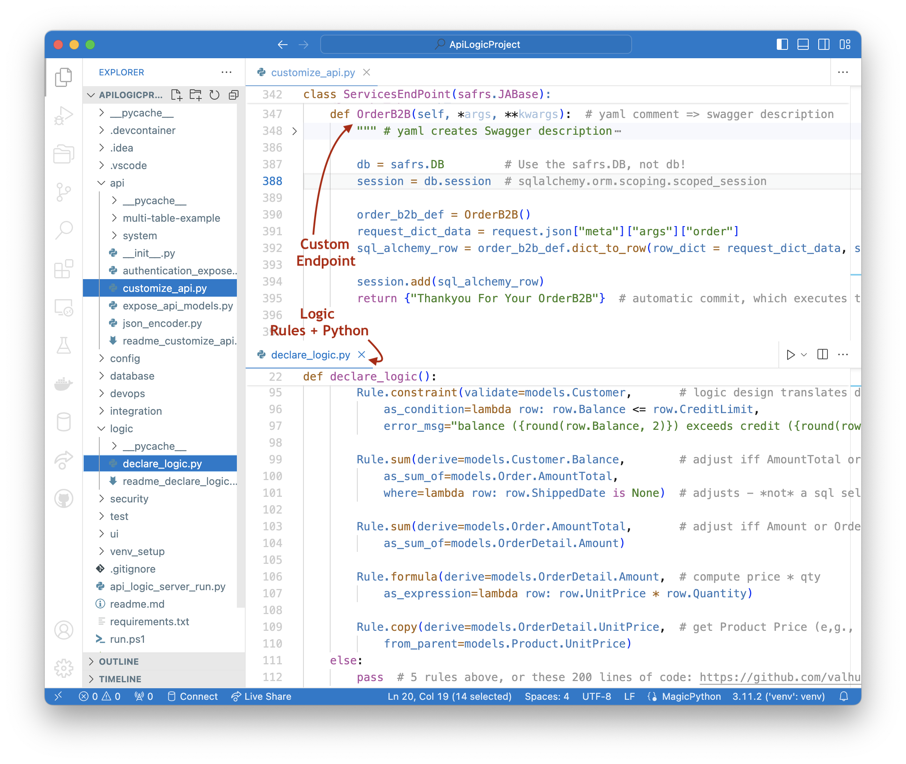
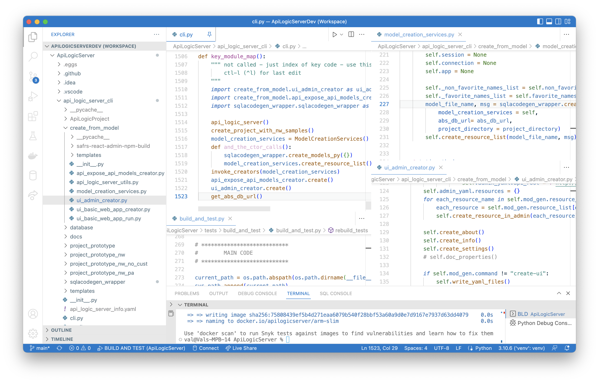
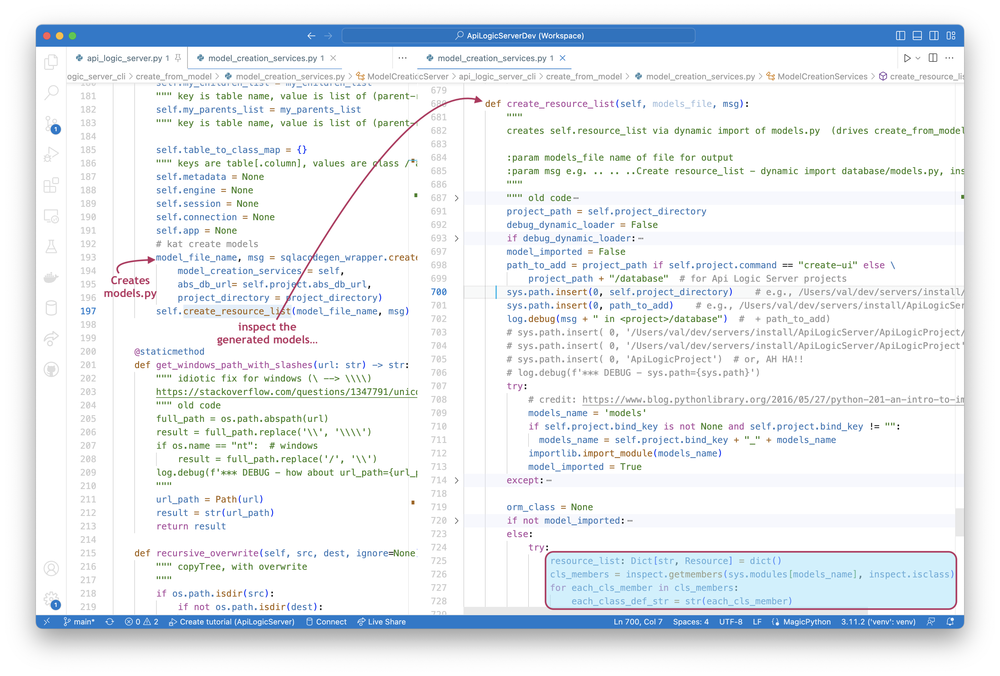

This page does _not_ address created projects, rather, it is about the API Logic Server system used to create projects.  It is for those who want to extend the product or understand how it works, not for those simply using the product.

# Created API Logic Project Structure

For reference, projects are created with this structure:



To create using the source code (e.g, from an IDE), using the ```venv``` created from above (note: to get the full log, you must must set `APILOGICSERVER_DEBUG` as in Run Config `1 - Create ApiLogicProject`):

```bash
(venv) val@Vals-MPB-14 ApiLogicServer % ApiLogicServer create

Welcome to API Logic Server 07.00.01

Project to create [ApiLogicProject]: 
SQLAlchemy Database URI [default = nw.sqlite, ? for help]: 


Creating ApiLogicProject with options:
  --db_url=default = nw.sqlite, ? for help
  --bind_key=
  --project_name=ApiLogicProject   (pwd: /Users/val/dev/servers/install/ApiLogicServer)
  --api_name=api
  --admin_app=True
  --react_admin=False
  --flask_appbuilder=False
  --from_git=
  --run=False
  --host=localhost
  --port=5656
  --swagger_host=localhost
  --not_exposed=ProductDetails_V
  --open_with=
  --use_model=
  --favorites=name description
  --non_favorites=id
  --extended_builder=
  --multi_api=False
  --infer_primary_key=False

ApiLogicServer 07.00.01 Creation Log:
0. Using Sample DB from: sqlite:////Users/val/dev/servers/install/ApiLogicServer/venv/lib/python3.10/site-packages/api_logic_server_cli/database/nw-gold.sqlite
1. Delete dir: /Users/val/dev/servers/install/ApiLogicServer/ApiLogicProject
2. Create Project: /Users/val/dev/servers/install/ApiLogicServer/ApiLogicProject
.. ..Clone from /Users/val/dev/servers/install/ApiLogicServer/venv/lib/python3.10/site-packages/api_logic_server_cli/project_prototype 
.. ..Copy in nw customizations: logic, custom api, readme, tests, admin app
.. ..Sqlite database setup /Users/val/dev/servers/install/ApiLogicServer/ApiLogicProject/database/db.sqlite...
.. .. ..From /Users/val/dev/servers/install/ApiLogicServer/venv/lib/python3.10/site-packages/api_logic_server_cli/database/nw-gold.sqlite
.. .. ..db_uri set to: sqlite:////Users/val/dev/servers/install/ApiLogicServer/ApiLogicProject/database/db.sqlite in <project>/config.py
3. Create/verify database/models.py, then use that to create api/ and ui/ models
 a.  Create Models - create database/models.py, using sqlcodegen
.. .. ..For database:  sqlite:////Users/val/dev/servers/install/ApiLogicServer/ApiLogicProject/database/db.sqlite
.. .. ..Create resource_list - dynamic import database/models.py, inspect 18 classes in <project>/database
.. .. ..Setting cascade delete for sample database database/models.py
 b.  Create api/expose_api_models.py from models
 c.  Create ui/admin/admin.yaml from models
.. .. ..Create ui/admin copy safrs-react-admin to: ApiLogicProject/ui/safrs-react-admin
.. .. ..  ..From /Users/val/dev/servers/install/ApiLogicServer/venv/lib/python3.10/site-packages/api_logic_server_cli/create_from_model/safrs-react-admin-npm-build
.. .. ..Write ApiLogicProject/ui/admin/admin.yaml
 d.  Create ui/basic_web_app -- declined
4. Final project fixup
 b.   Update api_logic_server_run.py with project_name=ApiLogicProject and api_name, host, port
 c.   Fixing api/expose_services - port, host
 d.   Updated customize_api_py with port=5656 and host=localhost
 e.   Updated python_anywhere_wsgi.py with /Users/val/dev/servers/install/ApiLogicServer/ApiLogicProject


==================================================================
ApiLogicProject customizable project created.  Adding Security:
  ..ApiLogicServer add-db --db_url=auth --bind_key=authentication
==================================================================


Creating ApiLogicProject with options:
  --db_url=auth
  --bind_key=authentication
  --project_name=ApiLogicProject   (pwd: /Users/val/dev/servers/install/ApiLogicServer)
  --api_name=api
  --admin_app=True
  --react_admin=False
  --flask_appbuilder=False
  --from_git=
  --run=False
  --host=localhost
  --port=5656
  --swagger_host=localhost
  --not_exposed=ProductDetails_V
  --open_with=
  --use_model=
  --favorites=name description
  --non_favorites=id
  --extended_builder=
  --multi_api=False
  --infer_primary_key=False

ApiLogicServer 07.00.01 Creation Log:
1. Not Deleting Existing Project
2. Using Existing Project
.. ..Adding Database [authentication] to existing project
.. .. ..Copying sqlite database to: database/authentication_db.sqlite
.. .. ..From /Users/val/dev/servers/install/ApiLogicServer/venv/lib/python3.10/site-packages/api_logic_server_cli/database/authentication.sqlite
.. ..Updating config.py file with SQLALCHEMY_DATABASE_URI_AUTHENTICATION...
.. ..Updating database/bind_databases.py with SQLALCHEMY_DATABASE_URI_AUTHENTICATION...
3. Create/verify database/authentication_models.py, then use that to create api/ and ui/ models
 a.  Create Models - create database/authentication_models.py, using sqlcodegen
.. .. ..For database:  sqlite:////Users/val/dev/servers/install/ApiLogicServer/ApiLogicProject/database/authentication_db.sqlite
.. .. ..Setting bind_key = authentication
.. .. ..Create resource_list - dynamic import database/authentication_models.py, inspect 5 classes in <project>/database
 b.  Create api/expose_api_models.py from models
 c.  Create ui/admin/admin.yaml from models
.. .. ..Write ApiLogicProject/ui/admin/authentication_admin.yaml
 d.  Create ui/basic_web_app -- declined
4. Final project fixup
 b.   Update api_logic_server_run.py with project_name=ApiLogicProject and api_name, host, port
 c.   Fixing api/expose_services - port, host
 d.   Updated customize_api_py with port=5656 and host=localhost
 e.   Updated python_anywhere_wsgi.py with /Users/val/dev/servers/install/ApiLogicServer/ApiLogicProject


ApiLogicProject customizable project created.  Next steps:
==========================================================

Run API Logic Server:
  cd ApiLogicProject;  python api_logic_server_run.py

Customize using your IDE:
  code ApiLogicProject  # e.g., open VSCode on created project
  Establish your Python environment - see https://valhuber.github.io/ApiLogicServer/Execute-VSCode-Local/


Security Added - enabled in config.sys


ApiLogicProject customizable project created.  Next steps:
==========================================================

Run API Logic Server:
  cd ApiLogicProject;  python api_logic_server_run.py

Customize using your IDE:
  code ApiLogicProject  # e.g., open VSCode on created project
  Establish your Python environment - see https://valhuber.github.io/ApiLogicServer/Execute-VSCode-Local/


(venv) val@Vals-MPB-14 ApiLogicServer % 
```

&nbsp;

# Creation Internals

!!! pied-piper ":bulb: TL/;DR - Deep Copy for default project, create models from schema, create api/ui from models"

    The basic process of creating a project is a deep copy of `api_logic_server_cli/project_prototype`, overlaid (as appropriate) from `project_prototype_nw`.

    Much of the logic is the process of creating the models from the database, using an altered variant of `sqlacodegen`.  The created model is then re-opened to create the internal meta data that drives the builders.

    The builders use this to create the api and ui.

&nbsp;

The ApiLogicServer source code looks like this:



Execution begins at `ApiLogicServer/api_logic_server_cli/cli.py`.  It gathers command line arguments and creates an instance of `ProjectRun(Project)`, which proceeds to `ProjectRun.create_project() `.  Its operation is described in the sections below.

### 1. Delete Dir
The target project directory is deleted.  This does not work on Windows, which requires the directory to not exist.

### 2. Create Project - copy or ```git clone```
The basic project structure is then created, either by a directory copy or ```git clone```.  By default, project is created from ```ApiLogicServer/prototype```.

#### 2a. Customize
With limited flexibility, you can provide your own ```from-git``` url/path.

#### NW Examples
For demonstration purposes, the system copies pre-defined logic and services so you can explore them.  These are copied from the ```api_logic_server_cli``` directory,  This is indicated by the following console log entry:

```
.. ..Append logic/declare_logic.py with pre-defined nw_logic, rpcs
```

### 3. Create/verify `database/models.py`, then use that to create api/ and ui/ models

The main driver instantiates `create_from_models/model_creation_services.ModelCreationServics()`, whose constructor calls `create_models`.  Described below, this provides access to the model, plus verious services to do things like return favorite fields, joins, etc.

The main driver then executes `invoke_creators` which calls the `create_from_models` modules to create api and ui models, based on the `create_from_models/model_creation_services` object.  Before writing `models.py`, import fixes are made in `fix_database_models`.

Here is the key excerpt of the main driver in `api_logic_server_cli/cli.py`:

```
    print(f'3. Create/verify database/models.py, then use that to create api/ and ui/ models')
    model_creation_services = ModelCreationServices(  ...)
    fix_database_models(project_directory, db_types, nw_db_status)
    invoke_creators(model_creation_services)  # MAJOR! creates api/expose_api_models, ui/admin & basic_web_app
```


### 3a. Create Models - create ```database/models.py``` 

The essence of the project creator is that, given a database model (description), we can 
generate APIs and UIs.  These models are created in `model_creation_services.py - ModelCreationServices.

The essence of the process is illustrated in the `key_module_map` at the end of `ApiLogicServer/api_logic_cli/cli.py`.  `ModelCreationServices` provides the model (`resource_list`) and various services (e.g, `findChildList`).  A key function is to __create the model__, which starts in the `__init()__` constructor:

* It calls `sqlacodegen_wrapper.create_models_py` to create a string of the models file, which is then written to disk in `write_models_py()`
    * See the [code comments for the function: `create_models_py`](https://github.com/valhuber/ApiLogicServer/blob/main/api_logic_server_cli/sqlacodegen_wrapper/sqlacodegen_wrapper.py){:target="_blank" rel="noopener"} 
* It then calls `create_resource_list()` (non-trivial)
    * It dynamically loads the created `models.py`
    * And builds the model using metadata create by the SAFRS package


For more information, see the comments in `create_models_py()`, easily reached via the `key_module_map` in `ApiLogicServer/api_logic_cli/cli.py`:

```python
def key_module_map():
    """ not called - just index of key code - use this for hover, goto etc 
        ctl-l (^l) for last edit
    """
    import create_from_model.ui_admin_creator as ui_admin_creator
    import create_from_model.api_expose_api_models_creator as api_expose_api_models
    import sqlacodegen_wrapper.sqlacodegen_wrapper as sqlacodegen_wrapper

    api_logic_server()                                          # main driver, calls...
    create_project_with_nw_samples()                            # clone project, overlay nw
    model_creation_services = ModelCreationServices()           # creates resource_list (python db model); ctor calls...
    def and_the_ctor_calls():
        sqlacodegen_wrapper.create_models_py({})                # creates models.py via sqlacodegen
        model_creation_services.create_resource_list()          # creates resource_list via dynamic import of models.py
    invoke_creators(model_creation_services)                    # creates api, ui via create_from_model...
    api_expose_api_models.create()                              # creates api/expose_api_models.py, key input to SAFRS        
    ui_admin_creator.create()                                   # creates ui/admin/admin.yaml from resource_list
    get_abs_db_url()                                            # nw set here, dbname```
```

&nbsp;

#### Create `resource_list` - dynamic import database/models.py, inspect each class

Called from `create_models`', this dynamically imports
the created (or, rebuild, the existing) `models.py`,
and creates teh `resource_list` used by the creator modules.

> create_resource_model_from_safrs is a complex process due to dynamic import of models.py - failures may manifest here.



#### If option: ```use_model```
SQL dialects and bugs can result in failures here.  The system therefore enables you to provide your own model, as described in [TroubleShooting](Troubleshooting.md#manual-model-repair).

If you elect this option, you should see the following in the console log:
```
.. ..Copy /Users/val/dev/ApiLogicServer/tests/models.py to /Users/val/dev/servers/sqlserver-types/database/models.py
```

#### Extensible generate from models
The ```models.py``` file provides `resource_list` metadata used to create APIs, a basic web app, and a react-admin app (steps 31, 3b and 3c), as shown below:


### 3b. Create ```api/expose_api_models.py``` (import / iterate models) 

The first creator to be invoked is `create_from_model/api_expose_api_models` to create `expose_api_models`.

It uses `model_creation_services.resource_list` to create `create_from_model/model_creation_services#create_models`.  It is straightforward.

The remaining steps make small updates to the created code to insert database names.

### 3c. Create ```ui/admin app``` (import / iterate models)

The main thing in `ui_admin_creator` is to create a ```admin.yaml``` file - an executable description of the pages and content.

### 3d. Create ```ui/basic_web_app``` with command: ```flask fab create-app```
The system then creates the basic web app.  The main thing here is to create the ```views.py``` file.

&nbsp;

