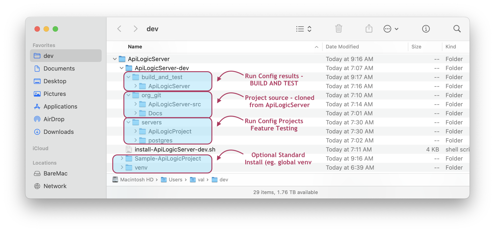
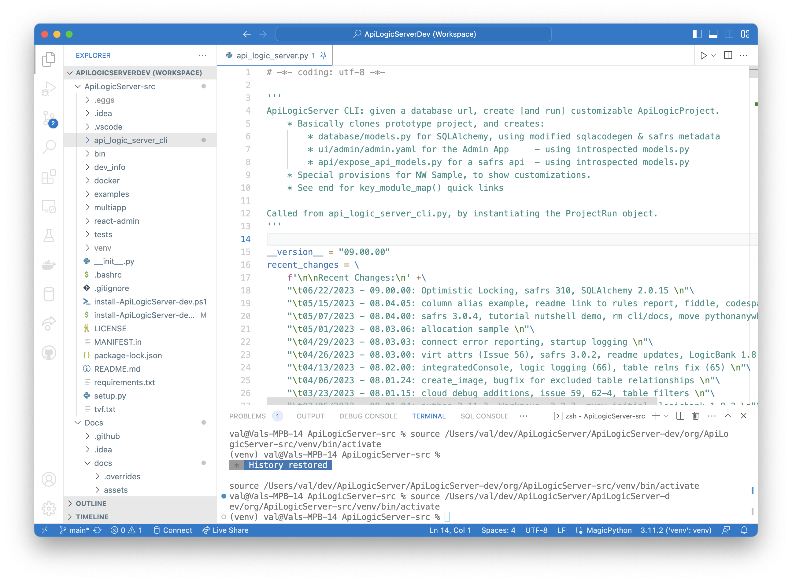
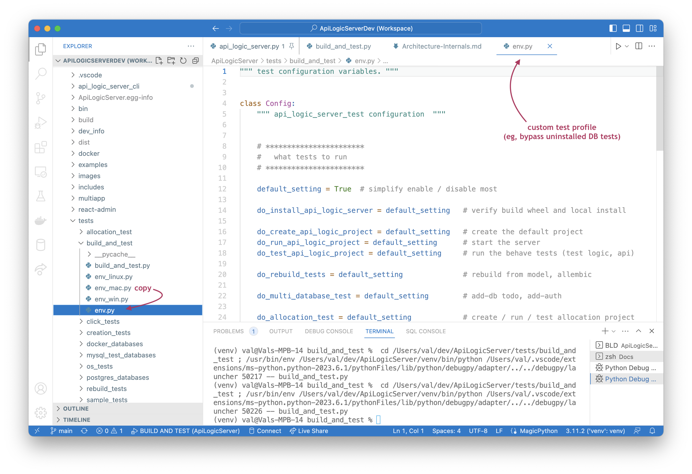

This page does _not_ address created projects, rather, it is about the API Logic Server system used to create projects.  It is for those who want to extend the product or understand how it works, not for those simply using the product.

# How to Install it

Follow these steps to:

* Obtain the software from GitHub
* Open it in your IDE
* Perform basic testing
* Build and release (including automated testing)
* Change and integrate Safrs React Admin (Admin app)


## Obtain the projects from GitHub

To create the projects:

1. Create an empty folder (e.g., `~/dev/ApiLogicServer`)
2. Optionally, install the product there (creating a venv)
      * You can use this venv as a shared venv for testing
3. Download and run [the install-ApiLogicServer-dev procedure](https://github.com/valhuber/ApiLogicServer/blob/main/install-ApiLogicServer-dev.sh) (note: Windows users use `install-ApiLogicServer-dev.ps1`), e.g.:

```bash title="Install API Logic Server Development environment"
cd ~/dev/ApiLogicServer/  # project directories created here
sh install-ApiLogicServer-dev.sh vscode
```

This will use `git clone` to create folders in `~/dev/ApiLogicServer/ApiLogicServer-dev/org/:`


  
It's basically straightforward, _though note_ the `cp` command which copies the `safrs-react-admin` runtime to API Logic Server for subsequent creation of API Logic Projects:

```bash
    echo "\ncopying build (sra - safrs-react-admin) --> ApiLogicServer"
    cp -r ../build api_logic_server_cli/create_from_model/safrs-react-admin-npm-build
```

> Note: `curl` must be installed for this procedure.

&nbsp;

## Open the dev workspace in your IDE

`install-ApiLogicServer...` will create a project (`~/dev/ApiLogicServer/ApiLogicServer-dev/org/ApiLogicServer-src/.vscode/ApiLogicServerDev.code-workspace`), and open it VS Code or PyCharm.

Python requires a virtual environment; the procedure differs for `vscode` vs. `charm`:

* `vscode` projects are created with a `venv` and are ready to run the Launch Configurations to create the sample
* `charm` projects require that you create the `venv` with the PyCharm

It should look something like this:



&nbsp;

## Create the Sample (`~/dev/servers/ApiLogicProject`)

Once in your IDE, you can run the pre-defined launch configuration `0 - Create and Run ApiLogicProject` to create and run the sample.  This creates `~/dev/servers/ApiLogicProject`.

<figure></figure>

&nbsp;

## Build and Test

As of version 6.02.20, test automation ([located here](https://github.com/valhuber/ApiLogicServer/tree/main/tests/build_and_test)) replaces a series of manually executed scripts ([located here](https://github.com/valhuber/ApiLogicServer/tree/main/tests/creation_tests)).  These have been verified on Mac, Linux (Ubuntu) and Windows.

The automated test (use the launch configuration `BUILD AND TEST`) performs a number of steps.  You can configure the test to run some or all of these by editing the ``env_xxx.py` files shown here:



&nbsp;

#### `do_install_api_logic_server`

This:

1. Runs the standard Python build: `python3 setup.py sdist bdist_wheel`
2. Installs it into a Python environment `dev/servers/install/ApiLogicServer/venv`
3. Installs `pyodbc`.  Note this requires you have installed `odbc`, but install failures are intentionally ignored (instead, skip the Sql/Server database with`do_docker_sqlserver = False` )

!!! pied-piper ":bulb: venv can be used for projects"

    You will probably find it helpful to use this as a [shared venv](../Project-Env/#shared-venv).

#### `do_create_api_logic_project`...

This creates the sample project, runs the server, and tests the logic using the behave tests.  It produces quite a lot of output which you can ignore.  The test is designed to terminate if the tests fail.

These are extensive tests which verify project creation, server startup, logic and some minimal API testing (the Behave tests issue APIs to read/write data).

#### `do_allocation_test`

This is a complex rule example.

#### `do_docker_<database>`

These create projects from docker databases ([see here](../Database-Connectivity/#docker-databases)) which are expected to be running.  They perform minimal validation to ensure the server starts by executing the _hello world_ API.  

    This in fact verifies that the `models.py` file is created and runs.

&nbsp;

## Get Docs working

The install procedure also installs `Org-ApiLogicServer/Docs`.  Follow it's readme.

&bnsp;

## Testing Packages

In some cases, you may wish to test using experimental version of underlying packages, such as `safrs` or `logicbank`.  You can [add multiple paths to Python Path](https://stackoverflow.com/questions/41471578/visual-studio-code-how-to-add-multiple-paths-to-python-path){:target="_blank" rel="noopener"} like this:

*1.* Edit `ApiLogicServer/.vscode/settings.json` to identify the desired packages, e.g.:

```
    "terminal.integrated.env.osx": 
        { "PYTHONPATH": "/Users/val/dev/safrs" }
```

If yu have more than one, separate them with *colon*s.

*2.* With the ApiLogicServer venv active, `pip uninstall` the packages you want to test

*3.* Exit the ApiLogicServer workspace, and restart VSCode on the `ApiLogicServer` folder (not workspace)

*4.* Use the Run Configs to create/test the app, e.g., `2 - Debug ApiLogicProject`

> **Note:** you will need to perform a similar process if you want an *installed* local version of ApiLogicServer using the `tests/build_and_test` procedure.

This procedure sometimes fails.  You can also try adding your package to the `env' in the Run Config:

```json
        {
            "name": "No Security ApiLogicServer (e.g., simpler swagger)",
            "type": "python",
            "request": "launch",
            "program": "api_logic_server_run.py",
            "redirectOutput": true,
            "env": {"PYTHONPATH": "/Users/val/dev/safrs", "SECURITY_ENABLED": "False", "PYTHONHASHSEED": "0", "OPT_LOCKING": "optional", "verbose": "True"},
            "justMyCode": false,
            "args": ["--flask_host=localhost", "--port=5656", "--swagger_host=localhost", "--verbose=False"],
            "console": "internalConsole",
            "internalConsoleOptions": "openOnSessionStart"
        },
```
&nbsp;

### Simpler for LogicBank: local install

It's easy to create a local install for LogicBank.  First, you need to install the source:

```bash
cd ~/dev
git clone https://github.com/valhuber/LogicBank.git
```

Then, build it and add to the ApiLogicServer venv:

*1.* Create Logic Bank installer on your hard drive

```bash
python3 setup.py sdist bdist_wheel
```

*2.* With the ApiLogicServer venv active, `pip uninstall LogicBank`

*3.* With the ApiLogicServer venv active, `python3 -m pip install ~/dev/LogicBank`

&nbsp;

## Develop / Debug admin app

Once you have created the API Logic Project, you can restart the server like this (it is _not_ necessary to recreate the sample each time you run):

```bash title="Start API Logic Project"
cd ~/dev/servers/ApiLogicProject
python3 api_logic_server_run.py
```

You can obtain an editable version of the admin app like this:

```bash title="Get Data Provider"
cd ~/dev/safrs-react-admin
git clone https://github.com/thomaxxl/rav3-jsonapi-client # modified data provider used, installed in the project root
```

Then, to debug (with server running):

```bash title="Execute debug version of admin app"
npm install --global yarn # required only once
yarn install
yarn run build

yarn start
```

To make this the runtime used to create API Logic Projects:

```bash title="Update ApiLogicServer to use your admin app"
cp -a /build/. ../ApiLogicServer/api_logic_server_cli/create_from_model/admin/
```

&nbsp;

# Docker Startup

You can review the dockerfile on `github`.  Note that the normal operation is to start a terminal session as the last step:

```bash
CMD ["bash"]
```

When bash sessions are started, Linux runs `.bashrc`.  This checks for environment variables which can be used to load an existing project from git, and run it.  (Note: this defeats the normal terminal startup).  For example, start Docker using `-e` arguments, like this:


```bash
docker run -it --name api_logic_server --rm --net dev-network \
-p 5656:5656 -p 5002:5002 -v ${PWD}:/localhost \
-e APILOGICSERVER_GIT='https://github.com/valhuber/Tutorial-ApiLogicProject.git' \
-e APILOGICSERVER_FIXUP='/localhost/Project-Fixup.sh' \
apilogicserver/api_logic_server
```


Alternatively, you can start Docker specifying an initial command, like this:
```bash
docker run -it --name api_logic_server --rm --net dev-network \
-p 5656:5656 -p 5002:5002 -v ${PWD}:/localhost \
apilogicserver/api_logic_server \
sh /home/api_logic_server/bin/run-project.sh https://github.com/valhuber/Tutorial-ApiLogicProject.git /localhost/Project-Fixup.sh
```

In both cases, the git load is performed by `bin/run-project.sh`, which you can explore on github.

&nbsp;

# Useful links

As a contributor, you will likely work with:

* [Docker Databases](../Database-Connectivity)
* [Shared virtual environments](../Project-Env)
