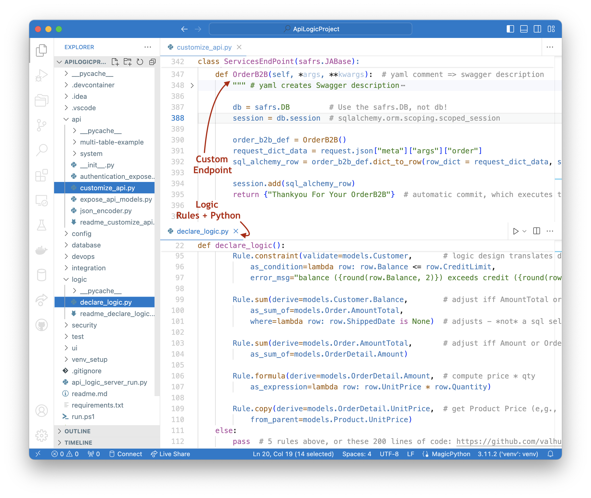

## Project Creation

The ApiLogicServer CLI `create` (or `create-and-run`) command creates the project structure shown below - for more information, [see here](Architecture-Internals-CLI.md).

&nbsp;

## API Execution: `api_logic_server_run.py`

Execution begins in `api_logic_server_run.py`.  Your customizations are done to the files noted in the callouts below.

`api_logic_server_run.py` (a file created in your ApiLogicProject) sets up a Flask app, the database, logic and api:

1. **Database Setup:** It imports`api/expose_api_models` which imports `database/models.py`, which then imports `database/customize_models.py` for your model extensions.  `api_logic_server_run.py` then sets up flask, and opens the  database with `db = safrs.DB`

2. **Logic Setup:** It then calls `LogicBank.activate`, passing `declare_logic` which loads your declared rules into Logic Bank.

3. **API Setup:** It next invokes `api/expose_api_models`.  This calls safrs to create the end points and the swagger information, based on the created `database/models.py` (the models used by the SQLAlchemy ORM).   It finally calls `api/customize.py` where you can add your own services.  The sample includes a trivial Hello World, as well as `add_order`.

## Logic Execution

SAFRS API listens for API calls, e.g., from the Admin App.  When updates are issued:

 **L1. Invokes SQLAlchemy updates:** SAFRS calls SQLAlchemy, passing a set of rows comprising a database transaction

**L2. `before_flush`:** SQLAlchemy provides a `before_flush` event, where all the update rows are assembled and passed to `Logic Bank`  (no relation to retail!).

**L3. Logic Execution:** Logic Bank reviews the rows, and based on what has change, prunes rules for unchanged data, and executes / optimizes relevant logic in an appropriate order.  

&nbsp;

### Row/Commit Logic

The console log below illustrates that the rows are processed in 2 distinct "logic loops":

* **Row Logic** - rules are executed, with chaining, as received in the `before_flush` event
* **Commit Logic** - commit constraints and events are executed after *all row logic is complete**

Two logic loops are provided so that parent logic can see all the adjustments of the child logic. 

* When the Order is first seen at the top of the log, the OrderDetails have not yet been processed, so their adjustment logic has not been run.  So, sums/counts will be 0 (e.g. `OrderDetailCount`).

* The Commit Logic loop is therefore provided after all the adjustment processing has occurred.

    * So, if you want to verify that Orders have 1 or more OrderDetails by placing a constraint on `OrderDetailCount`, this would need to be a CommitConstraint.

Row Logic processing:

&nbsp;

## Admin App Execution: `ui/admin/admin.yaml`

[http://localhost:5656/](http://localhost:5656/) redirects to `ui/admin/index.html` which loads the react-admin single-page app into your browser.

It then loads your `ui/admin/admin.yaml`, and responds to the various clicks by invoking the API (and hence the update logic), or the swagger at [http://localhost:5656/api](http://localhost:5656/api).
