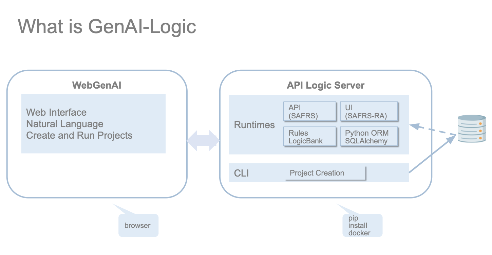
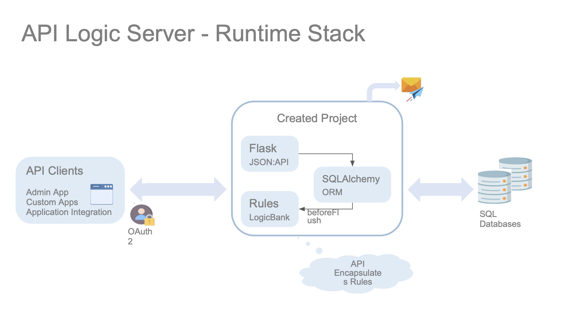

!!! pied-piper ":bulb: TL;DR - WebGenAI is a web app that uses ChatGPT and API Logic Server"

    **WebGenAI:**

    Uses ChatGPT for:
    
    * Data Model (Data Base)
    * Natural Language Logic - translation to rules
    * Test Data 

    It includes storage for downloadable projects and SQLite databases.

    It uses API Logic Server to create and run projects from the Data Model (Data Base)

    **API Logic Server** provides:

    * CLI-based creation - from Data Model (Data Base)
    * Execution - API, Logic and UI engines

## What is GenAI Logic

## Runtime Stack

## How Does It Work

