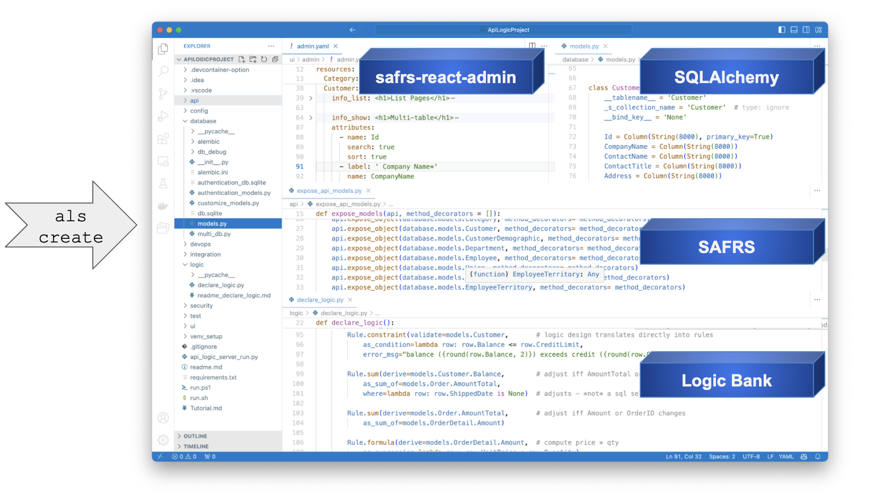
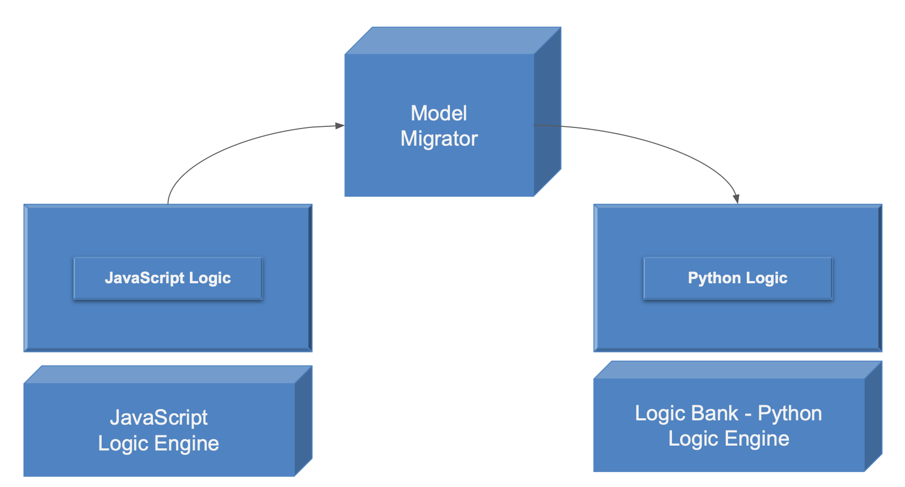

!!! pied-piper ":bulb: TL;DR - modern 3-tiered architecture, API-accessed, scalable containers"

    **Deployment Architecture**

    * A modern 3-tiered architecture, accessed by **APIs**
    * Logic is **automatically reused**, factored out of web apps and custom services
    * **Containerized** for scalable cloud deployment - the project includes a dockerfile to containerize it to DockerHub.

    **Development Architecture**

    * Installed as Docker, `pip`, or use Codespaces
    * **Standards-based customization** - debug in a standard IDE (VSCode, PyCharm), using standard packages (Flask, SQLAlchemy)

## Runtimes and CLI

API Logic Server is a Python Application, consisting of:

1. __Runtimes__ for ApiLogicProject execution (see below)
2. __CLI__ (Command Language Interface - provides `ApiLogicServer create `…`)

It executes either as a locally install (venv), or a Docker image (which includes Python).  In either case, the contents are the same:

&nbsp;

## Key Runtime Components

The following 

| Component                                                                              | Provides                                                                                                              |
|:---------------------------------------------------------------------------------------|:----------------------------------------------------------------------------------------------------------------------|
| [Flask](https://flask.palletsprojects.com/en/1.1.x){:target="_blank" rel="noopener"}        | enables you to write custom web apps, and custom api end points  |
| [SQLAlchemy](https://docs.sqlalchemy.org/en/14/core/engines.html){:target="_blank" rel="noopener"}    | Python-friendly ORM (analogous to Hiberate, JPA)                                                                      |
| [Logic Bank](Logic-Operation.md#logic-architecture){:target="_blank" rel="noopener"} | Listens for SQLAlchemy updates, provides Multi-Table Derivations and Constraint Rules Python Events (e.g., send mail, message) Customizable with Python  |
| [SAFRS](https://github.com/thomaxxl/safrs/wiki){:target="_blank" rel="noopener"}     | JSON:API and swagger, based on SQLAlchemy  |
| [SAFRS-RA](https://github.com/thomaxxl/safrs-react-admin){:target="_blank" rel="noopener"}   | *Admin App*, using SAFRS    |

## Model Execution Engines

When you create a project (`als create` or `als genai`), the system creates models shown below.  These model files are "executed" by the corresponding **Model Execution Engines**, as noted.

This *model driven* approach has substantial advantages, as described below.

&nbsp;

### Maintainable

In traditional framework-based implementations, the amount of code required is massive.  The last thing you want to take a high level of abstraction turned into low level code you need to understand and maintain.

By contrast, the models above are concise and clear.  They are declarative: they state *what* is to be done, not *how*:

* the [rules](Logic-Why.md){:target="_blank" rel="noopener"} are 40X more concise than code

* for APIs, just the line `api.expose_object(database.models.Category` represents multiple verbs -- and the swagger

* for apps, you just list the attributes; JavaScript and HTML would be massive (and unitelligable to most).

By way of analogy, you would not want a compiler to generate machine code, and then have to maintain the machine code.

&nbsp;

### Platform Independent

Given rapid technology advancement, it is strategic advantage to ***preserve IT investment over such change.***  This enables organizations to take advantage of new languages, new architectures, etc.  That has simply impossible in the past - existing procedural systems are necessarilty technology-dependent.

By contrast, the models are architecture-independant.  For example, the rule `Derive the Customer.Balance as sum(Orders where Date_shipped is None)` is architecture neutral.  So, it can be translated into different languages and architectures.

This is not a thoeretical proposition.  In fact, past implementations of this techology have *proved* the migration:

* from minicomputers, to Visual Basic, to J2EE

* from JavaScript to Python

As shown below, your investment is preserved with a Model Migrator, and a Logic Engine.  The Logic Engine provides the ordering, optimizations and data access (possibly using an ORM) for logic execution.

&nbsp;

## Execution: 3-tiered architecture

The API Logic Server executes as an application server, accessed by an API, in a standard 3-tiered architecture.  

Observe that logic plugs into SQLAlchemy.  **Logic is thus automatically shared** (factored out) of custom services, and web or browser-based apps.

In most cases, the API Logic Server executes in a **container**, so scales horizontally like any other Flask-based server.

