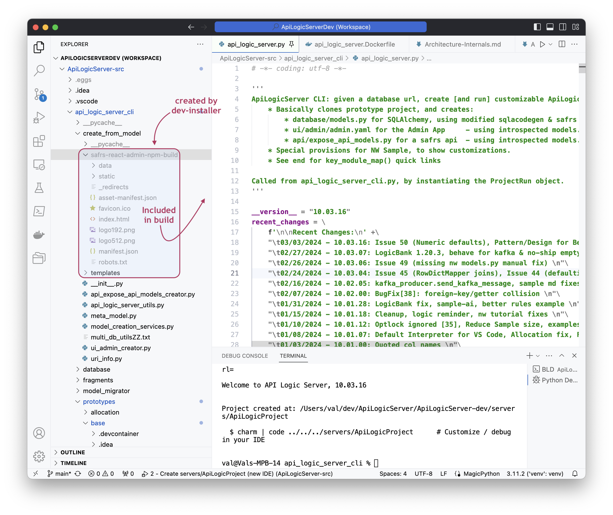
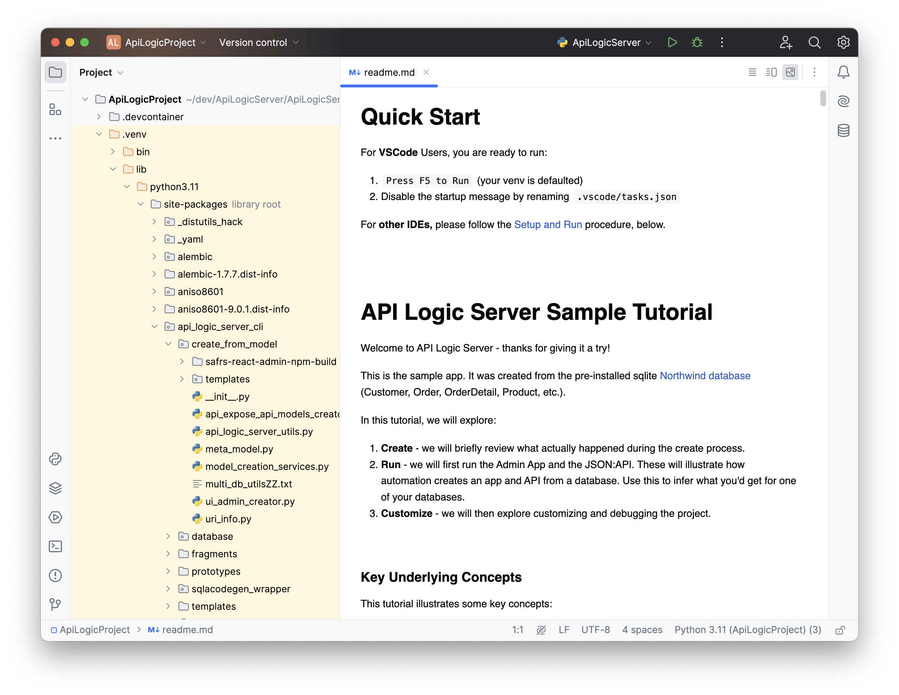

!!! pied-piper ":bulb: TL;DR: Admin App Runtime stored in `venv`"

    The Admin App is implemented by [SRA (Safrs React Admin)](https://github.com/thomaxxl/safrs-react-admin){:target="_blank" rel="noopener"}, a separate / stand-alone project in GitHub.  Yet, the user experience makes API Logic Server and SRA feel like a single, integrated system.
    
    That is because we have followed key Microservice principles, bundling all the elements to deliver value in a single service.  For API Logic Server/SRA, this means:

    1. Using Shared Data / API Models to drive automation

    2. A single integrated server to simplify deployment and administration

    3. A single shared source code repository for models and code

    4. System resources extracted from the shared repository

    API Logic Server supports [extended builders](Project-Builders.md){:target="_blank" rel="noopener"}, which enables you to introduce additional client technologies.  We encourage this, and suggest these principles merit strong consideration.

&nbsp;

## 1. Model Driven Automation

To maintain simplicity through a high level of abstraction, we seek to maximize automation based on declarative models.  This applies to:

* shared use of the underlying data model

* expressing application behavior by a yaml file, instead of complex html, JavaScript and CSS

&nbsp;

## 2. Single Integrated Server

Deployment and application adminstration are simplified if there is 1 server to deploy and administer, serving both APIs and Apps... a microservice.

This is provided by `admin_loader.py`, which: 

* finds (see `get_sra_directory()`) the minified Admin App,
* returns (see `return_spa()`) the minified Admin App, and
* returns the `admin.yaml` file

&nbsp;

## 3. Integrated Source Control

Apps are dependent on the models and APIs, so administration is simplified if these are in the same git repository.

&nbsp;

## 4. SRA runtime extraced from project

To save project space, the admin app source (JavaScript, CSS etc) is not stored in each created app.  This would "pollute" the git repository.  Instead, it is stored in the `venv`.

Further, so that admin app changes do not cause unnecessary changes to ApiLogicServer git, these files are not stored in the GitHub project.

Recall that the Admin App is defined by a yaml file.  The actual app is a minified React Admin JavaScript app, [safrs-react-admin](https://github.com/thomaxxl/safrs-react-admin){:target="_blank" rel="noopener"}.

It's about 34MB.  Not huge, but 10X bigger than most API Logic Projects.  So, we want to share it, making it available in the [run-venv](Architecture-venv/#run-venv){:target="_blank" rel="noopener"}.

Moreover, we don't want it to take up space in the ApiLogicServer git repository.

So, when you create the dev project, the [installer places a copy into your source tree](Architecture-Internals.md#admin-app-source), but denotes it as `.gitignore`.

It looks like this in the dev source:

It looks like this in the run-venv (though, your project may be using a [shared venv](Project-Env.md#shared-venv){:target="_blank" rel="noopener"}):

&nbsp;
