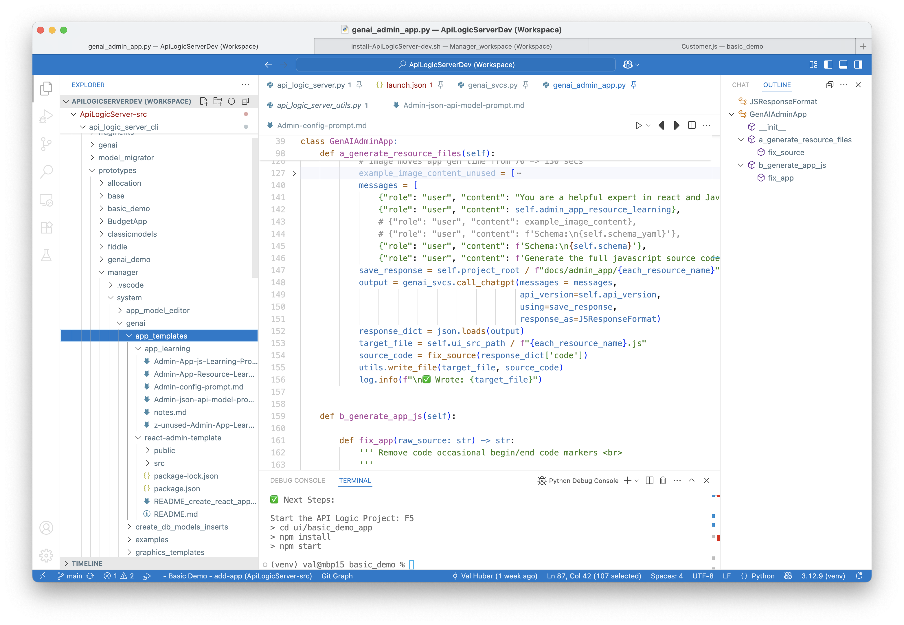
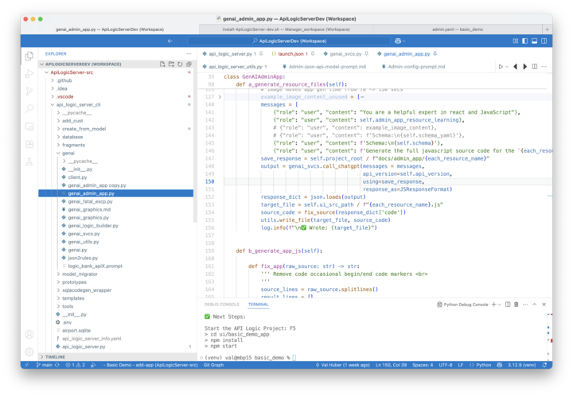

!!! pied-piper ":bulb: TL;DR: Admin App Runtime stored in `venv`"

    The generated Admin App is created using Natural Language, and creates full source
    code to faciliate unrestricted customization, e.g., through [vibe](Admin-Vibe.md).

    Creation is driven by:
    
    * learning files and templates as described below,
    * the schema, e.g. `ui/admin/admin.yaml`
    
    This approach enables users to tune/extend the generation process.

&nbsp;

## 1. Learning and Templates

These files are cloned into the Manager when it is created:

&nbsp;

## 2. Implementation

The CLI invokes the code shown below:

