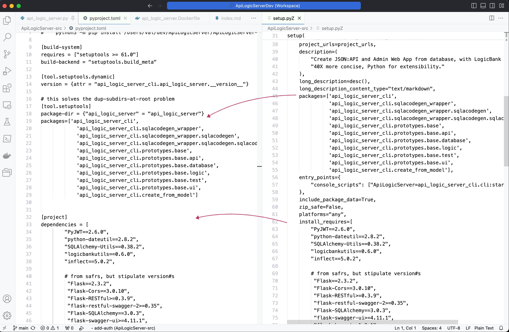

Upgrading to major versions of [Python](https://www.python.org/downloads/){:target="_blank" rel="noopener"} (e.g., 3.12) can be non-trivial; [here's a good article](https://pythonspeed.com/articles/upgrade-python-3.12/){:target="_blank" rel="noopener"}.  I recently upgraded API Logic Server, and offer this information in hopes it can make things a bit easier for you.

> Aside: [API Logic Server](https://apilogicserver.github.io/Docs/) is open source.  It creates executable API / Admin App projects from a database with 1 command; customize with rules and Python in your IDE.

There were 2 areas that required attention:

1. **Packaging:** preparing a project for `pip install` access.  This issue was unique to Python 3.12 -- the old setup procedures have been removed
2. **Dependent Libraries:** this is a consideration for any new release.  In general, I found [this page helpful](https://pyreadiness.org/3.12/)

My project is database oriented (using SQLAlchemy), so key risk areas usually involve database access.  MySQL and Oracle are generally straight-forward, but I always need to address [Postgres (psycopg)](https://stackoverflow.com/questions/77241353/psycopg2-importerror-python3-12-on-windows/77269958#77269958) and [Sql/Server (pyodbc)](https://pypi.org/project/pyodbc/).  These affect `requirements.txt`, and product packaging.  

Let's consider packaging first.

&nbsp;

## Project Packaging

My project requires packaging for [PyPi](https://pypi.org/project/ApiLogicServer/).  This has changed in Python 3.12.

Some quick background.  To make a package available for `pip install`, you must upload it to PyPi -- [here's an uploaded example](https://pypi.org/project/ApiLogicServer/).  This is 2 step process

1. **Build local install files:** this gathers your dependent libraries, CLI entry points, and so forth
2. **Upload to PyPi:** this is unchanged -- `python3 -m twine upload  --skip-existing dist/* `

The first step has changed in two ways - how you run the setup process, and how you specify your dependent libraries.

&nbsp;

### Run setup (dependencies etc)

This process prepares for `python3 -m twine upload...`, by creating local files that identify the libraries you require, CLI entry points, and so forth.

In the past, you ran `python3 setup.py sdist bdist_wheel`; that's no longer supported.  It's replaced by:

```bash
python3 -m build
```  

&nbsp;

### `pyproject.toml` (not `setup.py`)

In the past, your `setup.py` file identified the libraries you require, CLI entry points, and so forth.  `setup.py` is no longer supported in Python 3.12.  

Instead, you must provide a `pyproject.toml` file, as described in [this guide](https://packaging.python.org/en/latest/guides/modernize-setup-py-project/).  The `python3 -m build` uses this file.

For me, this set off a mild panic - I was unable to find a setup-to-toml migration utility, except for those looking to replace the entire `pip install` workflow.

As it turned out, migrating `setup.py` was not so painful by hand -- mainly a series of copy/paste procedures as shown below.  Here's a [working `pyproject.toml` shown in the diagram below](https://github.com/ApiLogicServer/ApiLogicServer-src/blob/main/pyproject.toml).




&nbsp;

## `psycopg2-binary` - Postgres

This is used by SQLAlchemy for Postgres access.  In addition to `pyproject.toml`, I had to change `requirements.txt`, as [shown here](https://github.com/ApiLogicServer/ApiLogicServer-src/blob/main/requirements.txt).  I changed `psycopg2-binary==2.9.5` to:

```python
psycopg2-binary==2.9.9
```

My project is large, so I found it convenient to create a small `venv`, and test the install.  It took a few tries to straighten out the *-binary* bit.

&nbsp;

## odbc - SQL/Server

Microsoft SQL/Server requires 3 packages (this on a mac):

&nbsp;

### unixodbc

Install [unixobdbc](https://exploratory.io/note/exploratory/How-to-set-up-ODBC-in-Mac-unixodbc-lQz2Fnp7); you might get:

```log
==> Running `brew cleanup unixodbc`...
Disable this behaviour by setting HOMEBREW_NO_INSTALL_CLEANUP.
Hide these hints with HOMEBREW_NO_ENV_HINTS (see `man brew`).
Removing: /opt/homebrew/Cellar/unixodbc/2.3.11... (48 files, 2.3MB)
Warning: The following dependents of upgraded formulae are outdated but will not
be upgraded because they are not bottled:
  msodbcsql18
(venv) val@Vals-MPB-14 Desktop % 
```

but, it seemed to work.

&nbsp;

### odbc driver

I required the Microsoft [odbc driver](https://learn.microsoft.com/en-us/sql/connect/odbc/linux-mac/install-microsoft-odbc-driver-sql-server-macos?view=sql-server-ver16)

&nbsp;

### pyodbc

This is used by SQLAlchemy.  In `requirements.txt` and `pyproject.toml`, I had to change pyodbc==4.0.34 --> pyodbc==5.0.0

&nbsp;

## Minor Issues - escape characters

As noted in Python docs, mistakes in strings (e.g, `\but I forgot the n`) were previously not flagged; now they are.

I mention this because unexpected messages show up when you start your program under the debugger.