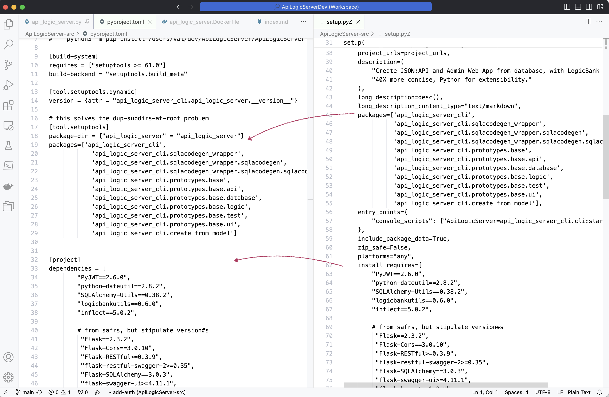

Upgrading to major versions of [Python](https://www.python.org/downloads/){:target="_blank" rel="noopener"} (e.g., 3.12) is [non-trivial](https://pythonspeed.com/articles/upgrade-python-3.12/){:target="_blank" rel="noopener"}.  

I recently upgraded API Logic Server, and offer this information in hopes in can make things a bit easier for you.

My project is database oriented (using SQLAlchemy), so key risk areas usually revolve around [database library dependencies](https://pyreadiness.org/3.12/){:target="_blank" rel="noopener"}:

1. [Postgres - psycopg](https://stackoverflow.com/questions/77241353/psycopg2-importerror-python3-12-on-windows/77269958#77269958){:target="_blank" rel="noopener"}

2. [Sql/Server - pyodbc](https://pypi.org/project/pyodbc/){:target="_blank" rel="noopener"}

These affect:

1. `requirements.txt`
2. `setup.py`
3. build and test procedures (e.g., per pyodbc install)

In Python 3.12, there were additional issues with package and release.

&nbsp;

## Project Packaging

My project requires I package it to [PyPi](https://pypi.org/project/ApiLogicServer/).  This has changed in Python 3.12.

Some quick background:

* To make a package available for `pip install`, you must upload it to PyPi -- [here's an uploaded example](https://pypi.org/project/ApiLogicServer/).

* This is 2 step process

    1. Build local install files - this gathers your dependent libraries, CLI entry points, and so forth
    2. Upload - this is changed: `python3 -m twine upload  --skip-existing dist/* `

The first step has change in two ways - how you specify your dependent libraries, and how you run the setup process.

&nbsp;

### Run setup (dependencies etc)

This process prepares for the `python3 -m twine upload  --skip-existing dist/* ` by preparing local files that identify the libraries you require, CLI entry points, and so forth.

In the past, you ran `python3 setup.py sdist bdist_wheel`; that's no longer supported.  It's replaced by:

```bash
python3 -m build
```  

&nbsp;

### `pyproject.toml` (not `setup.py`)

In the last, you provided a `setup.py` file to identify the libraries you require, CLI entry points, and so forth.  `setup.py` is no longer supported in Python 3.12.  Instead, you must provide a `pyproject.toml` file, as described in [this guide](https://packaging.python.org/en/latest/guides/modernize-setup-py-project/).  The `python3 -m build` uses this file.

For me, this set off a mild panic - I was unable to find a migration utility, except for those looking to replace the entire `pip install` workflow.

As it turned out, migrating `setup.py` was not so painful by hand -- mainly a series of copy/paste procedures as shown above.  Here's a [working `pyproject.toml` shown in the diagram below](https://github.com/ApiLogicServer/ApiLogicServer-src/blob/main/pyproject.toml).




&nbsp;

## `psycopg2-binary` - Postgres

This is used by SQLAlchemy for Postgres access.  In `requirements.txt` and `pyproject.toml`, I had to change

```python
# psycopg2-binary==2.9.5  <--- 3.11
psycopg2-binary==2.9.9
```

My project is large, so I found it convenient to create a small `venv`, and test the install.

&nbsp;

## odbc - SQL/Server

Microsoft SQL/Server requires 3 packages (this on a mac):

&nbsp;

### unixodbc

Install [unixobdbc](https://exploratory.io/note/exploratory/How-to-set-up-ODBC-in-Mac-unixodbc-lQz2Fnp7); you might get:

```log
==> Running `brew cleanup unixodbc`...
Disable this behaviour by setting HOMEBREW_NO_INSTALL_CLEANUP.
Hide these hints with HOMEBREW_NO_ENV_HINTS (see `man brew`).
Removing: /opt/homebrew/Cellar/unixodbc/2.3.11... (48 files, 2.3MB)
Warning: The following dependents of upgraded formulae are outdated but will not
be upgraded because they are not bottled:
  msodbcsql18
(venv) val@Vals-MPB-14 Desktop % 
```

but, it seemed to work.

&nbsp;

### odbc driver

I required the Microsoft 
[odbc driver](https://learn.microsoft.com/en-us/sql/connect/odbc/linux-mac/install-microsoft-odbc-driver-sql-server-macos?view=sql-server-ver16)

&nbsp;

### pyodbc

This is used by SQLAlchemy.  In `requirements.txt` and `pyproject.toml`, I had to change pyodbc==4.0.34 --> pyodbc==5.0.0

&nbsp;

## Minor Issues - escape characters

As noted in Python docs, mistakes in strings were previously not flagged; now they are.

I mention this because unexpected messages show up when you start your program under the debugger.