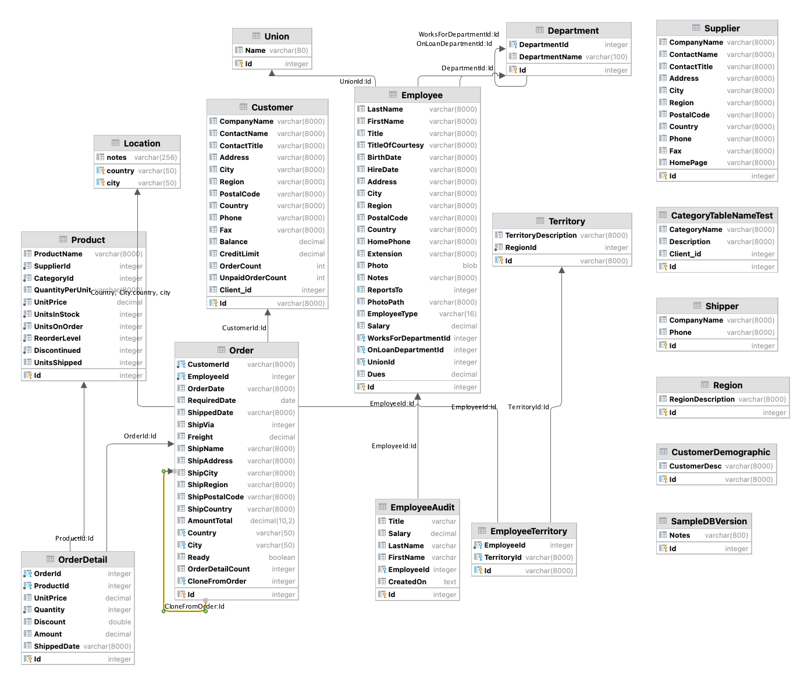

# Behave Logic Report

This is the sample project from API Logic Server, based on the Northwind database (sqlite database located in the `database` folder - no installation required):



>  The sample Scenarios below were chosen to illustrate the basic patterns of using rules.  Open the disclosure box (_"Tests - and their logic..."_) to see the implementation and notes.

The following report was created during test suite execution.

&nbsp;

---


# Behave Logic Report
&nbsp;
&nbsp;
## Feature: About Sample  
  
&nbsp;
&nbsp;
### Scenario: Transaction Processing
&emsp;  Scenario: Transaction Processing  
&emsp;&emsp;    Given Sample Database  
&emsp;&emsp;    When Transactions are submitted  
&emsp;&emsp;    Then Enforce business policies with Logic (rules + code)  
<details markdown>
<summary>Tests - and their logic - are transparent.. click to see Logic</summary>


&nbsp;
&nbsp;


**Rules Used** in Scenario: Transaction Processing
```
  Category  
    1. Constraint Function: <function declare_logic.<locals>.valid_category_description at 0x10b83fba0>   
  
```
**Logic Log** in Scenario: Transaction Processing
```

The following rules have been activate
 - 2024-07-12 14:57:05,237 - logic_logger - DEBU
Rule Bank[0x10a431ca0] (loaded 2024-07-12 14:56:46.929015
Mapped Class[Customer] rules
  Constraint Function: None
  Constraint Function: None
  Derive Customer.Balance as Sum(Order.AmountTotal Where <function declare_logic.<locals>.<lambda> at 0x10b83fd80>
  RowEvent Customer.customer_defaults()
  Derive Customer.UnpaidOrderCount as Count(<class 'database.models.Order'> Where <function declare_logic.<locals>.<lambda> at 0x10b9596c0>
  Derive Customer.OrderCount as Count(<class 'database.models.Order'> Where None
Mapped Class[Employee] rules
  Constraint Function: None
  Constraint Function: <function declare_logic.<locals>.raise_over_20_percent at 0x10b959940>
  Copy to: EmployeeAudi
Mapped Class[Category] rules
  Constraint Function: <function declare_logic.<locals>.valid_category_description at 0x10b83fba0>
Mapped Class[Order] rules
  Derive Order.AmountTotal as Sum(OrderDetail.Amount Where None
  RowEvent Order.send_order_to_shipping()
  RowEvent Order.congratulate_sales_rep()
  RowEvent Order.do_not_ship_empty_orders()
  Constraint Function: <function declare_logic.<locals>.ship_ready_orders_only at 0x10b9591c0>
  RowEvent Order.order_defaults()
  Derive Order.OrderDetailCount as Count(<class 'database.models.OrderDetail'> Where None
  RowEvent Order.clone_order()
  Derive Order.OrderDate as Formula (1): as_expression=lambda row: datetime.datetime.now()
Mapped Class[OrderDetail] rules
  Derive OrderDetail.Amount as Formula (1): as_expression=lambda row: row.UnitPrice * row.Qua [...
  Derive OrderDetail.UnitPrice as Copy(Product.UnitPrice
  RowEvent OrderDetail.order_detail_defaults()
  Derive OrderDetail.ShippedDate as Formula (2): row.Order.ShippedDat
Mapped Class[Product] rules
  Derive Product.UnitsInStock as Formula (1): <function
  Derive Product.UnitsShipped as Sum(OrderDetail.Quantity Where <function declare_logic.<locals>.<lambda> at 0x10b959580>
Logic Bank - 32 rules loaded - 2024-07-12 14:57:05,243 - logic_logger - INF
Logic Bank - 32 rules loaded - 2024-07-12 14:57:05,243 - logic_logger - INF

Logic Phase:		ROW LOGIC		(session=0x10dbbc710) (sqlalchemy before_flush)			 - 2024-07-12 14:57:06,076 - logic_logger - INF
..Shipper[1] {Delete - client} Id: 1, CompanyName: Speedy Express, Phone: (503) 555-9831  row: 0x10dbbce30  session: 0x10dbbc710  ins_upd_dlt: dlt - 2024-07-12 14:57:06,077 - logic_logger - INF

Logic Phase:		ROW LOGIC		(session=0x10dcac9e0) (sqlalchemy before_flush)			 - 2024-07-12 14:57:06,151 - logic_logger - INF
..Category[1] {Update - client} Id: 1, CategoryName: Beverages, Description:  [Soft drinks, coffees, teas, beers, and ales-->] x, Client_id: 1  row: 0x10dcad6a0  session: 0x10dcac9e0  ins_upd_dlt: upd - 2024-07-12 14:57:06,151 - logic_logger - INF
..Category[1] {Constraint Failure: Description cannot be 'x'} Id: 1, CategoryName: Beverages, Description:  [Soft drinks, coffees, teas, beers, and ales-->] x, Client_id: 1  row: 0x10dcad6a0  session: 0x10dcac9e0  ins_upd_dlt: upd - 2024-07-12 14:57:06,152 - logic_logger - INF

```
</details>
  
&nbsp;
&nbsp;
## Feature: Application Integration  
  
&nbsp;
&nbsp;
### Scenario: GET Customer
&emsp;  Scenario: GET Customer  
&emsp;&emsp;    Given Customer Account: VINET  
&emsp;&emsp;    When GET Orders API  
&emsp;&emsp;    Then VINET retrieved  
  
&nbsp;
&nbsp;
### Scenario: GET Department
&emsp;  Scenario: GET Department  
&emsp;&emsp;    Given Department 2  
&emsp;&emsp;    When GET Department with SubDepartments API  
&emsp;&emsp;    Then SubDepartments returned  
  
&nbsp;
&nbsp;
## Feature: Authorization  
  
&nbsp;
&nbsp;
### Scenario: Grant
&emsp;  Scenario: Grant  
&emsp;&emsp;    Given NW Test Database  
&emsp;&emsp;    When u1 GETs Categories  
&emsp;&emsp;    Then Only 1 is returned  
  
&nbsp;
&nbsp;
### Scenario: Multi-tenant
&emsp;  Scenario: Multi-tenant  
&emsp;&emsp;    Given NW Test Database  
&emsp;&emsp;    When sam GETs Customers  
&emsp;&emsp;    Then only 3 are returned  
  
&nbsp;
&nbsp;
### Scenario: Global Filters
&emsp;  Scenario: Global Filters  
&emsp;&emsp;    Given NW Test Database  
&emsp;&emsp;    When sam GETs Departments  
&emsp;&emsp;    Then only 8 are returned  
  
&nbsp;
&nbsp;
### Scenario: Global Filters With Grants
&emsp;  Scenario: Global Filters With Grants  
&emsp;&emsp;    Given NW Test Database  
&emsp;&emsp;    When s1 GETs Customers  
&emsp;&emsp;    Then only 1 customer is returned  
  
&nbsp;
&nbsp;
### Scenario: CRUD Permissions
&emsp;  Scenario: CRUD Permissions  
&emsp;&emsp;    Given NW Test Database  
&emsp;&emsp;    When r1 deletes a Shipper  
&emsp;&emsp;    Then Operation is Refused  
  
&nbsp;
&nbsp;
## Feature: Optimistic Locking  
  
&nbsp;
&nbsp;
### Scenario: Get Category
&emsp;  Scenario: Get Category  
&emsp;&emsp;    Given Category: 1  
&emsp;&emsp;    When Get Cat1  
&emsp;&emsp;    Then Expected Cat1 Checksum  
  
&nbsp;
&nbsp;
### Scenario: Valid Checksum
&emsp;  Scenario: Valid Checksum  
&emsp;&emsp;    Given Category: 1  
&emsp;&emsp;    When Patch Valid Checksum  
&emsp;&emsp;    Then Valid Checksum, Invalid Description  
  
&nbsp;
&nbsp;
### Scenario: Missing Checksum
&emsp;  Scenario: Missing Checksum  
&emsp;&emsp;    Given Category: 1  
&emsp;&emsp;    When Patch Missing Checksum  
&emsp;&emsp;    Then Valid Checksum, Invalid Description  
  
&nbsp;
&nbsp;
### Scenario: Invalid Checksum
&emsp;  Scenario: Invalid Checksum  
&emsp;&emsp;    Given Category: 1  
&emsp;&emsp;    When Patch Invalid Checksum  
&emsp;&emsp;    Then Invalid Checksum  
  
&nbsp;
&nbsp;
## Feature: Place Order  
  
&nbsp;
&nbsp;
### Scenario: Order Made Not Ready
&emsp;  Scenario: Order Made Not Ready  
&emsp;&emsp;    Given Customer Account: ALFKI  
&emsp;&emsp;    When Ready Flag is Reset  
&emsp;&emsp;    Then Logic Decreases Balance  
<details markdown>
<summary>Tests - and their logic - are transparent.. click to see Logic</summary>


&nbsp;
&nbsp;


**Logic Doc** for scenario: Order Made Not Ready
   
We reset `Order.Ready`.

This removes the order from contingent derivations (e.g., the `Customer.Balance`),
and constraints.

> **Key Takeaway:** adjustment from change in qualification condition


&nbsp;
&nbsp;


**Rules Used** in Scenario: Order Made Not Ready
```
  Customer  
    1. Derive Customer.UnpaidOrderCount as Count(<class 'database.models.Order'> Where <function declare_logic.<locals>.<lambda> at 0x105744ea0>)  
    2. Derive Customer.Balance as Sum(Order.AmountTotal Where <function declare_logic.<locals>.<lambda> at 0x105623740>)  
    3. RowEvent Customer.customer_defaults()   
    4. Derive Customer.OrderCount as Count(<class 'database.models.Order'> Where None)  
  Order  
    5. RowEvent Order.order_defaults()   
    6. RowEvent Order.clone_order()   
    7. RowEvent Order.congratulate_sales_rep()   
    8. RowEvent Order.do_not_ship_empty_orders()   
    9. RowEvent Order.send_order_to_shipping()   
  
```
**Logic Log** in Scenario: Order Made Not Ready
```

Logic Phase:		ROW LOGIC		(session=0x12061d190) (sqlalchemy before_flush)			 - 2024-08-31 21:14:53,887 - logic_logger - INF
..Order[11011] {Update - client} Id: 11011, CustomerId: ALFKI, EmployeeId: 3, OrderDate: 2014-04-09, RequiredDate: 2014-05-07, ShippedDate: None, ShipVia: 1, Freight: 1.2100000000, ShipName: Alfred's Futterkiste, ShipAddress: Obere Str. 57, ShipCity: Berlin, ShipRegion: Western Europe, ShipZip: 12209, ShipCountry: Germany, AmountTotal: 960.00, Country: None, City: None, Ready:  [True-->] False, OrderDetailCount: 2, CloneFromOrder: None  row: 0x12061f860  session: 0x12061d190  ins_upd_dlt: upd - 2024-08-31 21:14:53,888 - logic_logger - INF
..Order[11011] {Prune Formula: OrderDate [[]]} Id: 11011, CustomerId: ALFKI, EmployeeId: 3, OrderDate: 2014-04-09, RequiredDate: 2014-05-07, ShippedDate: None, ShipVia: 1, Freight: 1.2100000000, ShipName: Alfred's Futterkiste, ShipAddress: Obere Str. 57, ShipCity: Berlin, ShipRegion: Western Europe, ShipZip: 12209, ShipCountry: Germany, AmountTotal: 960.00, Country: None, City: None, Ready:  [True-->] False, OrderDetailCount: 2, CloneFromOrder: None  row: 0x12061f860  session: 0x12061d190  ins_upd_dlt: upd - 2024-08-31 21:14:53,889 - logic_logger - INF
....Customer[ALFKI] {Update - Adjusting Customer: Balance} Id: ALFKI, CompanyName: Alfreds Futterkiste, ContactName: Maria Anders, ContactTitle: Sales Representative, Address: Obere Str. 57A, City: Berlin, Region: Western Europe, PostalCode: 12209, Country: Germany, Phone: 030-0074321, Fax: 030-0076545, Balance:  [2102.0000000000-->] 1142.0000000000, CreditLimit: 2300.0000000000, OrderCount: 15, UnpaidOrderCount: 10, Client_id: 1  row: 0x1207563c0  session: 0x12061d190  ins_upd_dlt: upd - 2024-08-31 21:14:53,893 - logic_logger - INF
Logic Phase:		COMMIT LOGIC		(session=0x12061d190)   										 - 2024-08-31 21:14:53,896 - logic_logger - INF
..Order[11011] {Commit Event} Id: 11011, CustomerId: ALFKI, EmployeeId: 3, OrderDate: 2014-04-09, RequiredDate: 2014-05-07, ShippedDate: None, ShipVia: 1, Freight: 1.2100000000, ShipName: Alfred's Futterkiste, ShipAddress: Obere Str. 57, ShipCity: Berlin, ShipRegion: Western Europe, ShipZip: 12209, ShipCountry: Germany, AmountTotal: 960.00, Country: None, City: None, Ready:  [True-->] False, OrderDetailCount: 2, CloneFromOrder: None  row: 0x12061f860  session: 0x12061d190  ins_upd_dlt: upd - 2024-08-31 21:14:53,897 - logic_logger - INF
..Order[11011] {Commit Event} Id: 11011, CustomerId: ALFKI, EmployeeId: 3, OrderDate: 2014-04-09, RequiredDate: 2014-05-07, ShippedDate: None, ShipVia: 1, Freight: 1.2100000000, ShipName: Alfred's Futterkiste, ShipAddress: Obere Str. 57, ShipCity: Berlin, ShipRegion: Western Europe, ShipZip: 12209, ShipCountry: Germany, AmountTotal: 960.00, Country: None, City: None, Ready:  [True-->] False, OrderDetailCount: 2, CloneFromOrder: None  row: 0x12061f860  session: 0x12061d190  ins_upd_dlt: upd - 2024-08-31 21:14:53,897 - logic_logger - INF
Logic Phase:		AFTER_FLUSH LOGIC	(session=0x12061d190)   										 - 2024-08-31 21:14:53,903 - logic_logger - INF
..Order[11011] {AfterFlush Event} Id: 11011, CustomerId: ALFKI, EmployeeId: 3, OrderDate: 2014-04-09, RequiredDate: 2014-05-07, ShippedDate: None, ShipVia: 1, Freight: 1.2100000000, ShipName: Alfred's Futterkiste, ShipAddress: Obere Str. 57, ShipCity: Berlin, ShipRegion: Western Europe, ShipZip: 12209, ShipCountry: Germany, AmountTotal: 960.00, Country: None, City: None, Ready:  [True-->] False, OrderDetailCount: 2, CloneFromOrder: None  row: 0x12061f860  session: 0x12061d190  ins_upd_dlt: upd - 2024-08-31 21:14:53,904 - logic_logger - INF

```
</details>
  
&nbsp;
&nbsp;
### Scenario: Order Made Ready
&emsp;  Scenario: Order Made Ready  
&emsp;&emsp;    Given Customer Account: ALFKI  
&emsp;&emsp;    When Ready Flag is Set  
&emsp;&emsp;    Then Logic Increases Balance  
<details markdown>
<summary>Tests - and their logic - are transparent.. click to see Logic</summary>


&nbsp;
&nbsp;


**Logic Doc** for scenario: Order Made Ready
   
This illustrates the _ready flag_ pattern:
1. Add a ready flag to the Order
2. Make logic contingent on the ready flag:
    * Customer.Balance is increased only if the Order is ready
    * Empty Orders are not rejected

This enables the user to submit multiple transactions (add order details, alter them etc),
before making the order ready (like a checkout).

Until then, Customer's Balance adjustments, or empty orders constraints do not fire.

> **Key Takeaway:** the ready flag defers constraints/derivations until the user is ready.

> **Key Takeaway:** adjustment from change in qualification condition


&nbsp;
&nbsp;


**Rules Used** in Scenario: Order Made Ready
```
  Customer  
    1. Derive Customer.UnpaidOrderCount as Count(<class 'database.models.Order'> Where <function declare_logic.<locals>.<lambda> at 0x105744ea0>)  
    2. Derive Customer.Balance as Sum(Order.AmountTotal Where <function declare_logic.<locals>.<lambda> at 0x105623740>)  
    3. RowEvent Customer.customer_defaults()   
    4. Derive Customer.OrderCount as Count(<class 'database.models.Order'> Where None)  
  Order  
    5. RowEvent Order.order_defaults()   
    6. RowEvent Order.clone_order()   
    7. RowEvent Order.congratulate_sales_rep()   
    8. RowEvent Order.do_not_ship_empty_orders()   
    9. RowEvent Order.send_order_to_shipping()   
  
```
**Logic Log** in Scenario: Order Made Ready
```

Logic Phase:		ROW LOGIC		(session=0x12078f650) (sqlalchemy before_flush)			 - 2024-08-31 21:14:54,247 - logic_logger - INF
..Order[11011] {Update - client} Id: 11011, CustomerId: ALFKI, EmployeeId: 3, OrderDate: 2014-04-09, RequiredDate: 2014-05-07, ShippedDate: None, ShipVia: 1, Freight: 1.2100000000, ShipName: Alfred's Futterkiste, ShipAddress: Obere Str. 57, ShipCity: Berlin, ShipRegion: Western Europe, ShipZip: 12209, ShipCountry: Germany, AmountTotal: 960.00, Country: None, City: None, Ready:  [False-->] True, OrderDetailCount: 2, CloneFromOrder: None  row: 0x12078d280  session: 0x12078f650  ins_upd_dlt: upd - 2024-08-31 21:14:54,248 - logic_logger - INF
..Order[11011] {Prune Formula: OrderDate [[]]} Id: 11011, CustomerId: ALFKI, EmployeeId: 3, OrderDate: 2014-04-09, RequiredDate: 2014-05-07, ShippedDate: None, ShipVia: 1, Freight: 1.2100000000, ShipName: Alfred's Futterkiste, ShipAddress: Obere Str. 57, ShipCity: Berlin, ShipRegion: Western Europe, ShipZip: 12209, ShipCountry: Germany, AmountTotal: 960.00, Country: None, City: None, Ready:  [False-->] True, OrderDetailCount: 2, CloneFromOrder: None  row: 0x12078d280  session: 0x12078f650  ins_upd_dlt: upd - 2024-08-31 21:14:54,249 - logic_logger - INF
....Customer[ALFKI] {Update - Adjusting Customer: Balance} Id: ALFKI, CompanyName: Alfreds Futterkiste, ContactName: Maria Anders, ContactTitle: Sales Representative, Address: Obere Str. 57A, City: Berlin, Region: Western Europe, PostalCode: 12209, Country: Germany, Phone: 030-0074321, Fax: 030-0076545, Balance:  [1142.0000000000-->] 2102.0000000000, CreditLimit: 2300.0000000000, OrderCount: 15, UnpaidOrderCount: 10, Client_id: 1  row: 0x12078fd40  session: 0x12078f650  ins_upd_dlt: upd - 2024-08-31 21:14:54,251 - logic_logger - INF
Logic Phase:		COMMIT LOGIC		(session=0x12078f650)   										 - 2024-08-31 21:14:54,254 - logic_logger - INF
..Order[11011] {Commit Event} Id: 11011, CustomerId: ALFKI, EmployeeId: 3, OrderDate: 2014-04-09, RequiredDate: 2014-05-07, ShippedDate: None, ShipVia: 1, Freight: 1.2100000000, ShipName: Alfred's Futterkiste, ShipAddress: Obere Str. 57, ShipCity: Berlin, ShipRegion: Western Europe, ShipZip: 12209, ShipCountry: Germany, AmountTotal: 960.00, Country: None, City: None, Ready:  [False-->] True, OrderDetailCount: 2, CloneFromOrder: None  row: 0x12078d280  session: 0x12078f650  ins_upd_dlt: upd - 2024-08-31 21:14:54,255 - logic_logger - INF
..Order[11011] {Commit Event} Id: 11011, CustomerId: ALFKI, EmployeeId: 3, OrderDate: 2014-04-09, RequiredDate: 2014-05-07, ShippedDate: None, ShipVia: 1, Freight: 1.2100000000, ShipName: Alfred's Futterkiste, ShipAddress: Obere Str. 57, ShipCity: Berlin, ShipRegion: Western Europe, ShipZip: 12209, ShipCountry: Germany, AmountTotal: 960.00, Country: None, City: None, Ready:  [False-->] True, OrderDetailCount: 2, CloneFromOrder: None  row: 0x12078d280  session: 0x12078f650  ins_upd_dlt: upd - 2024-08-31 21:14:54,255 - logic_logger - INF
Logic Phase:		AFTER_FLUSH LOGIC	(session=0x12078f650)   										 - 2024-08-31 21:14:54,257 - logic_logger - INF
..Order[11011] {AfterFlush Event} Id: 11011, CustomerId: ALFKI, EmployeeId: 3, OrderDate: 2014-04-09, RequiredDate: 2014-05-07, ShippedDate: None, ShipVia: 1, Freight: 1.2100000000, ShipName: Alfred's Futterkiste, ShipAddress: Obere Str. 57, ShipCity: Berlin, ShipRegion: Western Europe, ShipZip: 12209, ShipCountry: Germany, AmountTotal: 960.00, Country: None, City: None, Ready:  [False-->] True, OrderDetailCount: 2, CloneFromOrder: None  row: 0x12078d280  session: 0x12078f650  ins_upd_dlt: upd - 2024-08-31 21:14:54,258 - logic_logger - INF
..Order[11011] {Sending Order to Shipping << not activated >>} Id: 11011, CustomerId: ALFKI, EmployeeId: 3, OrderDate: 2014-04-09, RequiredDate: 2014-05-07, ShippedDate: None, ShipVia: 1, Freight: 1.2100000000, ShipName: Alfred's Futterkiste, ShipAddress: Obere Str. 57, ShipCity: Berlin, ShipRegion: Western Europe, ShipZip: 12209, ShipCountry: Germany, AmountTotal: 960.00, Country: None, City: None, Ready:  [False-->] True, OrderDetailCount: 2, CloneFromOrder: None  row: 0x12078d280  session: 0x12078f650  ins_upd_dlt: upd - 2024-08-31 21:14:54,267 - logic_logger - INF

```
</details>
  
&nbsp;
&nbsp;
### Scenario: Good Order Custom Service
&emsp;  Scenario: Good Order Custom Service  
&emsp;&emsp;    Given Customer Account: ALFKI  
&emsp;&emsp;    When Good Order Placed  
&emsp;&emsp;    Then Logic adjusts Balance (demo: chain up)  
&emsp;&emsp;    Then Logic adjusts Products Reordered  
&emsp;&emsp;    Then Logic sends email to salesrep  
&emsp;&emsp;    Then Logic sends kafka message  
&emsp;&emsp;    Then Logic adjusts aggregates down on delete order  
<details markdown>
<summary>Tests - and their logic - are transparent.. click to see Logic</summary>


&nbsp;
&nbsp;


**Logic Doc** for scenario: Good Order Custom Service
   
Familiar logic patterns:

* Constrain a derived result (Check Credit)
* Chain up, to adjust parent sum/count aggregates (AmountTotal, Balance)
* Events for Lib Access (Kafka, email messages)

Logic Design ("Cocktail Napkin Design")

* Customer.Balance <= CreditLimit
* Customer.Balance = Sum(Order.AmountTotal where unshipped)
* Order.AmountTotal = Sum(OrderDetail.Amount)
* OrderDetail.Amount = Quantity * UnitPrice
* OrderDetail.UnitPrice = copy from Product

We place an Order with an Order Detail.  It's one transaction.

Note how the `Order.AmountTotal` and `Customer.Balance` are *adjusted* as Order Details are processed.
Similarly, the `Product.UnitsShipped` is adjusted, and used to recompute `UnitsInStock`

<figure></figure>

> **Key Takeaway:** sum/count aggregates (e.g., `Customer.Balance`) automate ***chain up*** multi-table transactions.

**Events - Extensible Logic**

Inspect the log for __Hi, Andrew - Congratulate Nancy on their new order__. 

The `congratulate_sales_rep` event illustrates logic 
[Extensibility](https://apilogicserver.github.io/Docs/Logic/#extensibility-python-events) 
- using Python to provide logic not covered by rules, 
like non-database operations such as sending email or messages.

<figure></figure>

There are actually multiple kinds of events:

* *Before* row logic
* *After* row logic
* On *commit,* after all row logic has completed (as here), so that your code "sees" the full logic results

Events are passed the `row` and `old_row`, as well as `logic_row` which enables you to test the actual operation, chaining nest level, etc.

You can set breakpoints in events, and inspect these.


&nbsp;
&nbsp;


**Rules Used** in Scenario: Good Order Custom Service
```
  Customer  
    1. Derive Customer.UnpaidOrderCount as Count(<class 'database.models.Order'> Where <function declare_logic.<locals>.<lambda> at 0x105744ea0>)  
    2. Derive Customer.Balance as Sum(Order.AmountTotal Where <function declare_logic.<locals>.<lambda> at 0x105623740>)  
    3. RowEvent Customer.customer_defaults()   
    4. Derive Customer.OrderCount as Count(<class 'database.models.Order'> Where None)  
  Order  
    5. RowEvent Order.order_defaults()   
    6. RowEvent Order.do_not_ship_empty_orders()   
    7. Derive Order.OrderDate as Formula (1): as_expression=lambda row: datetime.datetime.now())  
    8. Derive Order.AmountTotal as Sum(OrderDetail.Amount Where None)  
    9. RowEvent Order.clone_order()   
    10. RowEvent Order.congratulate_sales_rep()   
    11. Derive Order.OrderDetailCount as Count(<class 'database.models.OrderDetail'> Where None)  
    12. RowEvent Order.send_order_to_shipping()   
  OrderDetail  
    13. RowEvent OrderDetail.order_detail_defaults()   
    14. Derive OrderDetail.UnitPrice as Copy(Product.UnitPrice)  
    15. Derive OrderDetail.Amount as Formula (1): as_expression=lambda row: row.UnitPrice * row.Qua [...]  
    16. Derive OrderDetail.ShippedDate as Formula (2): row.Order.ShippedDate  
  Product  
    17. Derive Product.UnitsShipped as Sum(OrderDetail.Quantity Where <function declare_logic.<locals>.<lambda> at 0x105744d60>)  
    18. Derive Product.UnitsInStock as Formula (1): <function>  
  
```
**Logic Log** in Scenario: Good Order Custom Service
```

Logic Phase:		ROW LOGIC		(session=0x1207d6f30) (sqlalchemy before_flush)			 - 2024-08-31 21:14:54,620 - logic_logger - INF
..OrderDetail[None] {Insert - client} Id: None, OrderId: None, ProductId: 1, UnitPrice: None, Quantity: 1, Discount: 0, Amount: None, ShippedDate: None  row: 0x1207d6f00  session: 0x1207d6f30  ins_upd_dlt: ins - 2024-08-31 21:14:54,621 - logic_logger - INF
..OrderDetail[None] {copy_rules for role: Product - UnitPrice} Id: None, OrderId: None, ProductId: 1, UnitPrice: 18.0000000000, Quantity: 1, Discount: 0, Amount: None, ShippedDate: None  row: 0x1207d6f00  session: 0x1207d6f30  ins_upd_dlt: ins - 2024-08-31 21:14:54,625 - logic_logger - INF
..OrderDetail[None] {Formula Amount} Id: None, OrderId: None, ProductId: 1, UnitPrice: 18.0000000000, Quantity: 1, Discount: 0, Amount: 18.0000000000, ShippedDate: None  row: 0x1207d6f00  session: 0x1207d6f30  ins_upd_dlt: ins - 2024-08-31 21:14:54,625 - logic_logger - INF
....Order[None] {Adjustment logic chaining deferred for this parent parent do_defer_adjustment: True, is_parent_submitted: True, is_parent_row_processed: False, Order} Id: None, CustomerId: ALFKI, EmployeeId: 1, OrderDate: None, RequiredDate: None, ShippedDate: None, ShipVia: None, Freight: 11, ShipName: None, ShipAddress: None, ShipCity: None, ShipRegion: None, ShipZip: None, ShipCountry: None, AmountTotal:  [None-->] 18.0000000000, Country: None, City: None, Ready: True, OrderDetailCount:  [None-->] 1, CloneFromOrder: None  row: 0x1207d7ce0  session: 0x1207d6f30  ins_upd_dlt: * - 2024-08-31 21:14:54,627 - logic_logger - INF
....Product[1] {Update - Adjusting Product: UnitsShipped} Id: 1, ProductName: Chai, SupplierId: 1, CategoryId: 1, QuantityPerUnit: 10 boxes x 20 bags, UnitPrice: 18.0000000000, UnitsInStock: 39, UnitsOnOrder: 0, ReorderLevel: 10, Discontinued: 0, UnitsShipped:  [0-->] 1  row: 0x1207d60c0  session: 0x1207d6f30  ins_upd_dlt: upd - 2024-08-31 21:14:54,627 - logic_logger - INF
....Product[1] {Formula UnitsInStock} Id: 1, ProductName: Chai, SupplierId: 1, CategoryId: 1, QuantityPerUnit: 10 boxes x 20 bags, UnitPrice: 18.0000000000, UnitsInStock:  [39-->] 38, UnitsOnOrder: 0, ReorderLevel: 10, Discontinued: 0, UnitsShipped:  [0-->] 1  row: 0x1207d60c0  session: 0x1207d6f30  ins_upd_dlt: upd - 2024-08-31 21:14:54,628 - logic_logger - INF
..Order[None] {Insert - client} Id: None, CustomerId: ALFKI, EmployeeId: 1, OrderDate: None, RequiredDate: None, ShippedDate: None, ShipVia: None, Freight: 11, ShipName: None, ShipAddress: None, ShipCity: None, ShipRegion: None, ShipZip: None, ShipCountry: None, AmountTotal: 18.0000000000, Country: None, City: None, Ready: True, OrderDetailCount: 1, CloneFromOrder: None  row: 0x1207d7ce0  session: 0x1207d6f30  ins_upd_dlt: ins - 2024-08-31 21:14:54,629 - logic_logger - INF
..Order[None] {server_defaults: -- skipped: Ready[BOOLEAN (not handled)] } Id: None, CustomerId: ALFKI, EmployeeId: 1, OrderDate: None, RequiredDate: None, ShippedDate: None, ShipVia: None, Freight: 11, ShipName: None, ShipAddress: None, ShipCity: None, ShipRegion: None, ShipZip: None, ShipCountry: None, AmountTotal: 18.0000000000, Country: None, City: None, Ready: True, OrderDetailCount: 1, CloneFromOrder: None  row: 0x1207d7ce0  session: 0x1207d6f30  ins_upd_dlt: ins - 2024-08-31 21:14:54,630 - logic_logger - INF
..Order[None] {Formula OrderDate} Id: None, CustomerId: ALFKI, EmployeeId: 1, OrderDate: 2024-08-31 21:14:54.637311, RequiredDate: None, ShippedDate: None, ShipVia: None, Freight: 11, ShipName: None, ShipAddress: None, ShipCity: None, ShipRegion: None, ShipZip: None, ShipCountry: None, AmountTotal: 18.0000000000, Country: None, City: None, Ready: True, OrderDetailCount: 1, CloneFromOrder: None  row: 0x1207d7ce0  session: 0x1207d6f30  ins_upd_dlt: ins - 2024-08-31 21:14:54,637 - logic_logger - INF
....Customer[ALFKI] {Update - Adjusting Customer: Balance, UnpaidOrderCount, OrderCount} Id: ALFKI, CompanyName: Alfreds Futterkiste, ContactName: Maria Anders, ContactTitle: Sales Representative, Address: Obere Str. 57A, City: Berlin, Region: Western Europe, PostalCode: 12209, Country: Germany, Phone: 030-0074321, Fax: 030-0076545, Balance:  [2102.0000000000-->] 2120.0000000000, CreditLimit: 2300.0000000000, OrderCount:  [15-->] 16, UnpaidOrderCount:  [10-->] 11, Client_id: 1  row: 0x1207d44a0  session: 0x1207d6f30  ins_upd_dlt: upd - 2024-08-31 21:14:54,638 - logic_logger - INF
..OrderDetail[None] {Insert - client} Id: None, OrderId: None, ProductId: 2, UnitPrice: None, Quantity: 2, Discount: 0, Amount: None, ShippedDate: None  row: 0x1207d70e0  session: 0x1207d6f30  ins_upd_dlt: ins - 2024-08-31 21:14:54,641 - logic_logger - INF
..OrderDetail[None] {copy_rules for role: Product - UnitPrice} Id: None, OrderId: None, ProductId: 2, UnitPrice: 19.0000000000, Quantity: 2, Discount: 0, Amount: None, ShippedDate: None  row: 0x1207d70e0  session: 0x1207d6f30  ins_upd_dlt: ins - 2024-08-31 21:14:54,643 - logic_logger - INF
..OrderDetail[None] {Formula Amount} Id: None, OrderId: None, ProductId: 2, UnitPrice: 19.0000000000, Quantity: 2, Discount: 0, Amount: 38.0000000000, ShippedDate: None  row: 0x1207d70e0  session: 0x1207d6f30  ins_upd_dlt: ins - 2024-08-31 21:14:54,644 - logic_logger - INF
....Order[None] {Update - Adjusting Order: AmountTotal, OrderDetailCount} Id: None, CustomerId: ALFKI, EmployeeId: 1, OrderDate: 2024-08-31 21:14:54.637311, RequiredDate: None, ShippedDate: None, ShipVia: None, Freight: 11, ShipName: None, ShipAddress: None, ShipCity: None, ShipRegion: None, ShipZip: None, ShipCountry: None, AmountTotal:  [18.0000000000-->] 56.0000000000, Country: None, City: None, Ready: True, OrderDetailCount:  [1-->] 2, CloneFromOrder: None  row: 0x1207d7ce0  session: 0x1207d6f30  ins_upd_dlt: upd - 2024-08-31 21:14:54,645 - logic_logger - INF
....Order[None] {Prune Formula: OrderDate [[]]} Id: None, CustomerId: ALFKI, EmployeeId: 1, OrderDate: 2024-08-31 21:14:54.637311, RequiredDate: None, ShippedDate: None, ShipVia: None, Freight: 11, ShipName: None, ShipAddress: None, ShipCity: None, ShipRegion: None, ShipZip: None, ShipCountry: None, AmountTotal:  [18.0000000000-->] 56.0000000000, Country: None, City: None, Ready: True, OrderDetailCount:  [1-->] 2, CloneFromOrder: None  row: 0x1207d7ce0  session: 0x1207d6f30  ins_upd_dlt: upd - 2024-08-31 21:14:54,646 - logic_logger - INF
......Customer[ALFKI] {Update - Adjusting Customer: Balance} Id: ALFKI, CompanyName: Alfreds Futterkiste, ContactName: Maria Anders, ContactTitle: Sales Representative, Address: Obere Str. 57A, City: Berlin, Region: Western Europe, PostalCode: 12209, Country: Germany, Phone: 030-0074321, Fax: 030-0076545, Balance:  [2120.0000000000-->] 2158.0000000000, CreditLimit: 2300.0000000000, OrderCount: 16, UnpaidOrderCount: 11, Client_id: 1  row: 0x1207d44a0  session: 0x1207d6f30  ins_upd_dlt: upd - 2024-08-31 21:14:54,647 - logic_logger - INF
....Product[2] {Update - Adjusting Product: UnitsShipped} Id: 2, ProductName: Chang, SupplierId: 1, CategoryId: 1, QuantityPerUnit: 24 - 12 oz bottles, UnitPrice: 19.0000000000, UnitsInStock: 17, UnitsOnOrder: 40, ReorderLevel: 25, Discontinued: 0, UnitsShipped:  [0-->] 2  row: 0x1207d64e0  session: 0x1207d6f30  ins_upd_dlt: upd - 2024-08-31 21:14:54,650 - logic_logger - INF
....Product[2] {Formula UnitsInStock} Id: 2, ProductName: Chang, SupplierId: 1, CategoryId: 1, QuantityPerUnit: 24 - 12 oz bottles, UnitPrice: 19.0000000000, UnitsInStock:  [17-->] 15, UnitsOnOrder: 40, ReorderLevel: 25, Discontinued: 0, UnitsShipped:  [0-->] 2  row: 0x1207d64e0  session: 0x1207d6f30  ins_upd_dlt: upd - 2024-08-31 21:14:54,651 - logic_logger - INF
Logic Phase:		COMMIT LOGIC		(session=0x1207d6f30)   										 - 2024-08-31 21:14:54,651 - logic_logger - INF
..Order[None] {Commit Event} Id: None, CustomerId: ALFKI, EmployeeId: 1, OrderDate: 2024-08-31 21:14:54.637311, RequiredDate: None, ShippedDate: None, ShipVia: None, Freight: 11, ShipName: None, ShipAddress: None, ShipCity: None, ShipRegion: None, ShipZip: None, ShipCountry: None, AmountTotal: 56.0000000000, Country: None, City: None, Ready: True, OrderDetailCount: 2, CloneFromOrder: None  row: 0x1207d7ce0  session: 0x1207d6f30  ins_upd_dlt: ins - 2024-08-31 21:14:54,652 - logic_logger - INF
..Order[None] {Hi, Andrew - Congratulate Nancy on their new order} Id: None, CustomerId: ALFKI, EmployeeId: 1, OrderDate: 2024-08-31 21:14:54.637311, RequiredDate: None, ShippedDate: None, ShipVia: None, Freight: 11, ShipName: None, ShipAddress: None, ShipCity: None, ShipRegion: None, ShipZip: None, ShipCountry: None, AmountTotal: 56.0000000000, Country: None, City: None, Ready: True, OrderDetailCount: 2, CloneFromOrder: None  row: 0x1207d7ce0  session: 0x1207d6f30  ins_upd_dlt: ins - 2024-08-31 21:14:54,656 - logic_logger - INF
..Order[None] {Illustrate database access} Id: None, CustomerId: ALFKI, EmployeeId: 1, OrderDate: 2024-08-31 21:14:54.637311, RequiredDate: None, ShippedDate: None, ShipVia: None, Freight: 11, ShipName: None, ShipAddress: None, ShipCity: None, ShipRegion: None, ShipZip: None, ShipCountry: None, AmountTotal: 56.0000000000, Country: None, City: None, Ready: True, OrderDetailCount: 2, CloneFromOrder: None  row: 0x1207d7ce0  session: 0x1207d6f30  ins_upd_dlt: ins - 2024-08-31 21:14:54,657 - logic_logger - INF
..Order[None] {Commit Event} Id: None, CustomerId: ALFKI, EmployeeId: 1, OrderDate: 2024-08-31 21:14:54.637311, RequiredDate: None, ShippedDate: None, ShipVia: None, Freight: 11, ShipName: None, ShipAddress: None, ShipCity: None, ShipRegion: None, ShipZip: None, ShipCountry: None, AmountTotal: 56.0000000000, Country: None, City: None, Ready: True, OrderDetailCount: 2, CloneFromOrder: None  row: 0x1207d7ce0  session: 0x1207d6f30  ins_upd_dlt: ins - 2024-08-31 21:14:54,658 - logic_logger - INF
Logic Phase:		AFTER_FLUSH LOGIC	(session=0x1207d6f30)   										 - 2024-08-31 21:14:54,670 - logic_logger - INF
..Order[11078] {AfterFlush Event} Id: 11078, CustomerId: ALFKI, EmployeeId: 1, OrderDate: 2024-08-31 21:14:54.637311, RequiredDate: None, ShippedDate: None, ShipVia: None, Freight: 11, ShipName: None, ShipAddress: None, ShipCity: None, ShipRegion: None, ShipZip: None, ShipCountry: None, AmountTotal: 56.0000000000, Country: None, City: None, Ready: True, OrderDetailCount: 2, CloneFromOrder: None  row: 0x1207d7ce0  session: 0x1207d6f30  ins_upd_dlt: ins - 2024-08-31 21:14:54,670 - logic_logger - INF
..Order[11078] {Sending Order to Shipping << not activated >>} Id: 11078, CustomerId: ALFKI, EmployeeId: 1, OrderDate: 2024-08-31 21:14:54.637311, RequiredDate: None, ShippedDate: None, ShipVia: None, Freight: 11, ShipName: None, ShipAddress: None, ShipCity: None, ShipRegion: None, ShipZip: None, ShipCountry: None, AmountTotal: 56.0000000000, Country: None, City: None, Ready: True, OrderDetailCount: 2, CloneFromOrder: None  row: 0x1207d7ce0  session: 0x1207d6f30  ins_upd_dlt: ins - 2024-08-31 21:14:54,674 - logic_logger - INF

```
</details>
  
&nbsp;
&nbsp;
### Scenario: Bad Ship of Empty Order
&emsp;  Scenario: Bad Ship of Empty Order  
&emsp;&emsp;    Given Customer Account: ALFKI  
&emsp;&emsp;    When Order Shipped with no Items  
&emsp;&emsp;    Then Rejected per Do Not Ship Empty Orders  
<details markdown>
<summary>Tests - and their logic - are transparent.. click to see Logic</summary>


&nbsp;
&nbsp;


**Logic Doc** for scenario: Bad Ship of Empty Order
   
Reuse the rules for Good Order...

Familiar logic patterns:

* Constrain a derived result
* Counts as existence checks

Logic Design ("Cocktail Napkin Design")

* Constraint: do_not_ship_empty_orders()
* Order.OrderDetailCount = count(OrderDetail)


&nbsp;
&nbsp;


**Rules Used** in Scenario: Bad Ship of Empty Order
```
```
**Logic Log** in Scenario: Bad Ship of Empty Order
```

Logic Phase:		ROW LOGIC		(session=0x121069d60) (sqlalchemy before_flush)			 - 2024-08-31 21:14:55,264 - logic_logger - INF
..Order[None] {Insert - client} Id: None, CustomerId: ALFKI, EmployeeId: 1, OrderDate: None, RequiredDate: None, ShippedDate: 2013-10-13, ShipVia: None, Freight: 10, ShipName: None, ShipAddress: None, ShipCity: None, ShipRegion: None, ShipZip: None, ShipCountry: None, AmountTotal: None, Country: None, City: None, Ready: True, OrderDetailCount: None, CloneFromOrder: None  row: 0x12106a090  session: 0x121069d60  ins_upd_dlt: ins - 2024-08-31 21:14:55,265 - logic_logger - INF
..Order[None] {server_defaults: OrderDetailCount -- skipped: Ready[BOOLEAN (not handled)] } Id: None, CustomerId: ALFKI, EmployeeId: 1, OrderDate: None, RequiredDate: None, ShippedDate: 2013-10-13, ShipVia: None, Freight: 10, ShipName: None, ShipAddress: None, ShipCity: None, ShipRegion: None, ShipZip: None, ShipCountry: None, AmountTotal: None, Country: None, City: None, Ready: True, OrderDetailCount: 0, CloneFromOrder: None  row: 0x12106a090  session: 0x121069d60  ins_upd_dlt: ins - 2024-08-31 21:14:55,266 - logic_logger - INF
..Order[None] {Formula OrderDate} Id: None, CustomerId: ALFKI, EmployeeId: 1, OrderDate: 2024-08-31 21:14:55.270516, RequiredDate: None, ShippedDate: 2013-10-13, ShipVia: None, Freight: 10, ShipName: None, ShipAddress: None, ShipCity: None, ShipRegion: None, ShipZip: None, ShipCountry: None, AmountTotal: 0, Country: None, City: None, Ready: True, OrderDetailCount: 0, CloneFromOrder: None  row: 0x12106a090  session: 0x121069d60  ins_upd_dlt: ins - 2024-08-31 21:14:55,270 - logic_logger - INF
....Customer[ALFKI] {Update - Adjusting Customer: OrderCount} Id: ALFKI, CompanyName: Alfreds Futterkiste, ContactName: Maria Anders, ContactTitle: Sales Representative, Address: Obere Str. 57A, City: Berlin, Region: Western Europe, PostalCode: 12209, Country: Germany, Phone: 030-0074321, Fax: 030-0076545, Balance: 2102.0000000000, CreditLimit: 2300.0000000000, OrderCount:  [15-->] 16, UnpaidOrderCount: 10, Client_id: 1  row: 0x12106b260  session: 0x121069d60  ins_upd_dlt: upd - 2024-08-31 21:14:55,271 - logic_logger - INF
Logic Phase:		COMMIT LOGIC		(session=0x121069d60)   										 - 2024-08-31 21:14:55,274 - logic_logger - INF
..Order[None] {Commit Event} Id: None, CustomerId: ALFKI, EmployeeId: 1, OrderDate: 2024-08-31 21:14:55.270516, RequiredDate: None, ShippedDate: 2013-10-13, ShipVia: None, Freight: 10, ShipName: None, ShipAddress: None, ShipCity: None, ShipRegion: None, ShipZip: None, ShipCountry: None, AmountTotal: 0, Country: None, City: None, Ready: True, OrderDetailCount: 0, CloneFromOrder: None  row: 0x12106a090  session: 0x121069d60  ins_upd_dlt: ins - 2024-08-31 21:14:55,274 - logic_logger - INF
..Order[None] {Hi, Andrew - Congratulate Nancy on their new order} Id: None, CustomerId: ALFKI, EmployeeId: 1, OrderDate: 2024-08-31 21:14:55.270516, RequiredDate: None, ShippedDate: 2013-10-13, ShipVia: None, Freight: 10, ShipName: None, ShipAddress: None, ShipCity: None, ShipRegion: None, ShipZip: None, ShipCountry: None, AmountTotal: 0, Country: None, City: None, Ready: True, OrderDetailCount: 0, CloneFromOrder: None  row: 0x12106a090  session: 0x121069d60  ins_upd_dlt: ins - 2024-08-31 21:14:55,276 - logic_logger - INF
..Order[None] {Illustrate database access} Id: None, CustomerId: ALFKI, EmployeeId: 1, OrderDate: 2024-08-31 21:14:55.270516, RequiredDate: None, ShippedDate: 2013-10-13, ShipVia: None, Freight: 10, ShipName: None, ShipAddress: None, ShipCity: None, ShipRegion: None, ShipZip: None, ShipCountry: None, AmountTotal: 0, Country: None, City: None, Ready: True, OrderDetailCount: 0, CloneFromOrder: None  row: 0x12106a090  session: 0x121069d60  ins_upd_dlt: ins - 2024-08-31 21:14:55,277 - logic_logger - INF
..Order[None] {Commit Event} Id: None, CustomerId: ALFKI, EmployeeId: 1, OrderDate: 2024-08-31 21:14:55.270516, RequiredDate: None, ShippedDate: 2013-10-13, ShipVia: None, Freight: 10, ShipName: None, ShipAddress: None, ShipCity: None, ShipRegion: None, ShipZip: None, ShipCountry: None, AmountTotal: 0, Country: None, City: None, Ready: True, OrderDetailCount: 0, CloneFromOrder: None  row: 0x12106a090  session: 0x121069d60  ins_upd_dlt: ins - 2024-08-31 21:14:55,277 - logic_logger - INF
```
</details>
  
&nbsp;
&nbsp;
### Scenario: Bad Order Custom Service
&emsp;  Scenario: Bad Order Custom Service  
&emsp;&emsp;    Given Customer Account: ALFKI  
&emsp;&emsp;    When Order Placed with excessive quantity  
&emsp;&emsp;    Then Rejected per Check Credit  
<details markdown>
<summary>Tests - and their logic - are transparent.. click to see Logic</summary>


&nbsp;
&nbsp;


**Logic Doc** for scenario: Bad Order Custom Service
   
Reuse the rules for Good Order...

Familiar logic patterns:

* Constrain a derived result
* Chain up, to adjust parent sum/count aggregates

Logic Design ("Cocktail Napkin Design")

* Customer.Balance <= CreditLimit
* Customer.Balance = Sum(Order.AmountTotal where unshipped)
* Order.AmountTotal = Sum(OrderDetail.Amount)
* OrderDetail.Amount = Quantity * UnitPrice
* OrderDetail.UnitPrice = copy from Product


&nbsp;
&nbsp;


**Rules Used** in Scenario: Bad Order Custom Service
```
  Customer  
    1. Derive Customer.UnpaidOrderCount as Count(<class 'database.models.Order'> Where <function declare_logic.<locals>.<lambda> at 0x105744ea0>)  
    2. Constraint Function: None   
    3. Derive Customer.Balance as Sum(Order.AmountTotal Where <function declare_logic.<locals>.<lambda> at 0x105623740>)  
    4. RowEvent Customer.customer_defaults()   
    5. Derive Customer.OrderCount as Count(<class 'database.models.Order'> Where None)  
  Order  
    6. RowEvent Order.order_defaults()   
    7. Derive Order.OrderDate as Formula (1): as_expression=lambda row: datetime.datetime.now())  
    8. Derive Order.AmountTotal as Sum(OrderDetail.Amount Where None)  
    9. Derive Order.OrderDetailCount as Count(<class 'database.models.OrderDetail'> Where None)  
  OrderDetail  
    10. RowEvent OrderDetail.order_detail_defaults()   
    11. Derive OrderDetail.UnitPrice as Copy(Product.UnitPrice)  
    12. Derive OrderDetail.Amount as Formula (1): as_expression=lambda row: row.UnitPrice * row.Qua [...]  
    13. Derive OrderDetail.ShippedDate as Formula (2): row.Order.ShippedDate  
  Product  
    14. Derive Product.UnitsShipped as Sum(OrderDetail.Quantity Where <function declare_logic.<locals>.<lambda> at 0x105744d60>)  
    15. Derive Product.UnitsInStock as Formula (1): <function>  
```
**Logic Log** in Scenario: Bad Order Custom Service
```

Logic Phase:		ROW LOGIC		(session=0x121069880) (sqlalchemy before_flush)			 - 2024-08-31 21:14:55,444 - logic_logger - INF
..OrderDetail[None] {Insert - client} Id: None, OrderId: None, ProductId: 1, UnitPrice: None, Quantity: 1111, Discount: 0, Amount: None, ShippedDate: None  row: 0x121069250  session: 0x121069880  ins_upd_dlt: ins - 2024-08-31 21:14:55,445 - logic_logger - INF
..OrderDetail[None] {copy_rules for role: Product - UnitPrice} Id: None, OrderId: None, ProductId: 1, UnitPrice: 18.0000000000, Quantity: 1111, Discount: 0, Amount: None, ShippedDate: None  row: 0x121069250  session: 0x121069880  ins_upd_dlt: ins - 2024-08-31 21:14:55,457 - logic_logger - INF
..OrderDetail[None] {Formula Amount} Id: None, OrderId: None, ProductId: 1, UnitPrice: 18.0000000000, Quantity: 1111, Discount: 0, Amount: 19998.0000000000, ShippedDate: None  row: 0x121069250  session: 0x121069880  ins_upd_dlt: ins - 2024-08-31 21:14:55,460 - logic_logger - INF
....Order[None] {Adjustment logic chaining deferred for this parent parent do_defer_adjustment: True, is_parent_submitted: True, is_parent_row_processed: False, Order} Id: None, CustomerId: ALFKI, EmployeeId: 1, OrderDate: None, RequiredDate: None, ShippedDate: None, ShipVia: None, Freight: 10, ShipName: None, ShipAddress: None, ShipCity: None, ShipRegion: None, ShipZip: None, ShipCountry: None, AmountTotal:  [None-->] 19998.0000000000, Country: None, City: None, Ready: True, OrderDetailCount:  [None-->] 1, CloneFromOrder: None  row: 0x1210695e0  session: 0x121069880  ins_upd_dlt: * - 2024-08-31 21:14:55,465 - logic_logger - INF
....Product[1] {Update - Adjusting Product: UnitsShipped} Id: 1, ProductName: Chai, SupplierId: 1, CategoryId: 1, QuantityPerUnit: 10 boxes x 20 bags, UnitPrice: 18.0000000000, UnitsInStock: 39, UnitsOnOrder: 0, ReorderLevel: 10, Discontinued: 0, UnitsShipped:  [0-->] 1111  row: 0x121069670  session: 0x121069880  ins_upd_dlt: upd - 2024-08-31 21:14:55,466 - logic_logger - INF
....Product[1] {Formula UnitsInStock} Id: 1, ProductName: Chai, SupplierId: 1, CategoryId: 1, QuantityPerUnit: 10 boxes x 20 bags, UnitPrice: 18.0000000000, UnitsInStock:  [39-->] -1072, UnitsOnOrder: 0, ReorderLevel: 10, Discontinued: 0, UnitsShipped:  [0-->] 1111  row: 0x121069670  session: 0x121069880  ins_upd_dlt: upd - 2024-08-31 21:14:55,466 - logic_logger - INF
..Order[None] {Insert - client} Id: None, CustomerId: ALFKI, EmployeeId: 1, OrderDate: None, RequiredDate: None, ShippedDate: None, ShipVia: None, Freight: 10, ShipName: None, ShipAddress: None, ShipCity: None, ShipRegion: None, ShipZip: None, ShipCountry: None, AmountTotal: 19998.0000000000, Country: None, City: None, Ready: True, OrderDetailCount: 1, CloneFromOrder: None  row: 0x1210695e0  session: 0x121069880  ins_upd_dlt: ins - 2024-08-31 21:14:55,468 - logic_logger - INF
..Order[None] {server_defaults: -- skipped: Ready[BOOLEAN (not handled)] } Id: None, CustomerId: ALFKI, EmployeeId: 1, OrderDate: None, RequiredDate: None, ShippedDate: None, ShipVia: None, Freight: 10, ShipName: None, ShipAddress: None, ShipCity: None, ShipRegion: None, ShipZip: None, ShipCountry: None, AmountTotal: 19998.0000000000, Country: None, City: None, Ready: True, OrderDetailCount: 1, CloneFromOrder: None  row: 0x1210695e0  session: 0x121069880  ins_upd_dlt: ins - 2024-08-31 21:14:55,468 - logic_logger - INF
..Order[None] {Formula OrderDate} Id: None, CustomerId: ALFKI, EmployeeId: 1, OrderDate: 2024-08-31 21:14:55.472505, RequiredDate: None, ShippedDate: None, ShipVia: None, Freight: 10, ShipName: None, ShipAddress: None, ShipCity: None, ShipRegion: None, ShipZip: None, ShipCountry: None, AmountTotal: 19998.0000000000, Country: None, City: None, Ready: True, OrderDetailCount: 1, CloneFromOrder: None  row: 0x1210695e0  session: 0x121069880  ins_upd_dlt: ins - 2024-08-31 21:14:55,472 - logic_logger - INF
....Customer[ALFKI] {Update - Adjusting Customer: Balance, UnpaidOrderCount, OrderCount} Id: ALFKI, CompanyName: Alfreds Futterkiste, ContactName: Maria Anders, ContactTitle: Sales Representative, Address: Obere Str. 57A, City: Berlin, Region: Western Europe, PostalCode: 12209, Country: Germany, Phone: 030-0074321, Fax: 030-0076545, Balance:  [2102.0000000000-->] 22100.0000000000, CreditLimit: 2300.0000000000, OrderCount:  [15-->] 16, UnpaidOrderCount:  [10-->] 11, Client_id: 1  row: 0x12106a540  session: 0x121069880  ins_upd_dlt: upd - 2024-08-31 21:14:55,473 - logic_logger - INF
....Customer[ALFKI] {Constraint Failure: balance (22100.00) exceeds credit (2300.00)} Id: ALFKI, CompanyName: Alfreds Futterkiste, ContactName: Maria Anders, ContactTitle: Sales Representative, Address: Obere Str. 57A, City: Berlin, Region: Western Europe, PostalCode: 12209, Country: Germany, Phone: 030-0074321, Fax: 030-0076545, Balance:  [2102.0000000000-->] 22100.0000000000, CreditLimit: 2300.0000000000, OrderCount:  [15-->] 16, UnpaidOrderCount:  [10-->] 11, Client_id: 1  row: 0x12106a540  session: 0x121069880  ins_upd_dlt: upd - 2024-08-31 21:14:55,474 - logic_logger - INF

```
</details>
  
&nbsp;
&nbsp;
### Scenario: Alter Item Qty to exceed credit
&emsp;  Scenario: Alter Item Qty to exceed credit  
&emsp;&emsp;    Given Customer Account: ALFKI  
&emsp;&emsp;    When Order Detail Quantity altered very high  
&emsp;&emsp;    Then Rejected per Check Credit  
<details markdown>
<summary>Tests - and their logic - are transparent.. click to see Logic</summary>


&nbsp;
&nbsp;


**Logic Doc** for scenario: Alter Item Qty to exceed credit
   
Same constraint as above.

> **Key Takeaway:** Automatic Reuse (_design one, solve many_)


&nbsp;
&nbsp;


**Rules Used** in Scenario: Alter Item Qty to exceed credit
```
  Customer  
    1. Derive Customer.UnpaidOrderCount as Count(<class 'database.models.Order'> Where <function declare_logic.<locals>.<lambda> at 0x105744ea0>)  
    2. Constraint Function: None   
    3. Derive Customer.Balance as Sum(Order.AmountTotal Where <function declare_logic.<locals>.<lambda> at 0x105623740>)  
    4. RowEvent Customer.customer_defaults()   
    5. Derive Customer.OrderCount as Count(<class 'database.models.Order'> Where None)  
  Order  
    6. RowEvent Order.order_defaults()   
    7. Derive Order.AmountTotal as Sum(OrderDetail.Amount Where None)  
    8. Derive Order.OrderDetailCount as Count(<class 'database.models.OrderDetail'> Where None)  
  OrderDetail  
    9. RowEvent OrderDetail.order_detail_defaults()   
    10. Derive OrderDetail.Amount as Formula (1): as_expression=lambda row: row.UnitPrice * row.Qua [...]  
```
**Logic Log** in Scenario: Alter Item Qty to exceed credit
```

Logic Phase:		ROW LOGIC		(session=0x1207568a0) (sqlalchemy before_flush)			 - 2024-08-31 21:14:55,656 - logic_logger - INF
..OrderDetail[1040] {Update - client} Id: 1040, OrderId: 10643, ProductId: 28, UnitPrice: 45.6000000000, Quantity:  [15-->] 1110, Discount: 0.25, Amount: 684.0000000000, ShippedDate: None  row: 0x121069130  session: 0x1207568a0  ins_upd_dlt: upd - 2024-08-31 21:14:55,657 - logic_logger - INF
..OrderDetail[1040] {Formula Amount} Id: 1040, OrderId: 10643, ProductId: 28, UnitPrice: 45.6000000000, Quantity:  [15-->] 1110, Discount: 0.25, Amount:  [684.0000000000-->] 50616.0000000000, ShippedDate: None  row: 0x121069130  session: 0x1207568a0  ins_upd_dlt: upd - 2024-08-31 21:14:55,658 - logic_logger - INF
..OrderDetail[1040] {Prune Formula: ShippedDate [['Order.ShippedDate']]} Id: 1040, OrderId: 10643, ProductId: 28, UnitPrice: 45.6000000000, Quantity:  [15-->] 1110, Discount: 0.25, Amount:  [684.0000000000-->] 50616.0000000000, ShippedDate: None  row: 0x121069130  session: 0x1207568a0  ins_upd_dlt: upd - 2024-08-31 21:14:55,659 - logic_logger - INF
....Order[10643] {Update - Adjusting Order: AmountTotal} Id: 10643, CustomerId: ALFKI, EmployeeId: 6, OrderDate: 2013-08-25, RequiredDate: 2013-09-22, ShippedDate: None, ShipVia: 1, Freight: 29.4600000000, ShipName: Alfreds Futterkiste, ShipAddress: Obere Str. 57, ShipCity: Berlin, ShipRegion: Western Europe, ShipZip: 12209, ShipCountry: Germany, AmountTotal:  [1086.00-->] 51018.0000000000, Country: None, City: None, Ready: True, OrderDetailCount: 3, CloneFromOrder: None  row: 0x1207d7020  session: 0x1207568a0  ins_upd_dlt: upd - 2024-08-31 21:14:55,662 - logic_logger - INF
....Order[10643] {Prune Formula: OrderDate [[]]} Id: 10643, CustomerId: ALFKI, EmployeeId: 6, OrderDate: 2013-08-25, RequiredDate: 2013-09-22, ShippedDate: None, ShipVia: 1, Freight: 29.4600000000, ShipName: Alfreds Futterkiste, ShipAddress: Obere Str. 57, ShipCity: Berlin, ShipRegion: Western Europe, ShipZip: 12209, ShipCountry: Germany, AmountTotal:  [1086.00-->] 51018.0000000000, Country: None, City: None, Ready: True, OrderDetailCount: 3, CloneFromOrder: None  row: 0x1207d7020  session: 0x1207568a0  ins_upd_dlt: upd - 2024-08-31 21:14:55,663 - logic_logger - INF
......Customer[ALFKI] {Update - Adjusting Customer: Balance} Id: ALFKI, CompanyName: Alfreds Futterkiste, ContactName: Maria Anders, ContactTitle: Sales Representative, Address: Obere Str. 57A, City: Berlin, Region: Western Europe, PostalCode: 12209, Country: Germany, Phone: 030-0074321, Fax: 030-0076545, Balance:  [2102.0000000000-->] 52034.0000000000, CreditLimit: 2300.0000000000, OrderCount: 15, UnpaidOrderCount: 10, Client_id: 1  row: 0x12106acf0  session: 0x1207568a0  ins_upd_dlt: upd - 2024-08-31 21:14:55,665 - logic_logger - INF
......Customer[ALFKI] {Constraint Failure: balance (52034.00) exceeds credit (2300.00)} Id: ALFKI, CompanyName: Alfreds Futterkiste, ContactName: Maria Anders, ContactTitle: Sales Representative, Address: Obere Str. 57A, City: Berlin, Region: Western Europe, PostalCode: 12209, Country: Germany, Phone: 030-0074321, Fax: 030-0076545, Balance:  [2102.0000000000-->] 52034.0000000000, CreditLimit: 2300.0000000000, OrderCount: 15, UnpaidOrderCount: 10, Client_id: 1  row: 0x12106acf0  session: 0x1207568a0  ins_upd_dlt: upd - 2024-08-31 21:14:55,666 - logic_logger - INF

```
</details>
  
&nbsp;
&nbsp;
### Scenario: Alter Required Date - adjust logic pruned
&emsp;  Scenario: Alter Required Date - adjust logic pruned  
&emsp;&emsp;    Given Customer Account: ALFKI  
&emsp;&emsp;    When Order RequiredDate altered (2013-10-13)  
&emsp;&emsp;    Then Balance not adjusted  
<details markdown>
<summary>Tests - and their logic - are transparent.. click to see Logic</summary>


&nbsp;
&nbsp;


**Logic Doc** for scenario: Alter Required Date - adjust logic pruned
   
We set `Order.RequiredDate`.

This is a normal update.  Nothing depends on the columns altered, so this has no effect on the related Customer, Order Details or Products.  Contrast this to the *Cascade Update Test* and the *Custom Service* test, where logic chaining affects related rows.  Only the commit event fires.

> **Key Takeaway:** rule pruning automatically avoids unnecessary SQL overhead.


&nbsp;
&nbsp;


**Rules Used** in Scenario: Alter Required Date - adjust logic pruned
```
  Customer  
    1. Derive Customer.UnpaidOrderCount as Count(<class 'database.models.Order'> Where <function declare_logic.<locals>.<lambda> at 0x105744ea0>)  
    2. Derive Customer.Balance as Sum(Order.AmountTotal Where <function declare_logic.<locals>.<lambda> at 0x105623740>)  
    3. Derive Customer.OrderCount as Count(<class 'database.models.Order'> Where None)  
  Order  
    4. RowEvent Order.order_defaults()   
    5. RowEvent Order.clone_order()   
    6. RowEvent Order.congratulate_sales_rep()   
    7. RowEvent Order.do_not_ship_empty_orders()   
    8. RowEvent Order.send_order_to_shipping()   
  
```
**Logic Log** in Scenario: Alter Required Date - adjust logic pruned
```

Logic Phase:		ROW LOGIC		(session=0x1210402c0) (sqlalchemy before_flush)			 - 2024-08-31 21:14:55,849 - logic_logger - INF
..Order[10643] {Update - client} Id: 10643, CustomerId: ALFKI, EmployeeId: 6, OrderDate: 2013-08-25, RequiredDate:  [2013-09-22-->] 2013-10-13 00:00:00, ShippedDate: None, ShipVia: 1, Freight: 29.4600000000, ShipName: Alfreds Futterkiste, ShipAddress: Obere Str. 57, ShipCity: Berlin, ShipRegion: Western Europe, ShipZip: 12209, ShipCountry: Germany, AmountTotal: 1086.00, Country: None, City: None, Ready: True, OrderDetailCount: 3, CloneFromOrder: None  row: 0x12106bb30  session: 0x1210402c0  ins_upd_dlt: upd - 2024-08-31 21:14:55,850 - logic_logger - INF
..Order[10643] {Prune Formula: OrderDate [[]]} Id: 10643, CustomerId: ALFKI, EmployeeId: 6, OrderDate: 2013-08-25, RequiredDate:  [2013-09-22-->] 2013-10-13 00:00:00, ShippedDate: None, ShipVia: 1, Freight: 29.4600000000, ShipName: Alfreds Futterkiste, ShipAddress: Obere Str. 57, ShipCity: Berlin, ShipRegion: Western Europe, ShipZip: 12209, ShipCountry: Germany, AmountTotal: 1086.00, Country: None, City: None, Ready: True, OrderDetailCount: 3, CloneFromOrder: None  row: 0x12106bb30  session: 0x1210402c0  ins_upd_dlt: upd - 2024-08-31 21:14:55,852 - logic_logger - INF
Logic Phase:		COMMIT LOGIC		(session=0x1210402c0)   										 - 2024-08-31 21:14:55,854 - logic_logger - INF
..Order[10643] {Commit Event} Id: 10643, CustomerId: ALFKI, EmployeeId: 6, OrderDate: 2013-08-25, RequiredDate:  [2013-09-22-->] 2013-10-13 00:00:00, ShippedDate: None, ShipVia: 1, Freight: 29.4600000000, ShipName: Alfreds Futterkiste, ShipAddress: Obere Str. 57, ShipCity: Berlin, ShipRegion: Western Europe, ShipZip: 12209, ShipCountry: Germany, AmountTotal: 1086.00, Country: None, City: None, Ready: True, OrderDetailCount: 3, CloneFromOrder: None  row: 0x12106bb30  session: 0x1210402c0  ins_upd_dlt: upd - 2024-08-31 21:14:55,854 - logic_logger - INF
..Order[10643] {Commit Event} Id: 10643, CustomerId: ALFKI, EmployeeId: 6, OrderDate: 2013-08-25, RequiredDate:  [2013-09-22-->] 2013-10-13 00:00:00, ShippedDate: None, ShipVia: 1, Freight: 29.4600000000, ShipName: Alfreds Futterkiste, ShipAddress: Obere Str. 57, ShipCity: Berlin, ShipRegion: Western Europe, ShipZip: 12209, ShipCountry: Germany, AmountTotal: 1086.00, Country: None, City: None, Ready: True, OrderDetailCount: 3, CloneFromOrder: None  row: 0x12106bb30  session: 0x1210402c0  ins_upd_dlt: upd - 2024-08-31 21:14:55,854 - logic_logger - INF
Logic Phase:		AFTER_FLUSH LOGIC	(session=0x1210402c0)   										 - 2024-08-31 21:14:55,857 - logic_logger - INF
..Order[10643] {AfterFlush Event} Id: 10643, CustomerId: ALFKI, EmployeeId: 6, OrderDate: 2013-08-25, RequiredDate:  [2013-09-22-->] 2013-10-13 00:00:00, ShippedDate: None, ShipVia: 1, Freight: 29.4600000000, ShipName: Alfreds Futterkiste, ShipAddress: Obere Str. 57, ShipCity: Berlin, ShipRegion: Western Europe, ShipZip: 12209, ShipCountry: Germany, AmountTotal: 1086.00, Country: None, City: None, Ready: True, OrderDetailCount: 3, CloneFromOrder: None  row: 0x12106bb30  session: 0x1210402c0  ins_upd_dlt: upd - 2024-08-31 21:14:55,857 - logic_logger - INF

```
</details>
  
&nbsp;
&nbsp;
### Scenario: Set Shipped - adjust logic reuse
&emsp;  Scenario: Set Shipped - adjust logic reuse  
&emsp;&emsp;    Given Customer Account: ALFKI  
&emsp;&emsp;    When Order ShippedDate altered (2013-10-13)  
&emsp;&emsp;    Then Balance reduced 1086  
&emsp;&emsp;    Then Product[46] UnitsInStock adjusted  
<details markdown>
<summary>Tests - and their logic - are transparent.. click to see Logic</summary>


&nbsp;
&nbsp;


**Logic Doc** for scenario: Set Shipped - adjust logic reuse
   

Logic Patterns:

* Chain Down

Logic Design ("Cocktail Napkin Design")

* Formula: OrderDetail.ShippedDate = Order.ShippedDate

We set `Order.ShippedDate`.

This cascades to the Order Details, per the `derive=models.OrderDetail.ShippedDate` rule.

This chains to adjust the `Product.UnitsShipped` and recomputes `UnitsInStock`, as above

<figure></figure>


> **Key Takeaway:** parent references (e.g., `OrderDetail.ShippedDate`) automate ***chain-down*** multi-table transactions.

> **Key Takeaway:** Automatic Reuse (_design one, solve many_)


&nbsp;
&nbsp;


**Rules Used** in Scenario: Set Shipped - adjust logic reuse
```
  Customer  
    1. Derive Customer.UnpaidOrderCount as Count(<class 'database.models.Order'> Where <function declare_logic.<locals>.<lambda> at 0x105744ea0>)  
    2. Derive Customer.Balance as Sum(Order.AmountTotal Where <function declare_logic.<locals>.<lambda> at 0x105623740>)  
    3. RowEvent Customer.customer_defaults()   
    4. Derive Customer.OrderCount as Count(<class 'database.models.Order'> Where None)  
  Order  
    5. RowEvent Order.order_defaults()   
    6. RowEvent Order.do_not_ship_empty_orders()   
    7. Derive Order.AmountTotal as Sum(OrderDetail.Amount Where None)  
    8. RowEvent Order.clone_order()   
    9. RowEvent Order.congratulate_sales_rep()   
    10. Derive Order.OrderDetailCount as Count(<class 'database.models.OrderDetail'> Where None)  
    11. RowEvent Order.send_order_to_shipping()   
  OrderDetail  
    12. RowEvent OrderDetail.order_detail_defaults()   
    13. Derive OrderDetail.ShippedDate as Formula (2): row.Order.ShippedDate  
  Product  
    14. Derive Product.UnitsShipped as Sum(OrderDetail.Quantity Where <function declare_logic.<locals>.<lambda> at 0x105744d60>)  
    15. Derive Product.UnitsInStock as Formula (1): <function>  
  
```
**Logic Log** in Scenario: Set Shipped - adjust logic reuse
```

Logic Phase:		ROW LOGIC		(session=0x121109430) (sqlalchemy before_flush)			 - 2024-08-31 21:14:56,232 - logic_logger - INF
..Order[10643] {Update - client} Id: 10643, CustomerId: ALFKI, EmployeeId: 6, OrderDate: 2013-08-25, RequiredDate: 2013-10-13, ShippedDate:  [None-->] 2013-10-13, ShipVia: 1, Freight: 29.4600000000, ShipName: Alfreds Futterkiste, ShipAddress: Obere Str. 57, ShipCity: Berlin, ShipRegion: Western Europe, ShipZip: 12209, ShipCountry: Germany, AmountTotal: 1086.00, Country: None, City: None, Ready: True, OrderDetailCount: 3, CloneFromOrder: None  row: 0x1210f98b0  session: 0x121109430  ins_upd_dlt: upd - 2024-08-31 21:14:56,233 - logic_logger - INF
..Order[10643] {Prune Formula: OrderDate [[]]} Id: 10643, CustomerId: ALFKI, EmployeeId: 6, OrderDate: 2013-08-25, RequiredDate: 2013-10-13, ShippedDate:  [None-->] 2013-10-13, ShipVia: 1, Freight: 29.4600000000, ShipName: Alfreds Futterkiste, ShipAddress: Obere Str. 57, ShipCity: Berlin, ShipRegion: Western Europe, ShipZip: 12209, ShipCountry: Germany, AmountTotal: 1086.00, Country: None, City: None, Ready: True, OrderDetailCount: 3, CloneFromOrder: None  row: 0x1210f98b0  session: 0x121109430  ins_upd_dlt: upd - 2024-08-31 21:14:56,234 - logic_logger - INF
....Customer[ALFKI] {Update - Adjusting Customer: Balance, UnpaidOrderCount} Id: ALFKI, CompanyName: Alfreds Futterkiste, ContactName: Maria Anders, ContactTitle: Sales Representative, Address: Obere Str. 57A, City: Berlin, Region: Western Europe, PostalCode: 12209, Country: Germany, Phone: 030-0074321, Fax: 030-0076545, Balance:  [2102.0000000000-->] 1016.0000000000, CreditLimit: 2300.0000000000, OrderCount: 15, UnpaidOrderCount:  [10-->] 9, Client_id: 1  row: 0x12110a3c0  session: 0x121109430  ins_upd_dlt: upd - 2024-08-31 21:14:56,236 - logic_logger - INF
....OrderDetail[1040] {Update - Cascading Order.ShippedDate (,...)} Id: 1040, OrderId: 10643, ProductId: 28, UnitPrice: 45.6000000000, Quantity: 15, Discount: 0.25, Amount: 684.0000000000, ShippedDate: None  row: 0x1211094c0  session: 0x121109430  ins_upd_dlt: upd - 2024-08-31 21:14:56,241 - logic_logger - INF
....OrderDetail[1040] {Prune Formula: Amount [['UnitPrice', 'Quantity']]} Id: 1040, OrderId: 10643, ProductId: 28, UnitPrice: 45.6000000000, Quantity: 15, Discount: 0.25, Amount: 684.0000000000, ShippedDate: None  row: 0x1211094c0  session: 0x121109430  ins_upd_dlt: upd - 2024-08-31 21:14:56,241 - logic_logger - INF
....OrderDetail[1040] {Formula ShippedDate} Id: 1040, OrderId: 10643, ProductId: 28, UnitPrice: 45.6000000000, Quantity: 15, Discount: 0.25, Amount: 684.0000000000, ShippedDate:  [None-->] 2013-10-13  row: 0x1211094c0  session: 0x121109430  ins_upd_dlt: upd - 2024-08-31 21:14:56,242 - logic_logger - INF
......Product[28] {Update - Adjusting Product: UnitsShipped} Id: 28, ProductName: Rössle Sauerkraut, SupplierId: 12, CategoryId: 7, QuantityPerUnit: 25 - 825 g cans, UnitPrice: 45.6000000000, UnitsInStock: 26, UnitsOnOrder: 0, ReorderLevel: 0, Discontinued: 1, UnitsShipped:  [0-->] -15  row: 0x12110b1a0  session: 0x121109430  ins_upd_dlt: upd - 2024-08-31 21:14:56,244 - logic_logger - INF
......Product[28] {Formula UnitsInStock} Id: 28, ProductName: Rössle Sauerkraut, SupplierId: 12, CategoryId: 7, QuantityPerUnit: 25 - 825 g cans, UnitPrice: 45.6000000000, UnitsInStock:  [26-->] 41, UnitsOnOrder: 0, ReorderLevel: 0, Discontinued: 1, UnitsShipped:  [0-->] -15  row: 0x12110b1a0  session: 0x121109430  ins_upd_dlt: upd - 2024-08-31 21:14:56,244 - logic_logger - INF
....OrderDetail[1041] {Update - Cascading Order.ShippedDate (,...)} Id: 1041, OrderId: 10643, ProductId: 39, UnitPrice: 18.0000000000, Quantity: 21, Discount: 0.25, Amount: 378.0000000000, ShippedDate: None  row: 0x12110a330  session: 0x121109430  ins_upd_dlt: upd - 2024-08-31 21:14:56,246 - logic_logger - INF
....OrderDetail[1041] {Prune Formula: Amount [['UnitPrice', 'Quantity']]} Id: 1041, OrderId: 10643, ProductId: 39, UnitPrice: 18.0000000000, Quantity: 21, Discount: 0.25, Amount: 378.0000000000, ShippedDate: None  row: 0x12110a330  session: 0x121109430  ins_upd_dlt: upd - 2024-08-31 21:14:56,246 - logic_logger - INF
....OrderDetail[1041] {Formula ShippedDate} Id: 1041, OrderId: 10643, ProductId: 39, UnitPrice: 18.0000000000, Quantity: 21, Discount: 0.25, Amount: 378.0000000000, ShippedDate:  [None-->] 2013-10-13  row: 0x12110a330  session: 0x121109430  ins_upd_dlt: upd - 2024-08-31 21:14:56,247 - logic_logger - INF
......Product[39] {Update - Adjusting Product: UnitsShipped} Id: 39, ProductName: Chartreuse verte, SupplierId: 18, CategoryId: 1, QuantityPerUnit: 750 cc per bottle, UnitPrice: 18.0000000000, UnitsInStock: 69, UnitsOnOrder: 0, ReorderLevel: 5, Discontinued: 0, UnitsShipped:  [0-->] -21  row: 0x121108fb0  session: 0x121109430  ins_upd_dlt: upd - 2024-08-31 21:14:56,248 - logic_logger - INF
......Product[39] {Formula UnitsInStock} Id: 39, ProductName: Chartreuse verte, SupplierId: 18, CategoryId: 1, QuantityPerUnit: 750 cc per bottle, UnitPrice: 18.0000000000, UnitsInStock:  [69-->] 90, UnitsOnOrder: 0, ReorderLevel: 5, Discontinued: 0, UnitsShipped:  [0-->] -21  row: 0x121108fb0  session: 0x121109430  ins_upd_dlt: upd - 2024-08-31 21:14:56,249 - logic_logger - INF
....OrderDetail[1042] {Update - Cascading Order.ShippedDate (,...)} Id: 1042, OrderId: 10643, ProductId: 46, UnitPrice: 12.0000000000, Quantity: 2, Discount: 0.25, Amount: 24.0000000000, ShippedDate: None  row: 0x121109fd0  session: 0x121109430  ins_upd_dlt: upd - 2024-08-31 21:14:56,250 - logic_logger - INF
....OrderDetail[1042] {Prune Formula: Amount [['UnitPrice', 'Quantity']]} Id: 1042, OrderId: 10643, ProductId: 46, UnitPrice: 12.0000000000, Quantity: 2, Discount: 0.25, Amount: 24.0000000000, ShippedDate: None  row: 0x121109fd0  session: 0x121109430  ins_upd_dlt: upd - 2024-08-31 21:14:56,251 - logic_logger - INF
....OrderDetail[1042] {Formula ShippedDate} Id: 1042, OrderId: 10643, ProductId: 46, UnitPrice: 12.0000000000, Quantity: 2, Discount: 0.25, Amount: 24.0000000000, ShippedDate:  [None-->] 2013-10-13  row: 0x121109fd0  session: 0x121109430  ins_upd_dlt: upd - 2024-08-31 21:14:56,251 - logic_logger - INF
......Product[46] {Update - Adjusting Product: UnitsShipped} Id: 46, ProductName: Spegesild, SupplierId: 21, CategoryId: 8, QuantityPerUnit: 4 - 450 g glasses, UnitPrice: 12.0000000000, UnitsInStock: 95, UnitsOnOrder: 0, ReorderLevel: 0, Discontinued: 0, UnitsShipped:  [0-->] -2  row: 0x12110ad20  session: 0x121109430  ins_upd_dlt: upd - 2024-08-31 21:14:56,253 - logic_logger - INF
......Product[46] {Formula UnitsInStock} Id: 46, ProductName: Spegesild, SupplierId: 21, CategoryId: 8, QuantityPerUnit: 4 - 450 g glasses, UnitPrice: 12.0000000000, UnitsInStock:  [95-->] 97, UnitsOnOrder: 0, ReorderLevel: 0, Discontinued: 0, UnitsShipped:  [0-->] -2  row: 0x12110ad20  session: 0x121109430  ins_upd_dlt: upd - 2024-08-31 21:14:56,253 - logic_logger - INF
Logic Phase:		COMMIT LOGIC		(session=0x121109430)   										 - 2024-08-31 21:14:56,254 - logic_logger - INF
..Order[10643] {Commit Event} Id: 10643, CustomerId: ALFKI, EmployeeId: 6, OrderDate: 2013-08-25, RequiredDate: 2013-10-13, ShippedDate:  [None-->] 2013-10-13, ShipVia: 1, Freight: 29.4600000000, ShipName: Alfreds Futterkiste, ShipAddress: Obere Str. 57, ShipCity: Berlin, ShipRegion: Western Europe, ShipZip: 12209, ShipCountry: Germany, AmountTotal: 1086.00, Country: None, City: None, Ready: True, OrderDetailCount: 3, CloneFromOrder: None  row: 0x1210f98b0  session: 0x121109430  ins_upd_dlt: upd - 2024-08-31 21:14:56,256 - logic_logger - INF
..Order[10643] {Commit Event} Id: 10643, CustomerId: ALFKI, EmployeeId: 6, OrderDate: 2013-08-25, RequiredDate: 2013-10-13, ShippedDate:  [None-->] 2013-10-13, ShipVia: 1, Freight: 29.4600000000, ShipName: Alfreds Futterkiste, ShipAddress: Obere Str. 57, ShipCity: Berlin, ShipRegion: Western Europe, ShipZip: 12209, ShipCountry: Germany, AmountTotal: 1086.00, Country: None, City: None, Ready: True, OrderDetailCount: 3, CloneFromOrder: None  row: 0x1210f98b0  session: 0x121109430  ins_upd_dlt: upd - 2024-08-31 21:14:56,256 - logic_logger - INF
Logic Phase:		AFTER_FLUSH LOGIC	(session=0x121109430)   										 - 2024-08-31 21:14:56,262 - logic_logger - INF
..Order[10643] {AfterFlush Event} Id: 10643, CustomerId: ALFKI, EmployeeId: 6, OrderDate: 2013-08-25, RequiredDate: 2013-10-13, ShippedDate:  [None-->] 2013-10-13, ShipVia: 1, Freight: 29.4600000000, ShipName: Alfreds Futterkiste, ShipAddress: Obere Str. 57, ShipCity: Berlin, ShipRegion: Western Europe, ShipZip: 12209, ShipCountry: Germany, AmountTotal: 1086.00, Country: None, City: None, Ready: True, OrderDetailCount: 3, CloneFromOrder: None  row: 0x1210f98b0  session: 0x121109430  ins_upd_dlt: upd - 2024-08-31 21:14:56,263 - logic_logger - INF

```
</details>
  
&nbsp;
&nbsp;
### Scenario: Reset Shipped - adjust logic reuse
&emsp;  Scenario: Reset Shipped - adjust logic reuse  
&emsp;&emsp;    Given Shipped Order  
&emsp;&emsp;    When Order ShippedDate set to None  
&emsp;&emsp;    Then Logic adjusts Balance by -1086  
<details markdown>
<summary>Tests - and their logic - are transparent.. click to see Logic</summary>


&nbsp;
&nbsp;


**Logic Doc** for scenario: Reset Shipped - adjust logic reuse
   
Same logic as above.

> **Key Takeaway:** Automatic Reuse (_design one, solve many_)


&nbsp;
&nbsp;


**Rules Used** in Scenario: Reset Shipped - adjust logic reuse
```
  Customer  
    1. Derive Customer.UnpaidOrderCount as Count(<class 'database.models.Order'> Where <function declare_logic.<locals>.<lambda> at 0x105744ea0>)  
    2. Derive Customer.Balance as Sum(Order.AmountTotal Where <function declare_logic.<locals>.<lambda> at 0x105623740>)  
    3. RowEvent Customer.customer_defaults()   
    4. Derive Customer.OrderCount as Count(<class 'database.models.Order'> Where None)  
  Order  
    5. RowEvent Order.order_defaults()   
    6. RowEvent Order.do_not_ship_empty_orders()   
    7. Derive Order.AmountTotal as Sum(OrderDetail.Amount Where None)  
    8. RowEvent Order.clone_order()   
    9. RowEvent Order.congratulate_sales_rep()   
    10. Derive Order.OrderDetailCount as Count(<class 'database.models.OrderDetail'> Where None)  
    11. RowEvent Order.send_order_to_shipping()   
  OrderDetail  
    12. RowEvent OrderDetail.order_detail_defaults()   
    13. Derive OrderDetail.ShippedDate as Formula (2): row.Order.ShippedDate  
  Product  
    14. Derive Product.UnitsShipped as Sum(OrderDetail.Quantity Where <function declare_logic.<locals>.<lambda> at 0x105744d60>)  
    15. Derive Product.UnitsInStock as Formula (1): <function>  
  
```
**Logic Log** in Scenario: Reset Shipped - adjust logic reuse
```

Logic Phase:		ROW LOGIC		(session=0x121042900) (sqlalchemy before_flush)			 - 2024-08-31 21:14:56,658 - logic_logger - INF
..Order[10643] {Update - client} Id: 10643, CustomerId: ALFKI, EmployeeId: 6, OrderDate: 2013-08-25, RequiredDate: 2013-10-13, ShippedDate:  [2013-10-13-->] None, ShipVia: 1, Freight: 29.4600000000, ShipName: Alfreds Futterkiste, ShipAddress: Obere Str. 57, ShipCity: Berlin, ShipRegion: Western Europe, ShipZip: 12209, ShipCountry: Germany, AmountTotal: 1086.00, Country: None, City: None, Ready: True, OrderDetailCount: 3, CloneFromOrder: None  row: 0x1210fa4e0  session: 0x121042900  ins_upd_dlt: upd - 2024-08-31 21:14:56,659 - logic_logger - INF
..Order[10643] {Prune Formula: OrderDate [[]]} Id: 10643, CustomerId: ALFKI, EmployeeId: 6, OrderDate: 2013-08-25, RequiredDate: 2013-10-13, ShippedDate:  [2013-10-13-->] None, ShipVia: 1, Freight: 29.4600000000, ShipName: Alfreds Futterkiste, ShipAddress: Obere Str. 57, ShipCity: Berlin, ShipRegion: Western Europe, ShipZip: 12209, ShipCountry: Germany, AmountTotal: 1086.00, Country: None, City: None, Ready: True, OrderDetailCount: 3, CloneFromOrder: None  row: 0x1210fa4e0  session: 0x121042900  ins_upd_dlt: upd - 2024-08-31 21:14:56,660 - logic_logger - INF
....Customer[ALFKI] {Update - Adjusting Customer: Balance, UnpaidOrderCount} Id: ALFKI, CompanyName: Alfreds Futterkiste, ContactName: Maria Anders, ContactTitle: Sales Representative, Address: Obere Str. 57A, City: Berlin, Region: Western Europe, PostalCode: 12209, Country: Germany, Phone: 030-0074321, Fax: 030-0076545, Balance:  [1016.0000000000-->] 2102.0000000000, CreditLimit: 2300.0000000000, OrderCount: 15, UnpaidOrderCount:  [9-->] 10, Client_id: 1  row: 0x12106a570  session: 0x121042900  ins_upd_dlt: upd - 2024-08-31 21:14:56,662 - logic_logger - INF
....OrderDetail[1040] {Update - Cascading Order.ShippedDate (,...)} Id: 1040, OrderId: 10643, ProductId: 28, UnitPrice: 45.6000000000, Quantity: 15, Discount: 0.25, Amount: 684.0000000000, ShippedDate: 2013-10-13  row: 0x12106ac60  session: 0x121042900  ins_upd_dlt: upd - 2024-08-31 21:14:56,666 - logic_logger - INF
....OrderDetail[1040] {Prune Formula: Amount [['UnitPrice', 'Quantity']]} Id: 1040, OrderId: 10643, ProductId: 28, UnitPrice: 45.6000000000, Quantity: 15, Discount: 0.25, Amount: 684.0000000000, ShippedDate: 2013-10-13  row: 0x12106ac60  session: 0x121042900  ins_upd_dlt: upd - 2024-08-31 21:14:56,667 - logic_logger - INF
....OrderDetail[1040] {Formula ShippedDate} Id: 1040, OrderId: 10643, ProductId: 28, UnitPrice: 45.6000000000, Quantity: 15, Discount: 0.25, Amount: 684.0000000000, ShippedDate:  [2013-10-13-->] None  row: 0x12106ac60  session: 0x121042900  ins_upd_dlt: upd - 2024-08-31 21:14:56,667 - logic_logger - INF
......Product[28] {Update - Adjusting Product: UnitsShipped} Id: 28, ProductName: Rössle Sauerkraut, SupplierId: 12, CategoryId: 7, QuantityPerUnit: 25 - 825 g cans, UnitPrice: 45.6000000000, UnitsInStock: 41, UnitsOnOrder: 0, ReorderLevel: 0, Discontinued: 1, UnitsShipped:  [-15-->] 0  row: 0x1211097c0  session: 0x121042900  ins_upd_dlt: upd - 2024-08-31 21:14:56,669 - logic_logger - INF
......Product[28] {Formula UnitsInStock} Id: 28, ProductName: Rössle Sauerkraut, SupplierId: 12, CategoryId: 7, QuantityPerUnit: 25 - 825 g cans, UnitPrice: 45.6000000000, UnitsInStock:  [41-->] 26, UnitsOnOrder: 0, ReorderLevel: 0, Discontinued: 1, UnitsShipped:  [-15-->] 0  row: 0x1211097c0  session: 0x121042900  ins_upd_dlt: upd - 2024-08-31 21:14:56,670 - logic_logger - INF
....OrderDetail[1041] {Update - Cascading Order.ShippedDate (,...)} Id: 1041, OrderId: 10643, ProductId: 39, UnitPrice: 18.0000000000, Quantity: 21, Discount: 0.25, Amount: 378.0000000000, ShippedDate: 2013-10-13  row: 0x12106a960  session: 0x121042900  ins_upd_dlt: upd - 2024-08-31 21:14:56,671 - logic_logger - INF
....OrderDetail[1041] {Prune Formula: Amount [['UnitPrice', 'Quantity']]} Id: 1041, OrderId: 10643, ProductId: 39, UnitPrice: 18.0000000000, Quantity: 21, Discount: 0.25, Amount: 378.0000000000, ShippedDate: 2013-10-13  row: 0x12106a960  session: 0x121042900  ins_upd_dlt: upd - 2024-08-31 21:14:56,672 - logic_logger - INF
....OrderDetail[1041] {Formula ShippedDate} Id: 1041, OrderId: 10643, ProductId: 39, UnitPrice: 18.0000000000, Quantity: 21, Discount: 0.25, Amount: 378.0000000000, ShippedDate:  [2013-10-13-->] None  row: 0x12106a960  session: 0x121042900  ins_upd_dlt: upd - 2024-08-31 21:14:56,672 - logic_logger - INF
......Product[39] {Update - Adjusting Product: UnitsShipped} Id: 39, ProductName: Chartreuse verte, SupplierId: 18, CategoryId: 1, QuantityPerUnit: 750 cc per bottle, UnitPrice: 18.0000000000, UnitsInStock: 90, UnitsOnOrder: 0, ReorderLevel: 5, Discontinued: 0, UnitsShipped:  [-21-->] 0  row: 0x12110aa50  session: 0x121042900  ins_upd_dlt: upd - 2024-08-31 21:14:56,673 - logic_logger - INF
......Product[39] {Formula UnitsInStock} Id: 39, ProductName: Chartreuse verte, SupplierId: 18, CategoryId: 1, QuantityPerUnit: 750 cc per bottle, UnitPrice: 18.0000000000, UnitsInStock:  [90-->] 69, UnitsOnOrder: 0, ReorderLevel: 5, Discontinued: 0, UnitsShipped:  [-21-->] 0  row: 0x12110aa50  session: 0x121042900  ins_upd_dlt: upd - 2024-08-31 21:14:56,674 - logic_logger - INF
....OrderDetail[1042] {Update - Cascading Order.ShippedDate (,...)} Id: 1042, OrderId: 10643, ProductId: 46, UnitPrice: 12.0000000000, Quantity: 2, Discount: 0.25, Amount: 24.0000000000, ShippedDate: 2013-10-13  row: 0x12106ba40  session: 0x121042900  ins_upd_dlt: upd - 2024-08-31 21:14:56,675 - logic_logger - INF
....OrderDetail[1042] {Prune Formula: Amount [['UnitPrice', 'Quantity']]} Id: 1042, OrderId: 10643, ProductId: 46, UnitPrice: 12.0000000000, Quantity: 2, Discount: 0.25, Amount: 24.0000000000, ShippedDate: 2013-10-13  row: 0x12106ba40  session: 0x121042900  ins_upd_dlt: upd - 2024-08-31 21:14:56,675 - logic_logger - INF
....OrderDetail[1042] {Formula ShippedDate} Id: 1042, OrderId: 10643, ProductId: 46, UnitPrice: 12.0000000000, Quantity: 2, Discount: 0.25, Amount: 24.0000000000, ShippedDate:  [2013-10-13-->] None  row: 0x12106ba40  session: 0x121042900  ins_upd_dlt: upd - 2024-08-31 21:14:56,676 - logic_logger - INF
......Product[46] {Update - Adjusting Product: UnitsShipped} Id: 46, ProductName: Spegesild, SupplierId: 21, CategoryId: 8, QuantityPerUnit: 4 - 450 g glasses, UnitPrice: 12.0000000000, UnitsInStock: 97, UnitsOnOrder: 0, ReorderLevel: 0, Discontinued: 0, UnitsShipped:  [-2-->] 0  row: 0x12110ae70  session: 0x121042900  ins_upd_dlt: upd - 2024-08-31 21:14:56,677 - logic_logger - INF
......Product[46] {Formula UnitsInStock} Id: 46, ProductName: Spegesild, SupplierId: 21, CategoryId: 8, QuantityPerUnit: 4 - 450 g glasses, UnitPrice: 12.0000000000, UnitsInStock:  [97-->] 95, UnitsOnOrder: 0, ReorderLevel: 0, Discontinued: 0, UnitsShipped:  [-2-->] 0  row: 0x12110ae70  session: 0x121042900  ins_upd_dlt: upd - 2024-08-31 21:14:56,678 - logic_logger - INF
Logic Phase:		COMMIT LOGIC		(session=0x121042900)   										 - 2024-08-31 21:14:56,679 - logic_logger - INF
..Order[10643] {Commit Event} Id: 10643, CustomerId: ALFKI, EmployeeId: 6, OrderDate: 2013-08-25, RequiredDate: 2013-10-13, ShippedDate:  [2013-10-13-->] None, ShipVia: 1, Freight: 29.4600000000, ShipName: Alfreds Futterkiste, ShipAddress: Obere Str. 57, ShipCity: Berlin, ShipRegion: Western Europe, ShipZip: 12209, ShipCountry: Germany, AmountTotal: 1086.00, Country: None, City: None, Ready: True, OrderDetailCount: 3, CloneFromOrder: None  row: 0x1210fa4e0  session: 0x121042900  ins_upd_dlt: upd - 2024-08-31 21:14:56,680 - logic_logger - INF
..Order[10643] {Commit Event} Id: 10643, CustomerId: ALFKI, EmployeeId: 6, OrderDate: 2013-08-25, RequiredDate: 2013-10-13, ShippedDate:  [2013-10-13-->] None, ShipVia: 1, Freight: 29.4600000000, ShipName: Alfreds Futterkiste, ShipAddress: Obere Str. 57, ShipCity: Berlin, ShipRegion: Western Europe, ShipZip: 12209, ShipCountry: Germany, AmountTotal: 1086.00, Country: None, City: None, Ready: True, OrderDetailCount: 3, CloneFromOrder: None  row: 0x1210fa4e0  session: 0x121042900  ins_upd_dlt: upd - 2024-08-31 21:14:56,681 - logic_logger - INF
Logic Phase:		AFTER_FLUSH LOGIC	(session=0x121042900)   										 - 2024-08-31 21:14:56,685 - logic_logger - INF
..Order[10643] {AfterFlush Event} Id: 10643, CustomerId: ALFKI, EmployeeId: 6, OrderDate: 2013-08-25, RequiredDate: 2013-10-13, ShippedDate:  [2013-10-13-->] None, ShipVia: 1, Freight: 29.4600000000, ShipName: Alfreds Futterkiste, ShipAddress: Obere Str. 57, ShipCity: Berlin, ShipRegion: Western Europe, ShipZip: 12209, ShipCountry: Germany, AmountTotal: 1086.00, Country: None, City: None, Ready: True, OrderDetailCount: 3, CloneFromOrder: None  row: 0x1210fa4e0  session: 0x121042900  ins_upd_dlt: upd - 2024-08-31 21:14:56,687 - logic_logger - INF

```
</details>
  
&nbsp;
&nbsp;
### Scenario: Clone Existing Order
&emsp;  Scenario: Clone Existing Order  
&emsp;&emsp;    Given Shipped Order  
&emsp;&emsp;    When Cloning Existing Order  
&emsp;&emsp;    Then Logic Copies ClonedFrom OrderDetails  
<details markdown>
<summary>Tests - and their logic - are transparent.. click to see Logic</summary>


&nbsp;
&nbsp;


**Logic Doc** for scenario: Clone Existing Order
   
We create an order, setting CloneFromOrder.

This copies the CloneFromOrder OrderDetails to our new Order.

The copy operation is automated using `logic_row.copy_children()`:

1. `place_order.feature` defines the test

2. `place_order.py` implements the test.  It uses the API to Post an Order, setting `CloneFromOrder` to trigger the copy logic

3. `declare_logic.py` implements the logic, by invoking `logic_row.copy_children()`.  `which` defines which children to copy, here just `OrderDetailList`

<figure></figure>

`CopyChildren` For more information, [see here](https://github.com/valhuber/LogicBank/wiki/Copy-Children)

    Useful in row event handlers to copy multiple children types to self from copy_from children.

    child-spec := < ‘child-list-name’ | < ‘child-list-name = parent-list-name’ >
    child-list-spec := [child-spec | (child-spec, child-list-spec)]

    Eg. RowEvent on Order
        which = ["OrderDetailList"]
        logic_row.copy_children(copy_from=row.parent, which_children=which)

    Eg, test/copy_children:
        child_list_spec = [
            ("MileStoneList",
                ["DeliverableList"]  # for each Milestone, get the Deliverables
            ),
            "StaffList"
        ]

> **Key Takeaway:** copy_children provides a deep-copy service.


&nbsp;
&nbsp;


**Rules Used** in Scenario: Clone Existing Order
```
  Customer  
    1. Derive Customer.UnpaidOrderCount as Count(<class 'database.models.Order'> Where <function declare_logic.<locals>.<lambda> at 0x105744ea0>)  
    2. Constraint Function: None   
    3. Derive Customer.Balance as Sum(Order.AmountTotal Where <function declare_logic.<locals>.<lambda> at 0x105623740>)  
    4. RowEvent Customer.customer_defaults()   
    5. Derive Customer.OrderCount as Count(<class 'database.models.Order'> Where None)  
  Order  
    6. RowEvent Order.order_defaults()   
    7. Derive Order.OrderDate as Formula (1): as_expression=lambda row: datetime.datetime.now())  
    8. RowEvent Order.clone_order()   
    9. Derive Order.AmountTotal as Sum(OrderDetail.Amount Where None)  
    10. Derive Order.OrderDetailCount as Count(<class 'database.models.OrderDetail'> Where None)  
  OrderDetail  
    11. RowEvent OrderDetail.order_detail_defaults()   
    12. Derive OrderDetail.UnitPrice as Copy(Product.UnitPrice)  
    13. Derive OrderDetail.Amount as Formula (1): as_expression=lambda row: row.UnitPrice * row.Qua [...]  
    14. Derive OrderDetail.ShippedDate as Formula (2): row.Order.ShippedDate  
```
**Logic Log** in Scenario: Clone Existing Order
```

Logic Phase:		ROW LOGIC		(session=0x121146a50) (sqlalchemy before_flush)			 - 2024-08-31 21:14:57,021 - logic_logger - INF
..Order[None] {Insert - client} Id: None, CustomerId: ALFKI, EmployeeId: 1, OrderDate: None, RequiredDate: None, ShippedDate: None, ShipVia: None, Freight: 11, ShipName: None, ShipAddress: None, ShipCity: None, ShipRegion: None, ShipZip: None, ShipCountry: None, AmountTotal: None, Country: None, City: None, Ready: True, OrderDetailCount: None, CloneFromOrder: 10643  row: 0x121146ed0  session: 0x121146a50  ins_upd_dlt: ins - 2024-08-31 21:14:57,022 - logic_logger - INF
..Order[None] {server_defaults: OrderDetailCount -- skipped: Ready[BOOLEAN (not handled)] } Id: None, CustomerId: ALFKI, EmployeeId: 1, OrderDate: None, RequiredDate: None, ShippedDate: None, ShipVia: None, Freight: 11, ShipName: None, ShipAddress: None, ShipCity: None, ShipRegion: None, ShipZip: None, ShipCountry: None, AmountTotal: None, Country: None, City: None, Ready: True, OrderDetailCount: 0, CloneFromOrder: 10643  row: 0x121146ed0  session: 0x121146a50  ins_upd_dlt: ins - 2024-08-31 21:14:57,022 - logic_logger - INF
..Order[None] {Formula OrderDate} Id: None, CustomerId: ALFKI, EmployeeId: 1, OrderDate: 2024-08-31 21:14:57.029015, RequiredDate: None, ShippedDate: None, ShipVia: None, Freight: 11, ShipName: None, ShipAddress: None, ShipCity: None, ShipRegion: None, ShipZip: None, ShipCountry: None, AmountTotal: 0, Country: None, City: None, Ready: True, OrderDetailCount: 0, CloneFromOrder: 10643  row: 0x121146ed0  session: 0x121146a50  ins_upd_dlt: ins - 2024-08-31 21:14:57,029 - logic_logger - INF
....Customer[ALFKI] {Update - Adjusting Customer: UnpaidOrderCount, OrderCount} Id: ALFKI, CompanyName: Alfreds Futterkiste, ContactName: Maria Anders, ContactTitle: Sales Representative, Address: Obere Str. 57A, City: Berlin, Region: Western Europe, PostalCode: 12209, Country: Germany, Phone: 030-0074321, Fax: 030-0076545, Balance: 2102.0000000000, CreditLimit: 2300.0000000000, OrderCount:  [15-->] 16, UnpaidOrderCount:  [10-->] 11, Client_id: 1  row: 0x1210fa6f0  session: 0x121146a50  ins_upd_dlt: upd - 2024-08-31 21:14:57,030 - logic_logger - INF
..Order[None] {Begin copy_children} Id: None, CustomerId: ALFKI, EmployeeId: 1, OrderDate: 2024-08-31 21:14:57.029015, RequiredDate: None, ShippedDate: None, ShipVia: None, Freight: 11, ShipName: None, ShipAddress: None, ShipCity: None, ShipRegion: None, ShipZip: None, ShipCountry: None, AmountTotal: 0, Country: None, City: None, Ready: True, OrderDetailCount: 0, CloneFromOrder: 10643  row: 0x121146ed0  session: 0x121146a50  ins_upd_dlt: ins - 2024-08-31 21:14:57,033 - logic_logger - INF
....OrderDetail[None] {Insert - Copy Children OrderDetailList} Id: None, OrderId: None, ProductId:  [None-->] 28, UnitPrice: None, Quantity:  [None-->] 15, Discount:  [None-->] 0.25, Amount: None, ShippedDate: None  row: 0x12110af90  session: 0x121146a50  ins_upd_dlt: ins - 2024-08-31 21:14:57,035 - logic_logger - INF
....OrderDetail[None] {copy_rules for role: Product - UnitPrice} Id: None, OrderId: None, ProductId:  [None-->] 28, UnitPrice:  [None-->] 45.6000000000, Quantity:  [None-->] 15, Discount:  [None-->] 0.25, Amount: None, ShippedDate: None  row: 0x12110af90  session: 0x121146a50  ins_upd_dlt: ins - 2024-08-31 21:14:57,037 - logic_logger - INF
....OrderDetail[None] {Formula Amount} Id: None, OrderId: None, ProductId:  [None-->] 28, UnitPrice:  [None-->] 45.6000000000, Quantity:  [None-->] 15, Discount:  [None-->] 0.25, Amount:  [None-->] 684.0000000000, ShippedDate: None  row: 0x12110af90  session: 0x121146a50  ins_upd_dlt: ins - 2024-08-31 21:14:57,037 - logic_logger - INF
......Order[None] {Update - Adjusting Order: AmountTotal, OrderDetailCount} Id: None, CustomerId: ALFKI, EmployeeId: 1, OrderDate: 2024-08-31 21:14:57.029015, RequiredDate: None, ShippedDate: None, ShipVia: None, Freight: 11, ShipName: None, ShipAddress: None, ShipCity: None, ShipRegion: None, ShipZip: None, ShipCountry: None, AmountTotal:  [0-->] 684.0000000000, Country: None, City: None, Ready: True, OrderDetailCount:  [0-->] 1, CloneFromOrder: 10643  row: 0x121146ed0  session: 0x121146a50  ins_upd_dlt: upd - 2024-08-31 21:14:57,038 - logic_logger - INF
......Order[None] {Prune Formula: OrderDate [[]]} Id: None, CustomerId: ALFKI, EmployeeId: 1, OrderDate: 2024-08-31 21:14:57.029015, RequiredDate: None, ShippedDate: None, ShipVia: None, Freight: 11, ShipName: None, ShipAddress: None, ShipCity: None, ShipRegion: None, ShipZip: None, ShipCountry: None, AmountTotal:  [0-->] 684.0000000000, Country: None, City: None, Ready: True, OrderDetailCount:  [0-->] 1, CloneFromOrder: 10643  row: 0x121146ed0  session: 0x121146a50  ins_upd_dlt: upd - 2024-08-31 21:14:57,039 - logic_logger - INF
........Customer[ALFKI] {Update - Adjusting Customer: Balance} Id: ALFKI, CompanyName: Alfreds Futterkiste, ContactName: Maria Anders, ContactTitle: Sales Representative, Address: Obere Str. 57A, City: Berlin, Region: Western Europe, PostalCode: 12209, Country: Germany, Phone: 030-0074321, Fax: 030-0076545, Balance:  [2102.0000000000-->] 2786.0000000000, CreditLimit: 2300.0000000000, OrderCount: 16, UnpaidOrderCount: 11, Client_id: 1  row: 0x1210fa6f0  session: 0x121146a50  ins_upd_dlt: upd - 2024-08-31 21:14:57,040 - logic_logger - INF
........Customer[ALFKI] {Constraint Failure: balance (2786.00) exceeds credit (2300.00)} Id: ALFKI, CompanyName: Alfreds Futterkiste, ContactName: Maria Anders, ContactTitle: Sales Representative, Address: Obere Str. 57A, City: Berlin, Region: Western Europe, PostalCode: 12209, Country: Germany, Phone: 030-0074321, Fax: 030-0076545, Balance:  [2102.0000000000-->] 2786.0000000000, CreditLimit: 2300.0000000000, OrderCount: 16, UnpaidOrderCount: 11, Client_id: 1  row: 0x1210fa6f0  session: 0x121146a50  ins_upd_dlt: upd - 2024-08-31 21:14:57,041 - logic_logger - INF

```
</details>
  
&nbsp;
&nbsp;

## Feature: Salary Change  
  
&nbsp;
&nbsp;
### Scenario: Audit Salary Change
&emsp;  Scenario: Audit Salary Change  
&emsp;&emsp;    Given Employee 5 (Buchanan) - Salary 95k  
&emsp;&emsp;    When Patch Salary to 200k  
&emsp;&emsp;    Then Salary_audit row created  
<details markdown>
<summary>Tests - and their logic - are transparent.. click to see Logic</summary>


&nbsp;
&nbsp;


**Logic Doc** for scenario: Audit Salary Change
   
Logic Patterns:

* Auditing

Logic Design ("Cocktail Napkin Design")

* copy_row(copy_to=models.EmployeeAudit...)

Observe the logic log to see that it creates audit rows:

1. **Discouraged:** you can implement auditing with events.  But auditing is a common pattern, and this can lead to repetitive, tedious code
2. **Preferred:** approaches use [extensible rules](https://github.com/valhuber/LogicBank/wiki/Rule-Extensibility#generic-event-handlers).

Generic event handlers can also reduce redundant code, illustrated in the time/date stamping `handle_all` logic.

This is due to the `copy_row` rule.  Contrast this to the *tedious* `audit_by_event` alternative:

<figure></figure>

> **Key Takeaway:** use **extensible own rule types** to automate pattern you identify; events can result in tedious amounts of code.


&nbsp;
&nbsp;


**Rules Used** in Scenario: Audit Salary Change
```
  
```
**Logic Log** in Scenario: Audit Salary Change
```

Logic Phase:		ROW LOGIC		(session=0x10dfbbdd0) (sqlalchemy before_flush)			 - 2024-07-12 14:57:09,599 - logic_logger - INF
..Employee[5] {Update - client} Id: 5, LastName: Buchanan, FirstName: Steven, Title: Sales Manager, TitleOfCourtesy: Mr., BirthDate: 1987-03-04, HireDate: 2025-10-17, Address: 14 Garrett Hill, City: London, Region: British Isles, PostalCode: SW1 8JR, Country: UK, HomePhone: (71) 555-4848, Extension: 3453, Notes: Steven Buchanan graduated from St. Andrews University, Scotland, with a BSC degree in 1976.  Upon joining the company as a sales representative in 1992, he spent 6 months in an orientation program at the Seattle office and then returned to his permanent post in London.  He was promoted to sales manager in March 1993.  Mr. Buchanan has completed the courses 'Successful Telemarketing' and 'International Sales Management.'  He is fluent in French., ReportsTo: 2, PhotoPath: http://localhost:5656/ui/images/Employee/buchanan.jpg, EmployeeType: Commissioned, Salary:  [95000.0000000000-->] 200000, WorksForDepartmentId: 3, OnLoanDepartmentId: None, UnionId: None, Dues: None  row: 0x10dfbb710  session: 0x10dfbbdd0  ins_upd_dlt: upd - 2024-07-12 14:57:09,600 - logic_logger - INF
..Employee[5] {BEGIN Copy to: EmployeeAudit} Id: 5, LastName: Buchanan, FirstName: Steven, Title: Sales Manager, TitleOfCourtesy: Mr., BirthDate: 1987-03-04, HireDate: 2025-10-17, Address: 14 Garrett Hill, City: London, Region: British Isles, PostalCode: SW1 8JR, Country: UK, HomePhone: (71) 555-4848, Extension: 3453, Notes: Steven Buchanan graduated from St. Andrews University, Scotland, with a BSC degree in 1976.  Upon joining the company as a sales representative in 1992, he spent 6 months in an orientation program at the Seattle office and then returned to his permanent post in London.  He was promoted to sales manager in March 1993.  Mr. Buchanan has completed the courses 'Successful Telemarketing' and 'International Sales Management.'  He is fluent in French., ReportsTo: 2, PhotoPath: http://localhost:5656/ui/images/Employee/buchanan.jpg, EmployeeType: Commissioned, Salary:  [95000.0000000000-->] 200000, WorksForDepartmentId: 3, OnLoanDepartmentId: None, UnionId: None, Dues: None  row: 0x10dfbb710  session: 0x10dfbbdd0  ins_upd_dlt: upd - 2024-07-12 14:57:09,604 - logic_logger - INF
....EmployeeAudit[None] {Insert - Copy EmployeeAudit} Id: None, Title: Sales Manager, Salary: 200000, LastName: Buchanan, FirstName: Steven, EmployeeId: None, CreatedOn: None, UpdatedOn: None, CreatedBy: None, UpdatedBy: None  row: 0x10dfba1b0  session: 0x10dfbbdd0  ins_upd_dlt: ins - 2024-07-12 14:57:09,605 - logic_logger - INF
....EmployeeAudit[None] {early_row_event_all_classes - handle_all did stamping} Id: None, Title: Sales Manager, Salary: 200000, LastName: Buchanan, FirstName: Steven, EmployeeId: None, CreatedOn: 2024-07-12 14:57:09.606065, UpdatedOn: None, CreatedBy: aneu, UpdatedBy: None  row: 0x10dfba1b0  session: 0x10dfbbdd0  ins_upd_dlt: ins - 2024-07-12 14:57:09,606 - logic_logger - INF
Logic Phase:		COMMIT LOGIC		(session=0x10dfbbdd0)   										 - 2024-07-12 14:57:09,607 - logic_logger - INF
Logic Phase:		AFTER_FLUSH LOGIC	(session=0x10dfbbdd0)   										 - 2024-07-12 14:57:09,612 - logic_logger - INF

```
</details>
  
&nbsp;
&nbsp;
### Scenario: Manage ProperSalary
&emsp;  Scenario: Manage ProperSalary  
&emsp;&emsp;    Given Employee 5 (Buchanan) - Salary 95k  
&emsp;&emsp;    When Retrieve Employee Row  
&emsp;&emsp;    Then Verify Contains ProperSalary  
<details markdown>
<summary>Tests - and their logic - are transparent.. click to see Logic</summary>


&nbsp;
&nbsp;


**Logic Doc** for scenario: Manage ProperSalary
   
Observe the use of `old_row
`
> **Key Takeaway:** State Transition Logic enabled per `old_row`


&nbsp;
&nbsp;


**Rules Used** in Scenario: Manage ProperSalary
```
```
**Logic Log** in Scenario: Manage ProperSalary
```
```
</details>
  
&nbsp;
&nbsp;
### Scenario: Raise Must be Meaningful
&emsp;  Scenario: Raise Must be Meaningful  
&emsp;&emsp;    Given Employee 5 (Buchanan) - Salary 95k  
&emsp;&emsp;    When Patch Salary to 96k  
&emsp;&emsp;    Then Reject - Raise too small  
<details markdown>
<summary>Tests - and their logic - are transparent.. click to see Logic</summary>


&nbsp;
&nbsp;


**Logic Doc** for scenario: Raise Must be Meaningful
   
Logic Patterns:

* State Transition Logic

Logic Design ("Cocktail Napkin Design")

* Rule.constraint(validate=Employee, calling=raise_over_20_percent...)

Observe the use of `old_row
`
> **Key Takeaway:** State Transition Logic enabled per `old_row`


&nbsp;
&nbsp;


**Rules Used** in Scenario: Raise Must be Meaningful
```
  Employee  
    1. Constraint Function: <function declare_logic.<locals>.raise_over_20_percent at 0x10b959940>   
```
**Logic Log** in Scenario: Raise Must be Meaningful
```

Logic Phase:		ROW LOGIC		(session=0x10dfd4b60) (sqlalchemy before_flush)			 - 2024-07-12 14:57:09,907 - logic_logger - INF
..Employee[5] {Update - client} Id: 5, LastName: Buchanan, FirstName: Steven, Title: Sales Manager, TitleOfCourtesy: Mr., BirthDate: 1987-03-04, HireDate: 2025-10-17, Address: 14 Garrett Hill, City: London, Region: British Isles, PostalCode: SW1 8JR, Country: UK, HomePhone: (71) 555-4848, Extension: 3453, Notes: Steven Buchanan graduated from St. Andrews University, Scotland, with a BSC degree in 1976.  Upon joining the company as a sales representative in 1992, he spent 6 months in an orientation program at the Seattle office and then returned to his permanent post in London.  He was promoted to sales manager in March 1993.  Mr. Buchanan has completed the courses 'Successful Telemarketing' and 'International Sales Management.'  He is fluent in French., ReportsTo: 2, PhotoPath: http://localhost:5656/ui/images/Employee/buchanan.jpg, EmployeeType: Commissioned, Salary:  [95000.0000000000-->] 96000, WorksForDepartmentId: 3, OnLoanDepartmentId: None, UnionId: None, Dues: None  row: 0x10dd75790  session: 0x10dfd4b60  ins_upd_dlt: upd - 2024-07-12 14:57:09,908 - logic_logger - INF
..Employee[5] {Constraint Failure: Buchanan needs a more meaningful raise} Id: 5, LastName: Buchanan, FirstName: Steven, Title: Sales Manager, TitleOfCourtesy: Mr., BirthDate: 1987-03-04, HireDate: 2025-10-17, Address: 14 Garrett Hill, City: London, Region: British Isles, PostalCode: SW1 8JR, Country: UK, HomePhone: (71) 555-4848, Extension: 3453, Notes: Steven Buchanan graduated from St. Andrews University, Scotland, with a BSC degree in 1976.  Upon joining the company as a sales representative in 1992, he spent 6 months in an orientation program at the Seattle office and then returned to his permanent post in London.  He was promoted to sales manager in March 1993.  Mr. Buchanan has completed the courses 'Successful Telemarketing' and 'International Sales Management.'  He is fluent in French., ReportsTo: 2, PhotoPath: http://localhost:5656/ui/images/Employee/buchanan.jpg, EmployeeType: Commissioned, Salary:  [95000.0000000000-->] 96000, WorksForDepartmentId: 3, OnLoanDepartmentId: None, UnionId: None, Dues: None  row: 0x10dd75790  session: 0x10dfd4b60  ins_upd_dlt: upd - 2024-07-12 14:57:09,909 - logic_logger - INF

```
</details>
  
&nbsp;
&nbsp;
## Feature: Tests Successful  
  
&nbsp;
&nbsp;
### Scenario: Run Tests
&emsp;  Scenario: Run Tests  
&emsp;&emsp;    Given Database and Set of Tests  
&emsp;&emsp;    When Run Configuration: Behave Tests  
&emsp;&emsp;    Then No Errors  
  
&nbsp;&nbsp;  
Completed at July 12, 2024 14:57:0  