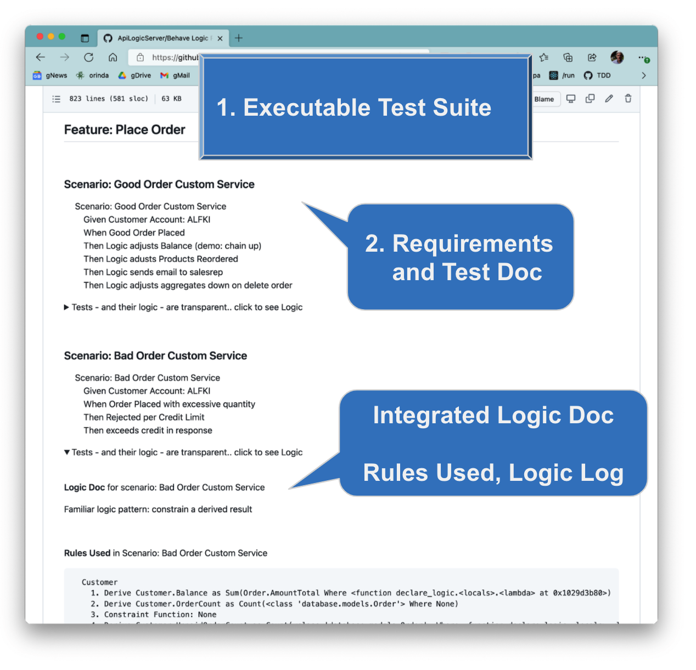
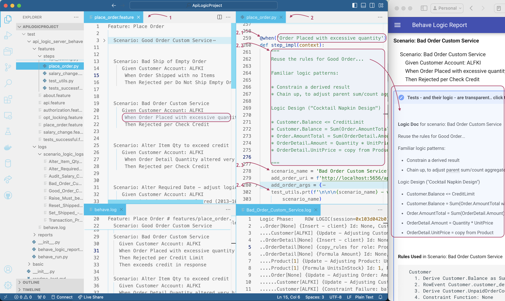

!!! pied-piper ":bulb: TL;DR - Executable Test Suite, Documentation"

      You can optionally use the Behave test framework to (here is an [Agile Approach for using Behave](Logic-Tutorial.md)):

      1. **Capture Requirements, as Tests:** use the Behave in your IDE to capture requirements.  Behave is based on Behavior Driven Design, so your requirements are phrased as tests.
      
      2. **Run Automated Test Suite:** create Python code to execute tests.  You can then execute your test suite with 1 command.

      3. **Requirements and Test Documentation:** as shown below, you can then create a wiki report that documents your requirements, and the tests (**Scenarios**) that confirm their proper operation.

         * **Integrated Logic Documentation:** the report integrates your logic, including a logic report showing your logic (rules and Python), and a Logic Log that shows exactly how the rules executed.  Logic Doc is transparent to business users, so can further contribute to Agile Collaboration.

&nbsp;&nbsp;

# Testing

Experienced professionals advocate test suites, for answering key questions like:

|   Key Question    | Best Practice   |
:-------|:-----------------|
| What is the formal definition of the systems' functionality? | The test suite defines the functionality |
| Is the system ready to go-live | The test suite passes |
| Did my maintenance change break something? | Run the test suite |

## Popular Frameworks

API Logic does not dictate any particular framework.  You can use (and we do internally) popular frameworks such as `PyUnit` (bundled with Python) and `unitest`.

&nbsp;

## The Behave Framework

One such framework is `behave`.  Since it can produce documentation, we have built in support as described here.

[Behave](https://behave.readthedocs.io/en/stable/tutorial.html) is a framework for defining and executing tests.  It is based on [TDD (Test Driven Development)](http://dannorth.net/introducing-bdd/), an Agile approach for defining system requirements as executable tests.

&nbsp;

# Using Behave

Behave is pre-installed with API Logic Server.  Use it as shown above:

1. Create `.feature` files to define ***Scenarios*** (aka tests) for ***Features*** (aka Stories)

2. Code `.py` files to implement Scenario tests

3. Run Test Suite: Launch Configuration `Behave Run`.  This runs all your Scenarios, and produces a summary report of your Features and the test results.

4. Report: Launch Configuration `Behave Report` to create the wiki file shown [here](Behave-Logic-Report.md){:target="_blank" rel="noopener"}.

These steps are further defined, below.  Explore the samples in the sample project.

&nbsp;&nbsp;

## 1. Create `.feature` file to define Scenario

Feature (aka Story) files are designed to promote IT / business user collaboration.  

&nbsp;&nbsp;

## 2. Code `.py` file to implement test

Implement your tests in Python.  Here, the tests are largely _1. read existing data_, _2. run transaction_, and _3. test results_, using the API.  You can obtain the URLs for reading/updatind data from the swagger.

Key points (see items 2.1, 2.2 etc in the diagram above):

1. Link your scenario / implementations with `@when` annotations, as shown for _Order Placed with excessive quantity_.

2. Optionally, include a ___Python docstring___ on your `@when` implementation as shown above, delimited by `"""` strings (see _"Familiar logic pattern"_ in the screen shot, above). If provided, this will be written into the wiki report.

3. Important: the system assumes the line following the docstring identifies the `scenario_name`; be sure to include it.

4. Include the `test_utils.prt()` call; be sure to use specify the scenario name as the 2nd argument.  This is what drives the name of the Logic Log file, discussed below.

&nbsp;&nbsp;

## 3. Run Test Suite: Launch Configuration `Behave Run`

You can now execute your Test Suite.  Run the `Behave Run` Launch Configuration, and Behave will run all of the tests, producing the outputs (`behave.log` and `<scenario.logs>` shown above.

* Windows users may need to run `Windows Behave Run`

* You can run just 1 scenario using `Behave Scenario`

* You can set breakpoints in your tests

The server must be running for these tests.  Use the Launch Configuration `ApiLogicServer`, or `python api_logic_server_run.py`.  The latter does not run the debugger, which you may find more convenient since changes to your test code won't restart the server.

&nbsp;&nbsp;

## 4. Report: Launch Configuration `Behave Report'

Run this to create the wiki reports from the logs in step 3.

## 5. Testing considerations

Please [see here](API-Opt-Lock.md#testing-and-pythonhashseed){:target="_blank" rel="noopener"} for important considerations on optimistic locking and testing.