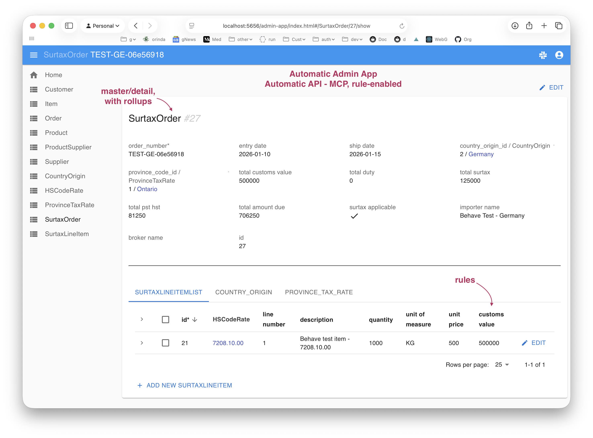
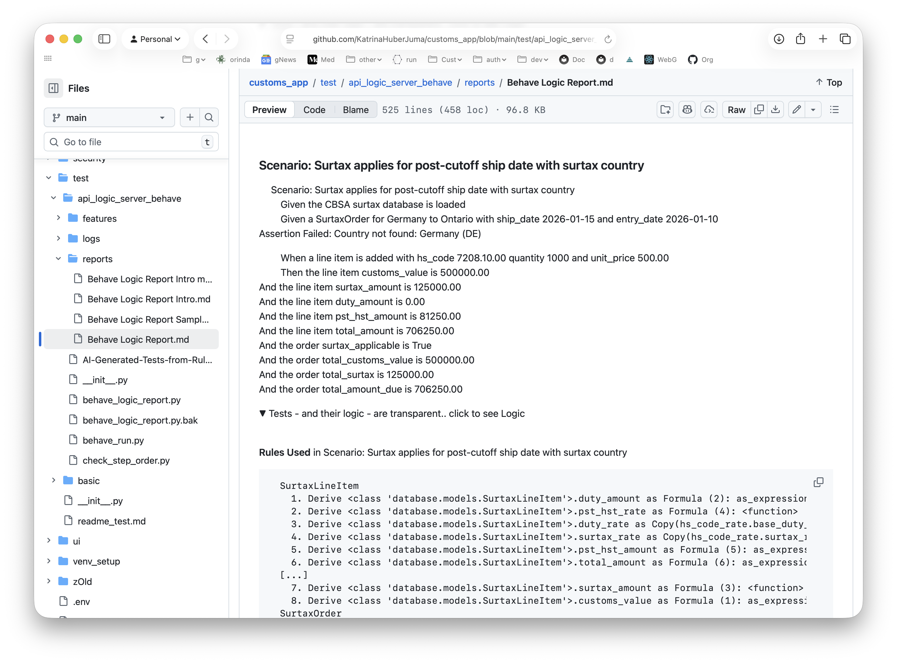
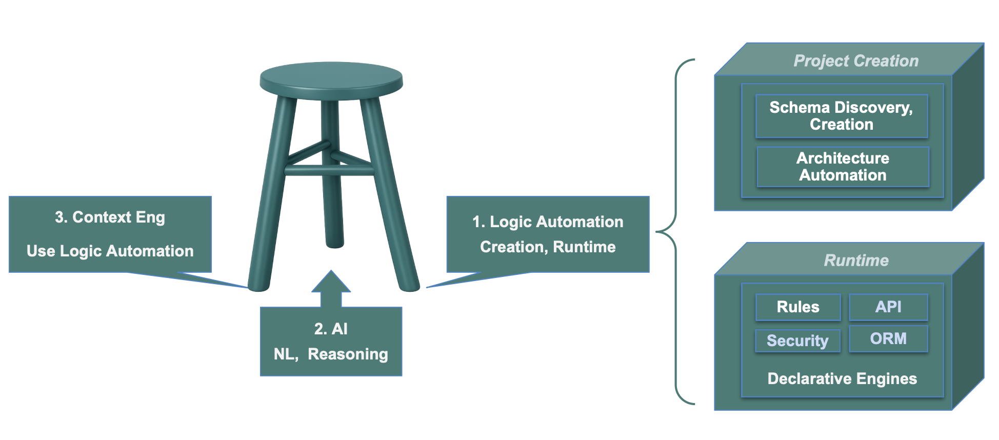

**Audience:** Technical GenAI-Logic evaluators

**Project:** CBSA Steel Derivative Goods Surtax calculator, built as a proof-of-concept.

## Overview



### TL;DR - Enterprise Governance and Speed

The goal of this POC was to explore whether GenAI-Logic added significant value in creating
business systems. Our findings:

- **Confirmation of the speed and power of AI:** a system created from a prompt.
  A several-week effort became 30 minutes.

- **Enterprise-class Governability:**

    - **Commit-Time Enforcement** — All transaction sources converge on a single
      deterministic commit point. Governance is unavoidable by architecture — not by
      discipline. You can't govern paths. You can govern the commit.

    - **AI Variance Reduction** — At authoring time, the DSL converts probabilistic AI
      output into deterministic, human-reviewed declarations before any code runs.
      At runtime, AI Rules are still governed at commit by deterministic rules. AI is
      enclosed at both points — authoring and execution.

    - **Correctness** — Multi-table derivations computed automatically and correctly
      across every change path — not just the ones you thought of. The constraint at
      the end is only as good as the derivation chain feeding it.

    - **Completeness** — Every write path — API, agent, MCP, Vibe app, workflow,
      test script, admin UI — passes through the same rule set. No bypass by
      architecture, not by policy. You can't accidentally miss a path.

    - **Executable, Auditable Requirements** — Rules preserve business intent at the
      requirements level of abstraction, all the way to execution. The traceability
      chain is automatic: requirement → rule → execution. Compliance teams can
      prove governance — not just assert it. With procedural generated code,
      requirements are buried in implementation. With rules, they remain visible,
      inspectable, and executable.

    - **Maintainability** — Change one rule, the engine recomputes the dependency
      graph. No archaeology, no regression hunting across paths. Declarative rules
      are readable by humans, debuggable in a standard IDE, readable by AI.

    - **AI Safety** — Agentic reasoning enclosed by invariants. AI Rules can propose
      values at runtime — supplier selection, pricing decisions — but deterministic
      rules decide what commits. The agent can't accidentally violate a constraint
      it doesn't know about.

- **Enterprise Architecture**

    - Full-featured: enterprise-class API for all objects — pagination, filtering,
      optimistic locking, security — logic enabled out of the box.

    - Manageable: 16 declarative rules replace hundreds of lines of procedural code
      you didn't write, can't audit against requirements, and can't safely change.

<br>

### Two Creation Prompts

#### Subsystem Prompt
The subsystem was created by providing the following prompt to Copilot:

```text
Create a fully functional application and database
 for CBSA Steel Derivative Goods Surtax Order PC Number: 2025-0917 
 on 2025-12-11 and annexed Steel Derivative Goods Surtax Order 
 under subsection 53(2) and paragraph 79(a) of the 
 Customs Tariff program code 25267A to calculate duties and taxes 
 including provincial sales tax or HST where applicable when 
 hs codes, country of origin, customs value, and province code and ship date >= '2025-12-26' 
 and create runnable ui with examples from Germany, US, Japan and China" 
 this prompt created the tables in db.sqlite.
  Transactions are received as a CustomsEntry with multiple 
SurtaxLineItems, one per imported product HS code.
```

> See also the proposed prompt

#### Tests Prompt
```text
create behave tests from CBSA_SURTAX_GUIDE
```

<br>

### Results: system, test suite and report

#### System: API, Database, Logic, Admin App


#### Test Suite and Report

The GenAI-Logic `create` command builds test services and Context Engineering. These enable the LLM to generate tests that proved the code worked, as well as elucidate the logic through readable test reports.



<br>

#### Runtime Architecture: Container, Governed AI

The resultant projects are standard containers.  Deploy without fees.  Sample scripts are provided for Azure.

Execution does *not* use probabilistic AI services *except* for explict AI Rules; these results are strictly governed by deterministic rules at commit time


---

## 1. Project Contents

The following artifacts were generated and are present in this repository.

**Data layer** — `database/models.py` contains auto-generated SQLAlchemy models for `SurtaxOrder`, `SurtaxLineItem`, `HSCodeRate`, `CountryOrigin`, and `ProvinceTaxRate`. The schema follows standard autonumber primary key conventions.

**Business logic** — `logic/logic_discovery/cbsa_steel_surtax.py` contains 16 declarative rules covering line-item calculations (customs value, duty, surtax, PST/HST, total), sum rollups to order-level totals, surtax applicability (date and country checks), and data validation constraints. The file is auto-loaded at startup by `logic/logic_discovery/auto_discovery.py`.

**REST API** — The JSON:API server runs at `http://localhost:5656/api/`. Custom API endpoints are co-located in `api/api_discovery/` and auto-loaded by `api/api_discovery/auto_discovery.py`. No manual registration is required.

**Admin UI** — A full CRUD interface is available at `http://localhost:5656/admin-app` for manual testing and business user workshopping.

**Test suite** — `test/api_logic_server_behave/features/cbsa_surtax.feature` defines 7 Behave scenarios covering: surtax-applicable orders, pre-cutoff (no surtax) orders, non-surtax countries, multi-line rollups, and three constraint violations. Step implementations live in `test/api_logic_server_behave/features/steps/`.  

**Test Report** - the test suite creates logs we use to create a report.  To see the **report**, [click here](Customs-Logic-Report.md){:target="_blank" rel="noopener"}.

**Reference data loader** — `load_cbsa_data.py` populates HS codes, countries, and provincial tax rates from CBSA PC 2025-0917.

<br>

---

## 2. Context Engineering

This POC illustrates the [3-legged stool](#appendix-3-legged-stool), and how Context Engineering leverage underlying automatin to produce a remarkable results. 

It was built across several iterations. Each iteration revealed a specific gap in Context Engineering (CE) — the curated knowledge given to the AI before generation. The gaps and their fixes are documented below.

This was a very interesting joint AI/human design; the approach:

1. Gen customs_demo
2. Ask genned demo to compare itself to the reference implementation - [see it here](https://github.com/KatrinaHuberJuma/customs_app){:target="_blank" rel="noopener"} - and create a comparison doc
3. Analyze the comparison doc in a long-running manager session in mgr Copilot with full CE (mgr, project, internals)
4. Ask Copilot to Revise CE (in src and venv), and update this document
5. Repeat

<br>

<details markdown>
<summary>1. No GenAI-Logic CE → poor "Fat API" demo architecture &emsp; ❌</summary>

<br>

The GenAI-Logic Context Engineering (CE) materials were not loaded, so Claude built a working customs application using standard Python code generation.  The starting case was the `basic_demo` application, which introduced tables we did not need, but did not (we thought) interfere.

The result is a good demo: compiles and runs. 

This was, however, a "happy accident", illustrating that ***AI alone does not deliver an Enterprise-class architecture***, as described below.

* **Demo API (no filtering, pagination, etc)** — No Enterprise-class API with filtering, sorting, pagination, optimistic locking, etc.  Only required endpoints created.

* **Unshared, Path-specific logic (Quality Issues)** — Logic embedded in a single path — not automatically shared across insert/update/delete/FK-change paths.

* **Procedural — Manual Ordering (with bugs)** — Logic is *procedural* with explicit ordering. **AI uses pattern matching to order execution, which can fail for business logic** — to see the A/B study, [**click here**](https://github.com/ApiLogicServer/ApiLogicServer-src/blob/main/api_logic_server_cli/prototypes/basic_demo/logic/procedural/declarative-vs-procedural-comparison.md){:target="_blank" rel="noopener"}. This in fact did occur in our example.

This illustrates the value of the ***3 legged stool*** architecture:

<br>

<details markdown>
<summary>3 legged stool architecture</summary>

<br>GenAI-Logic provides functionality by a combination of core services (project creation, api execution, rules engine), and by leveraging/extending AI Assistants in your IDE.



<details markdown>

<summary>Diagram - Tech Details </summary>

<br>
As shown above, GenAI-Logic functionality is delivered by 3 key elements:

<br>

**1. Architecture Automation**

GenAI-Logic provides automation both at Project Creation, and Runtime:

* Project Creation - schema discovery to create projects, with architecture automation to integrate and start the engines

* Runtime Engines - engines to execute APIs, Logic, Security, database access, etc

<br>

**2. AI**

The primary use of AI is to use your AI Assistant for:

* Authoring (e.g., create logic, APIs), and
* Explanations - find how the system works (e.g., how does logic work, what about performance, etc)

Importantly, these authoring services preserve *Human in the Loop:* review what AI creates, accept/alter as required.  The resultant system is deterministic.

You can also elect to use AI at runtime, by specifying rules with `Use AI to...`.  For example, the *MCP AI Demo* illustrates using AI to choose an optimal supplier - for more information, see [MCP AI Example](Integration-MCP-AI-Example.md){:target="_blank" rel="noopener"}.

> AI can be used to compute values, and we know AI can make mistakes.<br>Govern such AI Logic using business rules -- AI can propose, deterministic rules decide what commits.

We use the following models:

* CLI services use ChatGPT.  You will need to configure your key, typically as an environment variable.

* Copilot access is your choice.  We get good results and typically use Claude Sonnet 4.6.

<br>

**Context Engineering**

Each project contains thousands of lines of Context Engineering that inform AI Assistant about the CLI and runtime engines.

</details>


| Leg | What it provides | Without it |
|-----|-----------------|------------|
| **Logic Automation** (Rules, API Engines) | Correct, auto-enforced business logic across all write paths; enterprise API; governed AI execution | **- Procedural Logic:** Dependency bugs, hard to maintain <br> **- Fat API:** Unshared, Path-dependent logic <br>**- Demo-class APIs** (no optimistic locking, etc) |
| **Generative AI** | Rapid creation, iteration, test generation from natural language | Weeks of manual development |
| **Context Engineering** | Guides AI to the right architecture (declarative rules, proper data model) | AI defaults to "Fat API" procedural code — works but ungoverned |

**Key insight:** Without Context Engineering, AI generates working demos that lack enterprise 
architecture. Without rules automation, AI generates procedural code with correctness bugs. 
Together: a several-week effort became **30 minutes**, producing a correct, enterprise-class, 
fully tested system.

> *"A/B result: 16 declarative rules vs. equivalent procedural code with 2 critical bugs."*

&nbsp;

**Highly Leveraged; Support Recommended**

As part of your project, you can extend Context Engineering.  We did so in this project (see section 2).  For more information, see [AI-Enabled](Project-AI-Enabled.md).

Such extensions require extensive architectural background, so training and support are recommended.

&nbsp;

</details>

<br>

</details>

</details>

<br>

<details markdown>
<summary><strong>2. Missing Business Automation CE → No Rules, Poor Data Model &emsp; ❌</strong></summary>

<br>

So, we loaded the Context Engineering, and re-built.  Claude produced poor results on two dimensions:

* data model errors (non-autonumber primary keys for `SurtaxOrder` and `SurtaxLineItem`)
* business logic still written as procedural code rather than declarative rules

This was because the CE (Context Engineering) was provided for WebGenAI, but not Copilot.  So we created `docs/training/subsystem_creation.md` with data model and rules training.

<br>

</details>

<br>

<details markdown>
<summary><strong>3. Proper app generated correctly from prompt &emsp; ✅</strong></summary>

<br>

With the revised CE in place, Claude generated a complete, correct customs application in a single pass: proper autonumber data model, 16 declarative LogicBank rules enforcing all calculations, clean separation between API routing and rule enforcement, and a Behave test suite with requirement-to-rule traceability.  This became our **reference implementation.**

> Context Engineering learning compounds. Each prior failure encoded a reusable correction. Any future project that loads this CE material starts at Step 2 — the failures were compressed into training assets, not wasted effort.

**What this means for evaluation:** The product (GenAI-Logic) provides the architectural value. The process (Context Engineering iteration) determines whether the AI can reach that architecture reliably. Both matter.

<br>

</details>

<br>


<details markdown>
<summary><strong>4. Productization revealed `basic_demo` dependence & master/detail prompt omission &emsp; ❌</strong></summary>

<br>

The 'basic_demo` tables were an accidental artifact - we thought.  But when we re-genned using just the clean `starter.sqlite`, we got a poor result:

* we lost the master/detail structure that had been inferred from `basic_demo` - this needed to be added to the prompt
* `basic_demo` also showed several basic logic patterns that we needed to add to the CE, shown below

The study produced several durable CE principles now encoded in Context Engineering ()`subsystem_creation.md`, `logic_bank_api.md`, and `.copilot-instructions.md`):

* **Reference table default** — flat column + `Rule.copy`. Versioned child table only when the prompt explicitly mentions `effective_date`, rate history, or versioning.

* **`Rule.copy` is the default** for parent-value access (snapshot, safe). `Rule.formula` is the escalation (live propagation, needed less often).

* **Request Pattern scope** — integration side-effects only (email, Kafka, AI calls). Not for domain data entry where LogicBank rules derive computed columns automatically.

* **Domain insert is the pattern** — direct insert fires all LogicBank rules. No `Sys*` wrapper needed.

* **"Create runnable UI"** = seed example data + Admin App at `http://localhost:5656`. Never a custom HTML page or calculator endpoint.

* **Lookup references use FK integers** — transactional tables store `country_origin_id FK → CountryOrigin.id`, not `country_of_origin = "DE"`. FK is what makes `Rule.copy` traversable; a text code has no relationship.

* **Seed data canonical pattern** — use `alp_init.py` with Flask context active so LogicBank fires and all computed fields are correct on first load. Never shell heredocs (terminal tool garbles them).

* **Spec = floor, not ceiling** — a column list in a prompt is the minimum anchor the author needed to specify, not a complete design. Apply domain knowledge to flesh out standard fields, constraints, and sums. Prompt author omissions mean "obvious to them" — not "not required."

> Just as `basic_demo` "polluted" a clean generation, so did this readme!  The learning: AI is crafty - it will use whatever it can find, so be careful what you leave lying around.  See the front-matter, above.

</details>

<br>

<details markdown>
<summary><strong>5. Prompt is a floor, not a ceiling &emsp; ❌</strong></summary>

<br>

As we added promot engineering for the schema, this changed the AI pattern to blind obedience.  For example, roll-up rules and constraints were not added.

So, we changed the CE to stipulate that the prompt is a floor, not a ceiling.

</details>

<br>

<details markdown><summary>6. Validation: Iterations Lead to Enterprise-Quality Results &emsp; ✅</summary>

Each iteration tested against the hand-crafted `customs_app` (16 rules) as the fixed ground-truth reference.

| Iteration | Key change | Rules | `Rule.copy` | `Rule.constraint` | Outcome |
|---|---|---|---|---|---|
| `customs_demo_ce_fix` | Applied Root Cause fixes to CE | 10 | 0 | 0 | Catastrophic failures gone; FK text-code problem remains |
| `customs_demo_v2` | Fixed prompt: FK integers + single `province.tax_rate` | 13 | 3 ✅ | 1 | `Rule.copy` validated; `base_duty_rate` and constraints still missing |
| `customs_demo_v3` | Added spec=floor principle to CE | 11 | 3 ✅ | 1 | Generic domain fields restored; domain-specific `base_duty_rate` cannot be recovered by CE alone |
| New release (`customs_demo`) | Added `base_duty_rate` and `quantity × unit_price` to prompt explicitly | **16 ✅** | 1 | 3 ✅ | Functionally at par with reference — all constraints, sums, and rates correct |

**The `v1a` clean-room finding.** A final test (`customs_demo_v1a`) ran the prompt with no `customs_demo` readme in context. Without the readme acting as a ghost, the result regressed to near-v3 quality — confirming that the "new release" 16-rule win was partially readme-assisted. What the CE alone **does** reliably produce: header/detail structure, flat reference table design, `Rule.copy` for duty rate, and `alp_init.py` Flask-context seed data. Constraints, single-column province, and `CountryOrigin` FK table require the prompt spec.

> **CE reliability boundary:** CE is reliable for what it explicitly encodes. If a structural outcome depends on inference — from ghost context, readme text, or ambient schema artifacts — it is non-deterministic and will not reproduce on a clean project. The practical test: can you point to the CE sentence that requires this outcome? If not, the result is fragile.

**Domain accuracy finding:** The clean-room test also caught a factual error in the hand-crafted reference — `customs_app` marks Germany, Japan, and China as surtax-applicable. PC 2025-0917 is a targeted US retaliatory levy; only US-origin goods attract the 25% surcharge. The AI, without the reference in context, modeled this correctly. Domain experts reviewing this system should verify country-of-origin applicability against the current PC annex.

</details>

<br>

<details markdown><summary>7. Results Vary - Human in the Loop ⚠️ </summary>

<br>Iterations produce generally good results, but not identical.  The familiar "human in the loop" advice applies - the result of AI is not a project you deploy instantly, but one that is easy to scan, test and verify.

</details>

<br>

> Key Takeaway: GenAI-Logic is a combination of infrastructure (API, Rules Engine), and AI.  Leveraging AI requires Context Engineering.  <br><br>This can enable major changes without a product re-release, but strong support/background is required.

<br>

---

## 3. Test Creation From Rules

**Behave** is a Python BDD (Behavior-Driven Development) test framework. Tests are written in plain English using **Gherkin** syntax (`Given / When / Then`), making them readable by non-engineers.

`Scenario: Surtax applies for post-cutoff ship date`
  `Given a SurtaxOrder for Germany to Ontario with ship_date 2026-01-15`
  `When a line item is added with hs_code 7208.10.00 quantity 1000`
  `Then the line item surtax_amount is 125000.00`

Each step maps to a Python function in `features/steps/`. GenAI-Logic adds a **Behave Logic Report** on top (`behave_logic_report.py`) that traces which rules fired per scenario — turning tests into living requirements documentation (requirement → rule → execution).

To run the Behave test suite, start the server first, then execute:

```bash
cd test/api_logic_server_behave
python behave_run.py
```

The Behave Logic Report (`test/api_logic_server_behave/behave_logic_report.py`) produces a per-scenario trace showing which rules fired, in what order, and with what before/after values. This creates a direct requirement → rule → execution traceability chain. 

For example, the scenario `Surtax applies for post-cutoff ship date with surtax country` in `features/cbsa_surtax.feature` traces through the `determine_surtax_applicability` formula rule, the `calculate_surtax_amount` formula rule, the `copy_pst_hst_rate` formula rule, and all five sum rules up to the order totals — all triggered by a single line-item insert.

<br>

---

## 4. Debugging: Standard IDE, Logging

The LogicBank logic log records before- and after-values for every attribute touched during a transaction commit. Rules in `logic/logic_discovery/cbsa_steel_surtax.py` emit structured log messages using `logic_row.log()` — for example:

```
Surtax Amount: 125000.0 (Applicable: True)
PST/HST Rate: 0.1625
Surtax Applicable: True (Ship Date: 2026-01-15, Date Check: True, Country Check: True, Cutoff: 2025-12-26)
```

To extract a clean logic trace for a specific transaction, set the log level to `DEBUG` in `config/logging.yml` and filter on the `logic_logger` name. The debug documentation for logic traces is in `docs/logic/readme`. The `test_date_fix.sh` script at the project root demonstrates extracting and validating specific logic log output.

<br>

---

## 5. Maintenance: Automated Reuse and Ordering

Changing a rule requires editing one declaration in `logic/logic_discovery/cbsa_steel_surtax.py`. The engine recomputes the dependency graph at startup and applies the change to every write path automatically — insert, update, delete, and foreign key reassignment. There is no need to find insertion points, trace execution paths, or audit every API endpoint.

The contrast with procedural code is quantified in `logic/procedural/declarative-vs-procedural-comparison`. For an equivalent order management system, the procedural approach produced 220+ lines of code with 2 critical bugs (missed cases for FK reassignment). The declarative approach produced 5 rules with 0 bugs. The customs system in this POC has 16 rules. An equivalent procedural implementation would require explicit handling of every combination of line-item insert, quantity update, price update, HS code change, country change, and ship date update — each requiring code changes in multiple functions.

<br>

---

## 6. AI Use: Human In the Loop, Determinism

While the system was *created* using AI, that was authoring only.  The expectation is that developers remain the ***human in the loop*** to verify the rules, and debug them.

The created Rules in `logic/logic_discovery/cbsa_steel_surtax.py` execute **deterministically** at transaction commit time via SQLAlchemy ORM events. There is no inference, no sampling, and no variability: given the same input state, the same output is always produced. 

All writes to the database — through the REST API, through the Behave test suite, through the Admin UI at `/admin-app`, or through any agent or script — pass through the identical rule set. The execution order is computed once at startup from the declared dependency graph, not from code paths at runtime.

### AI Rules Also Supported - With Governance
The system does support AI rules — rules that call AI at runtime (though not used here). Importantly, these are subjected to this same governance:

> AI may propose values, but rules determine what commits.

### Next Exploration: AI-Determined HS Codes

HS code classification is a well-known compliance pain point — importers frequently mis-classify goods, triggering audits and penalties. A natural next step is to add an AI Rule that determines the correct HS code from a product description, analogous to our `find-supplier` example where AI selects the best supplier from a product spec.

This raises two engineering questions worth exploring:

1. **AI Rules in a transactional workflow** — the AI inference runs at transaction time, not at authoring time. The downstream duty, surtax, and PST/HST calculations fire automatically from whatever HS code the AI resolves. The audit log captures both the inference result and the full rule chain that followed from it.

2. **Human-in-the-loop at authoring time, not inspection time** — AI distills natural-language intent into declarative rules. A compliance engineer reviews the DSL output, not the implementation it replaced. The review artifact is at the same abstraction level as the business requirement — 1 rule per derivation, not 200 lines of service code tracing execution paths — which is what makes the review tractable. Once approved, the rules execute deterministically: same input state, same output, every time, across every write path. Governance is structural, not procedural.

These two points converge: the deterministic DSL rules that govern every ordinary transaction are the *same* rules that govern AI Rules. There is no separate governance layer to design or enforce. An AI-proposed HS code enters the same commit pipeline as a human-entered one — duty, surtax, and provincial tax fire identically, with no exceptions and no bypass paths. The AI inference is bounded; the consequences are not probabilistic.

<br>

---

## 7. Automatic Invocation - Code *Cannot* Bypass Rules

Rules fire by architectural necessity, not by policy. The LogicBank engine hooks into SQLAlchemy's `before_flush` and `before_commit` events at the ORM layer, below Flask and below any API handler. There is no write path to the database that does not pass through the same hooks. 

You cannot bypass enforcement by calling a different endpoint, using a different HTTP method, writing a new API service, or modifying the database through a workflow step. This is the structural property that makes AI-proposed logic changes safe to commit: a rule change that passes validation is automatically enforced everywhere, with no additional wiring.

<br>

---

## 8. What GenAI-Logic Is Not

The rules engine enforces data integrity at write time. It is not a tool for read-only analytics or reporting — SQL views, BI tools, or direct query optimization are appropriate there. 

It is not a workflow orchestration engine: multi-step approval processes, long-running sagas, and external system coordination belong in tools like Temporal or Airflow. It does not replace complex algorithms — machine learning models, graph traversal, or combinatorial optimization are pure Python problems. 

Rules solve one specific problem well: ensuring that defined data relationships are always true, across every write path, automatically.

<br>

---

## 9. A/B Result

For the foundational order management case, 5 declarative rules replaced 220+ lines of AI-generated procedural code, and the procedural version contained 2 critical bugs that were only discovered through directed prompting:

* one for `Order.customer_id` reassignment (old customer balance not decremented) and 
* one for `Item.product_id` reassignment (unit price not re-copied from new product)

The full experiment, including the original procedural code and the AI's own analysis of why it failed, is documented in the A/B study, [**click here**](https://github.com/ApiLogicServer/ApiLogicServer-src/blob/main/api_logic_server_cli/prototypes/basic_demo/logic/procedural/declarative-vs-procedural-comparison.md){:target="_blank" rel="noopener"}. 

> (tL;DR: pattern-matching AI deals poorly with complex dependencies common to business logic).

---

**Bottom line:** The customs POC demonstrates that GenAI-Logic delivers correct, maintainable business logic — and that getting an AI to generate it correctly requires Context Engineering to be as precise about architecture as it is about syntax. A production CBSA implementation would start from the CE and prompt patterns documented in section 2, not from a blank slate; the iteration study exists so that starting point is already validated.
