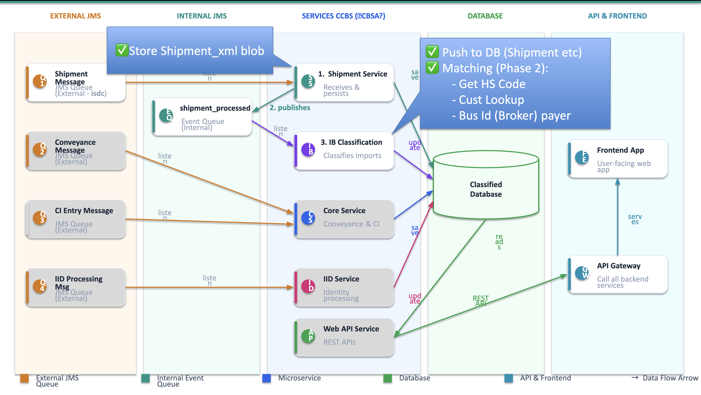
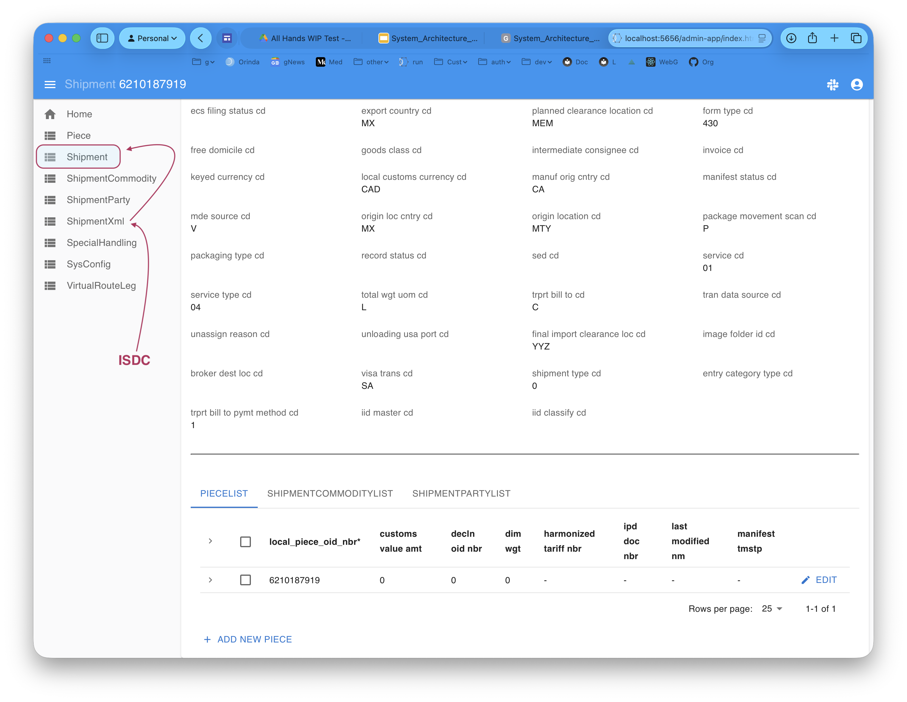

# Customs Demo

**Bootstrap Copilot by pasting the following into the chat:**
```
Please load `.github/.copilot-instructions.md`.
```

&nbsp;

## Project Overview

This system is a prototype for a rewrite of the following, using Kafka instead of JMS, and sqlite:





An enterprise integration (EAI) microservice that ingests CIMCorp/ISDC customs shipment data from a Kafka topic, parses the canonical XML format, and persists the resulting shipment records — with full REST API, Admin UI, and a declarative business logic layer ready for governance rules.

**Inputs** (in `docs/elmo_creation/`):
- Database — 7 tables, 130+ columns
- XML-to-DB field mapping (`Classify Entity Details.csv`)
- Sample message (`sample_data/MDE-CDV-HVS-WR-Rev260328.xml`)

**Outputs**:
- Working Kafka consumer pipeline: `isdc` → `ShipmentXml` → `shipment_processed` → DB tables  
- JSON:API for all tables, Admin UI, declarative logic engine (rules to come in Phase 2)
- Matching: look up the matching CcpCustomer
    - found: set `Shipment.trprt_bill_to_acct_nbr == CcpCustomer.duty_bill_to_acct_nbr` and create a `ShipmentParty` row
    - no match: log a warning, do nothing.

&nbsp;

## Basic Design

1. `integration/kafka/kafka_consumer.py` - isdc
    * reads message, inserts into `ShipmentXml`
2. `logic/logic_discovery/shipment_xml_ingest.py`
    * insert → publishes xml to topic: `shipment_processed`
3. `integration/kafka/kafka_consumer.py` - shipment_processed
    * parses xml → database tables
4. Matching: Phase 2, presumably rules/events on Shipment

&nbsp;

> **Design note — why 2 messages?** The original design used 1 message: receive XML, save `ShipmentXml`, parse into DB tables — all in one transaction. The 2-message design now in place was adopted after reviewing production reliability requirements.
>
> The key advantage is **transaction isolation**. A tempting alternative to 2 messages is a try/catch in the single transaction: always save `ShipmentXml`, best-effort parse the DB tables. This breaks down in SQLAlchemy: a failed flush (e.g. parser error mid-parse) **poisons the session** — you can't commit the blob in the same session after an exception. You'd need two explicit back-to-back transactions, plus a third to write the error back to `ShipmentXml`. That's messy and fragile.
>
> The 2-message design solves this cleanly: Kafka acts as the durable commit boundary between ingestion and processing. The blob is always saved (transaction 1), and a parse failure only affects transaction 2 — no session gymnastics, and back-pressure decoupling is a free bonus.

&nbsp;

## Creation Instructions

```bash
# A - Create the project (already done)
genai-logic create  --project_name=demo_customs --db_url=sqlite:///samples/requirements/customs_demo/database/customs.sqlite

# B - in created project, get and implement the requirements
$ cp -r ../samples/requirements/customs_demo/. .

# C - use the shared Manager venv (do not create a local project .venv)
source ../venv/bin/activate

# D - required hardening for delete integrity (no orphans after parent delete via API):
in database/models.py, add ORM relationship cascade on Shipment child lists
(pattern: relationship(cascade="all, delete", back_populates="...")).
Apply to:
   Shipment.PieceList
   Shipment.ShipmentCommodityList
   Shipment.SpecialHandlingList
   Shipment.ShipmentPartyList

# E - ask Copilot to create the system
implement req docs/requirements/customs_demo

```
