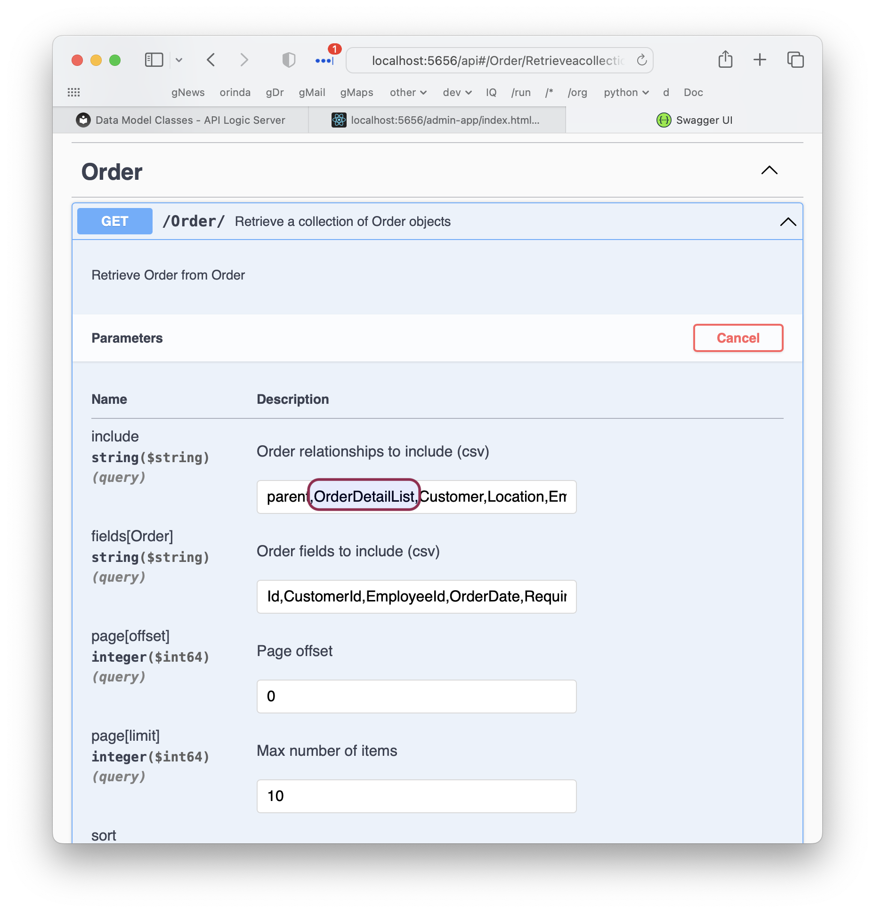
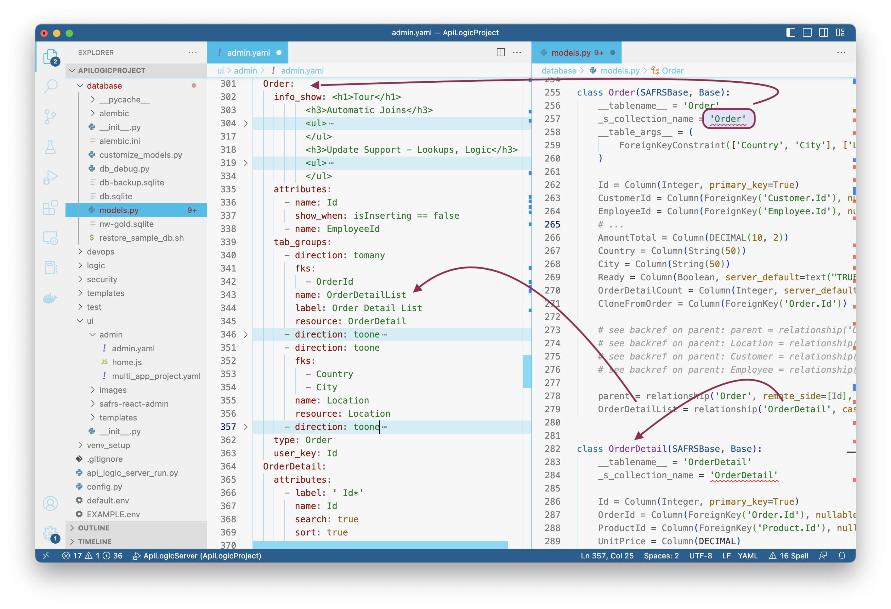
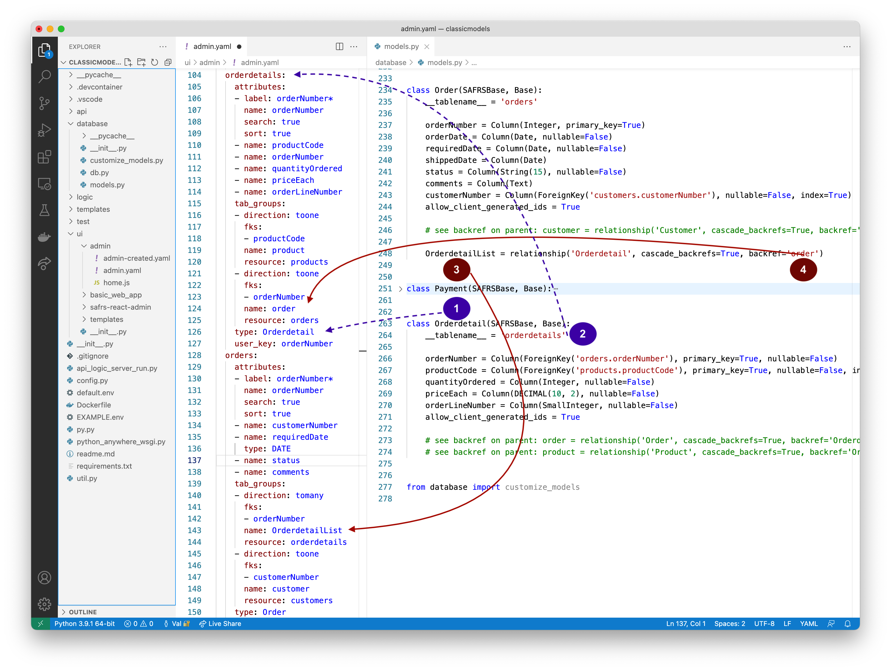
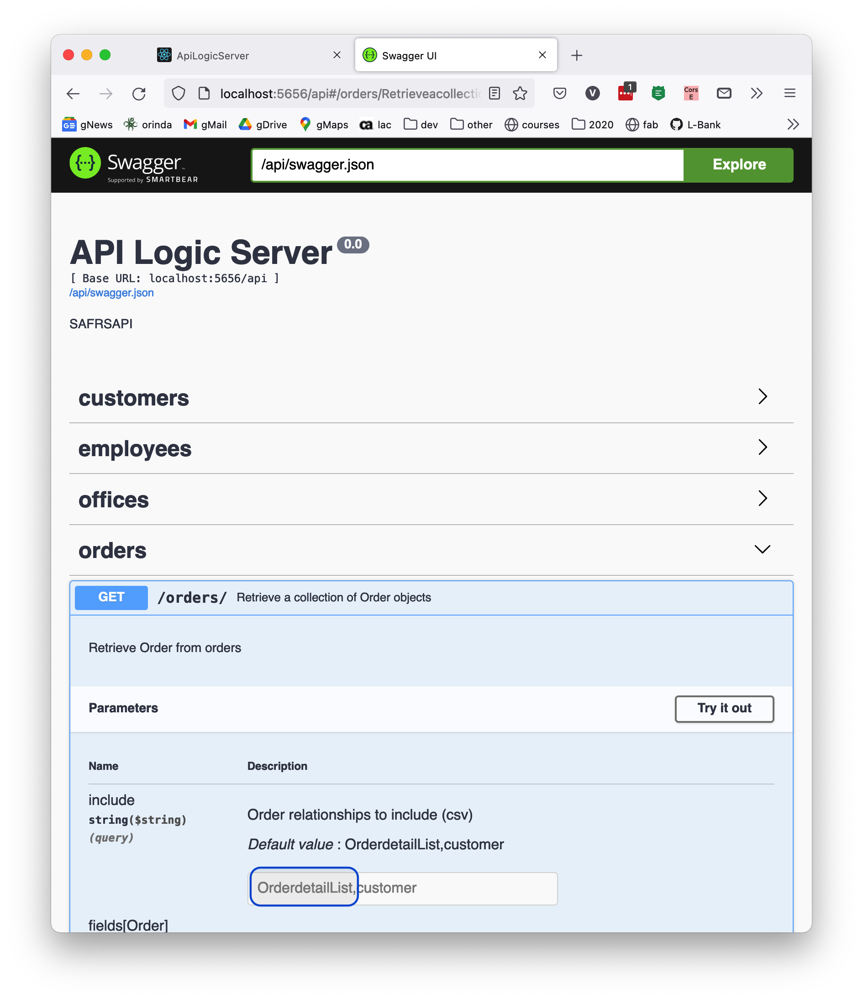

Most of API Logic Server functionality derives from the data model classes created from your schema when you create your project with `ApiLogicServer create`.  

It operates as described below.

# Create `models.py` from schema

`ApiLogicServer create` builds the `database/models.py` file, with a class for each table: 

```python
class Category(SAFRSBase, Base):             #  <--- singular/capitalized tablename
    __tablename__ = 'CategoryTableNameTest'  #  <--- from schema
    _s_collection_name = 'Category'          #  <--- defaults from class name - endpoint, admin reference
    Id = Column(Integer, primary_key=True)
    CategoryName = Column(String(8000))
    Description = Column(String(8000))


class Order(SAFRSBase, Base):
    __tablename__ = 'Order'
    _s_collection_name = 'Order'
    __table_args__ = (
        ForeignKeyConstraint(['Country', 'City'], ['Location.country', 'Location.city']),
    )

    Id = Column(Integer, primary_key=True)
    CustomerId = Column(ForeignKey('Customer.Id'), nullable=False, index=True)
    EmployeeId = Column(ForeignKey('Employee.Id'), nullable=False, index=True)
    # etc
    AmountTotal = Column(DECIMAL(10, 2))
    Country = Column(String(50))
    City = Column(String(50))
    Ready = Column(Boolean, server_default=text("TRUE"))
    OrderDetailCount = Column(Integer, server_default=text("0"))
    CloneFromOrder = Column(ForeignKey('Order.Id'))

    # see backref on parent: parent = relationship('Order', remote_side=[Id], cascade_backrefs=True, backref='OrderList')
    # see backref on parent: Location = relationship('Location', cascade_backrefs=True, backref='OrderList')
    # see backref on parent: Customer = relationship('Customer', cascade_backrefs=True, backref='OrderList')
    # see backref on parent: Employee = relationship('Employee', cascade_backrefs=True, backref='OrderList')

    parent = relationship('Order', remote_side=[Id], cascade_backrefs=True, backref='OrderList')  # special handling for self-relationships
    OrderDetailList = relationship('OrderDetail', cascade='all, delete', cascade_backrefs=True, backref='Order')  # manual fix

```

> This was derived from [sqlacodgen](https://pypi.org/project/sqlacodegen/){:target="_blank" rel="noopener"} -- many thanks!  (It is *not* necessary to `pip` this into your project - it's part of API Logic Server).

&nbsp;

## Class (end point) for each table

A __class__ is created for each table.  The name (e.g. `Order`) is derived from the table name: capitalized and singlularized.

&nbsp;

### End point name from Class

These class names are used as the default API endpoint name.  Override them as described below.

&nbsp;

### Overriding the Class Name

Developers often want to control endpoint names.  To do so, edit the value of `_s_collection_name` as shown above. 

&nbsp;

## Relationship Names

Your class model includes accessors for related data:

1. Relationships are created on the _one_ side of one-to-many relationships.  The __relationship name__ is the target class + "List", and is available in Python (`items = anOrder.OrderDetailList`).  These names are used in your UI admin apps, and your API

2. Relationships have 2 names; the __backref__ name is how the _many_ side refers to the _one_ side (e.g., `anOrder = anOrderDetail.order`)

Relationship names are also part of your API:



> Each database has extensions which can introduce issues in model generation, so facilities are described in [Troubleshooting](Troubleshooting.md) to edit models and rebuild.

Relationship names are derived from database foreign keys, as [described here](Data-Model-Keys.md#foreign-keys).  As described in the link, you can add missing foreign keys in your data model classes.

&nbsp;

### Multi-reln

In the [sample database](Sample-Database.md){:target="_blank" rel="noopener"}, there are 2 relationships between `Department` and `Employee`.  The default names described above would clearly create name collisions.  These are avoided with 2 strategies:

* basic: the first relationship is named as above; subsequent accessor names are appended with a number (1, 2)

* advanced: if the foreign key is single-field, and ends with `id` or `_id`, the foreign key names is used:

```python title="advanced relationship names"

    # parent relationships (access parent) -- example: self-referential
    # .. https://docs.sqlalchemy.org/en/20/orm/self_referential.html
    Department : Mapped["Department"] = relationship(remote_side=[Id], back_populates=("DepartmentList"))

    # child relationships (access children)
    DepartmentList : Mapped[List["Department"]] = relationship(back_populates="Department")
    EmployeeList : Mapped[List["Employee"]] = relationship(foreign_keys='[Employee.OnLoanDepartmentId]', back_populates="OnLoanDepartment")
    WorksForEmployeeList : Mapped[List["Employee"]] = relationship(foreign_keys='[Employee.WorksForDepartmentId]', back_populates="WorksForDepartment")
```

&nbsp;


## Model Linkages

The diagram below illustrates how the class aspects and the admin app tie together:



## Override s_count: performance

If you see performance issues in loading the API, explore overriding s_count:


## View Support

Views are supported with the following restrictions:

* They are created in `models.py` as tables, not classes
* They are not part of API automation
    * You can expose views with custom APIs, as [shown here](https://github.com/ApiLogicServer/demo/blob/main/api/customize_api.py){:target="_blank" rel="noopener"} -- search for *view

&nbsp;

----

# Appendix: Pre 9.1.0 (SQLAlchemy 2 typing)

Release 9.1.0 enhanced data model attribute / relationship typing, based on SQLAlchemy 2.  Prior to that release, classes were created like this: 

```python
class Category(SAFRSBase, Base):                #  <--- singular/capitalized tablename
    __tablename__ = 'CategoryTableNameTest'     #  <--- from schema
    _s_collection_name = 'Category'             #  <--- defaults from class name - endpoint, admin 
    __bind_key__ = 'None'

    Id = Column(Integer, primary_key=True)
    CategoryName = Column('CategoryName_ColumnName', String(8000))  # manual fix - alias
    Description = Column(String(8000))
    Client_id = Column(Integer)

    @jsonapi_attr
    def _check_sum_(self):                      # <--- optimistic locking
        return None if isinstance(self, flask_sqlalchemy.model.DefaultMeta) \
            else self._check_sum_property if hasattr(self,"_check_sum_property") \
                else None  # property does not exist during initialization

    @_check_sum_.setter
    def _check_sum_(self, value):  # type: ignore [no-redef]
        self._check_sum_property = value

    S_CheckSum = _check_sum_


class Order(SAFRSBase, Base):
    __tablename__ = 'Order'
    _s_collection_name = 'Order'  # type: ignore
    __bind_key__ = 'None'
    __table_args__ = (
        ForeignKeyConstraint(['Country', 'City'], ['Location.country', 'Location.city']),
    )

    Id = Column(Integer, primary_key=True)
    CustomerId = Column(ForeignKey('Customer.Id'), nullable=False, index=True)
    EmployeeId = Column(ForeignKey('Employee.Id'), nullable=False, index=True)
    OrderDate = Column(String(8000))
    RequiredDate = Column(Date)
    # etd
    AmountTotal : DECIMAL = Column(DECIMAL(10, 2))  # <--- Observe typing
    Country = Column(String(50))
    City = Column(String(50))
    Ready = Column(Boolean, server_default=text("TRUE"))
    OrderDetailCount = Column(Integer, server_default=text("0"))
    CloneFromOrder = Column(ForeignKey('Order.Id'))

    # parent relationships (access parent)
    Order : Mapped["Order"] = relationship(remote_side=[Id], back_populates=("OrderList"))
    Location : Mapped["Location"] = relationship(back_populates=("OrderList"))
    Customer : Mapped["Customer"] = relationship(back_populates=("OrderList"))
    Employee : Mapped["Employee"] = relationship(back_populates=("OrderList"))

    # child relationships (access children)
    OrderList : Mapped[List["Order"]] = relationship(back_populates="Order")
    OrderDetailList : Mapped[List["OrderDetail"]] = relationship(cascade="all, delete", back_populates="Order")  # manual fix

```

&nbsp;

# Appendix: Pre 6.5.0 (End Point names from table names)

This functionality was altered in version 6.4.6.  In prior versions, it operated as shown in the example below:

* On the right are the created data model classes
* On the left are references to it from the Admin Web App `admin.yaml` model file that defines how the app behaves:



Observe that:

1. A __class__ is created for each table.  The name (e.g. `OrderDetail`) is derived from the table name, but is capitalized and singlularized


2. The __table name__ is from your schema, this corresponds to a resource collection in the API


3. Relationships are created on the _one_ side of one-to-many relationships.  The __relationship name__ is the target class + "List", and is available in Python (`items = anOrder.OrderDetailList`).  These names are used in your UI admin apps, and your API


4. Relationships have 2 names; the __backref__ name is now the _many_ side refers to the _one" side (e.g., anOrder = anOrderDetail.order`)


Relationship names are also part of your API:



> Each database has extensions which can introduce issues in model generation, so facilities are described in [Troubleshooting](Troubleshooting.md) to edit models and rebuild.


