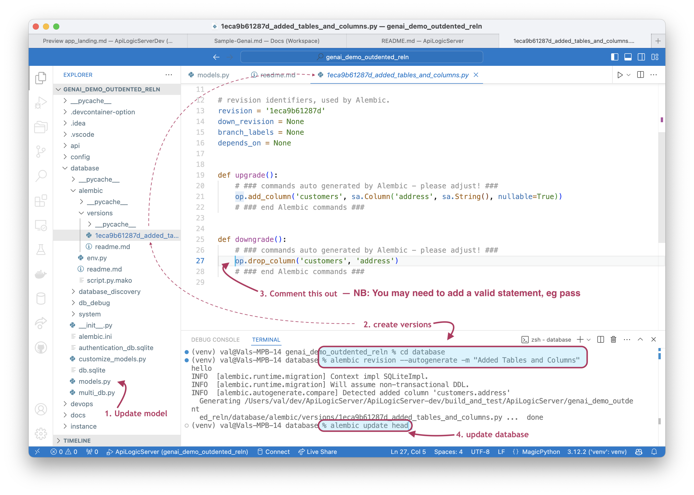

!!! pied-piper ":bulb: TL;DR - Executable Test Suite, Documentation"

      You can change your database schema and rebuild your project ("schema migration"), **preserving customizations** to your logic, api and admin app.  You can drive changes from either:

      * Your database, using your database tools

      * Your `database/models.py` file, using alembic to drive those changes into the database

      To reconcile your api and admin app, you then issue `als rebuild-from-model` or 'rebuild-from-database`


&nbsp;

## Project Creation: Models

When you intially create your project:

* the system reads the database schema to create `models.py`

* `models.py` drives the creation process of APIs, Apps etc.

* you customize the created project, mainly by altering the files on the far right shown in the diagram below

### Model Customization

As shown in the diagram, creation is always driven from `models.py.`  Models differ from physical schemas in important ways:

* the system ensures that class names are capitalized and singular

* there are good reasons to customize `models.py`:

      * to add foreign keys missing in the database - these are critical for multi-table apis and applications
      * to provide better naming, e.g. alias column names as shown below from the northwind sample

```python title='alias column names'
class Category(SAFRSBaseX, Base):
    __tablename__ = 'CategoryTableNameTest'
    _s_collection_name = 'Category'  # type: ignore
    __bind_key__ = 'None'

    Id = Column(Integer, primary_key=True)
    CategoryName = Column('CategoryName_ColumnName', String(8000))  # manual fix - alias
    Description = Column(String(8000))
    Client_id = Column(Integer)
```


## Rebuild from Model or Database

It is highly likely you will need to alter your database design.  This poses the question: do I alter the schema (using a database tool), or `models.py`?  As shown below, the system supports both, so you can decide what strategy works best for you:


You can rebuild your project, preserving customizations (including any additional files you have created).  You have 2 alternatives, depending on where you choose the _"source of truth"_ for your database:

| Source of Truth | Means | Use `rebuild` option |
| :--- |:---|:---|
| Database | The schema is the source of truth<br><br>It includes all the foreign keys | `rebuild-from-datatabase:` rebuilds the files shown in blue and purple. |
| Model | Model is the source of truth<br><br>Use SQLAlchemy services to drive changes into the database |`rebuild-from-model:` rebuilds the files shown in blue |

Note that `ui/admin/admin.yaml` is never overwritten (the dotted line 
means it is written on only on `create` commands).  After rebuilds, merge the new `ui/admin/admin-created.yaml` into your customized `admin.yaml.`

For more information, see [Alembic](Data-Model-Customization.md){:target="_blank" rel="noopener"}.

&nbsp;

### API and Admin App merge updates

As of release 5.02.03, ```rebuild``` services provide support for updating customized API and Admin:

| System Object | Support |
| :---  | :--- |
| API | `api/expose_api_models_created.py` created with new `database/models.py` classes |
| Admn App | `ui/admin/admin-merge.yaml` is the merge of `ui/admin/admin.yaml` and new `database/models.py` classes |

Review the altered files, edit (if required), and merge, or copy them over the original files.

&nbsp;

### Use Alembic to update database schema from model

As of release 5.02.03, created API Logic Projects integrate [Alembic](https://alembic.sqlalchemy.org/en/latest/index.html) to perform database migrations.

* Autogenerate: alter your `database/models.py`, and have alembic create the migration scripts for you
* Manual: create migration scripts by hand, or

Preconfiguration includes:

* initialized `database/alembic` directory
* configured `database/alembic/env.py` for autogenerations
* configured `database/alembic.ini` for directory structure

You can Alembic in a more-automated *Autogenerate* mode, or *Manual*, as described below.  Then, use `rebuild-from-model` as described above.

#### Autogenerate

The diagram below illustrates a simple path for enacting changes to the data model, and using alembic to automate the database changes:

1. Update `database/models.py` (e.g., add columns, tables)
2. Use alembic to compute the revisions
```bash
cd database
alembic revision --autogenerate -m "Added Tables and Columns"
```
3. Edit the revision file to signify your understanding
4. Activate the change
```bash
alembic upgrade head 
```




#### Manual
As described in the [Tutorial](https://alembic.sqlalchemy.org/en/latest/tutorial.html):
```
cd database
alembic revision -m "my revision"
```
This will create `database/alembic/versions/xxx_my_revision.py`.
* edit the `upgrade()` and `downgrade()` functions as shown in the Tutorial

Then, to run the script
```
alembic upgrade head
```

<br>
### Use AI Assistant

You can also use your AI assistant to add columns, tables, and relationships.  It will choreograph changes to database models, and use alembic to for the database.