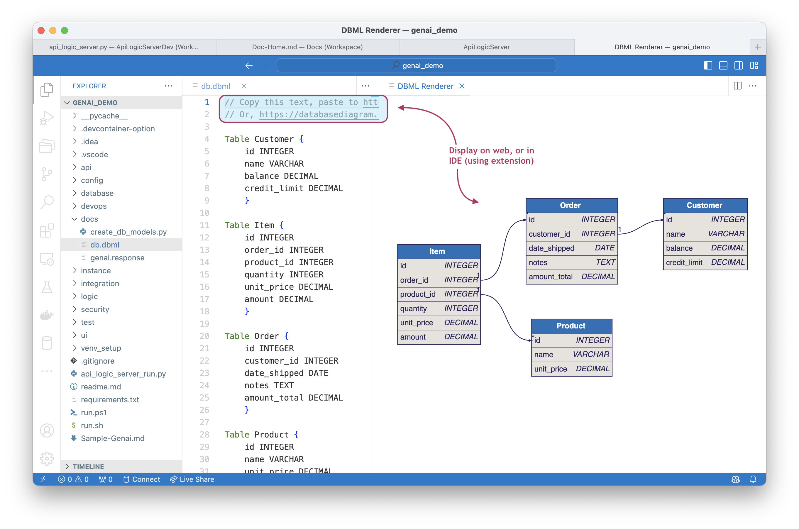

!!! pied-piper ":bulb: TL;DR - Database Diagram Creation"

    Created projects include a `docs` folder with a `db.dbml` file.  This can be rendered
    
    * on the Web, or 
    * in your IDE

        * Requires IDE extension.  For example, in VSCode,  *DBML Live Preview.* 

&nbsp;

