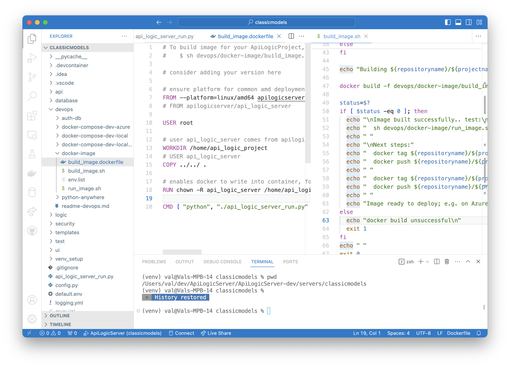

!!! pied-piper ":bulb: TL;DR - Project Creation: DevOp script creation"

    Shell scripts are created to:

    * containerize your project

    * test the image

    * deploy it to Azure

    Note the scripts require modification for your GitHub and Docker accounts.

&nbsp;

This is built when you create your project.

* The various names are drawn from your project name, and altered to meet docker standards (lower case, no underbars, etc).

* Note the construction includes usage of `env` files and environment variables; for more information, [see Container Configuration](DevOps-Container-Configuration.md#configuring-the-server){:target="_blank" rel="noopener"}.

You can create and run the image as shown above.  

You can also run the docker compose, which contains services for both your application, and the database.  

The pages below illustrate how you can explore database configuration:

* You can use [cloud-based ***managed databases*** (e.g., Azure)](DevOps-Containers-Deploy.md){:target="_blank" rel="noopener"}.

* Or use [dev-oriented ***database images***](DevOps-Containers-Deploy-Multi.md){:target="_blank" rel="noopener"}. You can explore these using our pre-built sample database containers; see [Container Database](DevOps-Containers-Deploy-Multi.md){:target="_blank" rel="noopener"}.

* These examples just get you started; cloud suppliers provide a wealth of options and documentation.

