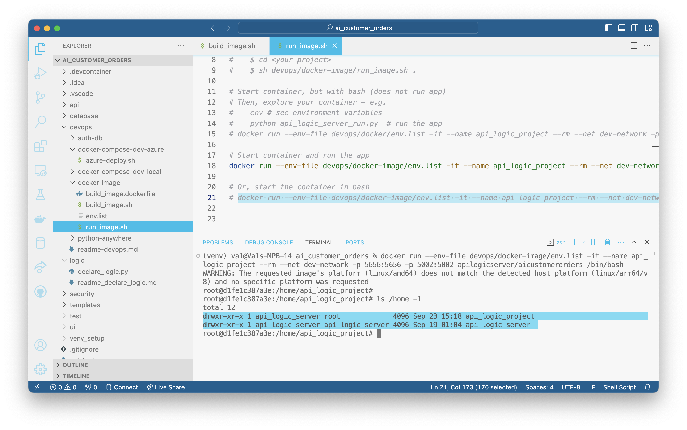
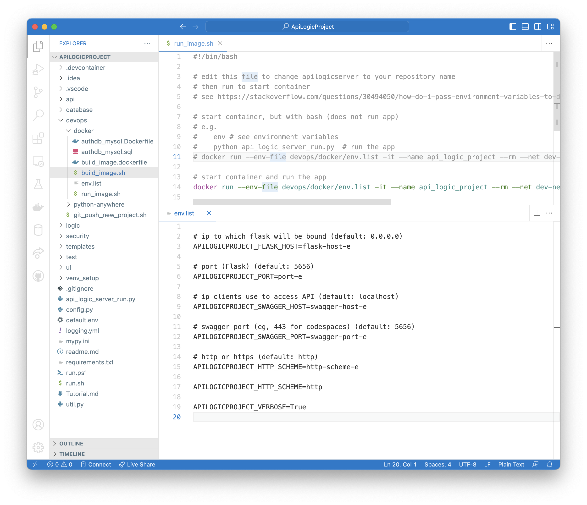

!!! pied-piper ":bulb: TL;DR - Configure Containers with env variables"

    Containers are most commonly configured by environment variables, either in docker files, docker compose files, env files, or command line arguments.  The most common configuration parameters govern database / port locations - [click here](#overrides-env-variables).

&nbsp;

## Starting the Server

### Via the Container

Once the container [is created](DevOps-Containers-Build.md){:target="_blank" rel="noopener"}, you can start it [click here](https://github.com/ApiLogicServer/demo/blob/main/devops/docker-image/run_image.sh){:target="_blank" rel="noopener"}, which contains:

```bash
docker run --env-file devops/docker-image/env.list -it --name api_logic_project --rm --net dev-network -p 5656:5656 -p 5002:5002 apilogicserver/<your project>
```

Note that:

1. Execution begins automatically (the dockerfile runs `python api_logic_server_run.py`)

2. Configuration is via `env.list`; configure as required


&nbsp;

### Via the IDE

As described in the Quick Start, Run Configurations are provided to start the server in your IDE.

&nbsp;

### Command Line - Python

Recall that you execute your API Logic Project by __starting the server__, like this:

```
ApiLogicServer (venv)> cd my_new_project
my_new_project(venv)> python api_logic_server_run.py
```
Note this presumes you have activated your `venv`.  The system also provides shell scripts you can use:
```
sh run.sh  # windows - use run.ps1
```


Then, __to run the Admin App and Swagger:__

Run your browser at

```html
http://localhost:5656/
```

&nbsp;

### Command Line - Scripts

Alternatively, you can start the server using the run script, e.g.:

<figure></figure>

### Stopping the server

You can stop the server by cancelling it, or via an API:

```
http://localhost:5656/stop?msg=API stop - Stop API Logic Server
```

This can be useful in testing if you don't have access to the server console.  The `msg` parameter is optional.

&nbsp;

## Configuring the server

Configuration parameters enable you to specify hosts and ports, database locations, debug settings, etc,, as described below.

&nbsp;

### Database Locations

SQLAlchemy database URIs are set in your `conf/config.py`` file, from your creation CLI arguments.  They apply to target database(s), and the authentication database.  For example:

```python
    SQLALCHEMY_DATABASE_URI : typing.Optional[str] = f"mysql+pymysql://root:p@localhost:3306/classicmodels"
```

Special handling is provided for sqlite databases, [as described here](Database-Connectivity.md#sqlite){:target="_blank" rel="noopener"}.

&nbsp;

### Docker Directories

Projects are created with a [`devops/docker-image/build-image/dockerfile`](https://github.com/ApiLogicServer/ApiLogicServer-src/blob/main/api_logic_server_cli/prototypes/base/devops/docker-image/build_image.dockerfile){:target="_blank" rel="noopener"}, resulting in the following directory structure:  



&nbsp;

### Hosts and Ports

ApiLogicServer attempts to avoid port conflicts.  These can arise from:

* Common use of 8080

* Mac use of 5000

To avoid conflicts, ports are defaulted as follows:

| For |  Port |
|:--------------|:--------------|
| ApiLogicServer | `5656` |
| Basic Web App | `5002` |


Hosts are defaulted as follows:

| Installed as |  Basic Web App Host |
|:--------------|:--------------|
| Docker | `0.0.0.0` |
| Local Install | `localhost` |

These defaults are also stored in the `conf/config.py` file.

&nbsp;

### Defaults: Create Time

You can specify default values for hosts, ports and databases when you create the application.  Specify ApiLogicServer CLI arguments, like this:

```bash
ApiLogicServer create --project_name=~/dev/servers/api_logic_server \
                      --host=myhost --port=myport --swagger_host=mycloud \
                      --db_url=mysql+pymysql://root:p@localhost:3306/classicmodels
```

&nbsp;

### Overrides: Config.py

As noted above, the defaults are stored in the `conf/config.py` file.  You can override these values as required.

&nbsp;

### Overrides: Logic Project CLI

When you run created applications, you can provide API Logic ***Project*** arguments to override the defaults.  Discover the arguments using `--help`:

```bash
(venv) val@Vals-MBP-16 ApiLogicProject % python api_logic_server_run.py -h

API Logic Project Starting: /Users/val/dev/servers/ApiLogicProject/api_logic_server_run.py
usage: api_logic_server_run.py [-h] [--port PORT] [--flask_host FLASK_HOST] [--swagger_host SWAGGER_HOST]
                               [--swagger_port SWAGGER_PORT] [--http_type HTTP_TYPE] [--verbose VERBOSE]
                               [--create_and_run CREATE_AND_RUN]
                               [flask_host_p] [port_p] [swagger_host_p]

positional arguments:
  flask_host_p
  port_p
  swagger_host_p

options:
  -h, --help                       show this help message and exit
  --port PORT                      port (Flask) (default: 5656)
  --flask_host FLASK_HOST          ip to which flask will be bound (default: localhost)
  --swagger_host SWAGGER_HOST      ip clients use to access API (default: localhost)
  --swagger_port SWAGGER_PORT      swagger port (eg, 443 for codespaces) (default: 5656)
  --http_type HTTP_TYPE            http or https (default: http)
  --verbose VERBOSE                for more logging (default: False)
  --create_and_run CREATE_AND_RUN  system use - log how to open project (default: False)
(venv) val@Vals-MBP-16 ApiLogicProject % 

```
These are used for [Codespaces support](https://valhuber.github.io/ApiLogicServer/Tech-CodeSpaces/){:target="_blank" rel="noopener"}

&nbsp;

__Notes:__

* `host` is the flask-host, which maps to the IP address of the interface to which flask will be bound (on the machine itself
* `swagger_host` maps to the ip address as seen by the clients

For example, 127.0.0.1 (localhost) or 0.0.0.0 (any interface) only have meaning on your own computer.

Also, it's possible to map hostname->IP DNS entries manually in /etc/hosts, but users on other computers are not aware of that mapping.

### Overrides - env variables

A common approach for host, port and database configuration is to use env variables.  These can be set in your OS, or container options such as env files or docker compose.  

The names of the variables are those noted used in the `conf/config.py` file, **preceded by** `APILOGICPROJECT_`[^1].  These values override both the `conf/config.py` values and the Api Logic Project CLI arguments.

Here are the most commonly set environment variables:

```yaml
services:

    api-logic-server:
        image: apilogicserver/classicmodels
        environment:
          - APILOGICPROJECT_VERBOSE=true
          - SECURITY_ENABLED=true
          - APILOGICPROJECT_CLIENT_URI=//classicmodels.azurewebsites.net
          - PYTHONPATH=/app/ApiLogicProject 
          ## specify Database uri's:
          - APILOGICPROJECT_SQLALCHEMY_DATABASE_URI=mysql+pymysql://root:p@mysql-service:3306/classicmodels
          - APILOGICPROJECT_SQLALCHEMY_DATABASE_URI_AUTHENTICATION=mysql+pymysql://root:p@mysql-service:3306/authdb
```

For example, to override the database location on mac:

```bash
export APILOGICPROJECT_SQLALCHEMY_DATABASE_URI=mysql+pymysql://root:p@localhost:3306/
```

To see a list of typical env variables, [click here](https://github.com/ApiLogicServer/demo/blob/main/devops/docker-image/env.list){:target="_blank" rel="noopener"}.


The example below illustrates you can store such variables in a `devops/docker-image/env.list` file (be sure to edit these - they are to confirm settings during initial testing):



### Debugging

You can see the env variables in the sample `env_list` file - [click here](https://github.com/ApiLogicServer/demo/blob/main/devops/docker-image/env.list){:target="_blank" rel="noopener"}.

Use the `APILOGICPROJECT_VERBOSE` to log the values to the console log.

&nbsp;

## Production Deployment

As noted in the [gunicorn documentation](https://flask.palletsprojects.com/en/2.0.x/deploying/){:target="_blank" rel="noopener"}:

  > While lightweight and easy to use, Flask’s built-in server is not suitable for production as it doesn’t scale well. 

&nbsp;

#### gunicorn

You can run API Logic Server servers under [gunicorn](https://flask.palletsprojects.com/en/2.2.x/deploying/gunicorn/){:target="_blank" rel="noopener"}.  To use the default API Logic Server ports:

```
gunicorn api_logic_server_run:flask_app -w 4 -b localhost:5656
```

Or, to use the default gunicorn ports:

```
gunicorn api_logic_server_run:flask_app -w 4
```

You will also need to:

1. Update the default server/port settings in `api_logic_server_run.py`
2. Start your browser at [http://127.0.0.1:8000](http://127.0.0.1:8000)

&nbsp;

#### PythonAnywhere
Please see the [Install Instructions](Install.md){:target="_blank" rel="noopener"} for information on PythonAnywhere.

&nbsp;

#### Docker

You can use Docker compose files or env files to configure your project.  There is an example in the default project - [click here to see run-image.sh](https://github.com/ApiLogicServer/demo/tree/main/devops/docker-image){:target="_blank" rel="noopener"}.

[^1]:
    Several changes were made as of release 9.01.17.  It is available as preview; [click here](index.md#getting-started){:target="_blank" rel="noopener"}

