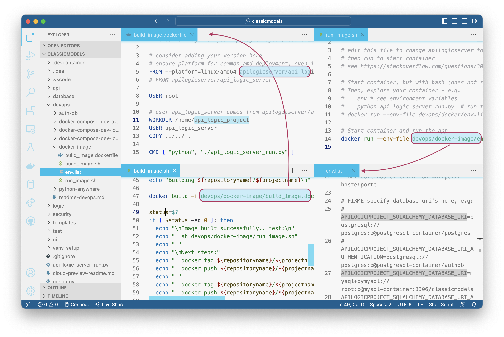

[Containers](../DevOps-Containers){:target="_blank" rel="noopener"} are a best practice for deployment, *and* offer several advantables for development.  This outlines a typical scenario for building images for API Logic Server projects.


The diagram above identifies 3 important images you can build, described below.

&nbsp;

## MyApp: containerize project

This is the image you will deploy for production.  It includes Python, API Logic Server, any additional packages your require, and your app (Python and logic).  These are defined by a `dockerfile`. 

API Logic Projects include a `dockerfile` for [containerizing your application](https://github.com/ApiLogicServer/tutorial/blob/main/3.%20ApiLogicProject_Logic/devops/docker/build-container.dockerfile){:target="_blank" rel="noopener"}.

A key aspect of images is that you can *extend* an existing image: add new software to build another image.  See the line:

```
FROM apilogicserver/api_logic_server
```

This builds your projects' image, starting with API Logic Server image.



To build a container for your ApiLogicProject:

1. On Docker Hub, create a docker repository under your docker account. 
2. Create / customize your project as your normally would
3. Edit `ApiLogicProject.dockerfile`: change `your_account/your_repository` as appropriate
    * Here is [an example](https://github.com/ApiLogicServer/tutorial/blob/main/3.%20ApiLogicProject_Logic/devops/docker/build-container.dockerfile){:target="_blank" rel="noopener"}
4. In terminal (not in VSCode docker - docker CLI is not installed there), cd to your project
5. Build a container for your project with terminal commands:

```bash
docker build -f ApiLogicProject.dockerfile -t your_account/your_repository --rm .
docker tag your_account/your_repository your_account/your_repository:1.00.00
docker login; docker push your_account/your_repository:1.00.00
```

To run your project container directly...

```bash
docker run -it --name your_project --rm --net dev-network -p 5656:5656 -p 5002:5002 -v ${PWD}:/localhost your_account/your_repository

# start the image, but open terminal (e.g., for exploring docker container)
docker run -it --name your_project --rm --net dev-network -p 5656:5656 -p 5002:5002 -v ${PWD}:/localhost your_account/your_repository bash
```

&nbsp;

## MyPkgs: Containerize Packages

Your project may require additional packages not already included with API Logic Server.  You have 2 choices how to include these:

* Standard `pip` - per Python standards, your project includes a `requirements.txt` file; update it with your dependencies.

* If your team is using Dev Containers for development, it is a best practice to establish dependencies in a new image `MyPkgs`, then build your `MyApp` container from that.

&nbsp;

## MyDB: Test Databases

One of the great things about Docker is the ability to install popular databases, with no hassle.  Follow the procedures described in [Connection Examples](../Database-Connectivity/#docker-databases){:target="_blank" rel="noopener"}.

If you wish, you can add your own database / test data to the pre-supplied [repositories](https://hub.docker.com/repositories/apilogicserver){:target="_blank" rel="noopener"}, and then build an image from the updated result.

In most cases, images are code, not data.  The DBMS images, however, include their own data.  This enables fellow developers to `run` the image and get started, without having to understand and setup volumes for DBMS data.
