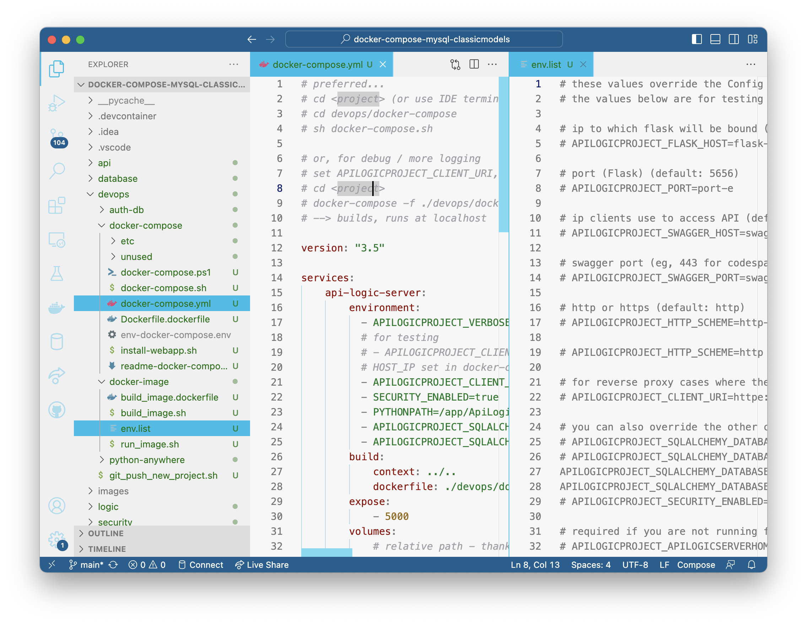

!!! pied-piper ":bulb: TL;DR - Dev Deploy: Multi-Container Systems"

    This page shows the simplest way to deploy a **dev system** to the cloud, to enable collaboration with Business User and fellow developers: 

    * create a resource group

    * create a database container (database server and data - for simplified management)

    * deploy an API Logic Project image from DockerHub


[Containers](../DevOps-Containers){:target="_blank" rel="noopener"} are a best practice for deployment, *and* offer several advantages for development.  This outlines a typical scenario for deploying API Logic Server projects to Azure.

This tutorial presumes you've already `push`ed an image, here called `apilogicserver/docker_api_logic_project:latest`.


# Rapid Cloud Preview

This project illustrates using API Logic Server with Docker and docker-compose.  The objective is to provide a simple way to explore using docker with API Logic Server on your local machine.  These are *not* production procedures - they are designed for simple local machine operation.

This doc explains:

* **I. Create the Project, and Verify Local Operation** - run the project

* **II. Add Security**

* **III. Running the project as an *image*** - create and run an image

* **IV. Running the project as a *docker-compose*** - build, deploy and run

* **V. Status, Open Issues (eg, not working on windows)** 

This presumes you have Python, and docker.

&nbsp;

&nbsp;


# I. Create the Project

Follow the steps below:

&nbsp;

## 1. Start the database container

```bash
docker run --name mysql-container --net dev-network -p 3306:3306 -d -e MYSQL_ROOT_PASSWORD=p apilogicserver/mysql8.0:latest
```

Verify it looks like this:


&nbsp;

## 2. Create the Project:

Create the project with API Logic Server:

```bash
ApiLogicServer create --project_name=. --db_url=mysql+pymysql://root:p@localhost:3306/classicmodels
```

&nbsp;

## 3. Verify proper operation

The project should be ready to run without customization:

1. Open the project in VSCode



2. Establish your (possibly preview) virtual environment

3. Press F5 to run the server

4. Run the [Admin App](http://localhost:5656), and Swagger.  Verify that `customers` returns data.

&nbsp;

&nbsp;


# II. Add Security

Using the terminal window inside VSCode:

**Stop the server.**

Open a ***new* terminal window** in VSCode:

> The *current* terminal window has an old copy of the project root.  If you try to run, you will see *No such file or directory".  Just open another terminal window and repeat the command.

```bash
ApiLogicServer add-auth --project_name=. --db_url=mysql+pymysql://root:p@localhost:3306/authdb
```

The system introspects your `--db_url` database, creates models for it, and configures your project to enable security.

The command above uses the pre-supplied [docker database](https://apilogicserver.github.io/Docs/Database-Connectivity/#docker-databases), here MySQL.

Security databases must include certain tables and columns.  Your authdb can optionally provide a superset of these.  Such extensions are useful in declaring role-based authorization.

To help you get started, the `auth-db` folder provides starter kits for creating these databases.  Alter these files for your project, prepare database containers for your team, and use them in the `add-auth` command above.

Re-run the project (F5), observe you need to login (***admin, p***).

&nbsp;

&nbsp;

# III. Running the project as image

These scripts simplify creating and running docker containers for your project.  Their use is illustrated in the links above.

Important Notes:

1. The docker compose steps use the created image, so you must perform this step first

2. The image must contain the security models created in the step above

&nbsp;

## 1. Stop the Server 

Stop the API Logic Project, using your IDE.

&nbsp;

## 2. Build the Image

> For preview versions, verify `devops/docker-image/build_image.dockerfile` is using `apilogicserver/api_logic_server_x` (note the *_x*).

&nbsp;

```bash
sh devops/docker-image/build_image.sh .
```

&nbsp;

## 3. Observe database config

When run from a container, the database uri using `localhost` (from above) does not work.  Confirm the following in `devops/docker-image/env.list`:

```
APILOGICPROJECT_SQLALCHEMY_DATABASE_URI=mysql+pymysql://root:p@mysql-container:3306/classicmodels
APILOGICPROJECT_SQLALCHEMY_DATABASE_URI_AUTHENTICATION=mysql+pymysql://root:p@mysql-container:3306/authdb
```

&nbsp;

## 4. Start the Server

Use the pre-created command line script:

```bash
sh devops/docker-image/run_image.sh
```

&nbsp;

## 5. Run the App

Run the [Admin App](http://localhost:5656), and Swagger.

You can also run the [Authentication Administration App](http://localhost:5656/admin/authentication_admin/) to define users and roles (though not required).

&nbsp;

&nbsp;

# IV. Running as docker-compose

Use docker compose to choreograph multiple services (e.g, your application and a database) for a multi-tiered system.

&nbsp;

## 1. Stop the system

Press ctl-C to stop the API Logic Project container.

The procedure below will spin up *another* database container.  If the current database container is running, you will see port conflicts.

**Stop** the database container (e.g., using Docker Desktop).

&nbsp;

## 2. Observe database service

Open `devops/docker-compose-dev-local/ddocker-compose-dev-local.yml`, and observe the database service:

```yaml
    mysql-service:
        image: apilogicserver/mysql8.0:latest
        restart: always
        environment:
            # MYSQL_DATABASE: 'db'
            # So you don't have to use root, but you can if you like
            - MYSQL_USER=root
            # You can use whatever password you like
            - MYSQL_PASSWORD=p
            # Password for root access
            - MYSQL_ROOT_PASSWORD=p
        ports:
            # <Port exposed> : <MySQL Port running inside container>
            - '3306:3306'
        expose:
            # Opens port 3306 on the container
            - '3306'
```

&nbsp;

## 3. Observe the app service

In `devops/docker-compose-dev-local/ddocker-compose-dev-local.yml`,  observe the database service uses the your application image, and has configured the database URIs to your database service, above:

```yaml
    api-logic-server:
        image: apilogicserver/classicmodels
        environment:
          - APILOGICPROJECT_VERBOSE=true
          # for testing
          # - APILOGICPROJECT_CLIENT_URI=//10.0.0.77
          # HOST_IP set in docker-compose.sh/ps1
          # - APILOGICPROJECT_CLIENT_URI=//${HOST_IP}
          - SECURITY_ENABLED=true
          ## - APILOGICPROJECT_HTTP_SCHEME=https
          ## - PYTHONPATH=/app/ApiLogicProject 
          ## database uri's:
          - APILOGICPROJECT_SQLALCHEMY_DATABASE_URI=mysql+pymysql://root:p@mysql-service:3306/classicmodels
          - APILOGICPROJECT_SQLALCHEMY_DATABASE_URI_AUTHENTICATION=mysql+pymysql://root:p@mysql-service:3306/authdb
        expose:
          - 5656
        ports:
          - 5656:5656
```

&nbsp;

## 4. Observe Security

The database contains `authdb`.  To activate security, observe `devops/docker-compose/docker-compose.yml`:

1. Set `- SECURITY_ENABLED=true`

2. Under api-logic-server-environment, observe:

`          - APILOGICPROJECT_SQLALCHEMY_DATABASE_URI_AUTHENTICATION=mysql+pymysql://root:p@mysql-service:3306/authdb
`

&nbsp;

## 5. Build, Deploy and Run

The following will build, deploy and start the container stack locally:

```
# sh devops/docker-compose/docker-compose.sh
```

Then, in your browser, open [`localhost:5656`](http://localhost:5656).

&nbsp;

# V. Deploy to cloud

This procedure is modeled after [this article](https://learn.microsoft.com/en-us/azure/app-service/tutorial-multi-container-app); it uses [this project](https://github.com/Azure-Samples/multicontainerwordpress).

&nbsp;

## 1. Acquire Project Files

The following setup steps are required.  You will modify these for your own project.  You can use the apilogicserver project/image for this exercise.

&nbsp;

**a) Push Project to github**

We've already pushed the `classicmodels` project.

&nbsp;

**b) Push Image to DockerHub**

We've already pushed the `classicmodels` image, like this:

```bash
docker tag apilogicserver/classicmodels apilogicserver/classicmodels:latest"
docker push apilogicserver/classicmodels:latest"
```

&nbsp;

**c) Acquire file in Azure**

To obtain the project files (docker compose, etc), use the portal:


1. Login to the portal

2. In the Portal CLI:

```bash
mkdir classicmodels
cd classicmodels

git clone https://github.com/ApiLogicServer/classicmodels.git

cd classicmodels
```

&nbsp;

## 2. Create container group

```bash
az group create --name myResourceGroup --location "westus"
```

&nbsp;

## 3. Create service plan

```bash
az appservice plan create --name myAppServicePlan --resource-group myResourceGroup --sku S1 --is-linux
```

&nbsp;

## 4. Create docker compose app

Your create the multi-container system as shown below.  

Note the argument `--name classicmodels`.  Your `docker-compose-dev-azure.yml` has been pre-configured to use your **lower cased** project name:

```yaml
          - APILOGICPROJECT_CLIENT_URI=//classicmodels.azurewebsites.net
```

This name must match `--name classicmodels` in the following command:

```bash
az webapp create --resource-group myResourceGroup --plan myAppServicePlan --name classicmodels --multicontainer-config-type compose --multicontainer-config-file devops/docker-compose-dev-azure/docker-compose-dev-azure.yml
```

If you need to update the container:

1. Update youur project locally
2. Push to git
3. In the Azure portal,
   * `git pull`
   * Repeat the `az webapp create`, above
   
If you need to recreate the container, you can use the portal, or this command:

```bash
az container delete --resource-group myResourceGroup --name mycontainer
```

&nbsp;

## 5. Enable logging

Use [this procedure](https://learn.microsoft.com/en-us/azure/app-service/troubleshoot-diagnostic-logs#enable-application-logging-linuxcontainer); TL;DR:

> To enable web server logging for Windows apps in the Azure portal, navigate to your app and select App Service logs.  For Web server logging, select Storage to store logs on blob storage, or File System to store logs on the App Service file system.

```bash
az container logs --resource-group myResourceGroup --name mycontainer
```

For specific error conditions, see [Troubleshooting Azure](../Troubleshooting/#azure-cloud-deployment){:target="_blank" rel="noopener"}.

&nbsp;

## 6. Browse to the app 

To run the app, [https://classicmodels.azurewebsites.](https://classicmodels.azurewebsites).
