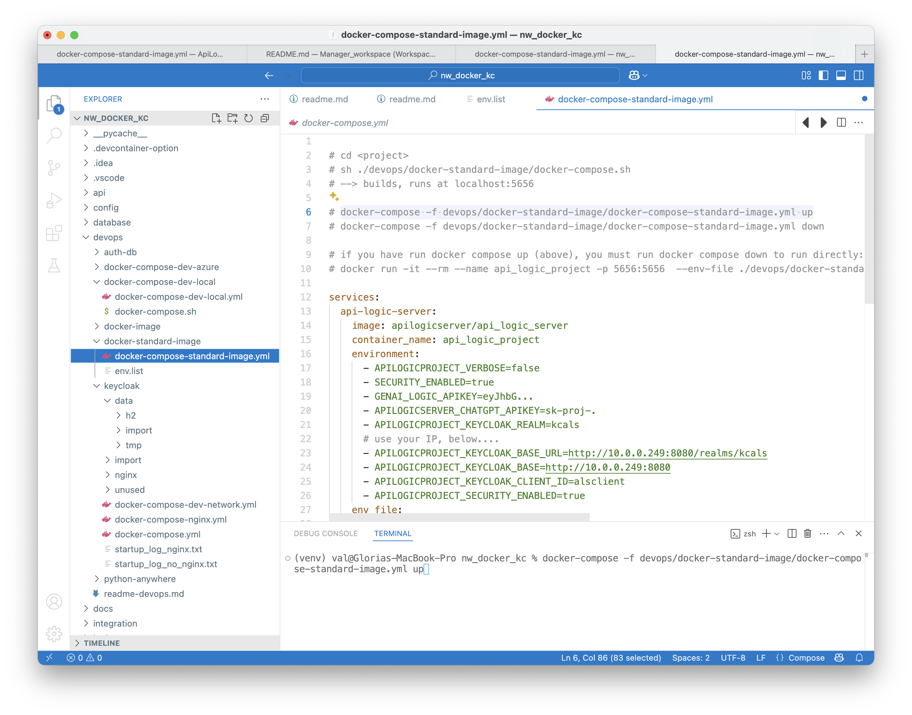

!!! pied-piper ":bulb: TL;DR - Using the standard container"

    You can run your project using the standard container, or build your own container as described on the next page.

    [Containers](DevOps-Containers.md){:target="_blank" rel="noopener"} are a best practice for deployment, *and* offer several advantages for development.  This outlines a typical scenario for building images for API Logic Server projects.

    `devops/docker-image/build-image.dockerfile` is pre-built into your project.  Alter it for your organization and project name.  It contains instructions for using it via the command line to `build` and `push` your image.

The diagram above illustrates you can run your project using the pre-created docker image.

> You may wish to connect your system to others containers, such as databases or keycloak.  Networking requires you configure the hosts' IP address as shown above.