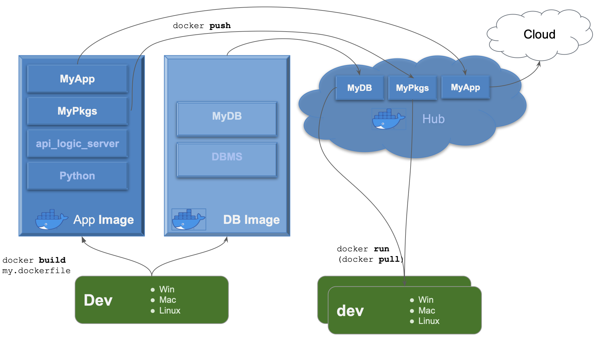

!!! pied-piper ":bulb: TL;DR - Projects are pre-configured for containers: for both deployment and development"

    Containers are a critical component of DevOps, so API Logic Projects provide pre-configured support:

    * they contain the `.devcontainer` directory to enable **Dev Container** use

    * they contain `devops/docker/build-container.dockerfile` for building your container for **deployment**

Containers are a best practice for deployment.  They *also* offer several advantages for development.  This page outlines a typical scenario for API Logic Server projects.

&nbsp;

## Container Overview

### Process

As shown above, you can

1. Use the Docker CLI (Command Language Interface) to `build` images.  An image might be an API Logic Server, or a DBMS.  In either case, it is:

     * *self-contained* - includes all its dependencies (you identify these in the `dockerfile` which is input to the `build` command), and 

     * *isolated* - containers are protected from incoming and outgoing access except through well-defined network and file access

2. These images can be `pushed` to Docker Hub as `repositories`, where they can be shared with other developers, and for production deployment.

3. Developers can `run` an image, whether on Windows, Macs or Linux systems - a running image is called a `container`.

&nbsp;

### Advantages

Containers provide significant well-known advantages for development and deployment:

* simplified __development__ by eliminating an otherwise complex install (Python, packages, etc)

* popular runtime __deployment__ platform, based on a standard Linux base

* __isolation__ - in both cases, Docker applications encapsulate their environment, eliminating external dependencies.  Likewise, Docker applications will not affect other applications running on the same hardware.

    * Avoid the *install A breaks B* problem

* __performance__ - containers are very light-weight (e.g., do not contain overhead for Operation System), so start quickly and minimize resource consumption.  For example, my laptop has 3 DBMSs; they start in a second, and consume little overhead.

* __sharing__ - containers are easy to share between developers (e.g., a test DBMS) via Docker Hub

* __portable__ - containers can run on Windows, Macs and Unix systems.

ApiLogicServer therefore provides support for building images, and for dev containers.

&nbsp;

### Terminology Recap

Some quick terms:

* Your docker account can contain multiple docker repositories
    * It would be typical to use your project name as the docker repository name
    * Note: repository names must be lower case
    * Repository names are scoped by your account - see the diagram above.  You then refer to your docker repository in the CLI commands as `your_account/your_repository`
* A docker repository can can be downloaded (pulled) to create a docker image on your local computer
* A docker image can be run as a docker container
* Your system might be comprised of multiple docker containers, e.g. one for your API Logic Project, one for your DBMS, etc.

For more information on containers, [see here](https://docker-curriculum.com){:target="_blank" rel="noopener"}.

&nbsp;

## Dev: Local, Container, Cloud

Containers are generally regarded as a deployment technology.  In addition, they offer several advantages for development.

API Logic Server supports a variety of development models.  You can [install](../Install-Express){:target="_blank" rel="noopener"} API Logic Server either:

* As a **Local** `pip` install,
* Or, use **Dev Containers,** by running the pre-supplied API Logic Server image
    * This avoids the sometimes tricky Python install.
    * This image contains Python and all the packages used by API Logic Server.
    * You can use it with VSCode `.devcontainer` support as described in the [install guide](../Install-Express){:target="_blank" rel="noopener"}.   This provides full IDE support: code editing, debugging, source control, etc.
    * For more information, see [Dev Containers](../DevOps-Docker){:target="_blank" rel="noopener"}.
* Or, run in the cloud using **Codespaces** - no install at all

In any case, you'll be using a source control system such as `git`, so it's possible to mix and match these configurations among developers.

&nbsp;

### Dev Containers: Optional

!!! pied-piper ":bulb: Best Practice for deployment, worth considering but *optional* for dev"

    It's worth emphasizing that your decision to use *Dev Containers* has no effect on using containers *for deployment*.  Dev Containers for *deployment* are a best practice.  *Dev Containers* provide interesting value, and should be considered, but you can create deployment containers no matter what decision you take.

    As you evalute Dev Containers, be aware API Logic Projects will run either way.  Or both: you can switch back and forth as you determine which approach is best for your team.

&nbsp;

## API Logic Server Containers

API Logic Server pre-supplies several [repositories](https://hub.docker.com/repositories/apilogicserver){:target="_blank" rel="noopener"} (images available on Docker Hub):

1. [Several DBMSs](../Database-Connectivity){:target="_blank" rel="noopener"}, so you can explore connectivity and as a quick-start for development

2. API Logic Server itself (here is the [dockerfile](https://github.com/valhuber/ApiLogicServer/blob/main/docker/api_logic_server.Dockerfile){:target="_blank" rel="noopener"}), shown below: 

You can use it in 2 ways:

   * for dev - as described in [Dev Containers](../DevOps-Docker){:target="_blank" rel="noopener"}

   * to build images - to share with developers, or deploy to cloud providers (e.g., Microsoft Azure, Amazon AWS, etc)

For more information, see [Architecture](../Architecture-What_Is).
