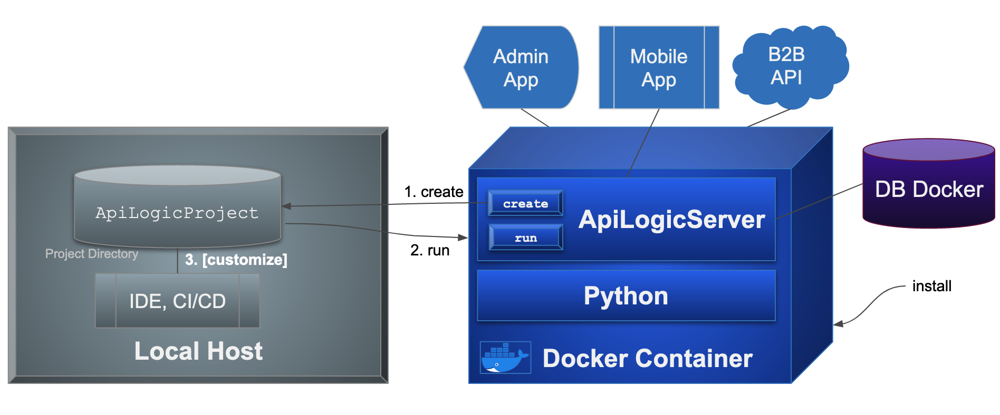
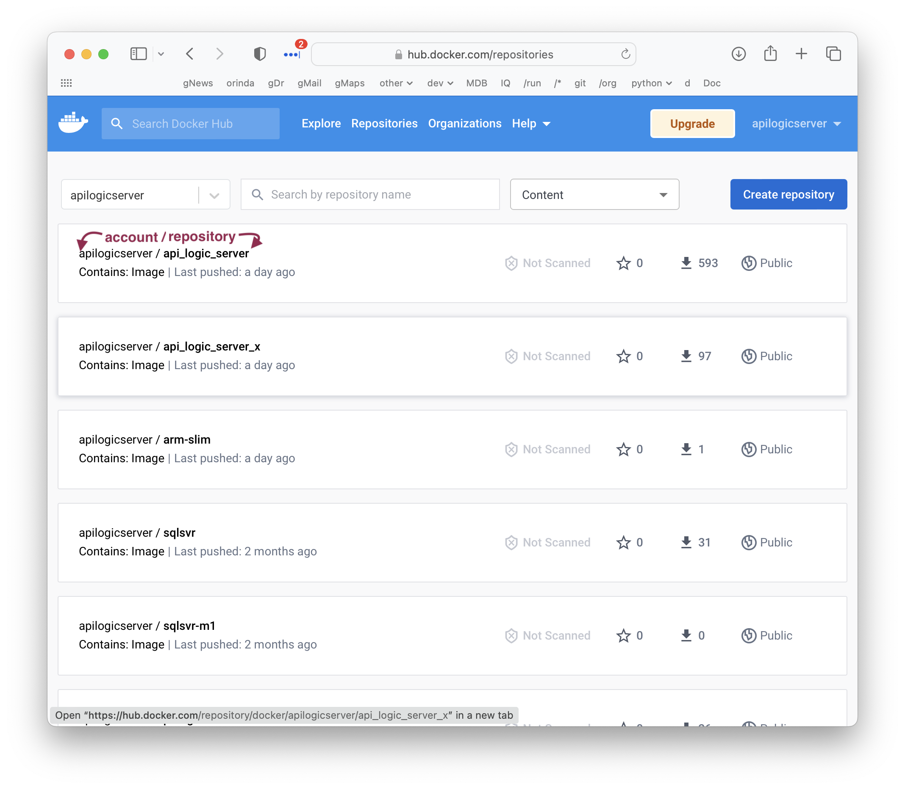
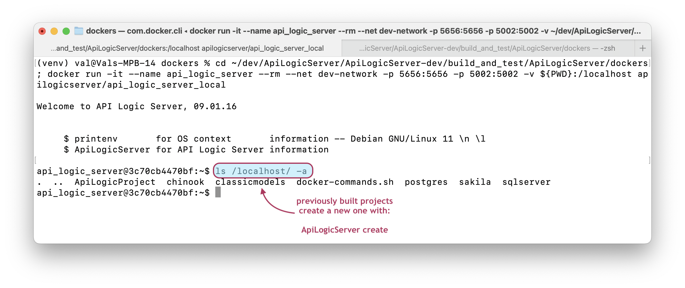

As described in [Containers](DevOps-Containers.md){:target="_blank" rel="noopener"}, you can ***develop* in a container**, including using VSCode.  This is optional, and *not* required to containerize your project for deployment.

!!! pied-piper ":bulb: TL;DR - `.devcontainer` configurations are pre-built for API Logic Projects"

    The `.devcontainer` is pre-built into your project, so it is ready to use with VSCode for code editing, debugging, etc.

    Recall that [devcontainers are valuable, but ***optional***](DevOps-Containers.md#dev-containers-optional){:target="_blank" rel="noopener"}.


## Creating projects

Recall from the [Install doc](Install.md) that you create projects like this:

### 1. Start Docker

```bash title="Start (might install) API Logic Server Docker"
> docker run -it --name api_logic_server --rm -p 5656:5656 -p 5002:5002 -v ${PWD}:/localhost apilogicserver/api_logic_server
$ # you are now active in the API Logic Server docker container to create projects
```

> Windows: use __Powershell__ (`PWD` is not supported in Command Line)

> To [update your container](DevOps-Containers-Run.md/#apilogicserver-container-upgrades){:target="_blank" rel="noopener"}: `docker pull apilogicserver/api_logic_server`

&nbsp;

### 2. Create a Project

Typical project creation identifies the database and target project name:
```bash title="Create Typical project"
$ cd /localhost/             # a directory on your local file system for project creation
$ ApiLogicServer create-and-run --project_name=/localhost/ApiLogicProject --db_url=
$ exit                       # return to local host 
```

&nbsp;

### 3. Customize project

Once the project is created, open it in VSCode:

1. Open Folder `ApiLogicServer/ApiLogicProject` in VSCode

       * Accept option to "Reopen in Container"

      > If you already skipped this option, no worries.  Use __View > Command Palette > Remote-Containers: Reopen in Container__

Then, use normal development procedures to edit code, debug it, and manage in under source control.

&nbsp;

## Project Files are Local

Recall that docker containers are self-contained.  So, we should ask: are the project files in the container, or on the local host?

Project files (and VSCode) are on the local host:

* That is why you provided `-v ${PWD}:/localhost`
    * This gives the container permission to access the current folder
* That is why you needed `$ exit  # return to local host`

As shown below, there are typically 2-3 "machines" in operation:

* Your **local host** (in grey), where the Customizable Project files (`ApiLogicProject`) are stored, 
and your Dev Tools (IDE etc) operate

* The ApiLogicServer Docker **container** (blue), which contains:
     * The **ApiLogicServer**, with CLI (Command Language Interface) commands:
         * **`create`** to create projects on your local host
         * **`run`** to execute projects, utilizing the various runtimes (Flask, SQLAlchemy, SAFRS API, Logic, Flask App Builder)
    * A **Python** environment to support execution, and development using your IDE

* The **database** (purple) can run as a separate Docker container, in your local host, or (for the demo) within the ApiLogicServer docker container



Your docker container (blue) files include Python, Python libraries, and API Logic Server.  The Python project above utilizes IDE `remote-container` support, which utilizes the docker container (not local host) version of Python.

Your docker container looks like this:





&nbsp;

## Install - `docker run` arguments

Once you've [installed Docker](Tech-Docker.md){:target="_blank" rel="noopener"} itself, the `docker run` command above installs the ApiLogicServer docker (if it's not already there), and starts it, opening a terminal window on the Docker container.  Notes:

* the `v ${PWD}:/localhost` argument is what enables the ApiLogicServer to create / access the project **on your local host**
   * Windows - Powershell must be used (due to the `$(PWD)` syntax)
   * if you use Command Prompt, specify the local directory completely 
   
The **arguments** mean:

* **-it** - launch a terminal window for the Docker container
* **--name api_logic_server** - the name of the image on your local host
* **-rm** - remove the container once it stops (your project files are not lost - they are on your local host)
* **-p 5656:5656** - maps local (host) part to Docker port 
* **-v ${PWD}:/localhost** - maps a local directory to a mount name for Docker.  This is where a directory will be created for your new project.  
   * `${PWD}` is your current folder.  
      * You could also provide a specific folder, e.g., `~/dev/servers` (Unix), or `C:\Users\val\dev\servers` (windows)
   * `/localhost`is the mounted volume reference from inside the Docker container
* **`apilogicserver/api_logic_server`** - the name of the image to pull from Docker Hub.  
   * This will fetch the image first time, and will run it locally on subsequent runs
   * The image is not automatically refreshed -- install ApiLogicServer updates as described below

You may also wish to add a parameter for networking:

* **--net my-network** - attaches to my-network


On your Docker container, you can **inspect** your environment:
```
python py.py
```

Open a new terminal window on your **local host**, and find your docker IP address:

```
docker inspect api_logic_server  # you will find the ip, e.g., 172.17.0.2
```

</details>


## Using the Manager

To use the Manager with Docker ("%" is a command from your local machine, "$" is a command in the docker container):

```bash title="Using the Manager with Docker"
% docker run -it --name api_logic_server_local --rm --net dev-network -p 5656:5656 -p 5002:5002 -v ${PWD}:/localhost apilogicserver/api_logic_server
$ als start
$ exit
% code . (and open container)
$ chmod a+rwx /workspaces/dockers
$ als create --project-name=/workspaces/dockers/nw+ --db-url=nw+
```