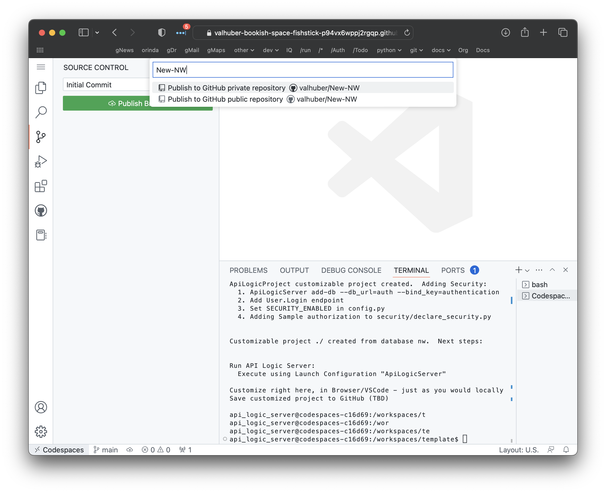
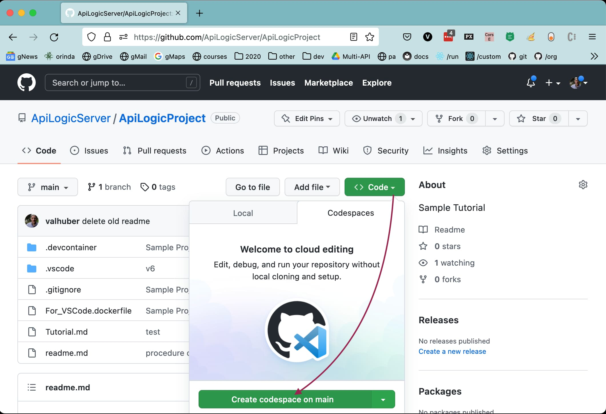
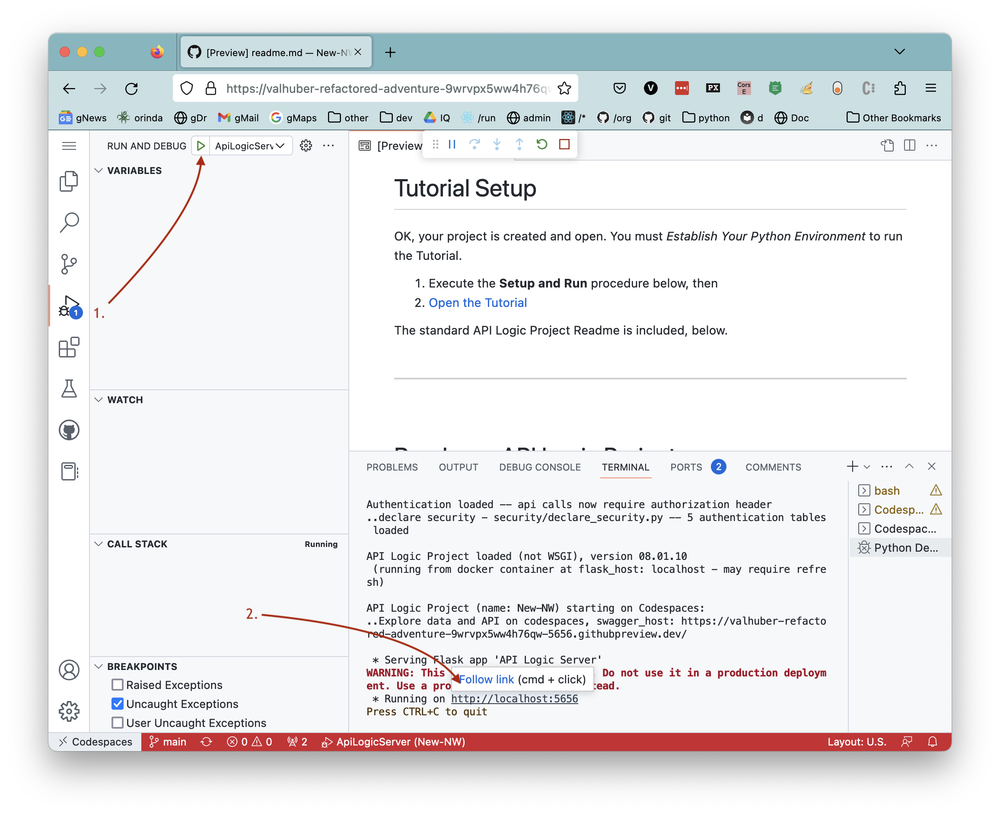

API Logic Projects are standard, and so are their GitHb / IDE operations.  A typical flow is illustrated below.

!!! pied-piper ":bulb: TL;DR - Standard file-based projects enable git; Codespaces ready"

    Projects are file-based (including logic), so work with standard `git` support.

    Projects are pre-configured for Dev Containers, so work with Codespaces.

## Local Project Creation

Create your project, customize as necessary, and use `git` or your IDE to publish the project to GitHub.  For example, in VSCode, there is a button to `Publish` your project.

## Codespaces Project Creation

This procedure requires your database be accessible from the cloud.

1. Open the [`template`]{https://github.com/ApiLogicServer/template)
2. Click the large green **Use this template > Open in a Codespace** button
    * The template defines your `.devcontainer`, including Python and API Logic Server
3. Create your project *in place*, e.g.:
    * `ApiLogicServer create --project_name=./ --db_url=nw`
4. Don't rebuild the Dev Container
5. Publish as a new project (providing your own name):

## Open existing GitHub project in Codespaces

However you have created your project, you (and your teammates) can open it in Codespaces:

> You will now see your project - running in VSCode, _in the Browser._  But that's just what you _see..._

> Behind the scenes, Codespaces has requisitioned a cloud machine, and loaded your project - with a _complete development environment_ - Python, your dependencies, git, etc.  

> You are attached to this machine in your Browser, running VSCode.

> :trophy: Pretty remarkable.

__1. Start the Server__

* Use the pre-defined Launch Configuration

__2. Start the Browser__

