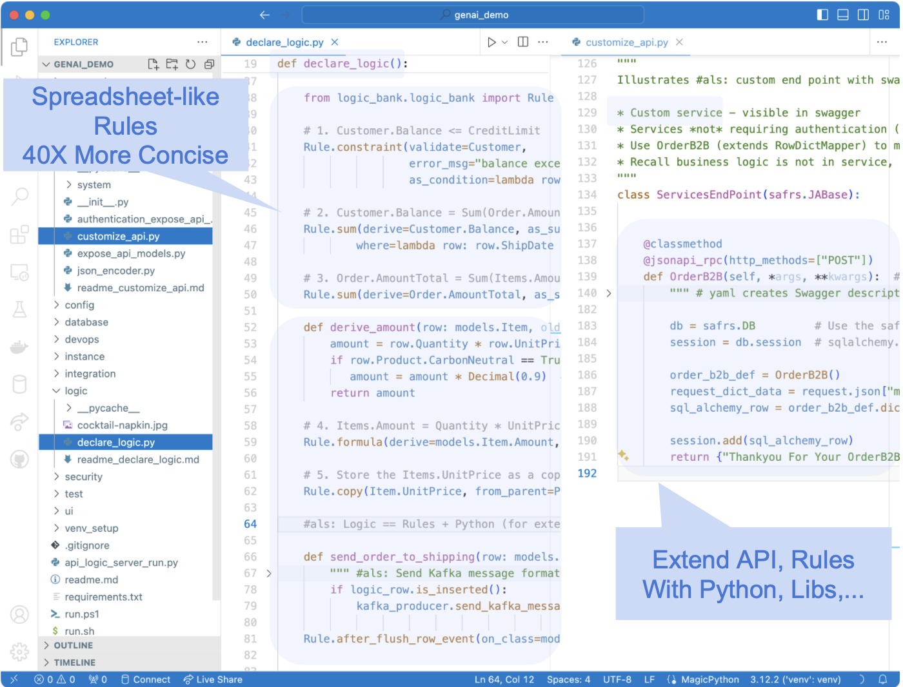
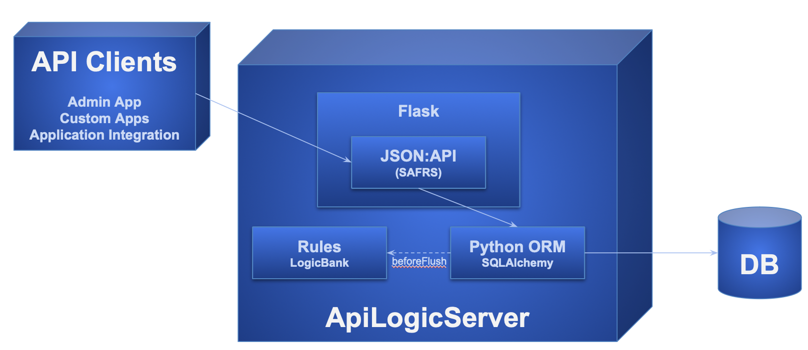

Welcome to API Logic Server documentation.  In sufficent large browsers, the pages are shown at left, and the page contents are at right.

# Start: Install, Samples, Training


## Install and Verify

If you have the correct Python (version 3.8-3.12), install is standard ([more detailed instructions here](Install-Express.md){:target="_blank" rel="noopener"}):

```bash title="Install API Logic Server in a Virtual Environment"
python3 -m venv venv                 # windows: python -m venv venv
source venv/bin/activate             # windows: venv\Scripts\activate
python -m pip install ApiLogicServer

ApiLogicServer start                 # optionally, start the project manager under VSCode
```

> Note: this requires you've activate VSCode `code` CLI (to get it: Open the Command Palette (Cmd+Shift+P) and type 'shell command')

<br>Verification test - create and run the demo:

```bash title="Verify - Create and Run Demo"
als create --project-name=sample_ai --db-url=sqlite:///sample_ai.sqlite
code sample_ai
```

Then explore the *demos, samples and tutorials*, below.  


<details markdown>

<summary>Demos, Tutorials, Samples</summary>

Type:

* Demo: Small Databases, Introduces Key Features
* Tutorial: Detailed Walk-throughs
* Samples: other databases (brief description)

> Recommendation: **start with the first 2 items**

| Project | Notes   |  Type  |
:-------|:-----------|:-------|
| [**AI Sample**](Sample-AI.md){:target="_blank" rel="noopener"} | 1. Use Copilot to create new databases from natural language<br>2. Illustrate a very rapid create / customize / iterate cycle<br>3. Introduce Integration | Demo |
| [**Tutorial**](Tutorial.md){:target="_blank" rel="noopener"}  | 1. How to Use the Key Features<br>2. Key code samples for adapting into your project | Tutorial |
| | | |
| [App Integration](Sample-Integration.md){:target="_blank" rel="noopener"} | Illustrates *running* Kafka messaging, self-serve and customized APIs, choreographed with rules and Python | Tutorial |
| [Deployment](Tutorial-Deployment.md){:target="_blank" rel="noopener"} | Containerize and deploy your applications | Tutorial |
| [Agile](Tech-Agile.md){:target="_blank" rel="noopener"} | Behavior Driven Design and testing, using Behave | Tutorial |
| [AI Drives Agile Vision](Tech-AI.md){:target="_blank" rel="noopener"} | Use Copilot to create new databases from natural language, to bootstrap an agile create / deploy and collaborate / iterate cycle | Demo |
| [Basic Demo](Sample-Basic-Demo.md){:target="_blank" rel="noopener"} | Focused use of API, Admin App and Rules on small customer/orders database | Demo |
| [Allocation](Logic-Allocation.md){:target="_blank" rel="noopener"} | *Power Rule* to allocate a payment to a set of outstanding orders | Sample |
| [MySQL Docker](Database-Connectivity.md){:target="_blank" rel="noopener"} | Create projects from sample databases: *chinook* (albums and artists), and *classicmodels* (customers and orders) | Sample |
| Sqlite databases | Create projects from pre-installed databases via [abbreviations](Data-Model-Examples.md){:target="_blank" rel="noopener"}:<br>- chinook, classicmodels, todo | Sample |
| [BudgetApp](Tech-Budget-App.md){:target="_blank" rel="noopener"} | illustrates automatic creation of parent rows for rollups | Sample |
| [Banking App](https://github.com/ApiLogicServer/banking){:target="_blank" rel="noopener"} | Illustrates more complex logic (Funds Transfer) | Sample - obtain via `git clone` |


Finally, try your own database.

</details>


<details markdown>

<summary> Training </summary>

After installing, you can optionally run the first demo, above.  The key training activities are:

1. Perform the [**Tutorial**](Tutorial.md){:target="_blank" rel="noopener"}
    * `ApiLogicServer create --project_name= --db_url=`
    * Keep this project installed; you can find code samples by searching `#als`
2. Perform [**Logic Training**](Logic.md){:target="_blank" rel="noopener"}
    * Spreadsheet-like rules and Python for integration, and multi-table derivations / constraints
3. **API Customization:** explore the code in `api/customize_api.py`
    * Note this is largely standard Flask, enhanced with logic

</details>

<details markdown>

<summary> Resources </summary>

You might find the following helpful in exploring the project:

* **Installed Sample Databases** -
Here are [some installed sample databases](Data-Model-Examples.md){:target="_blank" rel="noopener"} you can use with simplified abbreviations for `db_url`.

* **Dockerized Test Databases** - 
Then, you might like to try out some of our [dockerized test databases](https://valhuber.github.io/ApiLogicServer/Database-Connectivity.md){:target="_blank" rel="noopener"}.

* [auth](Security-Authentication-Provider.md#sqlite-auth-provider){:target="_blank" rel="noopener"} - sqlite authentication database (you can also use other DBMSs)

</details>

<details markdown>

<summary> Release Notes </summary>

04/16/2024 - 10.03.80: cli issues in create-and-run/run, Oracledb 2.1.12

04/05/2024 - 10.03.66: ApiLogicServer start, als create from-model (eg copilot) 

03/28/2024 - 10.03.46: Python 3.12, View support, CLI option-names, Keycloak preview

02/24/2024 - 10.03.04: Issue 45 (RowDictMapper joins), Issue 44 (defaulting), Issue 43 (rebuild no yaml), Tests

02/13/2024 - 10.02.04: kafka_producer.send_kafka_message, sample md fixes, docker ENV, pg authdb

02/07/2024 - 10.02.00: BugFix[38]: foreign-key/getter collision

01/31/2024 - 10.01.28: LogicBank fix, sample-ai, better rules example

01/15/2024 - 10.01.18: Cleanup, logic reminder, nw tutorial fixes

01/08/2024 - 10.01.07: Default Interpreter for VS Code, Allocation fix, F5 note fix, #als signposts

01/03/2024 - 10.01.00: Quoted col names, Default Interpreter for VS Code

12/21/2023 - 10.00.01: Fix < Python 3.11

12/19/2023 - 10.00.00: Kafka pub/sub, Data Type Fixes

12/06/2023 - 09.06.00: Oracle Thick Client, Safrs 3.1.1, Integration Sample, No rule sql logging, curl Post

11/19/2023 - 09.05.14: ApiLogicServer curl, optional project_name arg on add-auth, add-db, rebuild

11/12/2023 - 09.05.08: multi-db bug fix (24)

11/07/2023 - 09.05.07: Basic-demo: simplify customization process

11/05/2023 - 09.05.06: Basic-demo enhancements, bug fixes (22, 23)

10/31/2023 - 09.05.00: Enhanced Security (global filter, permissions), Logic (Insert Parent)

09/29/2023 - 09.04.00: Enhanced devops automation (sqlite, MySql, Postgres)

09/08/2023 - 09.03.04: AI Driven Automation (preview)

09/08/2023 - 09.03.00: Oracle support

09/08/2023 - 09.02.23: Fix Issue 16 - Incorrect admin.yml when table name <> class name

08/22/2023 - 09.02.18: Devops container/compose, Multi-arch dockers, add-auth with db_url, auth docker dbs

07/04/2023 - 09.01.00: SQLAlchemy 2 typed-relns/attrs, Docker: Python 3.11.4 & odbc18

06/22/2023 - 09.00.00: Optimistic Locking, safrs 310 / SQLAlchemy 2.0.15

05/07/2023 - 08.04.00: safrs 3.0.4, tutorial demo notes, rm cli/docs, move pythonanywhere

05/01/2023 - 08.03.06: allocation sample

04/29/2023 - 08.03.03: restore missing debug info for open database failures

04/26/2023 - 08.03.00: virt attrs (Issue 56), safrs 3.0.2, LogicBank 1.8.4, project readme updates

04/13/2023 - 08.02.00: integratedConsole, logic logging (66), table relns fix (65)

03/23/2023 - 08.01.15: table filters, cloud debug additions, issue 59, 62-4

02/15/2023 - 08.00.01: Declarative Authorization and Authentication

01/05/2023 - 07.00.00: Multi-db, sqlite test dbs, tests run, security prototype, env config

11/22/2022 - 06.03.06: Image, Chkbox, Dialects, run.sh, SQL/Server url change, stop endpoint, Chinook Sqlite

10/02/2022 - 06.02.00: Option infer_primary_key, Oct1 SRA (issue 49), cleanup db/api setup, restore postgres dvr

09/15/2022 - 06.01.00: Multi-app Projects

08/28/2022 - 06.00.01: Admin App show_when, cascade add. Simplify Codespaces swagger url & use default config

06/12/2022 - 05.02.22: No pyodbc by default, model customizations simplified, better logging

05/04/2022 - 05.02.03: alembic for database migrations, admin-merge.yaml

04/27/2022 - 05.01.02: copy_children, with support for nesting (children and grandchildren, etc.)

03/27/2022 - 05.00.06: Introducing [Behave test framework](https://apilogicserver.github.io/Docs/Logic-Tutorial/), LogicBank bugfix

12/26/2021 - 04.00.05: Introducing the Admin app, with Readme Tutorial

</details>

<details markdown>

<summary> Preview Version </summary>

&nbsp;

This pre-release includes:

* [logic and service discovery](IDE-Customize.md#discoverability-logic-services){:target="_blank" rel="noopener"}.

* technology preview of [Ontimize rich web app](App-Custom.md){:target="_blank" rel="noopener"}.

* run from Manager (Run/Debug Entry: `API Logic Server Run (run project from manager)`).

You can try it at (you may need to use `python3`):

```bash
python -m pip install --index-url https://test.pypi.org/simple/ --extra-index-url https://pypi.org/simple ApiLogicServer==10.04.19
```

Or use (neither available currently):

```bash
docker run -it --name api_logic_server --rm -p 5656:5656 -p 5002:5002 -v ~/dev/servers:/localhost apilogicserver/api_logic_server_x
```

Or, you can use [the beta version on codespaces](https://github.com/ApiLogicServer/beta){:target="_blank" rel="noopener"}.

</details>

---

&nbsp;

# Works With

<details markdown>

<summary>API Logic Server works with key elements of your existing infrastructure</summary>

| Works With | Notes   |
:-------|:-----------|
| [AI](Tutorial-AI.md){:target="_blank" rel="noopener"} | Use Copilot to create databases, and use API Logic Server to turn these into projects |
| [Other Systems](Sample-Integration.md){:target="_blank" rel="noopener"} | APIs and Messages - with logic |
| [Databases](Database-Connectivity.md){:target="_blank" rel="noopener"} | Tested with MySQL, Sql/Server, Postgres, SQLite and Oracle |
| Client Frameworks | Creates instant APIs that factors out business logic, where it is automatically shared for User Interfaces, APIs, and Messages |
| [Your IDE](IDE-Customize.md){:target="_blank" rel="noopener"} | Creates standard projects you can customize in your IDE, such as VSCode and PyCharm |
| [Messaging](Sample-Integration.md){:target="_blank" rel="noopener"} | Produce and Consume Kafka Messages
| [Deployment](Tutorial-Deployment.md){:target="_blank" rel="noopener"} | Scripts to create container images, and deploy them to the cloud |
| [Agile and Test Methodologies](Logic-Tutorial.md){:target="_blank" rel="noopener"} | Use Behave to capture requirements, rapidly implement them with API Logic Server, collaborate with Business Users, and test with the Behave framework |

</details>

---

&nbsp;

# Contact Us

We'd love to hear from you:

1. Email: apilogicserver@gmail.com
2. Issues: [github](https://github.com/ApiLogicServer/ApiLogicServer-src/issues){:target="_blank" rel="noopener"}
3. Slack: contact us on apilogicserver.slack.com

---

&nbsp;

# More Information

For docs, [click here](Doc-Home.md){:target="_blank" rel="noopener"}.

<details markdown>

<summary>Acknowledgements</summary>

Many thanks to

- [Thomas Pollet](https://www.linkedin.com/in/pollet/), for SAFRS, SAFRS-react-admin, and invaluable design partnership
- Tyler Band, for leadership on security
- [dbvis](https://www.dbvis.com), for a complimentary license in support of this open source project
- [Marelab](https://marmelab.com/en/), for [react-admin](https://marmelab.com/react-admin/)
- Armin Ronacher, for Flask
- Mike Bayer, for SQLAlchemy
- Alex Grönholm, for Sqlacodegen
- Thomas Peters, for review and testing
- [Meera Datey](https://www.linkedin.com/in/meeradatey/), for React Admin prototyping
- Denny McKinney, for Tutorial review
- Achim Götz, for design collaboration and testing
- Max Tardiveau, for testing and help with Docker
- Michael Holleran, for design collaboration and testing
- Nishanth Shyamsundar, for review and testing
- Gloria Huber and Denny McKinney, for doc revie


</details>

<details markdown>

<summary>Articles</summary>

There are several articles that provide some orientation to API Logic Server:

* [Instant APIs With Copilot and API Logic Server](https://dzone.com/articles/instant-apis-with-copilot-and-api-logic-server)
* [Instant App Backends With API and Logic Automation](https://dzone.com/articles/instant-app-backends-with-api-and-logic-automation)
* [Instant Integrations With API and Logic Automation](https://dzone.com/articles/instant-integrations-with-api-automation)
* [AI and Rules for Agile Microservices in Minutes](https://dzone.com/articles/ai-and-rules-for-agile-microserves)

Also:

* [How Automation Activates Agile](https://modeling-languages.com/logic-model-automation/)
* [How Automation Activates Agile](https://dzone.com/articles/automation-activates-agile) - providing working software rapidly drives agile collaboration to define systems that meet actual needs, reducing requirements risk
* [How to create application systems in moments](https://dzone.com/articles/create-customizable-database-app-systems-with-1-command)
* [Stop coding database backends…Declare them with one command.](https://medium.com/@valjhuber/stop-coding-database-backends-declare-them-with-one-command-938cbd877f6d)
* [Instant Database Backends](https://dzone.com/articles/instant-api-backends)
* [Extensible Rules](https://dzone.com/articles/logic-bank-now-extensible-drive-95-automation-even) - defining new rule types, using Python
* [Declarative](https://dzone.com/articles/agile-design-automation-how-are-rules-different-fr) - exploring _multi-statement_ declarative technology
* [Automate Business Logic With Logic Bank](https://dzone.com/articles/automate-business-logic-with-logic-bank) - general introduction, discussions of extensibility, manageability and scalability
* [Agile Design Automation With Logic Bank](https://dzone.com/articles/logical-data-indendence) - focuses on automation, design flexibility and agile iterations
* [Instant Web Apps](https://dzone.com/articles/instant-db-web-apps)
</details>

&nbsp;

## Runtimes and CLI

API Logic Server is a Python Application, consisting of:

1. __Runtimes__ for ApiLogicProject execution (see below)
2. __CLI__ (Command Language Interface - provides `ApiLogicServer create `…`)

It executes either as a locally install (venv), or a Docker image (which includes Python).  In either case, the contents are the same:


&nbsp;

## Created Projects

Created projects are designed for Customization.



## Key Runtime Components



The following 

| Component                                                                              | Provides                                                                                                              |
|:---------------------------------------------------------------------------------------|:----------------------------------------------------------------------------------------------------------------------|
| [Flask](https://flask.palletsprojects.com/en/1.1.x){:target="_blank" rel="noopener"}        | enables you to write custom web apps, and custom api end points  |
| [SQLAlchemy](https://docs.sqlalchemy.org/en/14/core/engines.html){:target="_blank" rel="noopener"}    | Python-friendly ORM (analogous to Hiberate, JPA)                                                                      |
| [Logic Bank](Logic-Operation.md#logic-architecture){:target="_blank" rel="noopener"} | Listens for SQLAlchemy updates, provides Multi-Table Derivations and Constraint Rules<br>Python Events (e.g., send mail, message)<br>Customizable with Python<br> |
| [SAFRS](https://github.com/thomaxxl/safrs/wiki){:target="_blank" rel="noopener"}     | JSON:API and swagger, based on SQLAlchemy  |
| [SAFRS-RA](https://github.com/thomaxxl/safrs-react-admin){:target="_blank" rel="noopener"}   | *Admin App*, using SAFRS    |


&nbsp;

## Execution: 3-tiered architecture

The API Logic Server executes as an application server, accessed by an API, in a standard 3-tiered architecture.  

Observe that logic plugs into SQLAlchemy.  **Logic is thus automatically shared** (factored out) of custom services, and web or browser-based apps.

In most cases, the API Logic Server executes in a **container**, so scales horizontally like any other Flask-based server.


