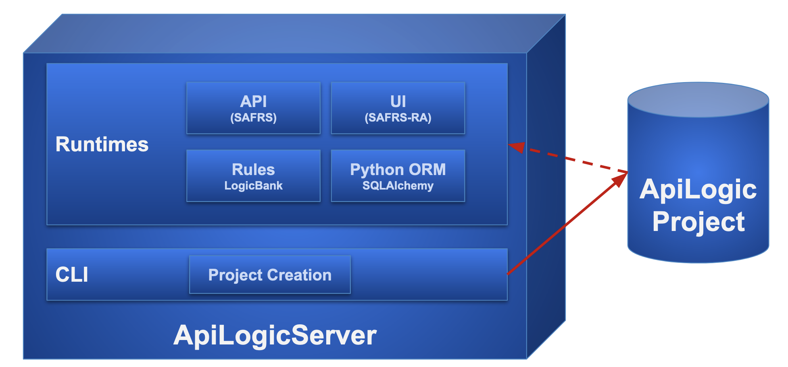

!!! pied-piper ":bulb: TL;DR - Open Source, CLI, Standard IDE, Standard Runtime"

    Weclcome to API Logic Server.  It's an open source project designed to create microservices quickly and easily.
    
    This page provides a project summary.  For more detailed information, select a page from the list at left.

    **Creation**

    * Create projects using the CLI, from a database, a SQLAlchemy model, or an AI description.
    
    **Development**

    * **Standards-based customization** - debug in a standard IDE (VSCode, PyCharm), using standard packages (Flask, SQLAlchemy)

    **Deployment**

    * A modern 3-tiered architecture, accessed by **APIs**
    * Logic is **automatically reused**, factored out of web apps and custom services
    * **Containerized** for scalable cloud deployment - the project includes a dockerfile to containerize it to DockerHub.

## Runtimes and CLI

API Logic Server is a Python Application, consisting of:

1. __Runtimes__ for ApiLogicProject execution (see below)
2. __CLI__ (Command Language Interface - provides `ApiLogicServer create `…`)

It executes either as a locally install (venv), or a Docker image (which includes Python).  In either case, the contents are the same:

 

## Created Projects

Created projects are designed for Customization.

## Key Runtime Components

The following 

| Component                                                                              | Provides                                                                                                              |
|:---------------------------------------------------------------------------------------|:----------------------------------------------------------------------------------------------------------------------|
| [Flask](https://flask.palletsprojects.com/en/1.1.x){:target="_blank" rel="noopener"}        | enables you to write custom web apps, and custom api end points  |
| [SQLAlchemy](https://docs.sqlalchemy.org/en/14/core/engines.html){:target="_blank" rel="noopener"}    | Python-friendly ORM (analogous to Hiberate, JPA)                                                                      |
| [Logic Bank](Logic-Operation.md#logic-architecture){:target="_blank" rel="noopener"} | Listens for SQLAlchemy updates, provides Multi-Table Derivations and Constraint Rules Python Events (e.g., send mail, message) Customizable with Python  |
| [SAFRS](https://github.com/thomaxxl/safrs/wiki){:target="_blank" rel="noopener"}     | JSON:API and swagger, based on SQLAlchemy  |
| [SAFRS-RA](https://github.com/thomaxxl/safrs-react-admin){:target="_blank" rel="noopener"}   | *Admin App*, using SAFRS    |

&nbsp;

## Execution: 3-tiered architecture

The API Logic Server executes as an application server, accessed by an API, in a standard 3-tiered architecture.  

Observe that logic plugs into SQLAlchemy.  **Logic is thus automatically shared** (factored out) of custom services, and web or browser-based apps.

In most cases, the API Logic Server executes in a **container**, so scales horizontally like any other Flask-based server.

