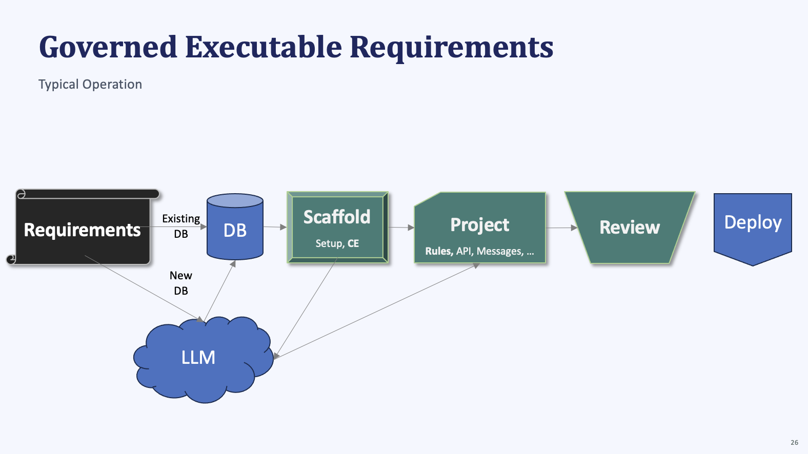
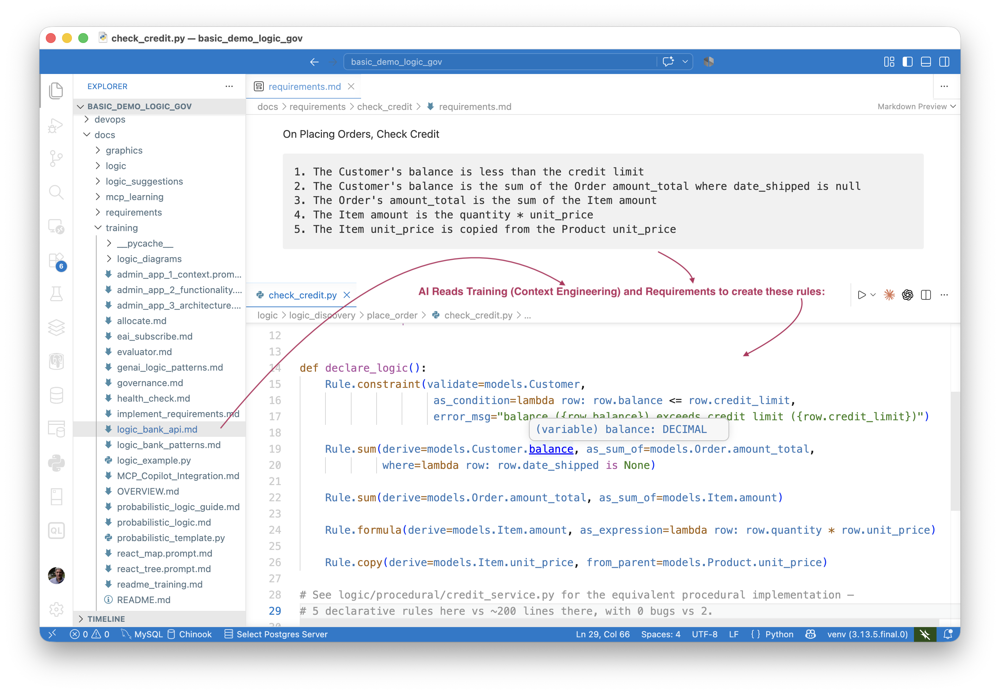
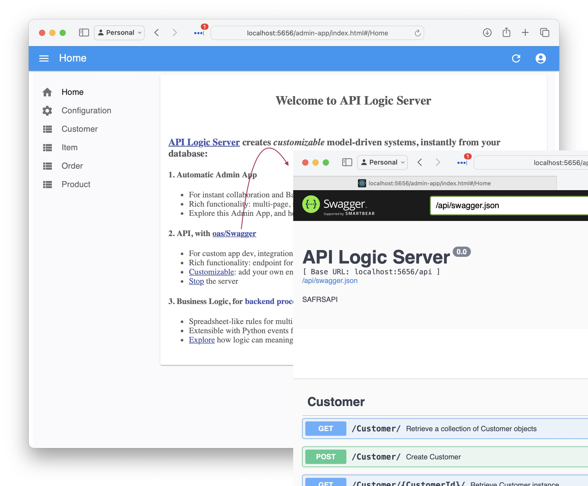
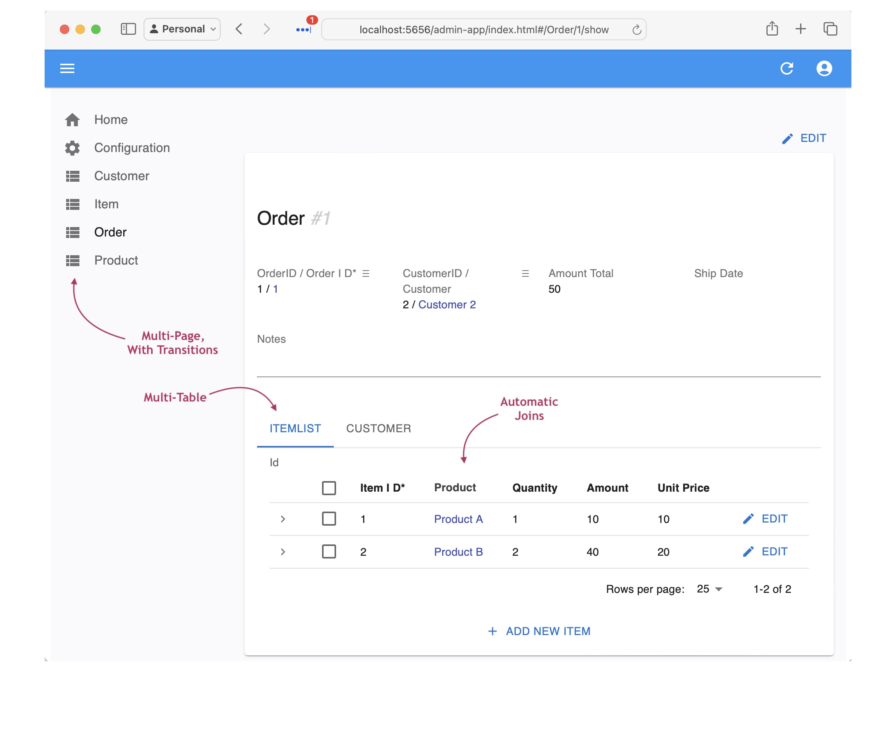

<style>
  .md-typeset h1,
  .md-content__button {
    display: none;
  }
</style>

# Governed Executable Requirements - Process

!!! pied-piper ":bulb: TL;DR - Requirements In, Enterprise-class Governed System Out"

    GenAI-Logic turns your requirements into enterprise-class database transaction systems, governed by rules that can't be bypassed.

    And it uses your methodology, standard tools, and shared artifacts, fostering collaboration between Business Users and Developers.

    * **Natural** — **use your existing methodology**: a declarative list, Gherkin, procedural prose, etc.  Your team keeps working the way they're already comfortable with, project after project.
    * **Readable** — **AI generates rules, not code**: the same requirement handed to a general coding assistant as a procedural task produces code that *looks* right and hides bugs — vs. five rules you can actually read.
    * **Trustable** — **governance is no bypass**: the rule engine plugs into the ORM's commit event, not into the API or handlers, so it fires identically whether the change comes from an API call, a message handler, or an AI agent.
    * **Reviewable** — **AI flags what needs judgment**: AI writes back a proactive audit trail (`ad-libs.md`) — you review a short list, not the full diff.
    * **Shared** — **fits your organization**: Business Users and Developers work the same project, with standard tools and artifacts — no hand-off, no rewrite.
    * **Standard** — **spans design to runtime**: build with your own IDE and git; run as scalable containers, reachable by API, MCP, and messages.

    <!-- -->

    Standard tools and methodologies. Governed rules you can read, trust, and maintain.

&nbsp;



<br>

## Requirements - as you do now

Write requirements the way you already do — nothing new to learn, nothing to migrate. AI converts whatever format you use into the same governed, no-bypass rules.

**Example: paste these requirements into your AI Assistant**

```
Create basic_demo from samples/dbs/basic_demo.sqlite.

On Placing Orders, Check Credit:    
    1. The Customer's balance is less than the credit limit
    2. The Customer's balance is the sum of the Order amount_total where date_shipped is null
    3. The Order's amount_total is the sum of the Item amount
    4. The Item amount is the quantity * unit_price
    5. The Item unit_price is copied from the Product unit_price

Use case: App Integration
    1. Publish the Order to Kafka topic 'order_shipping' when the date_shipped is not None.
```

Incomplete is fine too — provide what you have and request an interview; AI asks what's missing, and drafts the requirement from your answers.

Enterprise-class systems are supported with a set of requirements, including (for example) custom message formats, expressed by example.

*Formats, the RFI interview, and real transcripts: [Executable Reqmts](Exec-Reqmts.md){:target="_blank" rel="noopener"}. Enterprise samples: [Cost Allocation](https://github.com/ApiLogicServer/ApiLogicServer-src/tree/main/api_logic_server_cli/prototypes/manager/samples/allocate_dept_account_demo){:target="_blank" rel="noopener"}, [Customs Surtax](https://github.com/ApiLogicServer/ApiLogicServer-src/tree/main/api_logic_server_cli/prototypes/manager/samples/requirements/customs_demo_clvs){:target="_blank" rel="noopener"}*

<br>

## Existing DB, or New DB

Point at an existing database and it's used as-is — no migration, no re-modeling. Or describe a new one in your requirements text and AI creates it. Either way, the requirement text and the database are the two starting materials the rest of the pipeline is built from.

*Walkthroughs: [Create - Existing DB](Project-Existing-DB.md){:target="_blank" rel="noopener"}.*

<br>

## Scaffold (+ Context Eng)

AI sets up the project and installs Context Engineering — training material embedded in the project itself that steers every later generation step toward declarative **rules instead of hard-to-read procedural code**.

*What gets installed and why: [AI-Enabled Projects](Project-AI-Enabled.md){:target="_blank" rel="noopener"}.*

<br>

## Standard Project - Executable

AI generates an executable project: rules, API, Admin App and message handlers. Open it in your IDE, and run it.

The rules are deterministic and plug into the database's commit event — not into the API or handlers themselves — so they fire the same way regardless of where the change came from: an API call, a message handler, or an AI agent (your APIs are MCP-discoverable, so agents call them like any other client).

<details markdown>

<summary>See the Create Project, Governing Rules </summary>

<br>



</details>


<details markdown>

<summary>See the API </summary>


</details>

<details markdown>

<summary>See the Admin App </summary>

</details>

*Why Python-as-declaration works this way, across rules, API, and UI: [Model Driven](Tech-DSL.md){:target="_blank" rel="noopener"}.*

<br>

## Review - Rules Governance

The requirements are executable, but review is designed as a 3-step process to provide *human in the loop* governance of your business logic:

1. **Read:** unlike native AI which generates ~200 lines of code you'd rather not read, the 5 check credit requirements generate **5 rules you can read.**

2. **Trust:** AI-generated code is not only lengthy, we have observed bugs (for more information, [click here](https://github.com/ApiLogicServer/ApiLogicServer-src/blob/main/api_logic_server_cli/prototypes/manager/samples/basic_demo_logic_gov/logic/procedural/declarative-vs-procedural-comparison.md){:target="_blank" rel="noopener"}).  Rules are declarative, so address **all paths** (insert, update, delete), and operate as listeners to ORM commit events, so apply to **all transaction sources.** AI itself is never used at runtime unless you explicitly request it — and even then, its proposals (say, an optimal supplier) are still checked against your rules.

3. **Maintain:** the rules engine **orders rules execution** by analyzing dependencies, so it automatically adapts to changing rules — the same [comparison](https://github.com/ApiLogicServer/ApiLogicServer-src/blob/main/api_logic_server_cli/prototypes/manager/samples/basic_demo_logic_gov/logic/procedural/declarative-vs-procedural-comparison.md){:target="_blank" rel="noopener"} shows this is what lets the five rules handle the re-parenting cases the procedural version got wrong. It's also purpose-built for high-volume transaction processing, chaining rules across tables: unlike a RETE engine, which has no notion of old/new values, it uses those values to prune rules and avoid N+1 queries — an item's price change updates the order total with a single row update, not a series of them.

*Full architecture and the runtime opt-in pattern: [Logic](Logic-Why.md){:target="_blank" rel="noopener"} and [AI Security FAQ](FAQ-AI-Security.md){:target="_blank" rel="noopener"}. Audit-trail mechanics: [Executable Reqmts](Exec-Reqmts.md){:target="_blank" rel="noopener"}.*

<br>

## Deploy - Standard Container

The result runs as a scalable server exposing both the API and message handlers, built on the same rule engine and the same governance — no separate deployment step re-checks or re-implements the rules.

<br>

## Iterate, Vibe Custom UIs

You can add requirements, and update existing ones, in place.  Use your favorite Vibe tools to create custom User interfaces.  Use your IDE as always for coding, debugging, etc.  Ask AI to create tests, and add your own.

*See [vibe](Admin-Vibe-Sample.md){:target="_blank" rel="noopener"}.  [Testing](Behave.md){:target="_blank" rel="noopener"}. The [Manager](Manager.md){:target="_blank" rel="noopener"} is where you run all of this day to day.*
