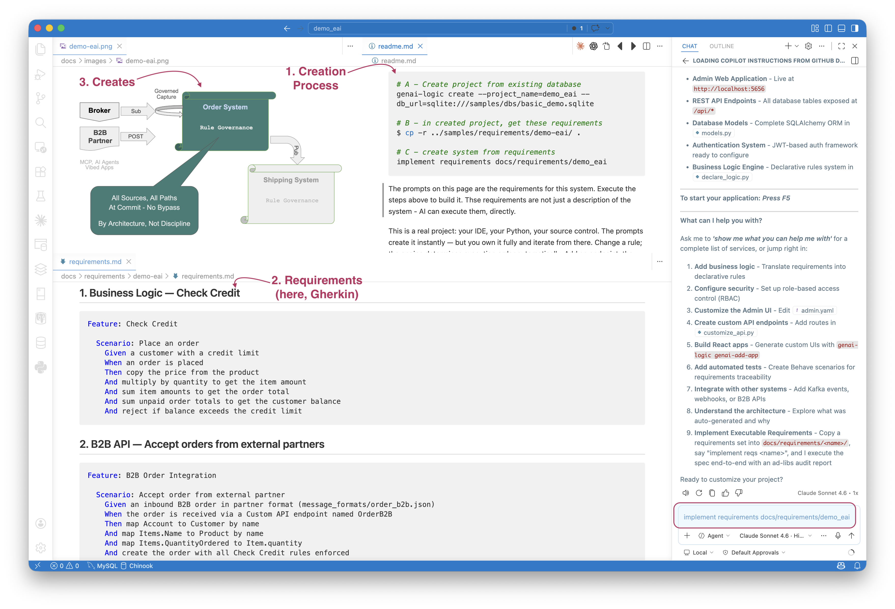
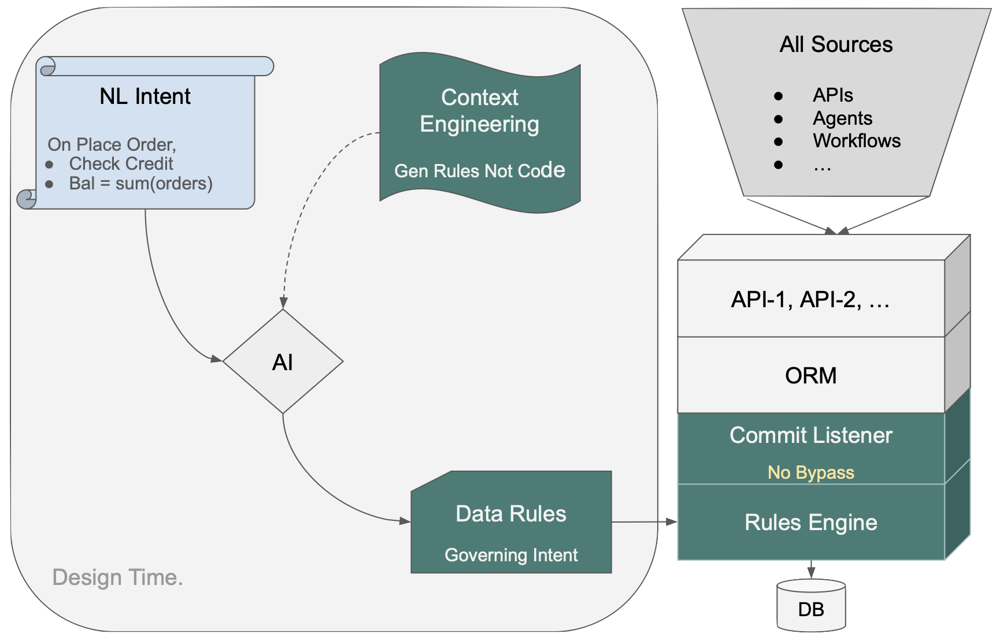

<style>
  .md-typeset h1,
  .md-content__button {
    display: none;
  }
</style>

# Executable Requirements

!!! pied-piper ":bulb: TL;DR - Requirements-Driven Iterative Development"

    **Executable Requirements** uses the spec as direct AI input to produce a *runnable project* — not a one-shot artifact, but a governed starting point your team iterates from.

    * **Any format:** structured prose, numbered lists, Gherkin — whatever your team already writes
    * **PM-driven workflow:** sample scenario - Product Manager prepares a `requirements/` folder (logic, message formats, acceptance tests); Dev drops it in the project and types `implement reqs <name>`
    * **AI produces a runnable project** and writes back an audit trail (`ad-libs.md`) of every decision — red flags for review, FYIs for standard patterns
    * **Iterative by design:** add new requirements — each cycle tightens the spec; declarative rules make logic changes safe (automatic ordering and reuse, no cascade of procedural updates)
    * **Governance is architectural:** rules live on the data, not the path — every new API, agent, or integration inherits them automatically
    * **Learn more:** [genai-logic.com](https://www.genai-logic.com){:target="_blank" rel="noopener"} — see the Architecture Walk-Through for full project overview and interactive architecture diagram

&nbsp;

## What It Is

Traditional requirements are a handoff artifact: a document a developer reads, interprets, and then implements. Interpretation introduces drift — requirements that describe intent, code that approximates it.

Executable Requirements treats requirements.md as direct AI input. The AI reads the file and produces a running system — Python source, database, REST API, business logic, tests. Not a prototype. Not a scaffold. A running system you own, in your IDE, in your source control.

Behavior is added incrementally: drop a new requirements file into docs/requirements/<name>/, tell the AI to implement it, and it executes that slice on the running system. Each increment builds on the last. The AI reports any decisions it made beyond the spec (the ad-libs report), so you know exactly what was automated and what needs review.

Declarative rules make iteration safe: adding logic for a new use case doesn't disturb existing rules. When a rule changes, you update the declaration; ordering and reuse are automatic.

The `demo_eai` sample illustrates the process:

1. You execute the steps in the upper right (`readme.md`) - note the use of Copilot in lower right
2. The key file is `requirements.md` - bottom left
3. This creates the system summarized in the diagram - top left



&nbsp;

### Logic, APIs and Messages

The typical requirements describe:

* Logic -- multi-table derivations and constraints, in Natural Language.  For more on rules, [click here](Logic-Why.md){:target="_blank" rel="noopener"}.
* Custom APIs/Messages -- these are typically described using example formats, and exception mappings.  For more on Enterprise Application Integration, [click here](Integration-EAI.md){:target="_blank" rel="noopener"}. 

You can use the Admin app, or more typically, vibe a custom app using the automatic API.

&nbsp;

## What It Is Not: a Wizard

The resultant project is fully standard Python — your IDE, your source control, your deployment pipeline. Nothing is locked to a generator or a framework layer. You customize, test, and deploy it the same way you would any Python service. The requirements file and the ad-libs report stay alongside the code as living documentation, not as a regeneration mechanism.

&nbsp;

## Requirement Format: Whatever You Already Write

There is no required format. The spec is whatever your team already produces — prose, numbered lists, Gherkin. The key is structure: clear sections for logic, integrations, and acceptance criteria.

**Numbered prose** (the simplest form — see `samples/prompts/genai_demo.prompt`):

```
Create a system with customers, orders, items and products.

On Placing Orders, Check Credit
    1. The Customer's balance is less than the credit limit
    2. The Customer's balance is the sum of the Order amount_total where date_shipped is null
    3. The Order's amount_total is the sum of the Item amount
    4. The Item amount is the quantity * unit_price
    5. The Item unit_price is copied from the Product unit_price

Use case: App Integration
    1. Publish the Order to Kafka topic 'order_shipping' if the date_shipped is not None.
```

**Gherkin** — for teams that already use BDD-style specs (see `samples/requirements/demo-eai/docs/requirements/demo-eai/requirements.md`):

```gherkin
Feature: Check Credit

  Scenario: Place an order
    Given a customer with a credit limit
    When an order is placed
    Then copy the price from the product
    And multiply by quantity to get the item amount
    And sum item amounts to get the order total
    And sum unpaid order totals to get the customer balance
    And reject if balance exceeds the credit limit
```

Both formats produce the same output: declarative rules enforced on every path, a standard JSON:API, and an Admin app — from a single `implement reqs` prompt.

&nbsp;

## Workflow: PM Prepares, Dev Executes

A natural division of labor emerges from the structure:

| Who | Does what |
|-----|-----------|
| **Product Manager** | Gathers artifacts: DDL, sample messages, architecture notes — in cloud storage, SharePoint, wherever they work |
| **Product Manager** | Writes `requirements.md` — sections for logic, integrations, acceptance; includes `message_formats/` sub-folder |
| **Developer** | Creates `docs/requirements/<name>/` in the project repo, drops in `requirements.md` and supporting files |
| **Developer** | Types `implement reqs <name>` in Copilot Agent mode |
| **AI** | Builds the system, writes `docs/requirements/<name>/ad-libs.md` with decisions made |
| **PM + Dev** | Reviews `ad-libs.md` — 🔴 items require confirmation, 🟡 are standard patterns; tighten the spec for the next increment |

This is the starting point for iterative development, not a one-shot deployment. Each cycle produces a working system your team owns and refines.

**What belongs in `requirements.md`:**

- **What to build** — tables, handlers, APIs, logic rules
- **Message formats** — reference files in `message_formats/`; include field mappings where non-obvious
- **Phases** — what's in scope now vs. deferred
- **Acceptance** — how to verify it worked (test commands, expected DB state)

Leave out: implementation details, file names, framework choices — let AI decide those and review the audit trail to see what it chose.

&nbsp;

## EAI: By-Example Integrations

For messaging integrations the requirements spec uses a **by-example** approach: include a sample JSON message alongside the spec, and AI auto-maps obvious fields silently — you only specify exceptions.

For example, `message_formats/order_b2b.json`:

```json
{
  "Account": "Alice",
  "Notes": "Kafka order from sales",
  "Items": [
    { "Name": "Widget",  "QuantityOrdered": 1 },
    { "Name": "Gadget",  "QuantityOrdered": 2 }
  ]
}
```

The corresponding requirements section names the exceptions — fields that rename, join, or map to child collections — and AI infers the rest:

```gherkin
Feature: B2B Order Integration

  Scenario: Accept order from external partner
    Given an inbound B2B order in partner format (message_formats/order_b2b.json)
    When the order is received via a Custom API endpoint named OrderB2B
    Then map Account to Customer by name
    And map Items.Name to Product by name
    And map Items.QuantityOrdered to Item.quantity
    And create the order with all Check Credit rules enforced
```

An `_unresolved` guard blocks server start on any field AI can't confidently map — no silent failures.

The same by-example pattern applies to **outbound Kafka publish**: describe the desired JSON shape, AI matches fields from the model, adds `# TODO` on uncertain ones, and generates the publish rule.

> For full details on mapping patterns, the two-message pattern, and `FIELD_EXCEPTIONS`, see [Integration EAI](Integration-EAI.md){:target="_blank" rel="noopener"} and [Integration Kafka](Integration-Kafka.md){:target="_blank" rel="noopener"}.

&nbsp;

## Human in the Loop: Dev Stays in Control

AI does the initial build — but the developer reviews, owns, and iterates on everything it produces. There are two review surfaces, one for each kind of output:

**Logic → Declarative Rules.** Business logic in the spec becomes Python rules in `logic/logic_discovery/`. The rules are short, readable, and directly traceable to the spec — the rule *is* the requirement, restated with precision. Dev reviews them in the IDE, adjusts as needed, and re-runs the suite. When requirements change, you update the rule; automatic ordering and reuse handle the rest. No cascade of procedural updates to track down.

**Message and API mappings → `ad-libs.md`.** Field mappings, Kafka patterns, lookup strategies, and other integration decisions AI had to fill in are reported in `docs/requirements/<name>/ad-libs.md`. Zero ad-libs means the spec was complete and unambiguous. The same review-and-refine loop applies: read the report, tighten the spec, re-run.

Two severity tiers:

| Tier | Meaning |
|------|---------|
| 🔴 **Review Required** | AI made a decision that could be wrong — specific action called out |
| 🟡 **FYI** | Standard pattern applied — no action needed, recorded for transparency |

Example from the `demo_eai` sample:

```
🔴  OrderB2BMapper.py — parent_lookups tuple shape may not match what
    RowDictMapper._parent_lookup_from_child() expects. Test with a POST
    to /api/OrderB2B. If you get a NOT NULL error, adjust the tuple shape.

🟡  check_credit.py — standard Check-Credit rules (copy, formula, sum,
    sum-with-where, constraint). Null-safe guard applied to constraint.

🟡  order_b2b.py — 2-message Kafka pattern applied (blob saved in Tx 1,
    parsed in Tx 2). Required pattern per eai_subscribe.md.
```

The loop: review `ad-libs.md`, update `requirements.md` to resolve any 🔴 items, re-run. Each cycle reduces the number of ad-libs until the spec and the implementation are in full agreement.

&nbsp;

## Try It — `demo_eai` in Under 10 Minutes

The Manager ships a ready-to-run sample: `samples/requirements/demo_eai/` — B2B order intake via both a custom REST endpoint and Kafka, with outbound shipping notification and full Check Credit logic.


```bash title="Step 1 - Establish Initial State, Execute Requirements"
# A - Create project from existing database
genai-logic create --project_name=demo_eai --db_url=sqlite:///samples/dbs/basic_demo.sqlite

# B - in created project, get these requirements
$ cp -r ../samples/requirements/demo-eai/ .

# C - create system from requirements
implement requirements docs/requirements/demo_eai
```

AI reads `docs/requirements/Order-EAI/requirements.md`, builds the system, and writes `docs/requirements/Order-EAI/ad-libs.md`.

**Step 2 — Review the audit trail:**

- **🔴 Review Required** — decisions that need your confirmation
- **🟡 FYI** — standard patterns applied, no action needed

Update `requirements.md` to clarify anything flagged red, then re-run.

**Step 3 — Verify** (no Kafka required — use the `consume_debug` endpoint):

```bash
curl 'http://localhost:5656/consume_debug/order_b2b?file=docs/requirements/Order-EAI/message_formats/order_b2b.json'

sqlite3 database/db.sqlite "SELECT * FROM order_b2b_message; SELECT * FROM 'order'; SELECT * FROM item;"
```

&nbsp;

## Deliverables

From one requirements file, AI delivers:

- **Standard JSON:API** — filtering, sorting, pagination, optimistic locking
- **Admin app** — multi-table, automatic joins, ready on day one
- **Declarative rules** — enforced on every path, at commit, automatically ordered and reused
- **B2B API and Kafka integration** — raw message persisted first, parse failures recoverable, nothing lost
- **Behave test suite** — generated from the rules, not written by hand
- **Logic Report** — requirement → rule → execution trace, readable by developers, business users, and auditors
- **`ad-libs.md` audit trail** — AI's decisions, reviewable and iterable
- **Standard project** — Python, your IDE, your source control, container-ready


&nbsp;

## How the Rules Engine Works



NL intent goes in on the left. Context Engineering directs AI to produce Data Rules — not procedural code. Those rules load into the Rules Engine at startup; dependencies are computed deterministically, not inferred at runtime. The Commit Listener hooks into the ORM. Every transaction — API, agent, workflow, message — passes through one control point.

Because the rules are on the *data*, not the path, every access path inherits them automatically. Delete an order, ship an order, have an agent update a quantity — none of those need to be anticipated in the spec. A new endpoint or agent added later requires no additional logic.

See [Logic Operation](Logic-Operation.md){:target="_blank" rel="noopener"} for details on rule ordering, chaining, and pruning.
