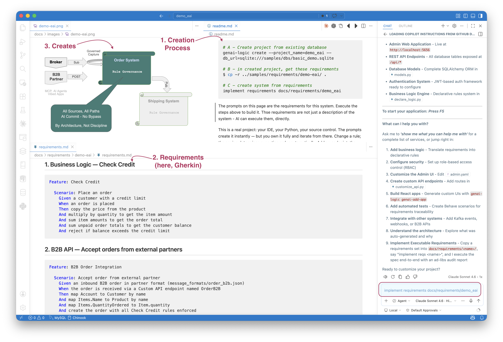
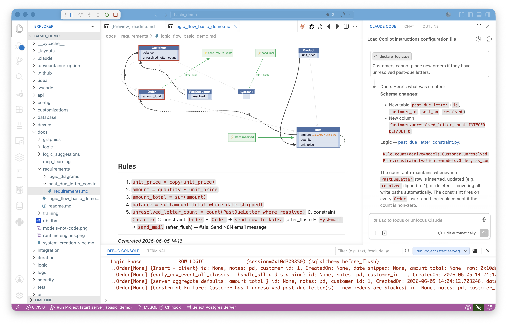
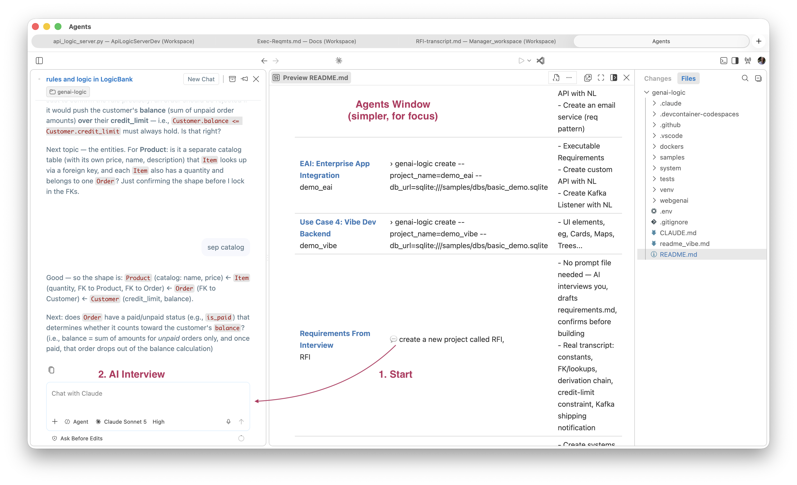
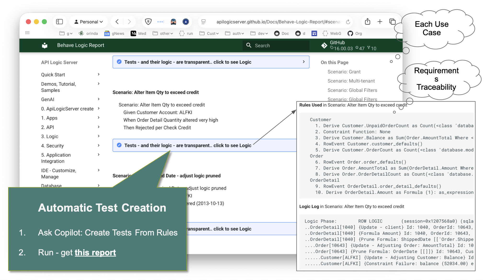
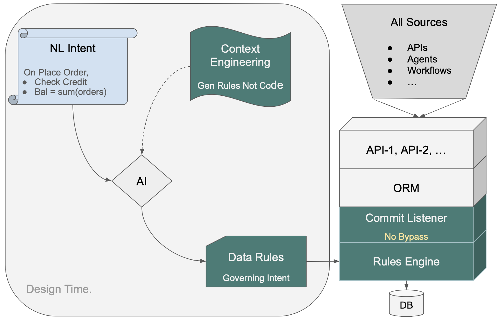

<style>
  .md-typeset h1,
  .md-content__button {
    display: none;
  }
</style>

# Executable Requirements

!!! pied-piper ":bulb: TL;DR - Requirements-Driven Iterative Development"

    **Executable Requirements** — also called **XGR**, *Governed* Executable Requirements — treats your requirements as the ongoing source of truth for governed logic — not a handoff artifact, but the engine configuration your system **runs from**, and **iterates from.**

    * **Any format:** structured prose, numbered lists, Gherkin — whatever your team already writes
    * **Three ways to arrive at `requirements.md`:**
        - **RFI** — no document at all; AI interviews you conversationally and drafts it for you, then reads it back for confirmation. Real transcript: [samples/requirements/RFI/RFI-transcript.md](https://github.com/ApiLogicServer/ApiLogicServer-src/blob/main/api_logic_server_cli/prototypes/manager/samples/requirements/RFI/RFI-transcript.md){:target="_blank" rel="noopener"}
        - **File** — a single existing prompt file, used as-is. Example: [samples/prompts/genai_demo.prompt](https://github.com/ApiLogicServer/ApiLogicServer-src/blob/main/api_logic_server_cli/prototypes/manager/samples/prompts/genai_demo.prompt){:target="_blank" rel="noopener"}
        - **Folder** — multiple requirement files plus message formats (JSON, XML, CSV) for richer, multi-increment specs. Simple: [demo_eai](Sample-Basic-EAI.md){:target="_blank" rel="noopener"} · Enterprise-class: [customs_demo_clvs](Customs-clvs-readme.md){:target="_blank" rel="noopener"} (real CBSA customs system, also simulates an existing database)
    * **Run from the Manager or the project** — whichever you're already in
    * **AI produces a runnable project**, and writes back a *proactive* human-in-the-loop audit trail (`ad-libs.md`) — unprompted, itemized: 🔴 for decisions that need your review, 🟡 for standard patterns needing none. You review a short list, not the whole diff. Real example: [customs_demo_clvs ad-libs.md](https://github.com/ApiLogicServer/ApiLogicServer-src/blob/main/api_logic_server_cli/prototypes/manager/samples/demo_customs_clvs/docs/requirements/customs_demo/ad-libs.md){:target="_blank" rel="noopener"} — 3 flagged, 6 FYIs, out of 14 rules built
    * **Iterative by design:** add new requirements — each cycle tightens the spec; declarative rules make logic changes safe (automatic ordering and reuse, no cascade of procedural updates)
    * **Governance is architectural:** rules live on the data, not the path — every new API, agent, or integration inherits them automatically
    * **Learn more:** [genai-logic.com](https://www.genai-logic.com){:target="_blank" rel="noopener"} — see the Architecture Walk-Through for full project overview and interactive architecture diagram

&nbsp;

## What It Is

Traditional requirements are a handoff artifact: a document a developer reads, interprets, and then implements. Interpretation introduces drift — requirements that describe intent, code that approximates it.

Executable Requirements treats requirements.md as direct AI input. The AI reads the file and produces a running system — Python source, database, REST API, business logic, tests. Not a prototype. Not a scaffold. A running system you own, in your IDE, in your source control.

Behavior is added incrementally: drop a new requirements file into `docs/requirements/<name>/`, tell the AI to implement it, and it executes that slice on the running system. Each increment builds on the last. Declarative rules make this safe — adding logic for a new use case doesn't disturb existing rules; ordering and reuse are automatic.

The [demo_eai](Sample-Basic-EAI.md){:target="_blank" rel="noopener"} sample illustrates the process:

1. You execute the steps in the upper right (`readme.md`) - note the use of Copilot in lower right
2. The key file is `requirements.md` - bottom left
3. This creates the system summarized in the diagram - top left



&nbsp;

### Simple Requests

In its simplest form, you can just provide raw logic.  This may cause the system to create new tables, attributes and rules.  For example:

```
Customers cannot place new orders if they have unresolved past-due letters.
```



### Logic, APIs and Messages

Or, you can provide much larger sets of requirements consisting of multiple files and resources.  The typical requirements describe:

* Logic -- multi-table derivations and constraints, in Natural Language.  For more on rules, [click here](Logic-Why.md){:target="_blank" rel="noopener"}.
* Custom APIs/Messages -- these are typically described using example formats, and exception mappings.  For more on Enterprise Application Integration, [click here](Integration-EAI.md){:target="_blank" rel="noopener"}. 

You can use the Admin app, or more typically, vibe a custom app using the automatic API.

See it in practice: [demo_eai](Sample-Basic-EAI.md){:target="_blank" rel="noopener"} is a clean, minimal folder — one `requirements.md`, two JSON message formats. [customs_demo_clvs](Customs-clvs-readme.md){:target="_blank" rel="noopener"} is the real enterprise-class case — a full CBSA customs declaration system built against seven XML message variants and a CSV mapping table, simulating an existing database rather than starting from a blank one.

&nbsp;

## Requirements from Interview



Classic wizards walk a fixed sequence of screens — no judgment, no pushback, blind to what you actually meant. RFI (above) is guided, not scripted: the AI asks follow-ups, catches gaps you didn't think to mention (see the transcript — the shipping notification only surfaced because the AI kept the thread open after the "requirements" looked done), and reads its synthesis back for confirmation before anything is built. It's closer to a business-analyst interview than a form.

This has a governance consequence beyond convenience. Requirements quality has traditionally depended on the skill and training of whoever captures them — a gap missed in an interview is a gap missed in the rules. RFI moves that responsibility from the individual BA to the interview process itself: the same follow-up questions (constants, lookups/FKs, integration points, judgment calls) get asked regardless of who's in the room. Rules governance still depends on requirements being complete — RFI is one way to make that completeness less dependent on who happens to be running the interview.

And whichever way you arrive at `requirements.md` — written, prompt file, or RFI — the resultant project is fully standard Python — your IDE, your source control, your deployment pipeline. Nothing is locked to a generator or a framework layer. You customize, test, and deploy it the same way you would any Python service. The requirements file and the ad-libs report stay alongside the code as living documentation, not as a regeneration mechanism.

&nbsp;

## Requirement Format: Whatever You Already Write

There is no required format. The spec is whatever your team already produces — prose, numbered lists, Gherkin. The key is structure: clear sections for logic, integrations, and acceptance criteria.

**Numbered prose** (the simplest form — see [samples/prompts/genai_demo.prompt](https://github.com/ApiLogicServer/ApiLogicServer-src/blob/main/api_logic_server_cli/prototypes/manager/samples/prompts/genai_demo.prompt){:target="_blank" rel="noopener"}):

```
Create a system with customers, orders, items and products.

On Placing Orders, Check Credit
    1. The Customer's balance is less than the credit limit
    2. The Customer's balance is the sum of the Order amount_total where date_shipped is null
    3. The Order's amount_total is the sum of the Item amount
    4. The Item amount is the quantity * unit_price
    5. The Item unit_price is copied from the Product unit_price

Use case: App Integration
    1. Publish the Order to Kafka topic 'order_shipping' if the date_shipped is not None.
```

**Gherkin** — for teams that already use BDD-style specs (see `samples/requirements/demo-eai/docs/requirements/demo-eai/requirements.md`):

```gherkin
Feature: Check Credit

  Scenario: Place an order
    Given a customer with a credit limit
    When an order is placed
    Then copy the price from the product
    And multiply by quantity to get the item amount
    And sum item amounts to get the order total
    And sum unpaid order totals to get the customer balance
    And reject if balance exceeds the credit limit
```

Both formats produce the same output: declarative rules enforced on every path, a standard JSON:API, and an Admin app — from a single `implement reqs` prompt.

&nbsp;

## Workflow: Any Source, Same Loop

`requirements.md` just needs to exist before you say `implement reqs <name>`. How it gets written doesn't matter:

- **Written by a person** — PM, analyst, or dev drafts it from DDL, sample messages, architecture notes, whatever's on hand. Usually a single **File**.
- **A prompt file, as-is** — the same prompt files used to *create* a project are already requirements prose. Drop one in unchanged. Also a single **File**.
- **Requirements From Interview (RFI)** — no document at all. Tell the AI you want to discuss the system instead of handing over a spec; it interviews you conversationally (constants, lookups/FKs, integration/judgment calls, type hierarchies), then synthesizes a `requirements.md` and reads it back for confirmation before building anything. See a real transcript at [samples/requirements/RFI/RFI-transcript.md](https://github.com/ApiLogicServer/ApiLogicServer-src/blob/main/api_logic_server_cli/prototypes/manager/samples/requirements/RFI/RFI-transcript.md){:target="_blank" rel="noopener"}.

However you author it, `requirements.md` can stand alone as a single **File**, or grow into a **Folder** — `requirements.md` plus `message_formats/` (sample JSON, XML, CSV — see [EAI: By-Example Integrations](#eai-by-example-integrations) below) plus, for larger systems, several named subfolders under `docs/requirements/`, each its own incremental slice. [demo_eai](Sample-Basic-EAI.md){:target="_blank" rel="noopener"} and [customs_demo_clvs](Customs-clvs-readme.md){:target="_blank" rel="noopener"} (above) are both Folder examples — the latter at real enterprise scale.

Whichever path you took, the loop is the same:

| Step | What happens |
|------|--------------|
| Place `requirements.md` (+ `message_formats/` if needed) in `docs/requirements/<name>/` | in the project, or in the Manager prefixed with `<name>/` — either works |
| Say `implement reqs <name>` | in Copilot Agent mode |
| AI builds the system | writes `docs/requirements/<name>/ad-libs.md` with decisions made |
| Review `ad-libs.md` | 🔴 items require confirmation, 🟡 are standard patterns |
| Update `requirements.md`, re-run | each cycle tightens the spec |

Not a one-shot deployment — the starting point for iterative development. Each cycle produces a working system you own and refine.

**What belongs in `requirements.md`:** what to build (tables, handlers, APIs, logic rules), message formats (reference `message_formats/`, map non-obvious fields), phases (in scope now vs. deferred), acceptance (how to verify it worked). Leave out implementation details, file names, framework choices — let AI decide those; read the ad-libs to see what it chose.

&nbsp;

## EAI: By-Example Integrations

For messaging integrations the requirements spec uses a **by-example** approach: include a sample JSON message alongside the spec, and AI auto-maps obvious fields silently — you only specify exceptions.

For example, `message_formats/order_b2b.json`:

```json
{
  "Account": "Alice",
  "Notes": "Kafka order from sales",
  "Items": [
    { "Name": "Widget",  "QuantityOrdered": 1 },
    { "Name": "Gadget",  "QuantityOrdered": 2 }
  ]
}
```

The corresponding requirements section names the exceptions — fields that rename, join, or map to child collections — and AI infers the rest:

```gherkin
Feature: B2B Order Integration

  Scenario: Accept order from external partner
    Given an inbound B2B order in partner format (message_formats/order_b2b.json)
    When the order is received via a Custom API endpoint named OrderB2B
    Then map Account to Customer by name
    And map Items.Name to Product by name
    And map Items.QuantityOrdered to Item.quantity
    And create the order with all Check Credit rules enforced
```

An `_unresolved` guard blocks server start on any field AI can't confidently map — no silent failures.

The same by-example pattern applies to **outbound Kafka publish**: describe the desired JSON shape, AI matches fields from the model, adds `# TODO` on uncertain ones, and generates the publish rule.

> For full details on mapping patterns, the two-message pattern, and `FIELD_EXCEPTIONS`, see [Integration EAI](Integration-EAI.md){:target="_blank" rel="noopener"} and [Integration Kafka](Integration-Kafka.md){:target="_blank" rel="noopener"}.

&nbsp;

## Human in the Loop: Dev Stays in Control

AI does the initial build — but the developer reviews, owns, and iterates on everything it produces, across two surfaces:

**Logic → Declarative Rules.** Business logic in the spec becomes Python rules in `logic/logic_discovery/` — short, readable, directly traceable to the spec. Dev reviews in the IDE, adjusts as needed. When requirements change, update the rule; ordering and reuse are automatic. No cascade of procedural updates to track down.

**Message and API mappings → `ad-libs.md`.** This is *proactive* human in the loop — the AI doesn't wait to be asked "did you get this right?" It itemizes every field mapping, Kafka pattern, and lookup strategy it had to fill in, flags 🔴 the ones that need a real decision, and marks 🟡 the ones that were standard patterns needing no action. You review a short, itemized list instead of the whole diff — and zero 🔴 items means the spec was complete and unambiguous.

Example from the [demo_eai](Sample-Basic-EAI.md){:target="_blank" rel="noopener"} sample:

```
🔴  OrderB2BMapper.py — parent_lookups tuple shape may not match what
    RowDictMapper._parent_lookup_from_child() expects. Test with a POST
    to /api/OrderB2B. If you get a NOT NULL error, adjust the tuple shape.

🟡  check_credit.py — standard Check-Credit rules (copy, formula, sum,
    sum-with-where, constraint). Null-safe guard applied to constraint.

🟡  order_b2b.py — 2-message Kafka pattern applied (blob saved in Tx 1,
    parsed in Tx 2). Required pattern per eai_subscribe.md.
```

For the real thing at enterprise scale, see the [full ad-libs.md from `customs_demo_clvs`](https://github.com/ApiLogicServer/ApiLogicServer-src/blob/main/api_logic_server_cli/prototypes/manager/samples/demo_customs_clvs/docs/requirements/customs_demo/ad-libs.md){:target="_blank" rel="noopener"} — 3 items flagged for review, 6 FYIs, out of 14 rules built. One 🔴 is a genuine ambiguity the AI caught on its own, unprompted: CBSA numeric customs-office codes (LVS-format messages) and 3-letter airport codes (HVS-format messages) land in the same source field, and only the numeric form matches any seeded office — exactly the kind of judgment call that needs a human, surfaced before anyone had to go looking for it.

&nbsp;

## Try It — `demo_eai` in Under 10 Minutes

The Manager ships a ready-to-run sample: `samples/requirements/demo_eai/` — B2B order intake via both a custom REST endpoint and Kafka, with outbound shipping notification and full Check Credit logic.


```bash title="Step 1 - Establish Initial State, Execute Requirements"
# A - Create project from existing database
genai-logic create --project_name=demo_eai --db_url=sqlite:///samples/dbs/basic_demo.sqlite

# B - in created project, get these requirements
$ cp -r ../samples/requirements/demo-eai/ .

# C - create system from requirements
implement requirements docs/requirements/demo_eai
```

AI reads `docs/requirements/Order-EAI/requirements.md`, builds the system, and writes `docs/requirements/Order-EAI/ad-libs.md`.

**Step 2 — Review the audit trail:**

- **🔴 Review Required** — decisions that need your confirmation
- **🟡 FYI** — standard patterns applied, no action needed

Update `requirements.md` to clarify anything flagged red, then re-run.

**Step 3 — Verify** (no Kafka required — use the `consume_debug` endpoint):

```bash
curl 'http://localhost:5656/consume_debug/order_b2b?file=docs/requirements/Order-EAI/message_formats/order_b2b.json'

sqlite3 database/db.sqlite "SELECT * FROM order_b2b_message; SELECT * FROM 'order'; SELECT * FROM item;"
```

**No requirements file yet?** Say this instead, in the Manager:

```
💬 create a new project called RFI, and let's discuss the system
```

The AI interviews you and drafts `requirements.md` itself — see [samples/requirements/RFI/RFI-transcript.md](https://github.com/ApiLogicServer/ApiLogicServer-src/blob/main/api_logic_server_cli/prototypes/manager/samples/requirements/RFI/RFI-transcript.md){:target="_blank" rel="noopener"} for a real session (Customer/Order/Item/Product, credit-limit constraint, Kafka shipping notification).

&nbsp;

## Deliverables

From one requirements file, AI delivers:

- **Standard JSON:API** — filtering, sorting, pagination, optimistic locking
- **Admin app** — multi-table, automatic joins, ready on day one
- **Declarative rules** — enforced on every path, at commit, automatically ordered and reused
- **B2B API and Kafka integration** — raw message persisted first, parse failures recoverable, nothing lost
- **Behave test suite** — generated from the rules, not written by hand
- **Logic Report** — requirement → rule → execution trace, readable by developers, business users, and auditors
- **`ad-libs.md` audit trail** — AI's decisions, reviewable and iterable
- **Standard project** — Python, your IDE, your source control, container-ready



&nbsp;

## How the Rules Engine Works



NL intent goes in on the left. Context Engineering directs AI to produce Data Rules — not procedural code. Those rules load into the Rules Engine at startup; dependencies are computed deterministically, not inferred at runtime. The Commit Listener hooks into the ORM. Every transaction — API, agent, workflow, message — passes through one control point.

Because the rules are on the *data*, not the path, every access path inherits them automatically. Delete an order, ship an order, have an agent update a quantity — none of those need to be anticipated in the spec. A new endpoint or agent added later requires no additional logic.

See [Logic Operation](Logic-Operation.md){:target="_blank" rel="noopener"} for details on rule ordering, chaining, and pruning.
