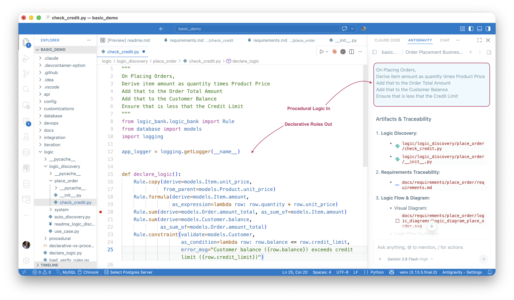
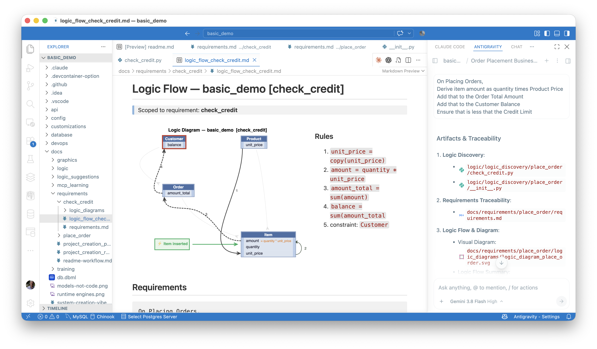
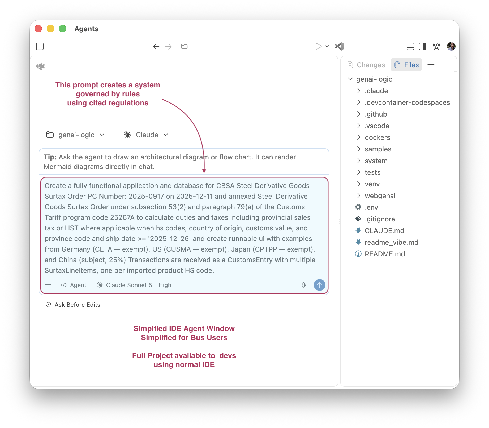

!!! pied-piper ":bulb: TL;DR - Is Learning Curve for Rules Steep?  No - Dramatically Reduces with AI and Context Engineering"

      Experience has shown that not all developers find the declarative rules approach intuitive.  They naturally think in procedural terms, which fit well with the programming paradigm.
      
      AI, with extensive Context Engineering, dramatically reduces this.  In fact, developers can submit procedural logic, and AI will transpile it into declarative rules.
      
      > The payoff: automatic re-use means logic imagined for inserting an order automatically addresses delete order, update order, and insert/update/delete line items.  For more on **automatic re-use**, [click here](Logic-Why.md#automatic-reuse){:target="_blank" rel="noopener"}.

&nbsp;

---

## Procedural Logic In

Funny story: early in the development of Context Engineering, I found that the same learning that drove code generation could also drive support.  So, I asked my AI Assistant to provide an example of rules - it produced:

```text title="Procedural Logic"
On Placing Orders,
Derive item amount as quantity times Product Price
Add that to the Order Total Amount
Add that to the Customer Balance
Ensure that is less that the Credit Limit
```

I gasped - here was AI teaching folks the wrong paradigm.

And yet, models had been improving.  So, I tried it.

&nbsp;

## Declarative Rules Out

I created a project from an existing database, like this:

```bash title="Create a Project: API (MCP), Admin App"
create basic_demo from samples/dbs/basic_demo.sqlite 
```

And then I submitted the logic... the result -- declarative rules:



With a diagram:



&nbsp;

## Reuse - Design One, Solve Many

Look again at the 5 rules above. None of them says "placing an order." They declare what
`Item.amount`, `Order.amount_total`, and `Customer.balance` *are* - not when to compute them.

That's the whole trick. Insert an Item. Delete it. Change its quantity. Move it to a different
Order. Move the Order to a different Customer. Same 5 rules, every time. Declared on the data,
not wired to one path.

The procedural version can't do this. "On Placing Orders..." names exactly one path. Every
other path - update, delete, re-parenting - needs its own handler, written and maintained by
hand. That's path-dependent logic. See **automatic re-use** in
[Why Rules?](Logic-Why.md#automatic-reuse){:target="_blank" rel="noopener"} for why this holds
past this one example.

&nbsp;

## Trust - on commit, no bypass

Nothing calls these 5 rules. There is no "order placement" code for them to be called from.

They sit on the ORM's commit event. Every write to `Item`, `Order`, or `Customer` fires them -
the JSON:API, a custom endpoint, an MCP request, a Kafka handler, a script, an AI agent
touching the database directly. There's no entry point downstream of the commit, so there's no
entry point that skips it.

Same guarantee, stated in [Introduction - Executable Requirements](Introduction.md): *"the rule
engine plugs into the ORM's commit event, not into the API or handlers, so it fires identically
whether the change comes from an API call, a message handler, or an AI agent."* Procedural
logic only runs where someone remembered to call it. Every new entry point is a new place to
forget.

&nbsp;

## Trust - error free

Not a claim taken on faith. Tested directly against the procedural alternative, twice.

**First test:** an AI assistant hand-wrote the same order/credit logic as procedural code -
see the [declarative-vs-procedural comparison](https://github.com/ApiLogicServer/basic_demo/blob/main/logic/procedural/declarative-vs-procedural-comparison.md).
~200 lines. Two real bugs. Reassign an `Order` to a different `Customer`: the old customer's
balance stays stale. Reassign an `Item` to a different `Product`: the old price stays too.
Same shape of bug, both times - the new side gets handled, the old side gets forgotten.

**Second test, sharper:** two frontier models, no ApiLogicServer, no rules engine - told
explicitly not to use either. Given this same requirement, phrased the way a developer
actually talks: "here's what needs to happen when someone places an order..." Both wrote code
with no update path, no delete path. Just one function, wired to order creation.
`Customer.balance` was a running total - incremented, never recomputed.

Probed live: change an item's quantity. Delete an item. Reassign an order's customer. Reassign
an item's product. Every case, both models, left stale data behind. No error. Nothing to catch
it. The same prompt, run through GenAI-Logic's 5 rules, handled all four correctly - checked
against a running server, not just read on the page.

Two models. One failure. Same root cause both times: procedural code reacts to the path it was
told about, and misses the one it wasn't.

&nbsp;

## Business User Empowerment

The requirement can come straight from a business user. Their language, not a developer's:



That's a real prompt - actual statute sections, actual program code, for a CBSA customs
surtax order. Written the way a compliance analyst writes, not the way a developer writes.
Handed to a simplified agent window, it produces a running, governed system: duty
calculations, trade-agreement exemptions, provincial tax handling. All rules. Nothing a
business user would need a developer to write first.

The check_credit rules read the same way:

```
The Customer's balance is less than the credit limit
The Customer's balance is the sum of the Order amount_total where date_shipped is null
The Order's amount_total is the sum of the Item amount
The Item amount is the quantity * unit_price
The Item unit_price is copied from the Product unit_price
```

No Python needed to check this says what you meant. It's the same words you'd use out loud.
That's what makes it reviewable by the person who owns the requirement, not just the developer
who typed it in. The procedural version has no equivalent - the logic is scattered across
handlers and queries, readable to a developer, opaque to everyone else.

&nbsp;

## Business User Collaboration

Readable by both sides means one artifact, not two. A developer and a business user look at
`check_credit.py` together and agree it says what it should. No separate business-readable
spec drifting out of sync with the "real" implementation. No hand-off where intent gets lost.

Policy changes ("balance is less than *or equal to* the credit limit")? One line of English,
one line of rule. A conversation, not a project.

&nbsp;

## Goverance At Scale

Five rules doesn't sound like much. Try it at 80 tables instead of one.

A hand-coded system needs a correct handler for every change path, on every table: insert,
update, delete, every foreign-key reassignment. A rules-based system needs one rule per
invariant. The engine supplies every path.

That gap doesn't stay small. Change paths grow faster than tables - re-parenting, deletes,
conditional aggregation each multiply the cases a hand-written system must get right, one at a
time. Rule count grows with the requirements instead. At 5 rules, a missed path is a curiosity
- one test finds it. At 80 tables' worth of hand-written equivalent, it's an audit problem, and
nobody reviews thousands of handlers by hand for "did you also handle the old parent?" Rules
scale by staying declarative: readable, auditable, complete by construction - not by review.

