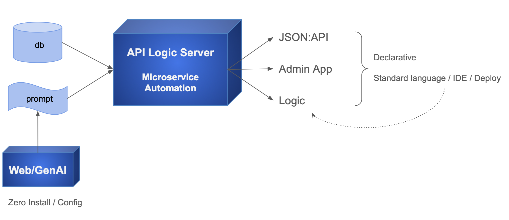

!!! pied-piper ":bulb: TL;DR - Create Microservice from Natural Language Prompt using CLI"

    API Logic Server / GenAI provides CLI commands that accepts a Natural Language prompt (e.g, CRM system), and produces:

    * a Microservice: an Admin App and a JSON:API
    * a project you can download and customize in your IDE using rules and python
    * deploy as a container using automatically generated scripts.

    API Logic Server / GenAI uses: 
    
    * GenAI services for data model creation, and 
    * API Logic Server for project creation.

    You can also use GenAI services via the [GenAI WebSite](GenAI.md){:target="_blank" rel="noopener"}.

&nbsp;

## Overview

To use GenAI to create projects

1. Establish your virtual environment (suggestion: [use the Manager](Manager.md){:target="_blank" rel="noopener"})
2. Provide a prompt in either a file (`als genai`), or a CLI argument (`als genai-create`):

```bash title='Project creation with GenAI'
als genai --using=system/genai/examples/genai_demo/genai_demo.prompt

# or, provide the prompt in an **quoted** argument:
als genai-create --project-name='customer_orders' --using='customer orders'
```

&nbsp;

## Conversations vs. resubmit

You can review created projects by using the app, and/or reviewing the [data model](Database-Connectivity.md){:target="_blank" rel="noopener"}.  Of course, it's simple to resubmit a new prompt and re-create the project.

However, this will be completely new rendition of your idea, and it may change things you like about the project.  ***Conversations*** enable you to keep what you already have, while making desired changed.

When you create a project, the API Logic Server / GenAI saves your prompt and response in a conversatation-directory.  Conversations are saved in 2 different conversations-directories:

* the manager's `system/genai/temp/<project>` directory

* the created project's `doc` directory.

You can iterate interative prompts, or by adding files to the  manager's `system/genai/temp/<project>` directory.

&nbsp;

### Conversations - Interative

The figure below creates and iterates a project, using the manager:

```bash title='create and iterate project with interactive prompts using genai-iterate'
als genai-create -project-name=conv —-using='customer orders'
als genai-iterate —-project-name=conv —using='add payments'
```


&nbsp;

### Conversations - Files

Alternatively, you can iterate projects by adding files to Manager's temp directory:
    
1. Add a file: `system/genai/temp/conv/conv002.prompt` (contents: "add payments")
2. Iterate

```bash title='iterate project using files (Note: genai, not genai-iterate)'
als genai --using=system/genai/temp/conv
```

This will recreate the project based on the existing context.  The project name is the last node of the directory name, here, *conv*.

&nbsp;

### Customized Project Sync

In the prior section, the result was a *recreated* project.  If you have customized the project, you can preserve your customizations as follows:

1. Copy `database/models.py` and `db.sqlite` from the GenAI to your customized project
2. In your customized project, use `als rebuild-from-model` 

    * For further information, see [Database Design Changes](Database-Changes.md){:target="_blank" rel="noopener"}.

&nbsp;


----


## Appendices

### GenAI and API Logic Server

GenAI is part of API Logic Server.  As shown below:

* API Logic Server can create microservices (Admin Apps, APIs, and Logic) from databases.

* It can also create microservices from database models (`als create --from-model=my_model.py`)

* GenAI

    * Use ChatGPT APIs, and creates a model file from the response
    * Submits that to `als create --from-model=my_model.py`




### Error Revovery

AI results are not consistent, so you may sometimes need to correct errors and resume.  This requires a bit of background about genai processing.

&nbsp;

#### GemAI Processing

`genai` processing is shown below (internal steps denoted in grey):

1. You create your.prompt file, and invoke `als genai --using=your.prompt`.  genai then creates your project as follows:

    a. Submits your prompt to the `ChatGPT API`

    b. Writes the response to file, so you can correct and retry if anything goes wrong

    c. Extracts model.py from the response

    d. Invokes `als create-from-model`, which creates the database and your project

2. Your created project is opened in your IDE, ready to execute and customize.  

    a. Review `Sample-Genai.md`, Explore Customizations.


&nbsp;

#### Recovery options

AI somtimes fails - here's how to recover after your correct the response or the model file.

##### From the Model File

You can find the models file at `system/genai/temp/model.py`.  You can correct the model file, and then run:

```bash
als create --project-name=genai_demo --from-model=system/genai/temp/create_db_models.py --db-url=sqlite
```

##### From the Response

Or, correct the chatgpt response, and

```bash
als genai --using=genai_demo.prompt --repaired-response=system/genai/temp/chatgpt_retry.response
```


