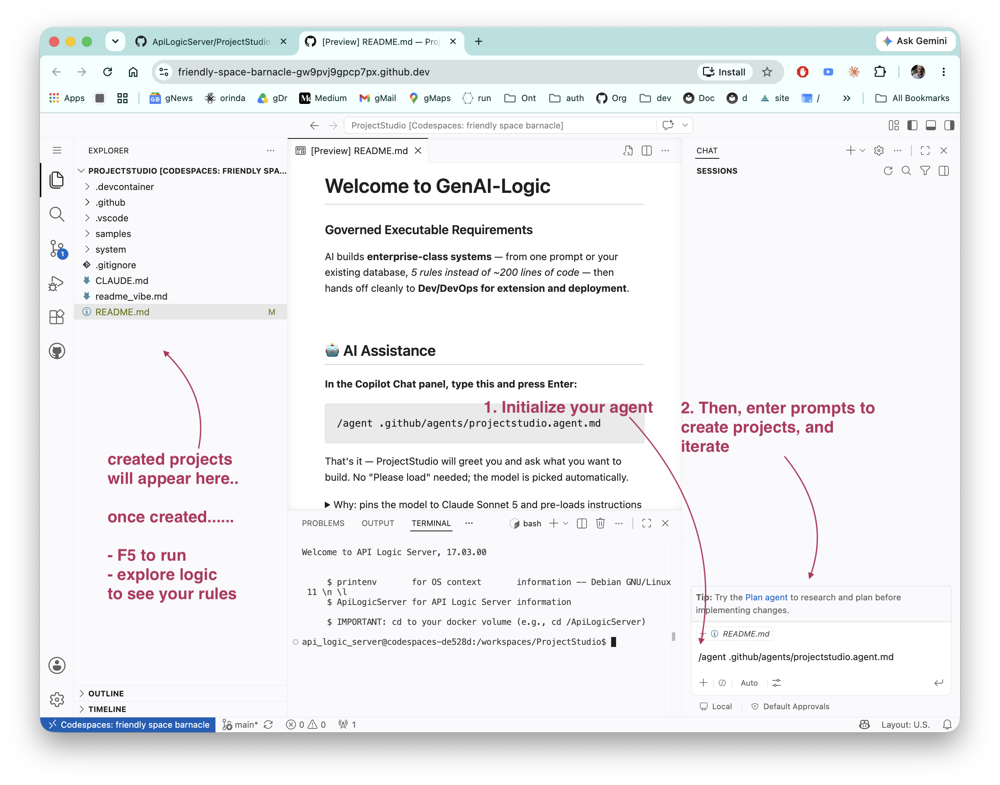

!!! pied-piper ":bulb: Project Studio"

      GenAI-Logic-web-studio enables **Business Analysts and Product Managers** to build **enterprise-class systems** — from one prompt or your existing database, *5 rules instead of ~200 lines of code* — then hand off cleanly to **Dev/DevOps for extension and deployment**.

      The goal here isn't a demo — it's an **enterprise-class** system you can trust and maintain:

      1. **User Friendly** — no database design or screen painting to learn; it's all automated from natural language.
      2. **Dev Friendly** — standard language, standard tooling; devs can extend this project in the IDE they already use.
      3. **DevOps Friendly** — containers; deploy to cloud or on-prem.
      4. **Enterprise Friendly** — pluggable security (SQL or Keycloak), full REST API, event/messaging integration (Kafka, webhooks) — built in, not bolted on.

&nbsp;

