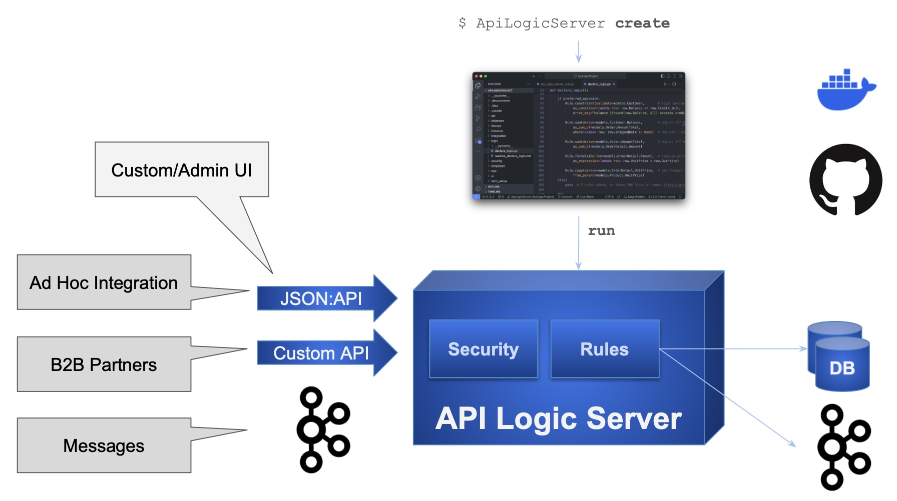

<style>
  .md-typeset h1,
  .md-content__button {
    display: none;
  }
</style>
[](https://pepy.tech/project/apilogicserver)
[](https://pypi.python.org/pypi/apilogicserver/)
[](https://pypi.python.org/pypi/apilogicserver/)

[](#instant-evaluation-no-install "Click for instant cloud-based, no-install eval")


&nbsp;

!!! pied-piper ":bulb: Fastest, Easiest Way to Create Servers for Integration and App Backends"

    For Developers and their organizations seeking to **increase business agility,**

    API Logic Server provides ***instant* API creation** from a database with one CLI command, <br>**customizable with standards:** Python, Flask, SQLAlchemy, and tools such as GitHub and your IDE.

    Weeks-to-months of complex framework-based development is no longer necessary.  <br>API Logic Server provides **unique API Automation for instant integrations and app backends,** and <br>**unique Logic Automation** with spreadsheet-like rules that decrease backend logic by **40X**.

&nbsp;


---

# Quick Tour

API Logic Server is an open source Python project, consisting of a CLI and set of runtimes (SAFRS API, Flask, SQLAlchemy ORM, business logic engine) for project execution.

It runs as a standard pip install, or under Docker. For more on API Logic Server Architecture, [see here](Architecture-What-Is.md){:target="_blank" rel="noopener"}.

Here's a quick tour of using API Logic Server: ***Create, Run, Customize.***

&nbsp;

**1. Create: *Microservice Automation* Means Create Projects With a Single CLI Command**

The [**`ApiLogicServer create`**](Project-Structure.md){:target="_blank" rel="noopener"} CLI command creates an executable project by reading the database schema in the `db_url` argument.  For example, this will create an executable, customizable project from the pre-installed sample database:

```bash
ApiLogicServer create --project_name=ApiLogicProject --db_url=nw
```

&nbsp;

**2. Run: *API Automation and App Automation***

Microservice Automation has created a project that is *executable,* with:

* ***API Automation*** means you have a running [**JSON:API**](API.md){:target="_blank" rel="noopener"} - filtering, sorting, pagination and optimistic locking
* ***App Automation*** means you have running [**Admin App**](Admin-Tour.md){:target="_blank" rel="noopener"} - multi-page, multi-table, with automatic joins and lookups

> The API **unblocks UI Developers** from waiting on lengthy API development cycles.
<br>The Admin App can be used for **instant business user collaboration**.
<details markdown>

<summary>See JSON:API and Admin App</summary>

&nbsp;

You can run directly (`python api_logic_server_run.py`), or open it in your IDE and use the pre-created run configurations:


Unlike frameworks which require significant time and expertise, the create command builds a complete API for your database, with endpoints for each table, including swagger.  The Admin App provides a link to the Swagger:


</details>

&nbsp;

**3. Customize: Logic Automation, Python Flexibility**

Customize created projects in your IDE, with Python and standard libaries.  Significantly, Microservice Automation also includes:.

* ***Logic Automation*** means you customize logic and security, using **Rules and Python** in your IDE

> Rules are unique and confer **significant business agility** - [40X more concise than code](Logic-Why.md){:target="_blank" rel="noopener"}, <br>for security and multi-table derivations and constraints.


<details markdown>

<summary>See Logic With Rules and Python</summary>

&nbsp;

Rules are 40X more concise than code, and are extensible with Python:


For more on customization, [click here](IDE-Customize.md#customize){:target="_blank" rel="noopener"}.

</details>

&nbsp;

> Customization also provides **no-code ad hoc integrations**,<br>and enables **Instant Business Relationships.**

<details markdown>

<summary>See Integration: APIs and Messages</summary>

&nbsp;

The automatically created JSON:API provides **no-code ad hoc integrations**, enabling organizations to move beyond ETL.  For example, other applications might require a customer record, and their addresses.  The automatically created self-serve JSON:API requires no code, and reduces future custom API development:

1. Create the JSON:API
2. Declare [security](Security-Overview.md){:target="_blank" rel="noopener"}, to control access and row level authorization

Integrate with B2B Partners by creating **custom endpoints** using Python and Flask, with under 10 lines of code.  *Instant business relationships.*  Observe that:

1. Update logic is partitioned out of each service - or UI - into shared [Logic](Logic.md){:target="_blank" rel="noopener"}
2. Mapping between SQLAlchemy rows and requests is automated with the [RowDictMapper](Integration-Map.md){:target="_blank" rel="noopener"}


<br>

Integrate internal systems with **Kafka**, using business logic events:


For more on integration, explore running code in the [Application Integration Sample Tutorial](Sample-Integration.md){:target="_blank" rel="noopener"}.

</details>

&nbsp;

---

# Scenarios

<details markdown>

<summary>Application Integration</summary>

&nbsp;

As illustrated below, API Logic Server supports transactions from User Interfaces, and Application Integration - both via custom APIs and Kafka messages.



*JSON:API* are a standard for self-serve APIs -- where clients can select the columns and the related data they require.

> Self-serve APIs reduce the need for ongoing custom API development.  Analogous to GraphQL, they fulfill requirements for UI development and ad hoc integration.

You can use Python, Flask and SQLAlchemy to create Custom APIs, e.g. for B2B Partners.  In addition to the underlying logic, API Logic Server provides mapping services as described under **Application Integration.**

Appication Integration support also provides automation for producing and consuming Kafka messages.  Here's an article: [click here](https://dzone.com/articles/instant-integrations-with-api-automation){:target="_blank" rel="noopener"}.  To see these services in a tutorial, [click here](Sample-Integration.md){:target="_blank" rel="noopener"}.

</details>


<details markdown>

<summary>Unblock Client App Dev</summary>

&nbsp;

Framework-based API development is time-consuming and complex.  Since client App Dev depends on APIs, front-end dev is often blocked.  This serialized dev process reduces business agility, and increases pressure on the team.

API Logic server can change that.  

1. **API Automation** means client App Dev can start as soon as you have a database

2. **Logic Automation** means that

    1. Such logic - a substantial element of the system - is **automatically partitioned** out of each client into server-based logic.  This reduces client coding, and enables the logic to be shared between user interfaces and services.
    2. Logic development can proceed **in parallel** with client App Dev

Here's an [article, here](https://dzone.com/articles/instant-app-backends-with-api-and-logic-automation){:target="_blank" rel="noopener"}.  Or, the the [Tutorial, here](Tutorial.md){:target="_blank" rel="noopener"}.

</details>


<details markdown>

<summary>1 day projects with AI-Driven Schema Automation</summary>

&nbsp;

API and Logic Automation begins with a database.  But what if it's a new project, and there is no database.

You can certainly use your SQL tools.  But we all know that SQL can be... tiresome.

AI provides a solution: ***Schema Automation***.  You can use ChatGPT to create the SQL DDL like this:

!!! pied-piper "Create database definitions from ChatGPT"

    Create a system with customers, orders, items and products.

    Include a notes field for orders.

    Enforce the Check Credit requirement (do not generate check constraints):
    1. Customer.balance <= credit_limit
    2. Customer.balance = Sum(Order.amount_total where date_shipped is null)
    3. Order.amount_total = Sum(Item.amount)
    4. Item.amount = quantity * unit_price
    5. Store the Item.unit_price as a copy from Product.unit_price


Then, employ API Logic Server API and Logic Automation, and use Python and standard frameworks to finish the job.

Here's a tutorial you can to explore this: [click here](Sample-AI.md){:target="_blank" rel="noopener"},or see [this article](https://dzone.com/articles/ai-and-rules-for-agile-microserves){:target="_blank" rel="noopener"}.

</details>

&nbsp;
For additional Use Cases, [click here](Product-Detail.md/#use-cases){:target="_blank" rel="noopener"}.

&nbsp;

---


# Key Features

| Feature | Notes   |
:-------|:-----------|
| [API Automation](Project-Structure.md){:target="_blank" rel="noopener"} | Unblock Agile Collaboration, Custom App Dev |
| [Logic Automation](Logic-Why.md){:target="_blank" rel="noopener"} | 40X More Concise than procedural code |
| [Application Integration](Sample-Integration.md){:target="_blank" rel="noopener"} | Automation with APIs and Kafka Messages |
| [Rule-Base Row Level Security](Security-Overview.md){:target="_blank" rel="noopener"} | Authorization and Authentication |
| [Self-Serve JSON:API](API.md){:target="_blank" rel="noopener"} | UI Developers and Partners don't require API Dev |
| [AI-Driven Automation](Sample-AI.md){:target="_blank" rel="noopener"} | Use ChatGPT to automate database creation |
| [Admin Web App](Admin-Tour.md){:target="_blank" rel="noopener"} | Agile Collaboration, Prototyping, Testing, Back Office Data Entry |
| [Multiple Databases](Data-Model-Multi.md){:target="_blank" rel="noopener"} | Application Integration |
| [Deployment Automation](Tutorial-Deployment.md){:target="_blank" rel="noopener"} | Automated Container Creation, Azure Deployment |

&nbsp;

---

# Video: Agile Collaboration

Click the image below for a video tutorial, showing complete project creation, execution, customization and debugging ([instructions here](Tech-Agile.md){:target="_blank" rel="noopener"}).  Or, see it using AI: [click here](Tutorial-AI.md).

[](https://youtu.be/sD6RFp8S6Fg "Using VS Code with the ApiLogicServer container"){:target="_blank" rel="noopener"}

&nbsp;

# Getting Started - Install, Tutorial

API Logic Server is designed to make it easy to get started:

* **Install and run Tutorial** - 
[install](Install-Express.md){:target="_blank" rel="noopener"}, and explore the [tutorial](Tutorial.md){:target="_blank" rel="noopener"} for the [sample database](Sample-Database.md){:target="_blank" rel="noopener"}.

* **Installed Sample Databases** -
Here are [some installed sample databases](Data-Model-Examples.md){:target="_blank" rel="noopener"} you can use with simplified abbreviations for `db_url`.

* **Dockerized Test Databases** - 
Then, you might like to try out some of our [dockerized test databases](https://valhuber.github.io/ApiLogicServer/Database-Connectivity.md){:target="_blank" rel="noopener"}.

* **Your Database** - Finally, try your own database.

&nbsp;

In addition to this app dev oriented tutorial, you can also explore:

* **Messaging:** the [Application Integration Tutorial](Sample-Integration.md){:target="_blank" rel="noopener"} illustrates using messaging, self-serve APIs and customized APIs, choreographed with rules and Python.

* **Deployment:** the [Deployment Tutorial](Tutorial-Deployment.md){:target="_blank" rel="noopener"} illustrates various ways to containerize and deploy your applications

* **Using AI:** the [AI-Driven Automation Tutorial](Tech-AI.md){:target="_blank" rel="noopener"} shows how you can use ChatGPT to create new databases from english descriptions, to bootstrap a very rapid create / collaborate / iterate Agile cycle.

&nbsp;

## Release Notes

To see Release Notes, [click here](https://github.com/ApiLogicServer/ApiLogicServer-src/releases){:target="_blank" rel="noopener"}.

## Preview Version

<details markdown>

<summary> Show me how </summary>

&nbsp;

This pre-release includes:

* Many simplfications for Tutorial

You can try it at (you may need to use `python3`):

```bash
python -m pip install --index-url https://test.pypi.org/simple/ --extra-index-url https://pypi.org/simple ApiLogicServer==10.01.25
```

Or use (neither available currently):

```bash
docker run -it --name api_logic_server --rm -p 5656:5656 -p 5002:5002 -v ~/dev/servers:/localhost apilogicserver/api_logic_server_x
```

Or, you can use [the beta version on codespaces](https://github.com/ApiLogicServer/beta){:target="_blank" rel="noopener"}.

</details>

&nbsp;

# Works With

API Logic Server works with key elements of your existing infrastructure:

| Works With | Notes   |
:-------|:-----------|
| [AI](Tutorial-AI.md){:target="_blank" rel="noopener"} | Use ChatGPT to create databases, and use API Logic Server to turn these into projects |
| [Other Systems](Sample-Integration.md){:target="_blank" rel="noopener"} | APIs and Messages - with logic |
| [Databases](Database-Connectivity.md){:target="_blank" rel="noopener"} | Tested with MySQL, Sql/Server, Postgres, and Oracle |
| Client Frameworks | Creates instant APIs that factors out business logic, where it is automatically shared for User Interfaces, APIs, and Messages |
| [Your IDE](IDE-Customize.md){:target="_blank" rel="noopener"} | Creates standard projects you can customize in your IDE, such as VSCode and PyCharm |
| [Messaging](Sample-Integration.md){:target="_blank" rel="noopener"} | Produce and Consume Kafka Messages
| [Deployment](Tutorial-Deployment.md){:target="_blank" rel="noopener"} | Scripts to create container images, and deploy them to the cloud |
| [Agile and Test Methodologies](Logic-Tutorial.md){:target="_blank" rel="noopener"} | Use Behave to capture requirements, rapidly implement them with API Logic Server, collaborate with Business Users, and test with the Behave framework |

&nbsp;

# Contact Us

We'd love to hear from you:

1. Email: apilogicserver@gmail.com
2. Slack: [https://apilogicserver.slack.com](https://join.slack.com/t/apilogicserver/signup?x=x-p3388652117142-3395302306098-5241761647201)

&nbsp;

# Detailed Product Information

For more product information, [click here](Product-Detail.md){:target="_blank" rel="noopener"}.