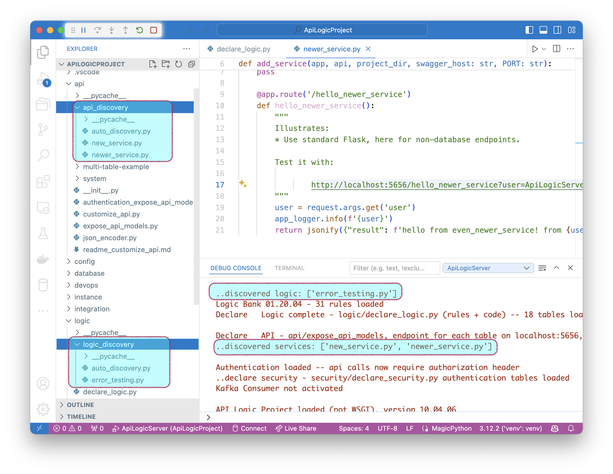
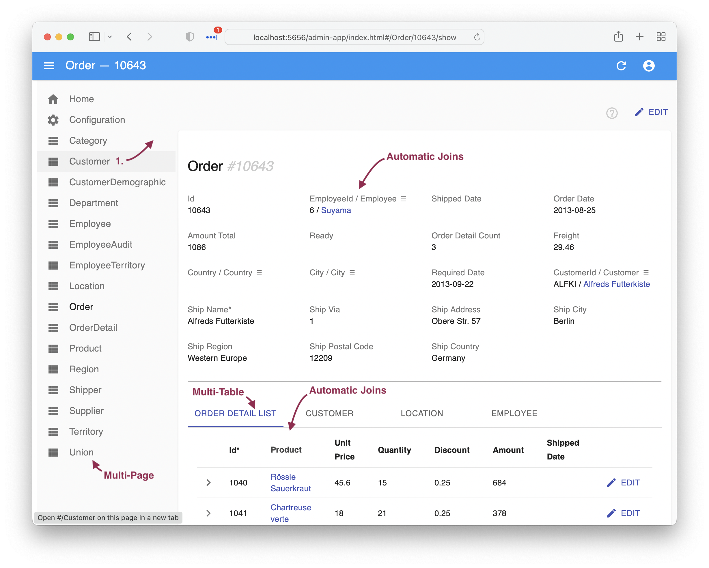
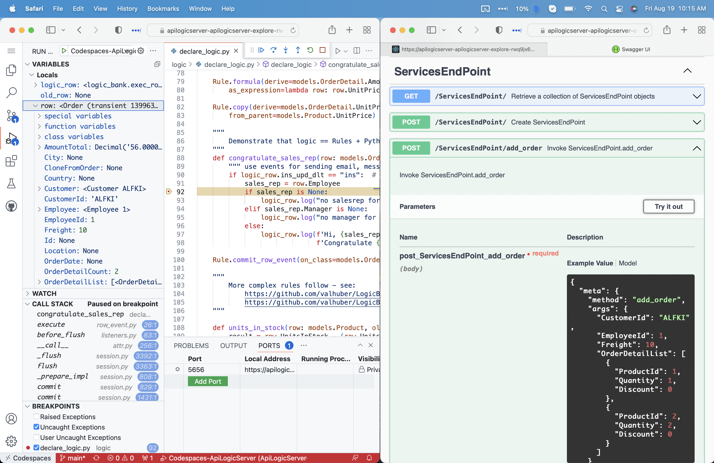

## Customize: Rules, Python

[Customize API Logic Projects](Tutorial.md#3-customize-and-debug-in-your-ide){:target="_blank" rel="noopener"} using:

* **[Rules](Logic-Why.md){:target="_blank" rel="noopener"} and Python,** with standard Python packages, such as **Flask and SQLAlchemy**.

* In **your IDE**, using **standard IDE features,** such as code editors with code completion, source control, debuggers, Natural Language, etc.

1. You can find **customization points** by searching your project for `Your Code Goes Here`.

2. You can find **customization examples** by creating the [Tutorial](Tutorial.md){:target="_blank" rel="noopener"}, and searching for `#als`.

&nbsp;

### Discoverability - Logic, Services

In addition to altering the files noted above, you can use discovery.  This enables logic and services to be broken up into multiple files, which are auto-discovered.  

These can help teams integrate their work, with reduced conflict.

&nbsp;

## Run

The `ApiLogicServer create` command also creates:

* Launch configurations to run your project, and run [tests](Behave.md){:target="_blank" rel="noopener"}.
* [Docker](DevOps-Docker.md){:target="_blank" rel="noopener"} files to open your project, and dockerize your project into a container for DockerHub

For more information on opening projects and establishing their Python Execution environment, see [Execute an API Logic Project](IDE-Execute.md){:target="_blank" rel="noopener"}.

&nbsp;

## Debug

Utilize IDE Debuggers, including for declarative rules, as described in the [Tutorial](Tutorial.md#3-customize-and-debug-in-your-ide):

&nbsp;

## Rebuild

If you change your database / data model, you can rebuild the project, preserving customizations.  For more information, [click here.](Project-Rebuild.md){:target="_blank" rel="noopener"}

&nbsp;

## Appendix - IDE Notes

### Virtual Environments

Be sure you are clear on how to setup your [project venv](Project-Env.md){:target="_blank" rel="noopener"}.

### VSCode CLI

You can launch VSCode from the command line.  It's often pre-installed on Windows; for Mac, you must activate VSCode `code` CLI (to get it: Open the Command Palette (Cmd+Shift+P) and type 'shell command').